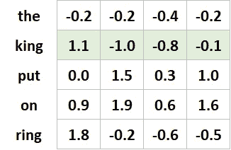

# 自然语言处理(NLP)术语介绍

> 原文：<https://medium.com/analytics-vidhya/an-introduction-to-natural-language-processing-nlp-terms-f8fe9e0a273?source=collection_archive---------11----------------------->

# **什么是 NLP**

自然语言处理是一种从人类语言中提取意义的方法。它使用计算机科学、语言学和人工智能的研究成果。它通常包括执行一项任务或使一项工作变得更容易。

# **现实生活中的 NLP**

您将已经在实际工作中遇到过许多种 NLP。这里有几个例子:

-在网上搜索，让谷歌帮你完成搜索

-语音助手——像 Alexa、Siri、Cortana、Google……能够提问，并接收智能回复

-拼写和语法纠正

-自动将一种语言翻译成另一种语言，例如从英语翻译成西班牙语，无需人工干预。

那么，计算机真的理解语言吗？不完全是。我们需要以机器可以处理的方式为模型提供语言。实际上，这意味着将单词转换成数字。在机器学习中，我们经常用向量来表示，所以在我们看一些例子之前，让我们快速复习一下向量。

# **矢量**

矢量的定义是一个有大小和方向的量，通常用线段来表示。

如果我们组成一个两个单词的短语“国王戒指”，我们可以将它表示为一个二维向量——每个单词一个，“国王”和“戒指”。因为每个单词有一个计数，所以我们的坐标是(1，1)。

当然，这是一个过于简化的例子。我们现在转向多维度，其中单词而不是短语是向量。以下是一些如何将单词翻译成机器可读的数字格式的例子。

“king ring”向量(图片基于《自然语言处理入门》中的一个示例)

# **一键编码**

第一个例子叫做一键编码。让我们扩展一下我们之前的短语，把它改成一个句子:“ ***国王戴上戒指*** ”。我们现在有了这些词:“the”、“king”、“put”、“on”、“ring”。单词“The”出现了两次。我们可以将这个句子显示为一个矩阵，其中每个单词用一列表示，每个*唯一的*单词用一行表示。每当一个单词在行和列中出现时，我们用 1 标记它，所有其他的例子都是 0。下图对此进行了说明:

一键编码

单词 king 将由向量[0，1，0，0，0，0]表示。

然而，这种方法效率很低。它创建了一个非常大的矩阵。即使在这个简单的例子中，你也可以看到比 1 多得多的 0。我们称之为**稀疏**向量空间，因为大多数值都是零，只有少数值分散在其中。想象一个有几千个单词的更大的文本文档，现在我们有一个向量空间，其中不到 0.1%的元素有任何值。

# **每个单词得到一个唯一的数字**

第二种方法是给每个单词分配一个唯一的编号。我们的例句可以表示为:[1，2，3，4，1，5]。这被认为是一个**密集**向量，因为所有的元素都有值。这是一种更有效的资源利用。

然而，这种方法也有一些问题。首先，我们分配的数字是任意的，因此它们不能反映单词之间的任何关系。第二，当我们对数据建模时，模型学习每个单词的权重。因为在单词编码的相似性和单词的相似性之间没有关系，所以加权没有意义。

# **单词嵌入**

第三种方法叫做单词嵌入。单词嵌入捕获关于单词含义和位置的信息。它们之所以被称为嵌入，是因为它们将原始文本中的信息映射成几个数字，将大量信息编码成更简洁、更有意义的东西。单词嵌入模型中的值是在模型训练期间学习的，而不是由程序员分配的。

单词嵌入是高维向量到低维空间的转换。每个单词由一个多维向量表示。这比稀疏单词表示所需的维数要少得多，稀疏单词表示的维数可能高达数百万。

更高维的单词嵌入捕捉单词之间更详细的关系，但是需要更多的数据来训练。通常，我们无法解释每个维度的含义——它们是从数据中推断出来的。这些维度被称为**潜在维度**。有意义的是嵌入空间中单词之间的距离，而不是沿着任何给定维度的数值。

单词嵌入

上面是一个 4 维向量空间(每一列都是一个维度)的例句图。这些值本身并不重要，但单词之间的相似性很重要。在嵌入空间中，单词 king 的矢量化表示将是[1.1，-1.0，-0.8，-0.1]

# **单词嵌入可视化**

为了帮助说明单词嵌入的概念，我们可以使用单词作为三维坐标的图像。距离和方向揭示了词的意义和相似性。

词语嵌入类比

来源:[https://developers . Google . com/machine-learning/crash-course/images/linear-relationships . SVG](https://developers.google.com/machine-learning/crash-course/images/linear-relationships.svg)

在上面的图表中，单词嵌入显示了单词“国王”和“王后”的关系与“男人”和“女人”的关系相同，即男女关系。我们也看到动词意义和国家及其首都之间的关系。还要注意，亚洲国家和欧洲国家被分组在一起。这些关系的不同寻常之处在于，模型完全是从文本中生成的，而不是从任何编程指令中生成的，比如“安卡拉是土耳其的首都”。

也许最吸引人的是我们可以进行单词向量运算。将“国王”的维度相加，将“男人”的维度相减，再加上“女人”，我们就非常接近“女王”的向量了。同样，我们可以对国家和城市做同样的事情。

**国王-男人+女人=王后**

**东京-日本+德国=柏林**

# **关于上下文的一切**

所有这些魔法是如何发生的？该模型根据单词周围单词的上下文来计算单词的含义。

> "从一个人交的朋友，你就可以知道这个人说的话."弗斯，J. (1957)。语言分析研究。

有两种方法可以从上下文中确定意思。第一种方法叫做**连续词袋(CBOW)** 。CBOW 查看周围的单词，试图预测我们的目标世界。在我们的例句中，它试图从“戴上戒指”来预测“国王”。

**Skip-gram** 的工作方式与 CBOW 相反。它使用单词作为输入，并试图预测它周围的单词。

这两种方法都在 **word2vec** 模型中使用。据 word2vec 的作者称，CBOW 速度更快，而 skip-gram 在处理不常用词方面做得更好。

# **下一次**

在未来的博客中，我们将探索所有这些部分如何在实践中协同工作

# **参考文献**

[word2vec](https://code.google.com/archive/p/word2vec/)

[机器学习/速成班/嵌入](https://developers.google.com/machine-learning/crash-course/embeddings/video-lecture)

[tensorflow.org/tutorials/text/word_embeddings](https://www.tensorflow.org/tutorials/text/word_embeddings)

[word 2 vec-已解释](https://israelg99.github.io/2017-03-23-Word2Vec-Explained/)

[machinelearningmastery.com](https://machinelearningmastery.com/what-are-word-embeddings/)

《深度学习图解:人工智能的可视化互动指南》,作者:克罗恩·乔恩

《从零到人工智能:人工智能时代的非技术性、无炒作的繁荣指南》,作者 Nicolò Valigi，Gianluca Mauro

《自然语言处理入门》，作者 Kochmar，Ekaterina