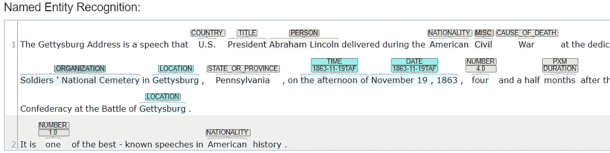

# 自然语言处理(NLP)术语介绍—第 2 部分

> 原文：<https://medium.com/analytics-vidhya/an-introduction-to-natural-language-processing-nlp-terms-part-2-86e248f16cd3?source=collection_archive---------21----------------------->

介绍更多 NLP 术语

在之前的博客中，我介绍了 NLP，它是如何工作的，以及一些入门术语。在这个博客里，我会添加更多的术语。

## **令牌化**

这意味着将一个文档分成不同的语言部分。通常，这意味着拆分成单词，但我们也可以标记句子，甚至单个字母或字符。我们对文本进行标记以创建单词嵌入。

> 这个“句子”被“单词”标记化了

## **停止言语**

停用词是频繁出现的词，不会增加我们文本的意义。像“the”、“of”、“and”、“a”、“to”这样的词。我们通常希望删除这些单词，以减小文本文档的大小，并确保有意义的单词更有影响力。英语中排名前 25 位的单词几乎占了所有书面材料的三分之一。*删除停用词是大幅缩减文本文档大小的一种简单方法。

**资料来源:阅读教师的书单*

停止言语

然而，我们并不总是想删除所有的停用词。否定词通常会颠倒句子的意思，所以去掉它们可能没有意义。最常见的否定是:“不”，“不”，“不要”，“从来没有”，“没有”。甚至像“几乎不”、“很少”、“一点点”这样的词也能改变一个句子的意思。

## **N-grams**

N-grams 是单词组合，当它们组合在一起时比分开时更有意义。例如,“Los”和“Angeles”这两个词放在一起表示“洛杉矶”,就有了更具体的含义。洛杉矶是两个单词，所以被称为双字母组合。同样，纽约市也是一个三元组。

## **词干**

词干包括去掉单词的前缀或后缀，只保留单词的词根。(注意:在 Python 中，大多数常见的英语词干分析器关注的是后缀，而不是前缀。)所以，play 和 play 会被视为同一个词。有时当词干分析器把单词的末尾砍掉时，你会得到一些奇怪的拼写——例如，ponies 变成 poni。

一匹矮种马…我的“y”在哪里

## **词汇化**

词汇化类似于词干化，但更复杂。它把一个词简化为它的本义或引理。这可能是一个不同的词。例如引理为“am”、“are”、“is”、“being”、“was”、weres“is”**be**。此外，一些像 spaCy 这样的库会将所有代词转换成“PRON”。词汇化使用像 WordNet 这样的字典来检索正确的词汇。

你应该使用哪种方法？词汇化通常更准确，但是运行时间更长，因为它使用字典，而不是算法。词汇化不适用于字典中没有的未知单词。

## **词性**

词性用来确定一个单词在句子中的意思。它包括给每个单词分配相关的词性。这对于确定单词的不同含义很有用。例如，在下面的句子中，“run”被使用了两次，但它有不同的含义。POS tag 可以识别它在第一句是名词，在第二句是动词。

> 这部电影打破了 T2 的票房纪录。
> 
> 我不得不**跑**(动词)去赶公共汽车。

## **名词短语提取**

这是一种识别文本中的名词短语并提取它们的方法。这可以让你对文章的主题有所了解。例如，洛杉矶的名词短语可能包括:太平洋、棕榈树、娱乐业和主题公园

洛杉矶

## **关键短语提取**

从文本中提取代表内容主旨的关键词或短语。这提供了文本的简明摘要。

## **命名实体识别**

这是识别文本中重要实体的工具。这些实体包括人员、组织、位置、时间和日期。这里有一个使用斯坦福 CoreNLP 图书馆的例子，文本来自维基百科。

来源:斯坦福 CoreNLP 演示

[https://corenlp.run/](https://corenlp.run/)

## **TF-IDF**

TF-IDF 代表词频——逆文档频率。TF-IDF 是一种在与一组文档进行比较时确定每个文档中最重要的单词的方法。这个想法是，如果一个单词对于每个文档都是通用的，那么它不会给特定的文档增加任何额外的含义，所以它可以被降低权重。但是，如果一个单词在特定文档中频繁出现，但在其他文档中很少出现，那么它确实有助于该文档的含义。

## **情感分析**

情感分析是评估文本的感觉或态度，关于它是积极的、中立的还是消极的。这在分析社交媒体、客户评论和品牌监控时尤其流行。它甚至可以应用于表情符号。情感分析有一些缺点。背景很重要——想想“那真是千钧一发”——对剃须刀来说很好，对机场事故来说很糟糕。人们经常用否定的词来表达“生病了”这个肯定的意思，用肯定的词来表达否定的意思……特别是带有讽刺和挖苦的意思。

剃光头发

祝你晚上愉快。

安德鲁

## **参考文献**

阅读教师书目，第 6 版，杰奎琳·克雷斯，爱德华·弗莱

斯坦福大学核心图书馆

CoreNLP 的演示