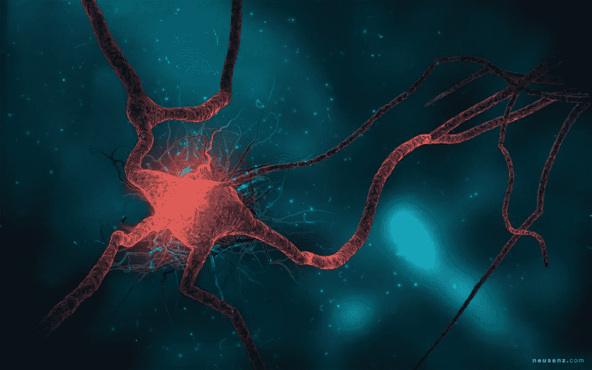
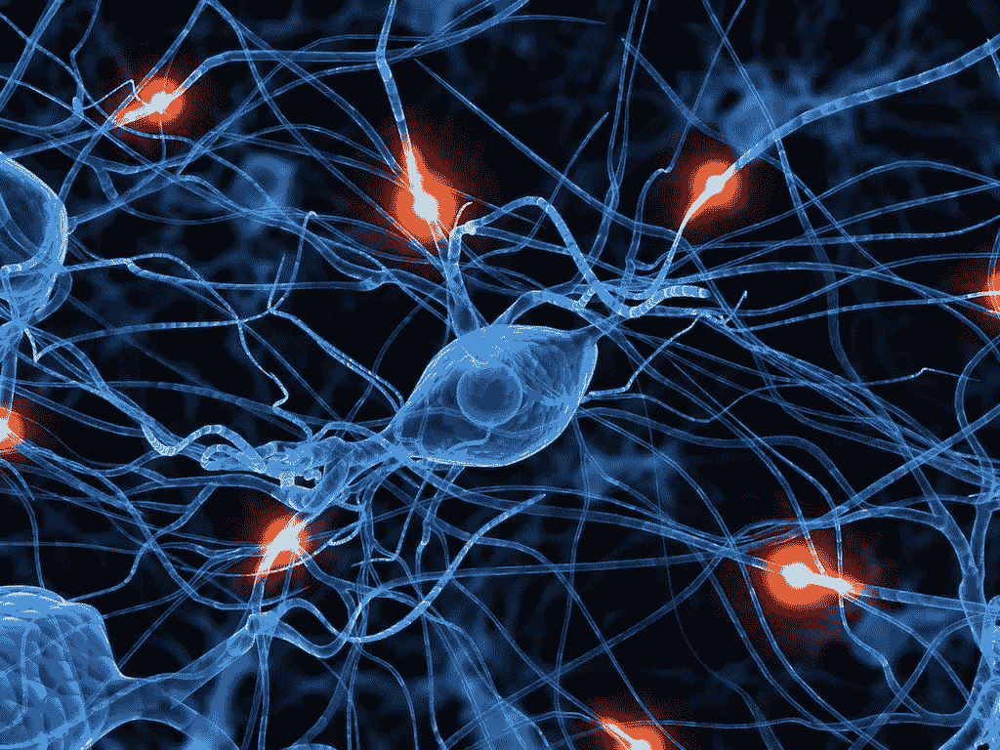
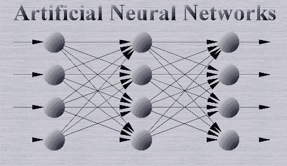
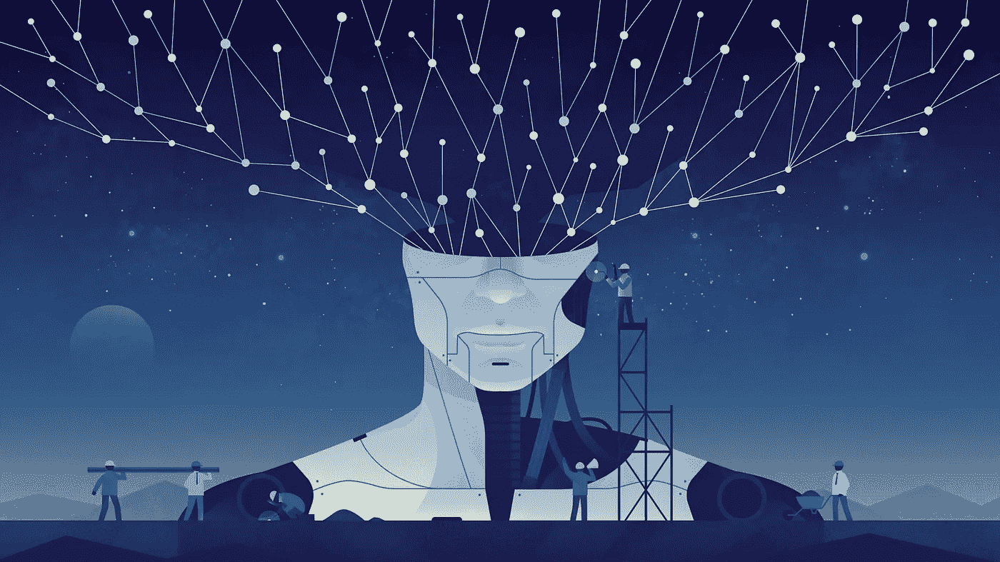

# 神经网络导论

> 原文：<https://medium.com/analytics-vidhya/an-introduction-to-neural-networks-417695dc1f38?source=collection_archive---------14----------------------->

随着机器学习和深度学习术语的推动，人工智能的复兴在世界各地引发了许多想法，特别是学术界的想法。虽然人工智能总体上包含了创造机器的想法，这些机器可以模仿人类的行为，并展示与人类智能相当(甚至可以超过)的智能，但它也添加了各种其他术语，如机器学习，其中模型被训练从现有数据中学习，它可以学习数据中的重要模式，并基于这些模式生成新的预测。另一方面，深度学习和神经网络曾被视为“害群之马”，随着人工智能概念的大肆宣传，现在已经获得了很多牵引力和时髦词汇。

那么是什么让神经网络如此受欢迎呢？神经网络的概念已经存在了几十年，但只是在数学概念和研究工作的回旋中。神经网络需要很长的时间来发展，即因为两个原因:神经网络需要大量的数据来处理和运行，并且它需要大型计算框架来处理数据和分析数据。神经网络被认为是计算昂贵的，直到 Geoffrey Hinton 和他的团队使用受限的 Boltzmann 机器来启动神经网络和深度学习作为一个整体。

# 什么是网？

对神经网络的基本介绍是，它是受人脑工作方式的启发，或者说我们期望它如何工作。最简单的神经网络是感知器，它是一个“神经元”网络，可以接受多个输入并产生一个输出。我们的人脑由数十亿个神经元组成，这就是神经网络试图模仿的。正如我们大脑中的神经元可以通过接收必要的输入来处理信息一样，传统的人工神经网络可以将原始特征作为输入，然后在生成数值向量作为输出之前，通过“隐藏层”进行处理。

神经网络主要由以下部分组成:

1.  输入层:通过输入层，信息被输入到神经网络。这是初始数据层，用于输入我们的信息片段，然后传递到隐藏层。
2.  隐藏层:当输入层中的神经元将所有原始特征作为输入时，它们被输入到隐藏层。隐藏层采用输入的加权组合，并将它们插入到一个 sigmoid 函数中，我们稍后将对此进行讨论。隐藏层中的每个节点表示一个权重，该权重乘以输入向量，并向其添加一个偏差。
3.  输出层:输出层构成了我们的神经网络的输出，它们只是呈现从隐藏层计算出来的信息。

# 神经网络是如何工作的？

使用一种称为反向传播的迭代算法来训练神经网络并使其工作。反向传播的工作原理是将大量的输入向量序列和相应的输出向量一起输入给它。在整个过程中，位于输入层和输出层之间的隐藏层经过调整和优化，以识别数据中的聚合要素，从而可以进行加权组合。那么反向传播是如何成功的呢？它的秘密在于我们的激活功能。

神经网络的关键部分是神经元如何从众多的输入向量中确定输出向量。答案就在激活函数中。虽然有许多激活函数，但在分类算法中最常见的是 Sigmoid 函数。这样一个系统中的每一个神经元都有自己的逻辑回归函数，一个没有任何隐含层的神经网络就是无数逻辑回归量的集合。

神经网络还需要图形处理单元(GPU)来工作，这些图形处理单元是专门的硬件，是具有大规模计算和并行处理能力的非常强大的设备，在深度学习和建立神经网络方面获得了神一样的地位。建立神经网络的整个目的是通过前向和后向传播来最小化成本误差函数。

# 神经网络的“你好世界”

在这个[代码片段](https://gist.github.com/HarshCasper/fac855d392b87963c0d88295593c61b9)中，我们使用 Keras 对神经网络的“Hello World”进行了编码，Keras 是一种高级神经网络 API，可以在 Tensorflow 或 Theano 等流行的深度学习库之上运行。在代码片段中，我们尝试实现了一个简单的函数 *y=2*x* ，并训练了一个密集连接的神经网络。

这些层之间流动的是张量。张量可以被可视化为矩阵，因此输入层本身不是层，而是与训练数据具有相同形状的张量。在接受输入并给出相应的输出后，该模型被迭代训练 500 个时期，其中基于输入和输出形状计算权重。

在密集层中，正如我们在上面实现的，权重与输入相乘。这意味着，我们实现了一个每单元一列、每单元一行的矩阵。在训练模型之后，我们可以给出标准值来预测我们的模型的效率，其效率几乎为 97%。

这不全是关于神经网络的。随着 21 世纪的到来，借助于巨大的计算能力和每次点击设备都会产生的大量数据，神经网络的范围和功能都得到了扩展，并出现了广泛的不同用途和目的。

各种形式的神经网络，如卷积神经网络、生成对抗网络、递归神经网络，正在全世界的各种应用中使用。随着各种深度学习库的兴起，如流行的 Tensorflow、PyTorch、Keras 等，深度学习的范围和功能不仅扩展到了学术界，还扩展到了太低级的用户，他们不太理解周围的数学，但可以将预定义的算法用于社会目的，帮助解决现实世界的问题。