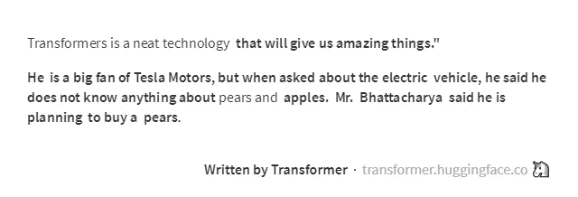

# 自然语言处理介绍-解释和例子。

> 原文：<https://medium.com/analytics-vidhya/an-introduction-to-nlp-explanation-and-examples-56035186197f?source=collection_archive---------9----------------------->

## 皮肤

所以你对自然语言处理感兴趣——NLP(不要误认为是神经语言编程，不管那是什么，它一直出现在我的搜索结果中……)。

这是 1950 年，思想杂志。一位名叫艾伦·图灵的杰出科学家(数学家)，在对让机器学习的理论方法进行了长时间的讨论后，写下了以下文字:

> 最好是给机器提供钱能买到的最好的感觉器官，然后教它理解和说英语。[1]

于是 NLP 诞生了。好吧，不那么突然，但想法是存在的。随着计算和计算机智能的出现，NLP 的想法已经出现了。

根据这一前提，自然语言处理可以概括为处理人类(通常广义为自然)语言的能力，无论是书面语言、口头语言还是图片语言等。

process(源自拉丁语 *processus —* progression，course)是将某物变成另一物。在这种情况下，以人类语言为例，用计算机来表达它。

例如，您正在阅读的这些单词是用自然语言(带有拉丁字母的英语)编写的，并存储在计算机语言(二进制，用一系列 0 和 1 表示)中。

然而， **NLP 不仅仅是将字母表翻译成比特**。它更多的是让计算机能够根据人类语言的表达和组织方式自动*行动/反应*(用语言术语做一些动作或产生一些东西)。

NLP 处理的事情有:

*   短语中的哪个单词是动词？
*   短语中哪个名词起短语词根的作用？
*   这个“变形的”(弯曲的)单词与哪个单词相关？
*   这句话所承载的情绪是什么？(刷 NLU 的 borthers)
*   这个词在上下文中是什么意思？(擅自闯入 NLU 地区)

和许多其他任务…

可能很难解释什么是 NLP，因为我们大多数人都很自然地这样做，我们不会停下来想下一个单词是什么，某个单词在短语中的角色是什么等等。我们只需要知道模式，并用想要的变化来填充它。

更难的是领会观念的观念(urr！？，概念？)表示。如何表现思想？用文字？为什么？我们是用语言来思考的吗？嗯，如果你是哲学家/神经科学家/语言学家，这是一个很好的讨论，但不是 NLP 概述系列(想了解这方面的一个巧妙想法吗？翻到[2]，看看哪里有关于意识和语言的讨论。

Jurafsky 和 Martin 在[3]中介绍了 NLP，这是我读过的最好的介绍之一。这些作者提出了 NLP 历史中的 6 代，我将尝试对其进行总结(请注意，这一历史部分在本书的第三版草稿中被删除——我在参考资料部分链接了第二版，您可以在第 9-13 页找到总结)。

1.  1940 年代和 1950 年代的基础:这是自然语言处理诞生的地方，受到图灵的思想、麦卡洛克和皮茨的人工神经元理论以及 Chmosky 的形式语言理论的推动——这是新的可能性的开始，一个除了人类以外的东西可以自动处理文本的时代。然而，大多数作品是理论或专家系统。这里出现了一些概率算法。
2.  **两大阵营 1957–1970**:在这个时代，自然语言处理出现了分歧:虽然基于符号/模型的方法(复制我们如何使用语言的规则)是规范，随着第一个解析算法和第一个在线语料库的开发，随机/统计范式(这意味着一些语言结构使用统计方法建模)随着一些贝叶斯方法的应用而确立。
3.  **四种范式 1970–1983**:这一时期开始时充满希望和前景，各团体捍卫四种截然不同的范式:随机(统计学)、基于逻辑、自然语言理解(NLU 及其表述)和话语建模。虽然这似乎是一片沃土，但这也是所谓的“人工智能冬天”时期，许多无效的人工智能尝试导致该地区的投资严重下降。如今，在更强大的计算机和算法(如 NLU 范式提出的基于网络的语义学)的帮助下，这些想法中的许多正被重新应用。
4.  经验主义和有限状态模型 1983–1993:在一个寒冷的时代之后，这个新时代开始提供更温暖、更清晰的结果。这是概率成为 NLP 最喜欢的工具的时候(当然是在计算机科学家中)。有了更好的计算机和数据，第一个数据驱动的词性标注器就诞生了。经验主义(实用的可复制的方法)成为了标准。
5.  **概率和基于模型的融合 1994–1999**:在这个时代，参考解析、信息检索和话语处理等领域的经典基于模型的算法开始与经验方法融合——这意味着更少的手工制作有利于更多的数据推断。
6.  **机器学习的崛起 2000–2008(这是本书第二版编辑的时候)**:大量的数据，强大的计算机，经过验证的机器学习算法和互联网！所有这些导致了 NLP 的(早期)黄金时代。树库允许更好的词汇化和词性标注。机器翻译变得大众化，许多语言分类任务随着机器学习而发展。
7.  **现在 2009 年——(这个时代不在茹拉夫斯基和马丁的书里)**:我们现在生活在第六时代的延伸。我们可以指出一个时代，在这个时代，深度学习通过突击取得了 NLP，聊天机器人在不经意间使用了许多 NLP 任务，并且有许多语言的几个可用库来完成复杂的 NLP 活动。更不用说 RNN，伯特和变压器模型的发展，这些模型相继将 NLP 推向顶峰。然而，即使有这样的爆发，NLP 也没有解决(甚至没有接近)，特别是当我们谈到 NLU 专业化(如处理歧义和真正自动化的思想)。

现在我们知道了一些历史和基本的含义，让我们来看一些 NLP 应用的例子。

**文本分类:**

可能是最容易解释的应用之一。它可以专门用于许多其他众所周知的活动，如**情感分析**(它只不过是将文本分类为好与坏之间的一种音调)。

在文本分类中，单词(更丰富的是，它们的关系、位置和上下文含义)被用作算法的**特征**，该算法定义文本是属于 x 类还是 y 类还是 z 类。由于分类是一项机器学习任务，因此通常是这样的(但您也可以定义一个模型或手动规则集)。

谷歌采用文本分类算法将收到的邮件分类为垃圾邮件或收件箱。

**(自动)问题回答:**

比文本分类稍微复杂一点的是问答。不仅要考虑问题文本，还要考虑许多可能的目标文档的文本。

有许多方法可以做问题回答:使用 Seq2Seq 这样的模型进行深度学习(在 2019 年末，Kaggle 甚至就此发起了一场比赛)；使用知识图表(谷歌将其用于其助手快速回答)和许多其他技术。如果你想了解更多，可以看看我的硕士论文，里面有很好的一章是关于问答的。

谷歌知识图展示。这用于大量信息检索的搜索，但也与问题回答有关。

**聊天机器人:**

这些实际上是以前技术的组合，但增加了一个终端用户应用程序层。许多新技术被用于加入自然语言处理的领域，允许机器人理解用户的意图、情感，甚至是讽刺。

如果你想把历史和例子混在一起，可以和伊莱扎医生交谈，伊莱扎医生是机器人[罗杰精神治疗师](https://en.wikipedia.org/wiki/Person-centered_therapy)创造的第一个聊天机器人。

**机器翻译:**

你猜对了！它允许将一种语言翻译成另一种语言。这个很容易理解，因为我们经常使用它(至少对我们来说，我们不是以英语为母语的人，或者想用其他语言显示不太笨拙的信息的人)。

对一些人来说，这个问题似乎已经解决了。但是如果你稍微摆弄一下，你会发现机器翻译中有许多细节还不完美(例如，尝试将讽刺性的上下文特定短语翻译成任何主要语言——现在尝试在英语以外的语言之间进行翻译)。

谷歌翻译加入帝国 X 公制战！

**自然语言生成(NLG):**

这是自然语言处理的“对立面”。机器不是消耗文本数据来提取推理，而是从以前的推理和刺激中生成文本。可以说，机器翻译在某种程度上是 NLG。但那是在概念层面。

我们周围已经有很多新闻机器人和类似的东西，但最近，Transformer 架构在该领域取得了前所未有的成果。看这多有趣:

借助变形金刚写的无厘头文字。这是无稽之谈，因为我让它这样，但它的工作！粗体字母是机器生成的文本，其他是我的=)

**文本摘要:**

想象一下，如果你能把我写的这些文字全部拿出来，只看“最重要的部分”。这就是文本摘要背后的思想。它的目的是检查文章的每一部分，决定它是否重要。它还可以“简化”为主题建模，即试图检索文本的主要主题(而不仅仅是摘要)。

提供:[http://textsummarization.net/text-summarizer](http://textsummarization.net/text-summarizer)

> 我知道你喜欢看申请。以下是到目前为止的文本摘要:
> 
> 于是 NLP 诞生了。
> 
> 根据这一前提，自然语言处理可以概括为处理人类(通常广义为自然)语言的能力，无论是书面语言、口头语言还是图片语言等。
> 
> 所以你对自然语言处理感兴趣——NLP(不要误认为是神经语言编程，不管那是什么，它一直出现在我的搜索结果中……)。
> 
> process(来自拉丁语 process us——progression，course)是将某物变成另一物。
> 
> 谷歌采用文本分类算法将收到的邮件分类为垃圾邮件或收件箱。

很好，不是吗？好吧，没有那么多(做了这么多工作之后，我不得不写这篇文章)，但你得到了要点。

**结论:**

NLP 是广泛而强大的。数据科学家需要它，机器学习工程师需要它，你需要它。现在，是时候用一些实践来弄脏我们的手了。没那么快。首先，让我们学习一些预处理的原理。

**参考书目和参考文献:**

[[1]a . m .图灵(1950)。I .计算机器和智能。*头脑*， *LIX* (236)，433–460。doi:10.1093/mind/lix . 236.433](https://phil415.pbworks.com/f/TuringComputing.pdf)

[2]h . h . Haladjian(2016 年)。意识和语言。2020 年 1 月 9 日检索，来自[https://www . psychologytoday . com/us/blog/theory-consciency/2016 08/consciency-and-language。](https://www.psychologytoday.com/us/blog/theory-consciousness/201608/consciousness-and-language.)

[[3]Jurafsky，d .，T20 马丁，J. H. (2014 年)。*语音和语言处理*。新泽西州上萨德尔河:培生国际教育公司。](https://www.researchgate.net/publication/200111340_Speech_and_Language_Processing_An_Introduction_to_Natural_Language_Processing_Computational_Linguistics_and_Speech_Recognition)

[4]杜克，T. F. (2019 年)。*基于图的问答方法——提高小语料库自然语言处理的效率*。Juiz de Fora。检索自 h[ttps://repositorio . ufjf . br/jspui/bitstream/ufjf/10735/1/tiagofaceroliduque . pdf](https://repositorio.ufjf.br/jspui/bitstream/ufjf/10735/1/tiagofaceroliduque.pdf)