# 使用 fastai 库介绍随机森林(程序员的机器学习—第 1 部分)

> 原文：<https://medium.com/analytics-vidhya/an-introduction-to-random-forest-using-the-fastai-library-machine-learning-for-programmers-part-63cf5c7960b4?source=collection_archive---------0----------------------->

对于任何想要学习机器学习的人来说，编程是一个至关重要的先决条件。当然，有相当多的 autoML 工具，但大多数仍处于非常初级的阶段，远远超出了个人的预算。数据科学家的最佳点在于将编程与机器学习算法相结合。

Fast.ai 由[杰瑞米·霍华德](https://medium.com/u/34ab754f8c5e?source=post_page-----63cf5c7960b4--------------------------------)和[瑞秋·托马斯](https://medium.com/u/ee56d0bac1b7?source=post_page-----63cf5c7960b4--------------------------------)的惊人搭档带领。所以当他们发布他们的机器学习课程时，我迫不及待地开始了。

我个人喜欢这门课的是自上而下的教学方法。你首先学习如何用 Python 编写算法，然后转向理论方面。虽然不是唯一的方法，但它肯定有它的优点。


在观看这些视频时，我决定以一系列文章的形式为我们这个令人敬畏的社区策划我的学习！因此，在这第一篇文章中，我提供了前两个视频的全面总结(包括代码)，在这两个视频中，杰瑞米·霍华德教我们如何使用 fastai 库构建随机森林模型，以及如何调整不同的超参数可以显著改变我们模型的准确性。

*你需要有一点 Python 的经验才能理解代码。* *所以，如果你是机器学习的初学者，并且以前没有使用过 Python 和 Jupyter 笔记本，我建议你先看看下面两个资源:*

*   [数据科学简介](https://trainings.analyticsvidhya.com/courses/course-v1:AnalyticsVidhya+DS101+2018T2/about)(涵盖 Python、统计学和预测建模的基础知识)
*   [Jupyter 笔记本初学者指南](https://www.analyticsvidhya.com/blog/2018/05/starters-guide-jupyter-notebook/)

# 目录

1.  课程结构和材料
2.  机器学习介绍:第 1 课
    2.1 导入必要的库
    2.2 下载数据集
    2.3 随机森林介绍
    2.4 预处理
    2.5 模型建立
3.  机器学习简介:第 2 课
    3.1 创建验证集
    3.2 创建单个树
4.  其他主题

# 课程结构和材料

视频讲座可在 YouTube 上获得，本课程按照以下结构分为 12 个讲座:

*   [第 1 课—随机森林简介](https://youtu.be/CzdWqFTmn0Y)
*   [第 2 课—随机森林深度潜水](https://youtu.be/blyXCk4sgEg)
*   [第 3 课——性能、验证和模型解释](https://youtu.be/YSFG_W8JxBo)
*   [第 4 课—特征重要性，树解释器](https://youtu.be/0v93qHDqq_g)
*   [第 5 课——从头开始推断和 RF](https://youtu.be/3jl2h9hSRvc)
*   [第 6 课—数据产品和实时编码](https://youtu.be/BFIYUvBRTpE)
*   [第 7 课— RF 从零开始和梯度下降](https://youtu.be/O5F9vR2CNYI)
*   [第 8 课—梯度下降和逻辑回归](https://youtu.be/DzE0eSdy5Hk)
*   [第 9 课——正规化、学习率和 NLP](https://youtu.be/PGC0UxakTvM)
*   [第 10 课—更多 NLP 和柱状数据](https://youtu.be/37sFIak42Sc)
*   [第 11 课—嵌入](https://youtu.be/XJ_waZlJU8g)
*   [第 12 课——完整的罗斯曼，伦理问题](https://youtu.be/5_xFdhfUnvQ)

本课程假设您的计算机上安装了 Jupyter 笔记本电脑。如果您没有(也不喜欢安装它)，您可以选择以下任何一种(这些都附带象征性的费用):

1.  [冠毛](https://www.crestle.com/)
2.  [纸张空间](https://www.paperspace.com/)

与每个讲座相关的所有笔记本都可以在 [fast.ai 的 GitHub 资源库](https://github.com/fastai/fastai)上找到。您可以一次性克隆或下载整个存储库。您可以在 [to-install](https://github.com/fastai/fastai#to-install) 部分找到完整的安装步骤。

# 机器学习简介:第 1 课

准备好开始了吗？然后查看 [Jupyter 笔记本](https://github.com/fastai/fastai/blob/master/courses/ml1/lesson1-rf.ipynb)和下面的第一课视频。

在这一讲中，我们将学习如何用 Python 建立一个随机森林模型。由于本课程采用自上而下的方法，我们将先进行编码，同时了解代码是如何工作的。然后，我们将研究随机森林算法的内部工作原理。

让我们深入探讨一下这个讲座的内容。

# 导入必要的库

```
%load ext_autoreload 
%autoreload 2
```

以上两个命令会在源代码更新时自动修改笔记本。因此，使用*ext _ auto load*将自动动态地在您的笔记本中进行更改。

```
%matplotlib inline
```

使用% *matplotlib inline* ，我们可以可视化笔记本内部的情节。

```
from fastai.imports import*
from fastai.structured import *
from pandas_summary import DataFrameSummary
from sklearn.ensemble import RandomForestRegressor, RandomForestClassifier
from IPython.display import display
from sklearn import metrics
```

使用 *import** 将导入 fastai 库中的所有内容。还导入了其他必要的库来读取数据帧摘要，创建随机森林模型和度量来计算 RMSE(评估度量)。

# 下载数据集

我们将使用的数据集是“[推土机蓝皮书](https://www.kaggle.com/c/bluebook-for-bulldozers)”。本次挑战的问题陈述如下:

> *目标是根据用途、设备类型和配置，预测拍卖中特定重型设备的销售价格。数据来源于拍卖结果公告，包括使用和设备配置信息。Fast Iron 正在创建一本“推土机蓝皮书”，供客户在拍卖中评估他们的重型设备车队的价值。*


评估指标是 RMSLE(均方根对数误差)。如果您以前没有听说过它，请不要担心，我们将在代码演练期间理解并处理它。假设您已经成功下载了数据集，让我们继续编码吧！

```
PATH = “data/bulldozers/”
```

该命令用于设置数据集的位置。我们目前将下载的数据集存储在 data 文件夹内名为*推土机*的文件夹中。要检查路径中有哪些文件，您可以键入:

```
!ls data/bulldozers/
```

或者，

```
!ls {PATH}
```

# 阅读文件

提供的数据集是. csv 格式。这是一个结构化数据集，其中的列代表一系列内容，如 ID、日期、州、产品组等。对于处理结构化数据，pandas 是最重要的库。当我们之前使用 *import** 命令时，我们已经将 *pandas 作为 pd* 导入。我们现在将使用 pandas 的 *read_csv* 函数来读取数据:

```
df_raw = pd.read_csv(f'{PATH}Train.csv', low_memory=False, parse_dates=["saledate"])
```

让我们看看数据的前几行:

```
df_raw.head()
```

由于数据集很大，这个命令没有显示完整的列数据。相反，我们将看到一些没有显示的数据点(如屏幕截图所示):

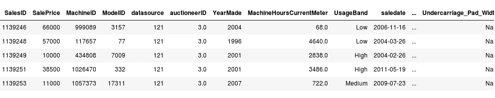

为了解决这个问题，我们将定义以下函数，其中我们将*最大行数*和*最大列数*设置为 1000。

```
def display_all(df):
    with pd.option_context("display.max_rows", 1000, display.max_columns", 1000): 
        display(df)
```

我们现在可以使用这个新创建的函数打印数据集的头部。我们进行了转置，使其在视觉上更具吸引力(我们将列名视为索引)。

```
display_all(df_raw.head().transpose())
```

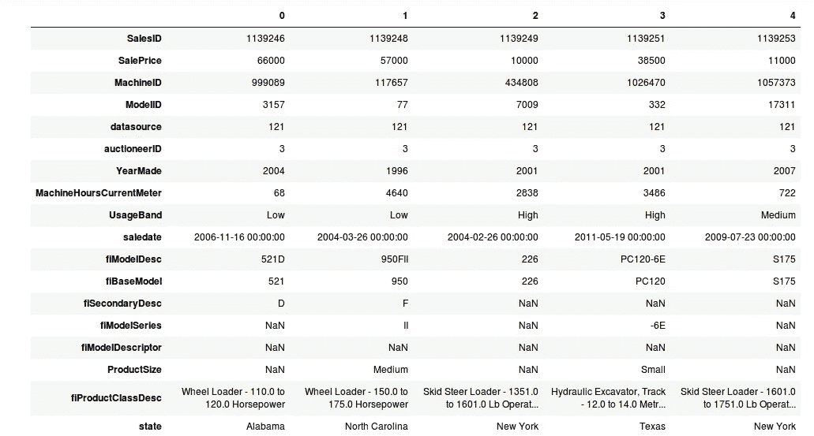

请记住，评估指标是 RMSLE——它基本上是结果的对数值之间的 RMSE。因此，我们将通过取目标变量的对数值来转换它。这就是受欢迎的图书馆*numpy*来拯救我们的地方。

```
df_raw.SalePrice = np.log(df_raw.SalePrice)
```

# 随机森林简介

随机森林模型如何从零开始工作的概念将在本课程的后面部分详细讨论，但这里用杰瑞米·霍华德的话说是一个简短的介绍:

*   随机森林是一种通用的机器学习技术
*   它可用于回归(目标是连续变量)或分类(目标是分类变量)问题
*   它还可以处理任何类型的列，如像素值、邮政编码、收入等。
*   一般来说，随机森林不会过度适应(很容易阻止它过度适应)
*   通常不需要单独的验证集。即使只有一个数据集，它也能告诉你它的概化程度
*   它几乎没有(如果有的话)统计假设(它不假设数据是正态分布的，数据是线性的，或者您需要指定交互)
*   需要很少的特性工程策略，所以这是一个很好的起点。对于许多不同类型的情况，您不需要记录数据或多次交互

听起来是个很棒的技术，对吧？

*RandomForestRegressor* 和 *RandomForestClassifier* 函数在 Python 中分别用于回归和分类问题。由于我们正在处理回归挑战，我们将坚持使用 *RandomForestRegressor* 。

```
m = RandomForestRegressor(n_jobs=-1) m.fit(df_raw.drop('SalePrice', axis=1), df_raw.SalePrice)
```

*m.fit* 功能有两个输入:

*   自变量
*   因变量(目标变量)

这里的目标变量是 *df_raw。销售价格*。自变量是除销售价格之外的所有变量**。**这里，我们使用 *df_raw.drop* 来删除 SalePrice 列(axis = 1 表示列)。这将引发如下所示的错误:

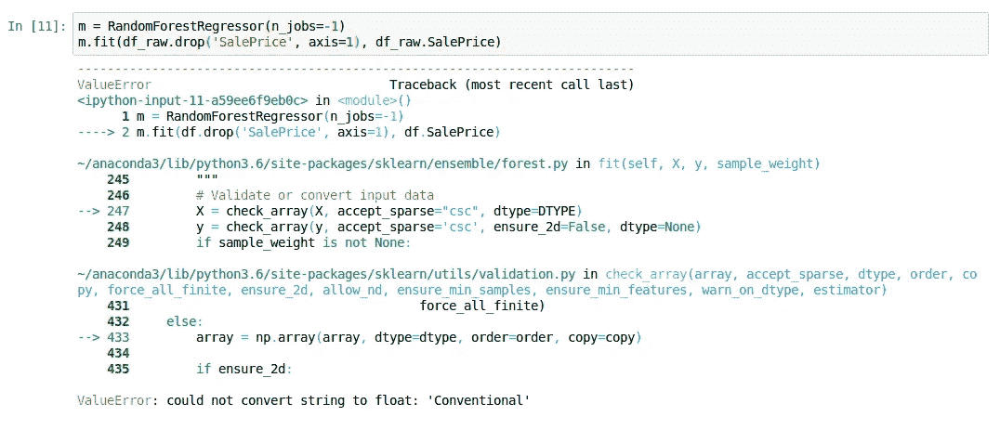

```
ValueError: could not convert string to float: 'Conventional'
```

这表明该模型不能处理“常规”值。大多数机器学习模型(包括随机森林)不能直接使用分类列。我们需要先将这些列转换成数字。所以下一步自然是将所有分类列转换成连续变量。

# 数据预处理

让我们分别处理每个分类列。首先，考虑日期时间格式的*销售日期*列。从日期列中，我们可以提取数字值，例如——年、月、月中的某一天、星期几、假日与否、周末或工作日、下雨了吗？等。

我们将利用 fastai 库中的 *add_datepart* 函数来为我们创建这些特性。该函数创建以下功能:

```
'Year', 'Month', 'Week', 'Day', 'Dayofweek', 'Dayofyear', 'Is_month_end', 'Is_month_start', 'Is_quarter_end', 'Is_quarter_start', 'Is_year_end', 'Is_year_start'
```

让我们运行函数并检查列:

```
add_datepart(df_raw, 'saledate')
df_raw.columns
```

输出:

```
Index(['SalesID', 'SalePrice', 'MachineID', 'ModelID', 'datasource', 'auctioneerID', 'YearMade', 'MachineHoursCurrentMeter', 'UsageBand', 'fiModelDesc', 'fiBaseModel', 'fiSecondaryDesc', 'fiModelSeries', 'fiModelDescriptor', 'ProductSize', 'fiProductClassDesc', 'state', 'ProductGroup', 'ProductGroupDesc', 'Drive_System', 'Enclosure', 'Forks', 'Pad_Type', 'Ride_Control', 'Stick', 'Transmission', 'Turbocharged', 'Blade_Extension', 'Blade_Width', 'Enclosure_Type', 'Engine_Horsepower', 'Hydraulics', 'Pushblock', 'Ripper', 'Scarifier', 'Tip_Control', 'Tire_Size', 'Coupler', 'Coupler_System', 'Grouser_Tracks', 'Hydraulics_Flow', 'Track_Type', 'Undercarriage_Pad_Width', 'Stick_Length', 'Thumb', 'Pattern_Changer', 'Grouser_Type', 'Backhoe_Mounting', 'Blade_Type', 'Travel_Controls', 'Differential_Type', 'Steering_Controls', 'saleYear', 'saleMonth', 'saleWeek', 'saleDay', 'saleDayofweek', 'saleDayofyear', 'saleIs_month_end', 'saleIs_month_start', 'saleIs_quarter_end', 'saleIs_quarter_start', 'saleIs_year_end', 'saleIs_year_start', 'saleElapsed'], dtype='object')
```

下一步是将分类变量转换成数字。为此，我们可以使用 fastai 的 *train_cats* 函数:

```
train_cats(df_raw)
```

在将分类列转换为数字列时，我们必须考虑以下两个问题:

1.  一些分类变量之间可以有顺序(例如，高>中>低)。我们可以使用*设置类别*来设置顺序。
2.  如果一个类别在训练数据中得到一个特定的数字，那么它在测试数据中应该有相同的值。例如，如果训练数据的高值为 3，测试数据的高值为 2，那么它将有两种不同的含义。我们可以使用 *apply_cats* 来验证和测试集合，以确保不同集合中的映射是相同的

虽然这在我们当前的情况下不会有太大的不同，因为随机森林是在分割数据集上工作的(我们很快就会详细了解随机森林是如何工作的)，但对于其他算法来说，知道这一点仍然是很好的。

# 缺失值处理

下一步是查看数据集中缺失值的数量，并了解如何处理它们。这在机器学习竞赛和现实生活的行业问题中都是一个相当普遍的挑战。

```
display_all(df_raw.isnull().sum().sort_index()/len(df_raw))
```

我们用*。isnull()。sum()* 获取缺失值的总数。这除以数据集的长度来确定缺失值的比率。

数据集现在可以用于创建模型了。数据清理始终是一个乏味且耗时的过程。因此，请确保保存转换后的数据集，以便下次加载数据时，我们不必再次执行上述任务。

我们将把它保存为羽化格式，这样可以让我们高效地访问数据:

```
#to save
os.makedirs('tmp', exist_ok=True)
df.to_feather('tmp/bulldozers-raw')

#to read
df_raw = pd.read_feather('tmp/bulldozers-raw')
```

我们必须估算缺失值，并将数据存储为从属和独立部分。这是通过使用 fastai 函数 *proc_df* 来完成的。该功能执行以下任务:

*   对于连续变量，它检查一列是否有缺失值
*   如果该列有缺失值，它会创建另一个名为 *columnname_na* 的列，其中 1 表示缺失，0 表示没有缺失
*   同时，缺失的值被替换为列的中值
*   对于分类变量，pandas 用-1 替换缺失值。因此 *proc_df* 将所有分类变量的值加 1。因此，我们用 0 表示缺失，而所有其他值都以 1 递增

```
df, y, nas = proc_df(df_raw, 'SalePrice')
```

# 模型结构

我们已经处理了分类列和日期值。我们还处理了缺失的值。现在，我们终于可以启动并构建我们一直在缓慢前进的随机森林模型了。

```
m = RandomForestRegressor(n_jobs=-1) 
m.fit(df, y) 
m.score(df,y)
```

*n_jobs* 设置为-1，以使用机器上所有可用的内核。这给了我们 0.98 的分数(r)，非常优秀。这里需要注意的是，我们已经在训练集上训练了模型，并在其上检查了结果。这个模型很有可能在看不见的数据(在我们的例子中是测试集)上表现不好。

找出答案的唯一方法是创建一个验证集，并在其上检查模型的性能。因此，让我们创建一个包含 12，000 个数据点的验证集(训练集将包含其余的数据)。

```
def split_vals(a,n): 
    return a[:n].copy(), a[n:].copy()

n_valid = 12000  # same as Kaggle's test set size
n_trn = len(df)-n_valid
raw_train, raw_valid = split_vals(df_raw, n_trn)
X_train, X_valid = split_vals(df, n_trn)
y_train, y_valid = split_vals(y, n_trn)

X_train.shape, y_train.shape, X_valid.shape
```

输出:

```
((389125, 66), (389125,), (12000, 66))
```

在这里，我们将在新的数据集(原始数据集的样本)上训练模型，并检查训练集和验证集的性能。

```
#define a function to check rmse value
def rmse(x,y): 
    return math.sqrt(((x-y)**2).mean())
```

为了将分数与训练集和测试集进行比较，下面的函数返回两个数据集的 RMSE 值和分数。

```
def print_score(m):
    res = [rmse(m.predict(X_train), y_train),
           rmse(m.predict(X_valid), y_valid),
           m.score(X_train, y_train), m.score(X_valid, y_valid)]
    if hasattr(m, 'oob_score_'): res.append(m.oob_score_)
    print(res)m = RandomForestRegressor(n_jobs=-1)
%time m.fit(X_train, y_train)
print_score(m)
```

上面代码的结果如下所示。**训练集得分为 0.98，验证集得分为 0.88** 。有点下降，但该模型总体上仍然表现良好。

```
CPU times: user 1min 3s, sys: 356 ms, total: 1min 3s
Wall time: 8.46 s
[0.09044244804386327, 0.2508166961122146, 0.98290459302099709, 0.88765316048270615]
```

# 机器学习简介:第 2 课

既然您已经知道如何用 Python 编写随机森林模型，那么理解它在所有代码下的实际工作方式也同样重要。随机森林经常被引用为黑盒模型，现在是时候消除这种误解了。

我们在第一课中观察到，该模型在训练数据(它以前见过的点)上表现非常好，但在验证集上测试时表现不佳(数据点模型没有经过训练)。让我们首先了解我们是如何创建验证集的，以及为什么它如此重要。

# 创建验证集

创建一个与测试集非常相似的验证集是机器学习中最重要的任务之一。验证分数代表了我们的模型在真实世界数据或测试数据上的表现。

请记住，如果涉及到时间组件，那么最近的行应该包含在验证集中。因此，我们的验证集将与测试集大小相同(来自训练数据的最后 12，000 行)。

```
def split_vals(a,n):
   return a[:n].copy(), a[n:].copy()

n_valid = 12000  
n_trn = len(df)-n_valid
raw_train, raw_valid = split_vals(df_raw, n_trn)
X_train, X_valid = split_vals(df, n_trn)
y_train, y_valid = split_vals(y, n_trn)
```

从 0 到(长度— 12000)的数据点存储为训练集(x_train，y_train)。如前所述，使用训练集构建模型，并在训练集和验证集上测量其性能。

```
m = RandomForestRegressor(n_jobs=-1)
%time m.fit(X_train, y_train)
print_score(m)
```

结果:

```
CPU times: user 1min 3s, sys: 356 ms, total: 1min 3s 
Wall time: 8.46 s 
[0.09044244804386327, 0.2508166961122146, 0.98290459302099709, 0.88765316048270615]
```

从上面的代码中，我们得到了结果:

*   训练场上的 RMSE
*   验证集上的 RMSE
*   训练集上的 r 平方
*   验证集上的 r 平方

很明显，该模型在训练集上过度拟合。另外，训练需要一分多钟。我们能减少训练时间吗？是的，我们可以！为此，我们将进一步获取原始数据集的子集:

```
df_trn, y_trn, nas = proc_df(df, 'SalePrice', subset=30000)
X_train, _ = split_vals(df_trn, 20000)
y_train, _ = split_vals(y_trn, 20000)
```

已经创建了 30，000 个样本的子集，我们从中抽取 20，000 个样本用于训练随机森林模型。

# 建造一棵树

随机森林是一组称为估计量的树。随机森林模型中的树木数量由参数 *n_estimator* 定义。我们将首先查看最大深度为 3 的单棵树(设置*n _ 估计器* = 1)。

```
m = RandomForestRegressor(**n_estimators=1**, max_depth=3, bootstrap=**False**, n_jobs=-1)
m.fit(X_train, y_train)
print_score(m)
```

结果:

```
[0.4965829795739235, 0.5246832258551836, 0.50149617735615859, 0.5083655198087873]
```

绘制树:

```
draw_tree(m.estimators_[0], df_trn, precision=3)
```

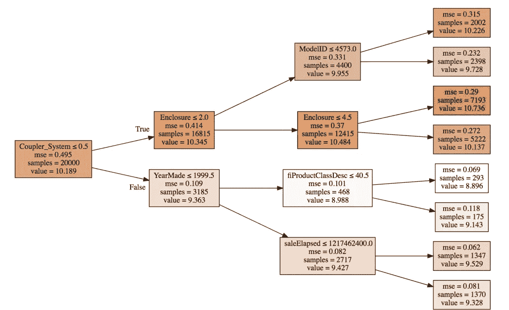

该树是一组二元决策。查看第一个框，第一个分割是基于耦合器系统值:小于/等于 0.5 或大于 0.5。分割后，我们得到耦合器 _ 系统> 0.5 的 3185 行，剩余的 16815 行具有<0.5\. Similarly, next split is on enclosure and Year_made.

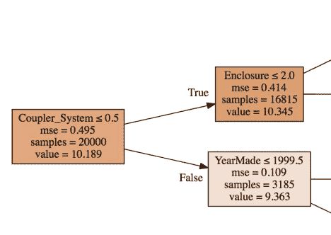

For the first box, a model is created using only the average value (10.189). This means that all the rows have a predicted value of 10.189 and the MSE (Mean Squared Error) for these predictions is 0.459\. Instead, if we make a split and separate the rows based on coupler_system <0.5, the MSE is reduced to 0.414 for samples satisfying the condition (true) and 0.109 for the remaining samples.

So how do we decide which variable to split on? The idea is to split the data into two groups which are as different from each other as possible. This can be done by checking each possible split point for each variable, and then figuring out which one gives the lower MSE. To do this, we can take a weighted average of the two MSE values after the split. The splitting stops when it either reaches the pre-specified *最大 _ 深度*值，或者当每个叶节点只有一个值时。

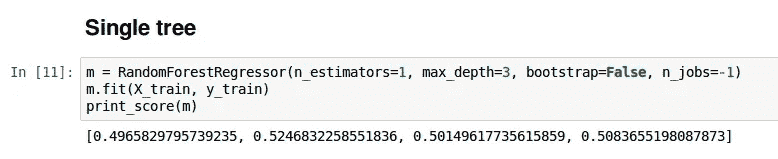

我们有一个基本模型——一棵树，但这不是一个很好的模型。我们需要建立在这个结构上的更复杂的东西。为了创建一个森林，我们将使用一种叫做装袋的统计技术。

# 装袋介绍

在 bagging 技术中，我们创建多个模型，每个模型给出的预测与其他模型不相关。然后我们对这些模型的预测进行平均。**随机森林是一种装袋技术。**

如果创建的所有树彼此相似并给出相似的预测，那么平均这些预测将不会提高模型性能。相反，我们可以在不同的数据子集上创建多个树，这样即使这些树过拟合，它们也会在不同的点集上这样做。*这些样品是用替代品取的。*

**简而言之，我们创建多个表现不佳的模型，并对它们进行平均，以创建一个良好的模型。**单个模型必须尽可能具有预测性，但放在一起应该是不相关的。我们现在将增加随机森林中估计量的数量，看看结果。

```
m = RandomForestRegressor(n_jobs=-1)
m.fit(X_train, y_train)
print_score(m)
```

如果我们不给 *n_estimator* 参数一个值，默认取为 10。我们将从 10 棵树中的每一棵树得到预测。此外， *np.stack* 将用于一个接一个地连接预测。

```
preds = np.stack([t.predict(X_valid) for t in m.estimators_])preds.shape
```

预测的维数是(10，12000)。这意味着验证集中的每一行有 10 个预测。

现在，为了将我们的模型结果与验证集进行比较，这里是预测行、预测的平均值和来自验证集的实际值。

```
preds[:,0], np.mean(preds[:,0]), y_valid[0]
```

实际值是 9.17，但我们的预测没有一个接近这个值。对我们所有的预测取平均值，我们得到 9.07，这是一个比任何单独的树更好的预测。

```
(array([ 9.21034,  8.9872 , 8.9872 , 8.9872 ,  8.9872 , 9.21034, 8.92266, 9.21034,  9.21034, 8.9872 ]),
9.0700003890739005,
9.1049798563183568)
```

尽可能可视化您的模型总是一个好主意。这张图显示了随着树木数量的增加，r 值的变化。

```
plt.plot([metrics.r2_score(y_valid, np.mean(preds[:i+1], axis=0)) for i in range(10)]);
```

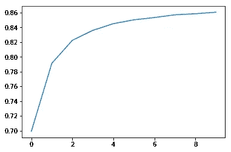

正如所料，随着树的数量增加，r 变得更好。您可以试验一下 *n_estimator* 的值，看看 r 值在每次迭代中是如何变化的。你会注意到，在一定数量的树之后，r 值趋于平稳。

# 场外(OOB)评分

为小数据集创建单独的验证集可能是一个潜在的问题，因为这将导致更小的训练集。在这种情况下，我们可以使用没有训练树的数据点(或样本)。

为此，我们设置参数 *oob_score* =True。

```
m = RandomForestRegressor(n_estimators=40, n_jobs=-1, oob_score=True)
m.fit(X_train, y_train)
print_score(m)

[0.10198464613020647, 0.2714485881623037, 0.9786192457999483, 0.86840992079038759, 0.84831537630038534]
```

*oob_score* 为 0.84，接近验证集。让我们看看其他一些有趣的技术，通过它们我们可以改进我们的模型。

# 二次抽样

之前，我们创建了一个 30，000 行的子集，训练集是从这个子集中随机选择的。作为一种替代方案，我们可以每次创建一个不同的子集，以便在更大部分的数据上训练模型。

```
df_trn, y_trn, nas = proc_df(df_raw, 'SalePrice')
X_train, X_valid = split_vals(df_trn, n_trn)
y_train, y_valid = split_vals(y_trn, n_trn)
set_rf_samples(20000)
```

我们使用 *set_rf_sample* 来指定样本大小。让我们检查一下模型的性能是否有所提高。

```
m = RandomForestRegressor(n_estimators=40, n_jobs=-1, oob_score=True)
m.fit(X_train, y_train)
print_score(m)

[0.2317315086850927, 0.26334275954117264, 0.89225792718146846, 0.87615150359885019, 0.88097587673696554]
```

我们得到 0.876 的验证分数。到目前为止，我们已经研究了一个样本的子集。我们可以在整个数据集上拟合这个模型(但这将需要很长时间来运行，这取决于您的计算资源有多好！).

```
reset_rf_samples()
m = RandomForestRegressor(n_estimators=40, n_jobs=-1, oob_score=True)
m.fit(X_train, y_train)
print_score(m)

[0.07843013746508616, 0.23879806957665775, 0.98490742269867626, 0.89816206196980131, 0.90838819297302553]
```

# 要试验和调整的其他超参数

# 最小样本叶

这可以作为树的停止标准。当叶节点中的样本数小于指定值时，树停止生长(或分裂)。

```
m = RandomForestRegressor(n_estimators=40, min_samples_leaf=3,n_jobs=-1, oob_score=True)
m.fit(X_train, y_train)
print_score(m)

[0.11595869956476182, 0.23427349924625201, 0.97209195463880227, 0.90198460308551043, 0.90843297242839738]
```

这里，我们将*最小样本叶*指定为 3。这意味着对于每次分割，节点中的最小样本数应为 3。我们看到，验证集的 r 提高了，测试集的 r 降低了，这表明模型没有过度拟合训练数据。

# 最大特征

随机森林的另一个重要参数是 *max_features* 。我们之前已经讨论过，各个树必须尽可能不相关。同样，随机森林使用行的子集来训练每棵树。此外，我们还可以使用列(特性)的子集，而不是使用所有的特性。这可以通过调整*最大特征*参数来实现。

```
m = RandomForestRegressor(n_estimators=40, min_samples_leaf=3, max_features=0.5, n_jobs=-1, oob_score=True) 
m.fit(X_train, y_train)
print_score(m)

[0.11926975747908228, 0.22869111042050522, 0.97026995966445684, 0.9066000722129437, 0.91144914977164715]
```

设置 *max_features* 稍微提高了验证分数。这里 *max_features* 被设置为 0.5，这意味着每次分割使用 50%的特征。请记住，这个参数也可以采用 log2 或 sqrt 这样的值。

# 其他主题

# Jupyter 笔记本中的提示和技巧

杰瑞米·霍华德提到了一些导航 Jupyter 笔记本的技巧和窍门，新手会觉得很有用。以下是一些亮点:

*   要找出函数位于哪个库中，只需键入函数名并运行单元格(shift-enter):

```
display
```


*   若要查看文档，请在函数前使用问号:

```
?display
```

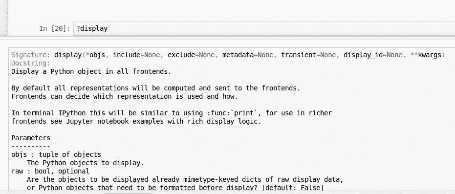

*   若要查看函数的源代码，请在函数名前使用双问号:

```
??display
```

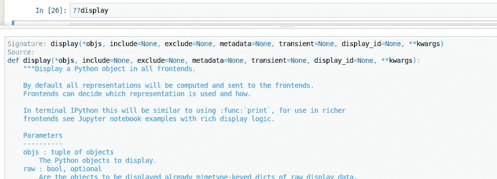

# 维度的诅咒

维度的诅咒是我们拥有的维度越多，空间边缘上的点就越多。所以如果列数越多，就会产生越来越多的空白空间。从理论上讲，这意味着点与点之间的距离意义不大。这不应该是真的，因为这些点彼此之间的距离仍然不同。即使它们在边上，我们仍然可以确定它们彼此之间有多远。

# 连续、分类、顺序变量

*   连续变量是具有整数值或浮点值的变量。例如，年龄、距离、体重、收入等
*   分类变量通常是代表名称或标签的字符串或值。例如，性别、州、邮政编码、级别等
*   序数变量是那些在它们之间有顺序的分类变量。例如，等级(I、II、III)或备注(差、好、优秀)有一个顺序。

# 过度拟合和欠拟合

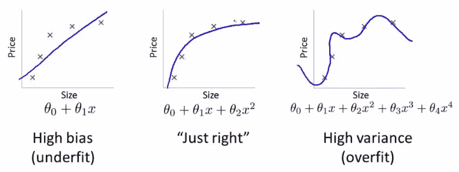

*   欠拟合:在训练数据和测试数据上表现不佳的模型。这个模型不能很好地概括。(左图)
*   过度拟合:在训练数据上表现非常好，但在测试数据上没有表现出类似的高性能的模型。(右图)

# 均方根对数误差

我们的数据集的评估指标是 RMSLE。这个公式是

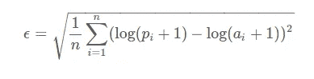

我们首先取对数值的平方差的平均值。我们对所得结果求平方根。这相当于计算这些值的对数的均方根误差(rmse)。

# r 平方

以下是 R 平方的数学公式:

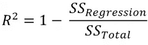

*   SSregression 是(实际值-预测值)的平方和
*   SStotal 是(实际值-平均值)的平方和

R 平方的值可以是小于 1 的任何值。如果 r 平方为负，说明你的模型比预测均值差。

# 极度随机化树

在 scikit-learn 中，我们有另一个算法 *ExtraTreeClassifier* ，它是一个极度随机化的树模型。与随机森林不同，它不是为每个变量尝试每个分裂点，而是为几个变量随机尝试几个分裂点。

# 结束注释

这篇文章对 fast.ai 的机器学习课程的前两个视频进行了非常全面的总结。在第一课中，我们学习了在推土机数据集上编码一个简单的随机森林模型。随机森林(和大多数 ml 算法)不能处理分类变量。在随机森林实现过程中，我们遇到了类似的问题，我们看到了如何使用数据集中的日期列和其他分类列来创建模型。

在第二个视频中，介绍了创建验证集的概念。然后，我们使用这个验证集来检查模型的性能，并调整一些基本的超参数来改进模型。这个视频中我最喜欢的部分是绘制和可视化我们建造的树。我相信通过这些视频你会学到很多东西。我将很快发布另一篇文章，介绍课程的下两个视频。

***更新:*** 这是该系列的第二部分(涵盖第 3、4、5 课)

[使用 fastai 库解释随机森林模型的直观指南(程序员的机器学习—第 2 部分)](https://www.analyticsvidhya.com/blog/2018/10/interpret-random-forest-model-machine-learning-programmers/)

*原载于 2018 年 10 月 8 日*[*www.analyticsvidhya.com*](https://www.analyticsvidhya.com/blog/2018/10/comprehensive-overview-machine-learning-part-1/)*。*