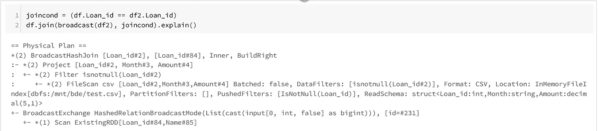

# 火花及其行为介绍。

> 原文：<https://medium.com/analytics-vidhya/an-introduction-to-spark-and-its-behavior-ac247889922f?source=collection_archive---------20----------------------->

# 清单如下:

1.  Mapreduce，Hadoop 和 Spark。
2.  火花建筑。
3.  集群中的火花。
4.  谓词下推、广播和累加器。

# **1。Mapreduce、** Hadoop 和 **Spark**

对于此部分，让下表代表存储在 S3 的待处理数据。

**贷款支付表**

下表分别用绿色和蓝色表示地图和洗牌+减少。如下所示，数据不会被读入驱动程序。

**Hadoop 集群中的 Map Reduce。**

作为第**0**步的一部分，从源读取输入数据。在**的第一个**步骤中，数据被加载到集群的各个节点中。**其次**，数据根据所需列映射到键值对。**第三**，键值对在节点间混洗，计算最终计数。**第四**，键值对减少到总计数。**最后，**计数被加载到驱动程序中。

上述并行处理数据的技术被称为 **MapReduce** 。技术算法可以用任何语言编写。Hadoop 已经实现了这种 Map 和 Reduce 技术以及逻辑来**管理集群**进行数据存储。

在 Map、Shuffle 和 Reduce 过程中，MapReduce 算法将每个中间步骤的结果写入**磁盘**。为每个中间步骤写入磁盘是一个昂贵的解决方案，Spark 为所有中间步骤数据存储将数据保留在 **RAM** 中。与 RAM 一起，Spark 使用了**血统**、 **RDD** 、**转化**和**动作的概念。**

# 2.火花建筑

以下是 Spark 架构的几个基本组件。

> **a .集群和集群管理器** —如上图所示，每个集群都有一个主/驱动节点和工作节点。在操作过程中，主机和工作机之间的所有协调都由一个名为集群管理器的应用程序负责。Spark 有自己的集群管理器，也可以与 YARN、Mesos 和 Kubernates 集成。在 AWS EMR 中，Spark 集群由 YARN 管理。
> 
> **b .驱动程序和执行器—** 每个 spark 应用程序都与一个驱动程序和多个执行器程序相关联。驱动程序是主控制器，与集群管理器一起管理数据处理执行器之间的任务分配。驱动程序可以在**主节点**或**工作节点**上执行，由参数**部署模式**控制。在多用户环境下，建议以集群模式提交 spark 应用，以避免驱动节点过载。与驱动程序和执行器相关联的 CPU 内核和内存的数量由***spark . driver . cores***，***spark . driver . memory***，***spark . executor . cores****和****spark . executor . memory***等参数控制。更多详情请访问[***AWS***](/analytics-vidhya/an-introduction-to-spark-with-aws-425e6ccdff52)**中带 Spark 的数据流水线简介。**

**spark session vs spark context**

> c. SparkSession 和 SparkContext *—* 如上所示，SparkSession 和 SparkContext 都是 spark cluster 的入口点。 **SparkContext** 是 2.0 之前进入 Spark JVM 的切入点。SparkSession 是在 2.0 之后引入的，封装了 spark、hive 和 sql 上下文。使用参数*spark . driver . allowmultiplecontexts，*可以在同一个 JVM 中执行多个 SparkContext，但是这使得 JVM 更加不稳定。一个 SparkContext 的崩溃可能会导致其他 spark context 的崩溃。2.0 之后， **SparkSession** 是 JVM 的入口点。可以启动多个 SparkSession，它们各自的配置、表和视图可以独立工作。如上图所示，所有 Spark 会话都有一个 **single** SparkContext，后跟集群管理器，用于管理和分配执行程序给各个会话。
> 
> **d .转化与行动—** Spark 遵循懒惰框架。对于所有称为转换的计算或映射，spark 会创建称为 DAG 的数据流计划。只有在调用某个操作(显示、收集、写入、缓存)时，才会根据创建的 DAG 或计划触发和执行数据流。对于任何故障，DAG 都会被跟踪以检索丢失的数据。对于 MapReduce 部分解释的例子，下面是 Spark 代码。

**群发火花**

> 一旦执行了上述代码，Spark 仅创建计划或数据沿袭，并可通过如下所示的 **explain** 参数获得。

**数据血统**

> 一旦执行了任何操作(如 show ),就会执行数据计划并进行数据移动，生成 DAG 图并输出如下。

**DAG 表示**

> 如上所述，为最终查询创建了总共 5 个不同的中间 RDD。5 个不同的 RDD 可以与 Hadoop 集群中的 **Map Reduce 中所示的 5 个不同步骤进行比较。MapReduce 在计算最终答案时将所有中间结果写入磁盘，而 Spark 在 RDD 上工作，并将数据保留在 RAM 中，直到计算出最终结果。**

**火花输出 on 动作。**

# 3.星团中的火花

可以使用 **Spark-submit** 向集群提交 spark 应用程序。与 spark 应用程序一起，spark-submit 接受在集群中使用 **conf** 参数成功执行应用程序所需的各种 Spark 配置参数。一旦 spark-submit 触发了一个应用程序，SparkSession 在 SparkContext 和集群管理器的帮助下创建 RDD，执行转换并管理集群以执行应用程序。

**提交的 Spark 申请中的转换+动作**

每个提交的申请都由许多职务组成。触发的 ***作业数=提交的申请中存在的*** 动作数。每个作业(一组转换)又被进一步划分为几个阶段。 ***跨集群节点的数据的每次洗牌*** 都会产生一个 ***新阶段*** 。每个**阶段由**任务**组成。 ***任务数=*** ***分区数*** 将 RDD 分为 while 操作。**

从上面的例子来看， ***作业数= 1 =动作数*** 。虽然计划了 5 项工作，但只执行了一项，其余的都被跳过了。 ***洗牌次数= 2 =级数*** 。一个用于从输入文件映射 RDD，另一个在分组时使用。 ***任务数= 1 =分区数*** 。

# 4.谓词下推、广播、累加器

> **a .谓词下推** —每当对数据应用任何过滤器时，过滤器逻辑在读取时被下推到数据源，而不是提取所有数据并应用过滤器。将过滤器下推到数据源的概念称为谓词下推。

谓词下推

对于并行处理，spark 使用共享变量。当驱动程序向执行器发送任务时，共享变量的副本会被发送到每个节点，以便用于执行任务。Spark 使用两种共享变量，如下所示

> **b. Broadcast 变量** — Broadcast 变量用于在每个节点保存一份数据副本，避免数据洗牌，提高效率。在执行小文件和大文件之间的连接时，可以将小文件广播到每个节点，以避免集群节点之间的数据洗牌。广播变量是一个只读变量。

广播变量。

> **c .累加器** —累加器是用于累加运算的共享变量。每个工人节点向累加器增值，而只有司机可以访问全局变量。工人只能将值添加到累加器中，而不能读取它。每次触发任何任务时，驱动程序都会将累加器变量发送到工作节点。

感谢阅读。欢迎提问和建议。

问候

阿比。