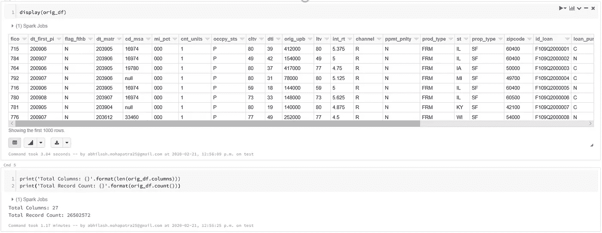

# 自动气象站 Spark 数据管道介绍。

> 原文：<https://medium.com/analytics-vidhya/an-introduction-to-spark-with-aws-425e6ccdff52?source=collection_archive---------3----------------------->

mihály kles 在 [Unsplash](https://unsplash.com?utm_source=medium&utm_medium=referral) 上拍摄的照片

这个故事展示了一种使用 **PySpark** 转换数据的简单方法。伴随着转换，Spark 内存管理也受到关注。

在这里，房地美从 1999 年**到 2018 年**的收购和性能数据用于创建单个 o/p 文件，该文件可进一步用于**数据分析**或构建**机器学习模型**。最后在 **MapReduce** 和 **Spark** 之间进行比较。

# 使用的工具/软件:

1.  服务—数据块，EMR。
2.  存储—个人电脑，S3。
3.  语言— PySpark、Python、SAS(参考)。

# 清单如下:

1.  理解数据和转换逻辑。
2.  Spark 并行和作业生命周期。
3.  Spark 内存管理。
4.  用 Spark-Submit 进行数据处理。
5.  数据验证。
6.  MapReduce 和 Spark 的比较。

对于完整卷，使用的两个 I/p 文件大小为 145 Gb，o/p 文件大小为 5 Gb。对于示例文件，总的 I/p 和 O/p 文件大小接近 3Gb。O/p 文件类似于收购文件，但有更多的列，如贷款违约状态、违约 UPB 等。来自性能数据。

# 1.理解数据和转换逻辑。

> 使用一个简单的 python 脚本从房地美网站收集数据。它废弃网站，下载并解压文件到本地电脑。解压缩后的文件被上传到 S3 进行进一步处理。
> 
> 采集文件有 **27** 个属性，性能有 26 个属性。更多详情请点击[复制本](http://www.freddiemac.com/fmac-resources/research/pdf/user_guide.pdf)链接。转换逻辑从房地美[网站](http://www.freddiemac.com/research/datasets/sf_loanlevel_dataset.page)提供的 **SAS** 代码中提取，并解码成 **PySpark** 。使用**窗口** **、Lag 和 UDF 的**从性能数据中提取出总共 **34 个**新属性，合计 o/p 文件中的 **61 个**属性。
> 
> 从 S3 的房地美网站收集的所有输入数据都是字符串类型。因此，在实际处理之前，在 PySpark 脚本中相应地执行类型转换。
> 
> 通过各种转换逻辑从性能数据创建了 8 个新的中间文件。最后，所有的 **8 个新文件与采集数据结合**,以创建具有 61 个属性的最终 o/p。
> 
> 使用**数据块**使用**样本**数据(3GB)进行初始 PySpark 代码开发，最后使用**完整** (145 GB)数据执行 **EMR** 中的脚本。
> 
> 在 DataBricks community edition 中(1 个 EC2 实例，8 个 8Vcores，6Gb)，处理 3GB 的样本数据需要大约 2.16 小时。
> 
> AWS EMR(1 个主节点+10 个核心节点，每个节点有 16 个 30Gb 的 Core)处理样本数据需要 19 分钟，持久存储完整数据需要 2.6 小时，不持久存储中间文件需要 4.9 小时。

**样本数据，持久化和不持久化作业完成时间。**

[***Git 链接所有必要的 SAS、DataBricks、Python & PySpark 代码。***](https://github.com/abhilash499/An-Introduction-to-PySpark)

# 2.Spark 并行和作业生命周期。

> 当提交一个普通的 python 作业时，程序在一个单独的 Vcore 中执行，尽管其他 Vcore 也是可用的。当一个类似的 python 程序与 Scikit-learn Grid Search CV 一起使用 **njobs=-1** 时，所有可用的内核都被单个作业用来并行执行不同的搜索作业。
> 
> 下图描述了类似的执行过程。Windows 处理器 **4** 正在显示一个**简单 Python** 脚本和 **5** 一个**网格搜索**两者同时执行。

**单机单核 Vs 多核。**

> 当一个 Spark 任务在集群中提交时，**所有**可用的**节点**和**所有**节点 **Vcores** 并行工作执行某个任务。下图显示了 **spark flow** 读取 csv 文件，执行转换并将数据保存到磁盘。

**Spak 作业生命周期。**

> 当我们提交一个 **Spark 作业**时，该作业被分成不同的**阶段**。每个阶段又进一步分为**任务**。在某个时间，一个**执行器**执行某个**数量的任务**，其中**最大任务数=执行器核心数**取决于任务和执行器内存大小。
> 
> 从上图中还可以清楚地看到，数据从未接触到驱动器/主节点。数据从源中提取，由执行者处理，然后传送到目的地。

# 3.Spark 内存管理。

> **默认**火花记忆分布如下图所示。在任何时候，Spark 向 YARN 请求的总内存将是 Executors 内存 **+** 开销内存。**因此，在修改 **spark.executor.memory** 时，应该始终记住 10%的内存开销**。为了控制开销内存，可以使用参数**spark . executor . memory overhead**。

**默认火花存储器分配。**

> 这里将启动一个 EMR 集群，该集群包含 1 个主节点和 10 个工作节点。在**集群**和 **Spark** 中可用的**内存/内核分布**如下所示。

**集群和火花分布。**

> 由于这里只对数据进行转换，所以使用**spark . storage . memory fraction = 0.1**&**spark . shuffle . memory fraction = 0.9**。下图描述了不同数量的**执行器内核**的火花分布。必要时，火花存储和混洗可互换使用总可用内存**。上面设置了内存不足时**将任何数据驱逐**到磁盘的限制。**

****

****遗嘱执行人分配。****

> **控制内存的另一种方式是我们的数据被 Spark 分成多少个分区来进行并行处理，Spark 称之为 RDD 的分区。这是因为，在某个时刻，一个火花**执行器**在某个 **RDD** / **分区**上执行某个**任务**。因此，每个分区应该根据执行者的内存携带数据，以避免错误。**
> 
> **数据分区由参数控制，如 **spark.default.parallelism、spark . SQL . shuffle . partition**和**repartition()/coalesce()**。**spark . default . parallelism**代表**从输入源读取数据**时使用的 RDD 分区数量，而**spark . SQL . shuffle . partition**代表**混洗数据时使用的 RDD 分区数量。****

****测试-1****

****

****Spark-Submit with SQL . shuffle . partitions = 400****

> **通过上述作业的转换，每当从输入(S3)读取数据时，任务数=分区数=根据默认值**spark . Default . parallelism**设置，该值根据数据大小而变化。一直休息，任务数= spark-submit 中设置的分区数=**spark . SQL . shuffle . partition**。**

****

****仅在从 S3 读取数据或向其写入数据时执行阶段/任务。****

****测试-2****

****

****Spark-Submit with SQL . shuffle . partitions = default . parallelism = 3200****

> **通过上述作业的转换，每当从输入(S3)读取**数据时，任务数=分区数=根据 spark-submit **中设置的**spark . default . parallelism**进行设置，对于大文件，但对于小文件，spark 会对其进行整形。**休息** **所有**的时间，任务数=分区数=**spark . SQL . shuffle . partition**在 spark-submit 中设置。******

**仅在从 S3 读取数据或向其写入数据时的阶段/任务。**

> **数据序列化**是将复杂数据结构中的数据对象转换成字节流以便存储、传输和分发的过程。数据序列化在任何分布式应用程序的性能中扮演着重要的角色。这可以通过参数 **spark.serializer** 来控制。正如 Apache 所建议的，序列化程序“org . Apache . spark . Serializer . kryoserializer”比默认的 Java 序列化程序更快。
> 
> 可以使用 **persist()/cache()将中间数据缓存到 RAM 或磁盘中。通过使用 persist，我们可以让**控制**缓存数据的位置，就像**磁盘**、**内存**或**两者都缓存**。测试执行一次，只将中间数据保存到磁盘，其他数据不保存。当中间文件**没有持久化**时，处理整个数据所花费的**时间**几乎是**的两倍**。**

**持久化与非持久化中间文件的总作业时间。**

> 向数据库读写数据时，如果数据量很大**，则执行**repartition()/coalesce()**。这是为了避免同时大量连接到数据库。**
> 
> Spark 在任何任务失败后都会尝试多次，然后才会放弃工作。这可以通过 **spark.task.maxFailures** 和*来设置。*默认为 **4** 。Spark 能够在 4 次尝试内连接到 S3，否则整个工作将会失败。

给 S3 写信时任务失败，但作业成功了。总共有 300 份文件被写到 S3。

# 4.数据处理。

> 在 DataBricks & EMR 中处理大小接近 **3Gb** 的样本数据时，默认设置运行良好。但是，当处理具有特定 AWS EMR 集群大小的所有 **145Gb** 数据时，上述参数被调整以成功执行作业。
> 
> **spark . dynamic allocation . enabled**默认情况下由 AWS 设置为真，这将一些参数初始化为默认值**。spark . SQL . shuffle . partition**&**spark . default . parallelism****= 3200**内存故障后用 400/800。**spark . shuffle . memory fraction = 0.9**&**设置了 spark . storage . memory fraction = 0.1**，这里只进行变换。按照 spark 的建议，**spark . serialize = " org . apache . spark . serializer . kryoserializer "**按照 Apache 的建议更快。
> 
> 处理完整卷时创建的中间文件为 81Gb，因此中间数据帧被**持久化**到**纯磁盘**。这个**节省了 50%的**加工时间**。在**写**输出的同时合并【20】**以限制大量连接同时到达 S3。这两处改动是在 **PySpark 脚本**中执行的。
> 
> 利用**这个**簇**的**大小，AWS 中的**默认**spark . dynamic callocation . enabled**被设置为**真**。通过此**设置，spark.executor.memory** 被设置为 **4743M = 4.6g** 。**

**spark . dynamic allocation . enabled 设置为真。**

> 有了**这个集群**，当**maximize resource allocation**设置为 **True** ， **spark.executor.memory 设置为 20131M = 19.6g** 。

**通过运行集群中的 json 修改设置。**

> 因此，在默认模式下，如果我们**仅**手动更改**执行器内核**，那么**执行器内存分配**不会发生变化，尽管使用了全部内存，但执行器数量会减少，从而导致并行性降低。因此当在**动态分配**或**最大化资源分配**模式下使用**时，如果**配置参数被修改，需要非常小心地**完成**。

***Test-1:spark . dynamic allocation . enabled = true，spark.executor.cores=4***

**由 AWS 默认 spark . dynamic allocation . enabled = true+spark . executor . cores = 4**

**执行器存储内存和分配的计数与之前计算的相同。**

**执行器核心= 4 的执行器状态**

***Test-2:maximize resource allocation = true，spark . executor . cores = 16***

**maximize resource allocation = true+spark . executor . cores = 16**

**执行器存储内存和计数完全按照之前的计算进行分配。**

> 下图显示了任意时间点的执行器状态。因为每个执行器有 16 个内核，所以在任何时候，一个执行器最多可以执行 16 个任务。这里，在拍摄图像时执行了 10 项任务。任务数量取决于分配的执行器内核、内存和任务大小。

**执行器核心= 16 的执行器状态**

**在该集群的 AWS 中，一旦*maximize resource allocation*被设置为 true *，spark.executor.memory* 也被自动设置为 20131M = 19.6g。然后，如果在不修改 *spark.executor.memory 的情况下修改 *spark.executor.cores* ，则*最大*为每个节点*分配一个执行器*，这与内存约束(19.6g)无关***

**在最大并行化的最后一次运行中，启动了一个新集群，并使用了与测试用例 1 相同配置的 spark-submit。**

**EMR 火花簇。**

**最终火花提交配置。**

> 2.5 小时后，转换工作成功完成**。由 coalesce 在脚本中设置的写入 S3 的文件总数为 20，记录计数与采集文件完全相同。在 PyScript 和 Spark 配置中仍然有很多优化的空间。**

****

****最终加工作业完成时间。****

# **5.数据验证。**

> **总共创建了 20 个输出文件，因为在写入 S3 之前使用了 coalesce。**

****

****来自 Spark 的 20 个输出文件+ 1 个作业完成确认。****

> **收购文件和贷款总数。**

****

****采集文件和总贷款数。****

> **已处理的文件和贷款总数。**

****

****已处理文件和贷款总数。****

****在读取已处理的文件时，注意标题，因为 20 个文件中的每一个都与一个标题记录相关联。****

# **6.MapReduce 和 Spark 的比较。**

> **使用 Hive 处理相同的数据，Hive 又使用 MapReduce 进行操作。而 Hive 中的预处理仅基于贷款 id 和周期进行排序。**

****

****以前使用的 EMR 配置单元集群大小。****

> **大约花了 **3.5 小时**到**订购和加载** **只有性能数据**到蜂巢。**
> 
> **[**EMR 中数据管道与 Hive 的链接。**](/analytics-vidhya/big-data-ml-pipeline-using-aws-533dc9b9d774) 这里处理的是相同的房地美数据，但只有日期转换。**
> 
> **在 Spark，虽然我们创建了一个比以前更大的集群，但也执行了繁重的任务。像**窗口、滞后、映射和连接 9 个不同的中间表**这样的操作在 Spark 中执行，即使有大得多的记录，也只有 **2.5 小时。****
> 
> **性能差异的主要原因是 MapReduce 在操作时将中间数据写入**磁盘**，而 Spark 使用**内存** (RAM)。写入磁盘绝对是一个开销很大的操作。**
> 
> **还有一个观察，关于**坚持**在星火。在这里，当在 **Spark** 中处理时，通过**仅将大的中间文件持久化到磁盘**中，节省了将近 50%的时间。由于个人集群 RAM 大小的**限制，使用 Persist。但是在 MapReduce **中，大文件和小文件**都被写到**磁盘**中，使得**变慢**。****

**这标志着使用 **PySpark** 和 **AWS** 处理所有 20 年来房地美单一家庭贷款数据的结束。**

> **该 o/p 处理文件可进一步用于**单户** **家庭贷款数据分析**和**使用机器学习建立贷款风险模型**。**

****除了****total-loss-generated****之外，尝试将所有其他转换从 SAS 中。***

****在共享集群或单个应用程序中工作时，应仔细设置 Spark 默认设置，以最大限度地利用资源。***

*** *这里由于数据大小是已知的，所以内存计算与分区一起精确地执行。当输入数据量不可用且很大时，可根据环境使用****【maximizeresourcelocation】****或****dynamicAllocation****与****broadcasting****强制连接。***

*** *AWS 集群会招致* ***费用*** *，但是 DataBricks 社区版可以免费使用* ***的示例文件。*****

**[***Git 链接所有必要的 SAS、DataBricks、Python & PySpark 代码。***](https://github.com/abhilash499/An-Introduction-to-PySpark)**

**感谢阅读。欢迎提问和建议。**

**问候**

**阿比。**