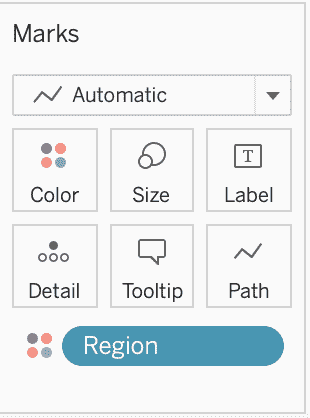

# Tableau 简介

> 原文：<https://medium.com/analytics-vidhya/an-introduction-to-tableau-1d28976e1040?source=collection_archive---------30----------------------->

Tableau 是一个很好的方式来创建简单而漂亮的可视化效果。对于数据科学家来说，当试图从大量的数据集中理解和说明趋势和大的想法时，这是非常有用的。它还可以创建专业图形，可用于演示、项目、网站、研究或共享到社交媒体。

Tableau 的另一个很酷的地方是几乎不需要编码——相反，该平台使用拖放变量、菜单和格式选项来操作数据。这使得即使没有编码经验也能更容易地创建。

*基础知识*

Tableau 提供五种产品:

*   桌面
*   读者
*   计算机网络服务器
*   公共
*   在线的

都以不同的价格提供不同的服务。读者和公众是免费的，出于介绍的目的，我们将侧重于公众。Public 是一个用于非商业数据的巨大服务器，所有发布的数据可视化显然都是对公众开放的。要下载 Tableau Public 供你自己探索，请点击[链接](https://public.tableau.com/en-us/s/download)。

下载 Tableau 后，第一步是连接到数据源。

*注意:当你连接到 tableau 上的一个数据文件时，你并没有编辑数据文件本身。您仍然可以在 tableau 中操作和编辑数据，以便创建可视化效果，但这不会更改数据集。*

然后，我们要拖动位于窗口左侧的一个工作表，它显示“将工作表拖动到此处”这将打开数据集的预览。在这个预览中，我们可以修改数据集，如重命名列或更改变量的结构。这很容易通过点击列上方的符号来完成。

要开始创建可视化(viz)，请在窗口底部打开一个工作表。这些控件的工作方式和外观类似于 Excel 表格。

在这里，可以创建和重命名新的工作表，以及仪表板和故事，我们将在后面讨论。一个新的工作表看起来会像这样:

在最左侧，您会注意到数据集的字段，这些字段将被拖到屏幕的“将字段拖放到此处”区域。这些被分解为维度和度量。**维度是定性数据，度量是定量的数值数据。**这些是默认组织的。

实际上，进行可视化需要双击这些维和度量，或者将它们拖到工作表窗口中的“行”和“列”架上。Tableau 将基于这些值自动生成图表或可视化。以这种方式添加更多的维度将改变输入到图形中的值，这将改变图形/可视化本身的外观。

*这是双击两个字段的结果。*

这是双击附加字段时发生的情况。这产生了将一个变量按“区域”分解的效果，显示了更多现在用颜色编码的信息。

您可能会注意到，当悬停在可视化上时，在某些点上会出现一个小框。这称为工具提示，是查看每个数据点信息的一种方式。

通过单击工具栏上的“显示标记标签”,可以将工具提示数据添加到可视化中。

工具栏还允许数据可视化中的其他更改。例如，它可以交换行和列，并改变图形的整体外观。使用工具栏，Tableau 可以轻松地更改颜色、过滤器和标签，以强调数据的某些方面。

*要添加颜色，只需将你想要着色的变量从工作表的左侧拖到“颜色”磁贴上。这将自动改变可视化值的颜色。要编辑颜色，单击颜色块，滚动选项选择您想要的配色方案。*

Tableau 可以感知数据试图表示什么，并猜测显示它的最佳格式。例如，到目前为止，我作为例子使用的数据集有许多来自各个国家和地区的数据。如果我双击“国家名称”字段，就会自动创建一幅世界地图！相同类型的更改可以应用于地图上的可视化。

假设你现在已经创建了完美的可视化，并希望继续前进，并作出另一个。只需转到窗口底部，然后单击“新建工作表”一旦在不同的工作表上创建了多个可视化效果，就可以很容易地将它们组合成一个仪表板。通过单击窗口底部的“新建仪表板”来添加新的仪表板。在这个新区域中，以前制作的表可以被拖动到屏幕的主要部分。

仪表板还允许添加更多内容！标题、链接、网页等等都可以添加到仪表板中，这是 viz 创作的最终产品。这是一个简单的仪表板:

一旦仪表板完成，通过连接到一个帐户，它可以很容易地导出和存储到 tableau。高达 10 GB 的存储空间可供免费使用。这些可视化效果可以分享到网站、社交媒体、项目等。

这是对 Tableau 的一个非常简短的介绍，但是使用这个强大的 data viz 工具还可以做更多的事情！Tableau 安装附带了一个名为 Sample-Superstore 的样本数据集，这是开始探索 Tableau 强大功能的一个很好的方式。这个关于全球二氧化碳排放量的数据集可以在 Tableau 网站上下载。有很多方法可以了解更多，包括 Tableau 网站和 YouTube 上的视频教程。祝你好运！