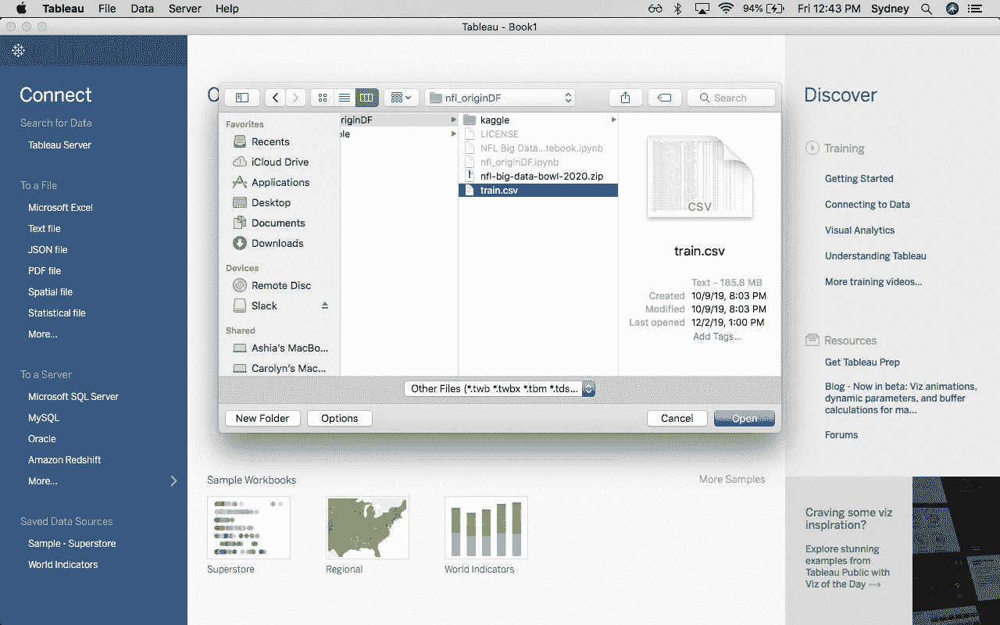
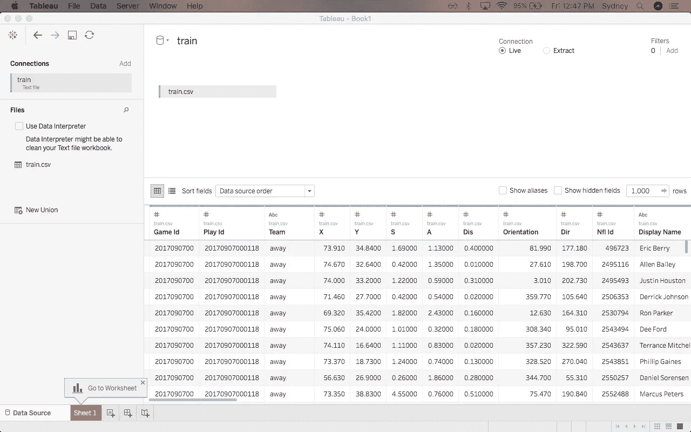
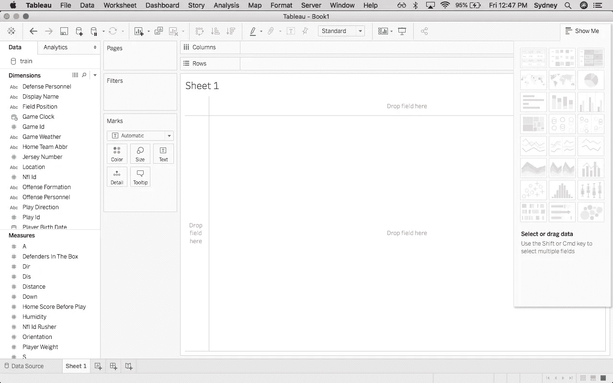
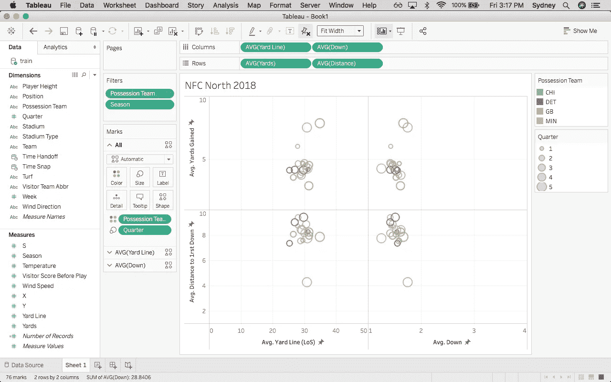

# Tableau 简介

> 原文：<https://medium.com/analytics-vidhya/an-introduction-to-tableau-71da88b40aa8?source=collection_archive---------15----------------------->

## 了解数据视觉效果的黄金标准

Tableau 是一个数据可视化平台，通过一套产品为公司提供*可访问的*传统数据分析。

Tableau 提供用于数据清理、可视化分析、协作、结果共享和灵活部署的产品。

在他们的产品中，定制很容易，允许任何公司定制他们的使用。Tableau 提供了简单的版本控制、项目组织和大量的数据安全特性，可以作为一个全面的数据解决方案。

## *Tableau 产品*

*   *Tableau 桌面* -旗舰数据分析软件
*   *Tableau Prep* -创建数据流的构建者和维护管理数据流的指挥者
*   *Tableau Online* -云中的协作和存储
*   *Tableau 服务器* -面向企业的云或内部部署的服务器
*   *Tableau Foundation* -执照、志愿者专业帮助、资金和其他非盈利资源
*   *Tableau Public*——任何人都可以免费使用公开数据

鉴于 Tableau 的用户友好特性，任何数据科学家都没有理由将它从简历中删除——特别是因为它是商业世界中使用最广泛的数据工具之一。这是他们客户名单中的一小部分:

客户还包括 NFL 球队、其他职业运动队、医院、大学、非营利组织和管理机构。此外，任何考虑进入一个仍在学习拥抱数据科学的行业的人都应该期待遇到 Tableau。

> Tableau 为 SheerID 认证的学生提供免费的一年期桌面和 Prep Builder 许可证。学生激活密钥可用于在两台机器上安装产品。
> 
> 对于个人用户，可以购买许可证，免费试用，或者用户可以使用 Tableau Public。
> 
> Tableau 还提供各种专业认证。

# **第一步:选择我们的数据源**

图 1

首先，我们连接到一个文件-在屏幕的左侧，选择“到一个文件”下的“更多…”来打开文件目录。对于本文，我们将使用 2017 年和 2018 年 NFL 赛季的比赛数据，名为“train.csv”。该数据的形状大约是 49 列和 500，000 行。

> Tableau 还可以轻松地集成两个不同的数据源——例如，这个 CSV 文件和一个 MySQL 服务器，只需添加一个连接。虽然我们可以根据需要直接编辑连接参数，但这将使用默认连接来创建。现在，我们将坚持使用这个 CSV 文件。

现在我们的数据源已经设置好了，我们将选择左下角的 *Sheet 1* ，开始在 Tableau 桌面平台中处理我们的数据:

图 2

# **第二步:选择要分析的数据**

图 3

在左侧，我们的数据中的列被自动拆分为维度和度量。维度通常是离散值，在我们将维度拖动到的列、行或标记字段中以蓝色显示。测量是连续的，以绿色显示。Tableau 在这个分类过程中通常是准确的，但是如果需要，我们可以选择切换任何列。

现在，我可以点击尺寸或尺寸中的任何值，并将其拖至屏幕顶部的*列*或*行*区域，或者拖至左侧的*过滤器*或*标记*区域。

我们将从过滤 2018 年比赛中控球队在 NFC North 的数据开始。我们通过将球队和赛季拖到*过滤器*区域，然后双击每个过滤器来指定我们想要查看的内容。在这种情况下，我们将赛季限制在 2018 年，并将控球队限制在 NFC North 的球队(绿湾包装工队、芝加哥熊队、明尼苏达维京队、底特律雄狮队)。

图 4

# **第三步:摆弄我们的参数**

继续上面的图 4，我们可以看到我们已经完成了以下工作:

*   指定我们正在查看列和行中每个数据区域的平均值(将鼠标悬停在每个区域上，然后从下拉菜单中选择 Average)
*   将季度设置为按大小显示(通过点击并拖动季度到左边的*标记*，然后点击“大小”)，结果显示在屏幕的右侧
*   将控球队设置为颜色可视化，使用与 Quarter 相同的方法
*   调整每个列和行的轴以适应数据

从这里，我们可以继续使用我们正在使用的数据，我们希望如何对数据进行子集化，以及如何可视化的细节。

在我们的工具包中只有这些基础，我们已经准备好创建属于[数据是美丽的](https://www.reddit.com/r/dataisbeautiful/)的可视化。

# 推荐阅读:

 [## Tableau:商业智能和分析软件

### Tableau 可以帮助任何人看到和理解他们的数据。连接到几乎任何数据库，拖放创建…

www.tableau.com](https://www.tableau.com/)  [## 走廊

### 用 Tableau Public 创建的惊人的数据可视化例子。

public.tableau.com](https://public.tableau.com/en-us/gallery/?tab=featured&topic=social-good) 

请继续关注我的下一篇 Tableau 帖子， *Tableau 功能和视觉变化，*探索 Tableau 强大的功能可以允许的偏见，以及我们如何以多种不同的方式创建真实、详细的视觉效果。