# 使用 TextRank 算法的文本摘要介绍(Python 实现)

> 原文：<https://medium.com/analytics-vidhya/an-introduction-to-text-summarization-using-the-textrank-algorithm-with-python-implementation-2370c39d0c60?source=collection_archive---------0----------------------->

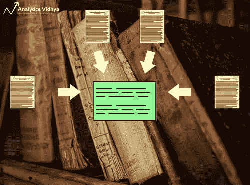

# 介绍

文本摘要是自然语言处理(NLP)的应用之一，它必将对我们的生活产生巨大的影响。随着数字媒体和出版业的不断发展，谁有时间去浏览整篇文章/文档/书籍来决定它们是否有用呢？谢天谢地，这项技术已经出现了。

你有没有在 shorts 里碰到过手机 app **？这是一个创新的新闻应用程序，可以将新闻文章转换成 60 字的摘要。而这正是我们在这篇文章中要学习的——**自动文本摘要**。**

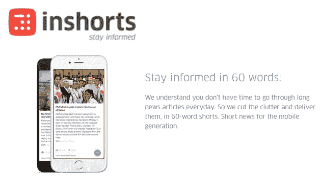

自动文本摘要是自然语言处理领域中最具挑战性和最有趣的问题之一。这是一个从多种文本资源(如书籍、新闻文章、博客帖子、研究论文、电子邮件和推文)中生成简明而有意义的文本摘要的过程。

由于大量文本数据的可用性，目前对自动文本摘要系统的需求正在激增。

通过这篇文章，我们将探索文本摘要的领域。我们将理解 TextRank 算法是如何工作的，并将在 Python 中实现它。系好安全带，这将是一次有趣的旅程！

# 目录

1.  文本摘要方法
2.  了解 TextRank 算法
3.  理解问题陈述
4.  TextRank 算法的实现
5.  下一步是什么？

# 文本摘要方法

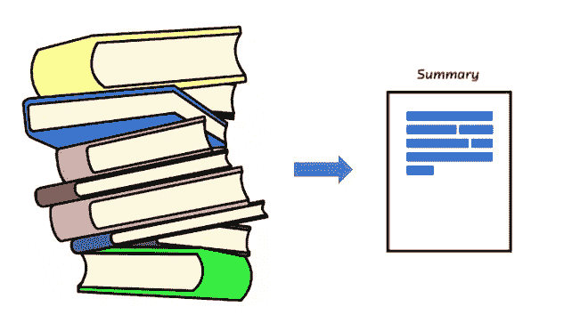

自动文本摘要早在 20 世纪 50 年代就受到了关注。汉斯·彼得·鲁恩在 20 世纪 50 年代后期发表了一篇名为“文学摘要的自动创建”的[研究论文](http://courses.ischool.berkeley.edu/i256/f06/papers/luhn58.pdf)，该论文使用词频和短语频等特征从文本中提取重要句子用于摘要目的。

Harold P Edmundson 在 20 世纪 60 年代后期进行的另一项重要的研究使用了一些方法，如提示词的存在、文本标题中出现的词以及句子的位置，来提取重要的句子用于文本摘要。从那时起，许多重要的和令人兴奋的研究已经发表，以解决自动文本摘要的挑战。

文本摘要可以大致分为两类— **抽取摘要**和**抽象摘要**。

1.  **提取摘要:**这些方法依赖于从一段文本中提取几个部分，如短语和句子，并将它们堆叠在一起以创建摘要。因此，识别用于摘要的正确句子在抽取方法中是至关重要的。
2.  **抽象摘要:**这些方法使用先进的自然语言处理技术来生成全新的摘要。本摘要的某些部分甚至可能不会出现在原文中。

在这篇文章中，我们将关注**提取摘要**技术。

# 了解 TextRank 算法

在开始使用 TextRank 算法之前，我们应该熟悉另一种算法 PageRank 算法。事实上，这实际上启发了 TextRank！PageRank 主要用于对在线搜索结果中的网页进行排名。让我们借助一个例子快速了解一下这个算法的基础。

# PageRank 算法

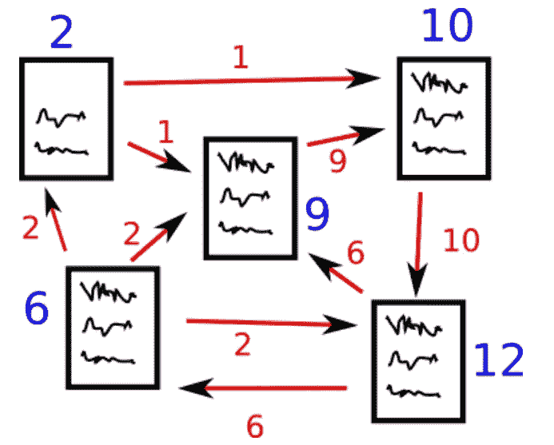

*来源:*[*http://www.scottbot.net/HIAL/*](http://www.scottbot.net/HIAL/)

假设我们有 4 个网页——w1、w2、w3 和 w4。这些页面包含相互指向的链接。有些页面可能没有链接，这些被称为悬挂页面。

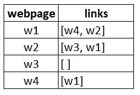

*   网页 w1 具有指向 w2 和 w4 的链接
*   w2 有 w3 和 w1 的链接
*   w4 仅具有网页 w1 的链接
*   w3 没有链接，因此它将被称为悬挂页面

为了对这些页面进行排名，我们必须计算一个叫做 **PageRank score** 的分数。这个分数是用户访问该页面的概率。

为了捕捉用户从一个页面导航到另一个页面的概率，我们将创建一个正方形矩阵 M ，具有 n 行和 n 列，其中 **n** 是网页的数量。

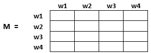

这个矩阵的每个元素表示用户从一个网页转换到另一个网页的概率。例如，下面突出显示的单元格包含从 w1 过渡到 w2 的概率。

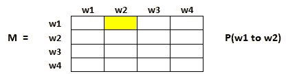

概率的初始化在下面的步骤中解释:

1.  从页面 I 到 j 的概率，即 M[ i ][ j ]，用 **1/(网页 wi 中唯一链接的数量)**初始化
2.  如果页面 I 和 j 之间没有链接，那么概率将被初始化为 **0**
3.  如果一个用户登陆了一个悬空页面，那么可以假设他同样有可能转换到其他页面。因此，M[ i ][ j ]将被初始化为 **1/(网页数量)**

因此，在我们的情况下，矩阵 M 将被初始化如下:

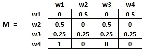

最后，这个矩阵中的值将以迭代的方式更新，以得出网页排名。

# TextRank 算法

现在我们已经掌握了 PageRank，让我们来理解一下 TextRank 算法。我在下面列出了这两种算法的相似之处:

*   我们用句子代替网页
*   任意两个句子之间的相似度被用作网页转移概率的等价物
*   相似性得分存储在一个正方形矩阵中，类似于用于 PageRank 的矩阵 M

TextRank 是一种抽取式无监督文本摘要技术。让我们来看看我们将遵循的 TextRank 算法的流程:

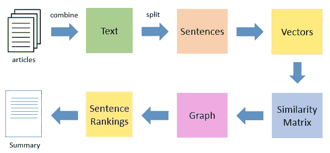

*   第一步是连接文章中包含的所有文本
*   然后将文本分成单独的句子
*   下一步，我们将为每一个句子找到向量表示(单词嵌入)
*   然后计算句子向量之间的相似度并存储在矩阵中
*   然后将相似度矩阵转换成图，以句子为顶点，相似度得分为边，用于句子排名计算
*   最后，一定数量的排名靠前的句子形成最终摘要

所以，事不宜迟，让我们启动 Jupyter 笔记本，开始编码吧！

*注:如果你想了解更多关于图论的知识，那么我推荐你看看这篇* [*文章*](https://www.analyticsvidhya.com/blog/2018/09/introduction-graph-theory-applications-python/) *。*

# 理解问题陈述

作为一个主要的网球爱好者，我总是通过虔诚地浏览尽可能多的网上网球更新来让自己了解这项运动的最新进展。然而，事实证明这是一项相当困难的工作！有太多的资源和时间是一个限制。

因此，我决定设计一个系统，通过浏览多篇文章为我准备一个要点摘要。如何着手做这件事？这就是我将在本教程中向您展示的内容。我们将把 TextRank 算法应用到一个收集文章的数据集上，目的是创建一个漂亮简洁的摘要。

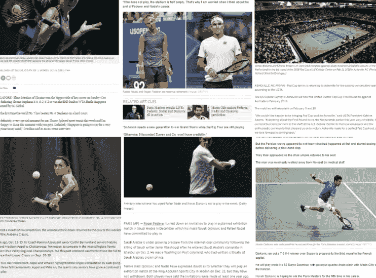

请注意，这本质上是一个单领域多文档的摘要任务，也就是说，我们将把多篇文章作为输入，并生成一个要点摘要。多领域文本摘要不在本文讨论范围之内，但是您可以随时尝试一下。

## 你可以从[这里](https://s3-ap-south-1.amazonaws.com/av-blog-media/wp-content/uploads/2018/10/tennis_articles_v4.csv)下载我们将要使用的数据集。

# TextRank 算法的实现

所以，没有任何进一步的麻烦，点燃你的 Jupyter 笔记本，让我们实施我们到目前为止所学的。

## 导入所需的库

首先，导入我们将用来应对这一挑战的库。

```
import numpy as np 
import pandas as pd 
import nltk nltk.download('punkt') # one time execution 
import re
```

## 读取数据

现在让我们来阅读我们的数据集。我已经在前一节提供了下载数据的链接(以防您错过)。

```
df = pd.read_csv("tennis_articles_v4.csv")
```

## 检查数据

让我们快速浏览一下数据。

```
df.head()
```

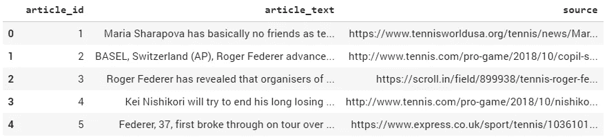

我们的数据集中有 3 列—“文章 id”、“文章文本”和“来源”。我们对“article_text”列最感兴趣，因为它包含文章的文本。让我们打印数据中第一篇文章的文本，看看它是如何出现的。

```
df['article_text'][0]
```

**输出:**

```
"Maria Sharapova has basically no friends as tennis players on the WTA Tour. The Russian player has no problems in openly speaking about it and in a recent interview she said: 'I don't really hide any feelings too much. I think everyone knows this is my job here. When I'm on the courts or when I'm on the court playing, I'm a competitor and I want to beat every single person whether they're in the locker room or across the net...
```

## 将文本拆分成句子

现在下一步是将文本分解成单独的句子。我们将使用 *nltk* 库的 *sent_tokenize( )* 函数来完成这项工作。

```
from nltk.tokenize import sent_tokenizesentences = [] 
for s in df['article_text']: 
  sentences.append(sent_tokenize(s))# flatten list
sentences = [y for x in sentences for y in x]
```

让我们打印列表中的几个元素*句子*。

```
sentences[:5]
```

**输出:**

```
['Maria Sharapova has basically no friends as tennis players on the WTA Tour.', "The Russian player has no problems in openly speaking about it and in a recent interview she said: 'I don't really hide any feelings too much.", 'I think everyone knows this is my job here.', "When I'm on the courts or when I'm on the court playing, 
I'm a competitor and I want to beat every single person whether they're in the locker room or across the net.So I'm not the one to strike up a conversation about the weather and know that in the next few minutes I have to go and try to win a tennis match.", "I'm a pretty competitive girl."]
```

## 下载手套单词嵌入

[手套](https://nlp.stanford.edu/projects/glove/)单词嵌入是单词的向量表示。这些单词嵌入将用于为我们的句子创建向量。我们也可以使用单词袋或 TF-IDF 方法来为我们的句子创建特征，但是这些方法忽略了单词的顺序(并且特征的数量通常非常大)。

我们将使用预先训练好的**维基百科 2014 + Gigaword 5** 手套向量[此处](https://nlp.stanford.edu/data/glove.6B.zip)。*注意——这些单词嵌入的大小是 822 MB。*

```
!wget [http://nlp.stanford.edu/data/glove.6B.zip](http://nlp.stanford.edu/data/glove.6B.zip) 
!unzip glove*.zip
```

让我们提取单词嵌入或单词向量。

```
# Extract word vectors 
word_embeddings = {} f = open('glove.6B.100d.txt', encoding='utf-8') 
for line in f: 
    values = line.split() 
    word = values[0] 
    coefs = np.asarray(values[1:], dtype='float32')   
    word_embeddings[word] = coefs 
f.close()
```

我们现在在字典中存储了 400，000 个不同术语的单词向量——“单词嵌入”。

## 文本预处理

让你的文本数据尽可能无噪声总是一个好的做法。所以，让我们做一些基本的文本清理。

```
# remove punctuations, numbers and special characters clean_sentences = pd.Series(sentences).str.replace("[^a-zA-Z]", " ") # make alphabets lowercase 
clean_sentences = [s.lower() for s in clean_sentences]
```

去掉停用词(一种语言的常用词——是、是、是、的、的、在等)。)出现在句子中。如果您还没有下载 *nltk-stopwords* ，那么执行以下代码行:

```
nltk.download('stopwords')
```

现在我们可以导入停用词了。

```
from nltk.corpus import stopwords 
stop_words = stopwords.words('english')
```

让我们定义一个函数来从数据集中删除这些停用词。

```
# function to remove stopwords 
def remove_stopwords(sen):     
    sen_new = " ".join([i for i in sen if i not in stop_words])          
    return sen_new# remove stopwords from the sentences 
clean_sentences = [remove_stopwords(r.split()) for r in clean_sentences]
```

我们将使用 *clean_sentences* 在 GloVe word vectors 的帮助下为我们数据中的句子创建向量。

## 句子的向量表示

```
# Extract word vectors 
word_embeddings = {} 
f = open('glove.6B.100d.txt', encoding='utf-8') 
for line in f: 
    values = line.split() 
    word = values[0] 
    coefs = np.asarray(values[1:], dtype='float32')    
    word_embeddings[word] = coefs 
f.close()
```

现在，让我们为我们的句子创建向量。我们将首先获取一个句子中组成单词的向量(每个向量的大小为 100 个元素),然后取这些向量的平均值以得到该句子的合并向量。

```
sentence_vectors = [] 
for i in clean_sentences: 
  if len(i) != 0: 
    v = sum([word_embeddings.get(w, np.zeros((100,))) for w in  
        i.split()])/(len(i.split())+0.001) 
  else: 
    v = np.zeros((100,)) 
  sentence_vectors.append(v)
```

## 相似矩阵准备

下一步是找到句子之间的相似性，我们将使用余弦相似性方法来应对这一挑战。让我们为这个任务创建一个空的相似度矩阵，并用句子的余弦相似度填充它。

我们先定义一个维数为零的矩阵(n * n)。我们将用句子的余弦相似度分数初始化这个矩阵。这里， **n** 是句子的数量。

```
# similarity matrix 
sim_mat = np.zeros([len(sentences), len(sentences)])
```

我们将使用余弦相似度来计算一对句子之间的相似度。

```
from sklearn.metrics.pairwise import cosine_similarity
```

并用余弦相似性得分初始化矩阵。

```
for i in range(len(sentences)): 
  for j in range(len(sentences)): 
    if i != j: 
      sim_mat[i][j] = cosine_similarity 
                      (sentence_vectors[i].reshape(1,100),   
                       sentence_vectors[j].reshape(1,100))[0,0]
```

## 应用 PageRank 算法

在继续之前，让我们将相似性矩阵 *sim_mat* 转换成一个图。该图的节点将代表句子，而边将代表句子之间的相似性得分。在这个图表上，我们将应用 PageRank 算法来得出句子的排名。

```
import networkx as nx nx_graph = nx.from_numpy_array(sim_mat) 
scores = nx.pagerank(nx_graph)
```

## 摘要提取

最后，是时候根据排名提取前 N 个句子用于摘要生成了。

```
ranked_sentences = sorted(((scores[i],s) for i,s in 
                           enumerate(sentences)), reverse=True)# Extract top 10 sentences as the summary 
for i in range(10): 
  print(ranked_sentences[i][1])
```

**输出:**

```
When I'm on the courts or when I'm on the court playing, I'm a competitor and I want to beat every single person 
whether they're in the locker room or across the net.So I'm not the one to strike up a conversation about the 
weather and know that in the next few minutes I have to go and try to win a tennis match.

Major players feel that a big event in late November combined with one in January before the Australian Open will 
mean too much tennis and too little rest.

Speaking at the Swiss Indoors tournament where he will play in Sundays final against Romanian qualifier Marius 
Copil, the world number three said that given the impossibly short time frame to make a decision, he opted out of 
any commitment.

"I felt like the best weeks that I had to get to know players when I was playing were the Fed Cup weeks or the 
Olympic weeks, not necessarily during the tournaments.

Currently in ninth place, Nishikori with a win could move to within 125 points of the cut for the eight-man event 
in London next month.

He used his first break point to close out the first set before going up 3-0 in the second and wrapping up the 
win on his first match point.
The Spaniard broke Anderson twice in the second but didn't get another chance on the South African's serve in the 
final set.

"We also had the impression that at this stage it might be better to play matches than to train.

The competition is set to feature 18 countries in the November 18-24 finals in Madrid next year, and will replace 
the classic home-and-away ties played four times per year for decades.

Federer said earlier this month in Shanghai in that his chances of playing the Davis Cup were all but non-existent.
```

我们走吧！对我们的文章来说，这是一个令人敬畏的、简洁的、有用的总结。

# 下一步是什么？

自动文本摘要是一个热门的研究课题，在本文中，我们只涉及了冰山一角。展望未来，我们将探索深度学习发挥重要作用的抽象文本摘要技术。此外，我们还可以了解以下总结任务:

**特定问题:**

*   多领域文本摘要
*   单文档摘要
*   跨语言文本摘要(某些语言的源和另一种语言的摘要)

**特定算法:**

*   使用 RNNs 和 LSTM 的文本摘要
*   使用强化学习的文本摘要
*   使用生成对抗网络的文本摘要

# 结束注释

我希望这篇文章能帮助你理解自动文本摘要的概念。它有各种各样的用例，并产生了非常成功的应用程序。无论是为了利用你的业务，还是仅仅为了你自己的知识，文本摘要是所有 NLP 爱好者都应该熟悉的一种方法。

我将在以后的文章中尝试使用高级技术来介绍抽象文本摘要技术。同时，请随时使用下面的评论部分让我知道你的想法，或者问你对这篇文章的任何问题。

## 请在这个 [GitHub Repo](https://github.com/prateekjoshi565/textrank_text_summarization) 中找到代码。

*欢迎致电****prateekjoshi565@gmail.com****联系我，进行一对一讨论。*