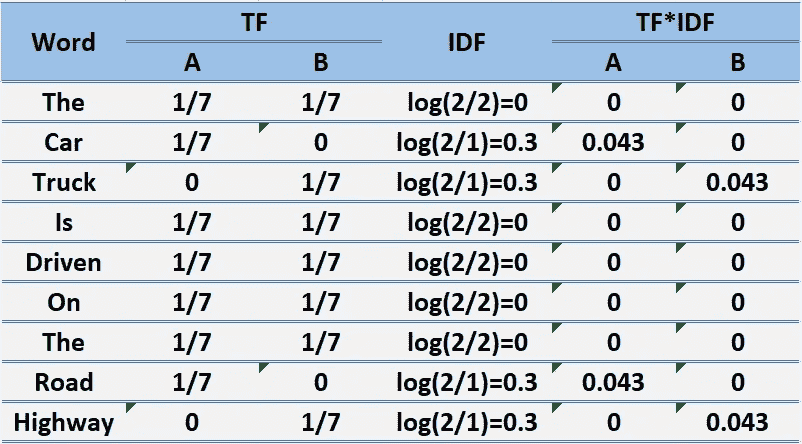

# TF-IDF 简介

> 原文：<https://medium.com/analytics-vidhya/an-introduction-to-tf-idf-using-python-5f9d1a343f77?source=collection_archive---------7----------------------->

> **什么是 TF-IDF？**
> 
> TF-IDF 代表“术语频率，逆文档频率”这是一种根据单词(或“术语”)在多个文档中出现的频率来对它们在文档中的重要性进行评分的方法。

**直觉上……**

1.  如果一个单词在文档中频繁出现，它就很重要。给这个词打个高分。
2.  但是如果一个单词出现在许多文档中，它就不是唯一的标识符。给这个词打个低分。

因此，在许多文档中出现的常见单词“the”和“for”将被缩减。在*单个*文档中频繁出现的单词将被放大。

**让我们来学习它在数学上的含义:**

> **词频(tf)** : *给出了这个词在语料库中每个文档中的出现频率。它是单词在文档中出现的次数与该文档中单词总数的比率。它随着该单词在文档中出现的次数的增加而增加。每个文档都有自己的 tf。*

图 1.1:计算词频的公式

> **逆数据频率(idf):** *用于计算语料库中所有文档中稀有词的权重。在语料库中很少出现的单词具有高 IDF 分数。它由下面的等式给出。*

图 1.2:计算反向数据频率的公式

结合这两者，我们得出语料库中文档中的单词的 TF-IDF 分数(w)。它是 tf 和 idf 的产物:

## TFᵢ,ⱼ= I 在 j 中出现的次数

## N =文件总数

## df ᵢ =包含 I 的文件数

让我们举个例子来更清楚地了解一下。

第一句话:汽车在路上行驶。

句子 2:卡车在高速公路上行驶。

在这个例子中，每个句子都是一个单独的文档。

我们现在将计算代表我们的语料库的上述两个文档的 TF-IDF。

从上表可以看出，常用词的 TF-IDF 为零，说明它们不显著。另一方面，“汽车”、“卡车”、“公路”和“高速公路”的 TF-IDF 不为零。这些话有更多的意义。

# TF-IDF 的局限性

> *1。它直接在字数统计空间中计算文档相似性，这对于大词汇量来说可能很慢。*
> 
> *2。它假设不同单词的计数提供了相似性的独立证据。*
> 
> *3。它没有利用单词之间的语义相似性。*

干杯！！

感谢您阅读这篇文章。如果觉得有帮助一定要分享出来。

还有，让我们在**中**、 **GitHub** 和 [**LinkedIn**](http://www.linkedin.com/in/roshan-kumar-gupta-43a96bb2) 上连线。

如有任何问题，您可以通过电子邮件(roshangg 96[at]Gmail[dot]com)联系我。

**快乐学习！！**