# Python 中的 TD Ameritrade API 简介

> 原文：<https://medium.com/analytics-vidhya/an-introduction-to-the-td-ameritrade-api-in-python-8c9d462e966c?source=collection_archive---------1----------------------->


使用 TD Ameritrade API，分析股票市场数据从未如此简单。只需一点设置和几行代码，用户就可以访问大量的股票和期权数据。

**生成消费者密钥**

为了使用 TD Ameritrade API，我们需要一个消费者密钥。这可以通过访问 TD 的开发者[网站](https://developer.tdameritrade.com/user/me/apps)，创建一个账户，然后请求一个令牌来找到。授予 API 访问权限后，您将获得一个消费者密钥:

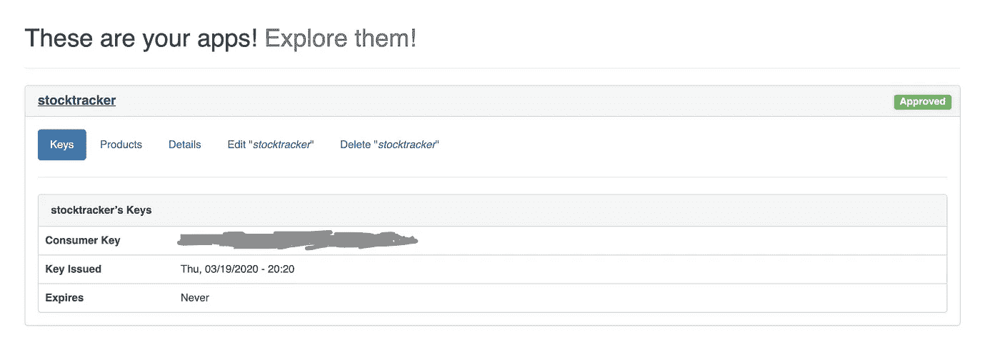

现在我们已经完成了身份验证，我们可以继续编写 Python 代码了:

**设置**

首先，让我们导入我们需要的包。我使用*请求*进行 API 请求，使用 JSON 解析数据。

```
import requests
import json
```

接下来，我们需要将消费者密钥作为变量传递:

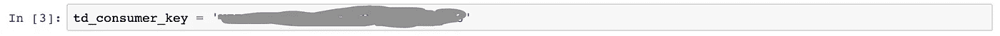

现在让我们连接到 API。我将用几个不同的端点来证明这一点:

1.  **股票报价**

如果您希望获得股票报价，端点如下:

```
endpoint = '[https://api.tdameritrade.com/v1/marketdata/{stock_ticker}/quotes?'](https://api.tdameritrade.com/v1/marketdata/{stock_ticker}/quotes?')
```

要获取有关美国航空公司股票的信息，我们可以将“AAL”输入到{stock_ticker}占位符中。

```
full_url = endpoint.format(stock_ticker='AAL')page = requests.get(url=full_url,
                    params={'apikey' : td_consumer_key})content = json.loads(page.content)
```

我们将返回关于美国航空公司的当前股票数据，包括当前价格、52 周范围、波动性和交易量。

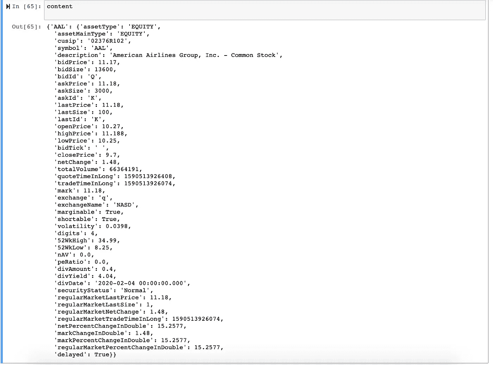

**2。历史价格**

我们还可以查看股票的历史股价。代码看起来非常类似于 quotes 端点，只是端点中的 *pricehistory* 替换了 *quotes* :

```
endpoint = '[https://api.tdameritrade.com/v1/marketdata/{stock_ticker}/pricehistory'](https://api.tdameritrade.com/v1/marketdata/{stock_ticker}/pricehistory')full_url = endpoint.format(stock_ticker='AAL')page = requests.get(url=full_url,
                    params={'apikey' : td_consumer_key})content = json.loads(page.content)
```

我们返回一个长长的蜡烛列表，对应不同的时间戳:

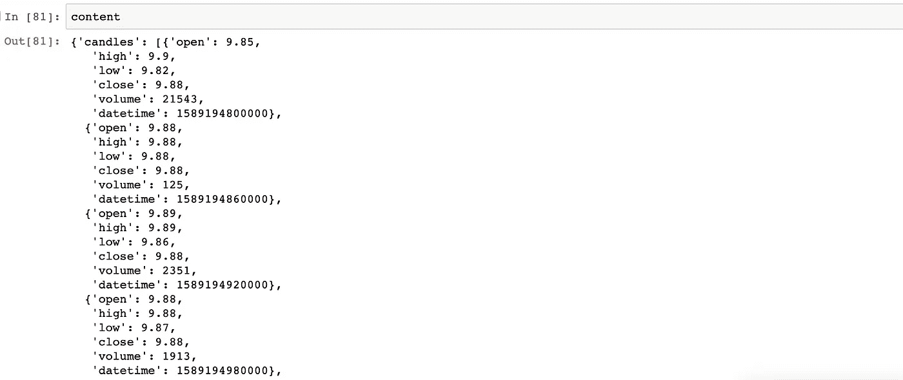

*pricehistory* 端点有很多[参数](https://developer.tdameritrade.com/price-history/apis/get/marketdata/%7Bsymbol%7D/pricehistory)，对应不同的周期和频率。

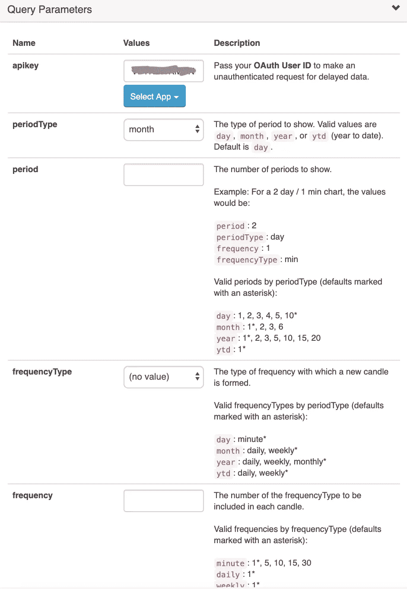

例如，要检索过去一年 AAL 股票价格的**周**历史数据，我们可以使用与上面相同的端点，但是添加了四个新参数:

```
endpoint = '[https://api.tdameritrade.com/v1/marketdata/{stock_ticker}/pricehistory?periodType={periodType}&period={period}&frequencyType={frequencyType}&frequency={frequency}'](https://api.tdameritrade.com/v1/marketdata/{stock_ticker}/pricehistory?periodType={periodType}&period={period}&frequencyType={frequencyType}&frequency={frequency}')full_url = endpoint.format(stock_ticker='AAL',periodType='year',period=1,frequencyType='weekly',frequency=1)page = requests.get(url=full_url,
                    params={'apikey' : td_consumer_key})content = json.loads(page.content)
```

这将给我们带来一年的蜡烛:

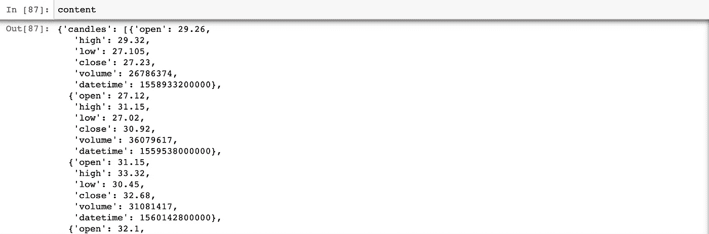

**3。基本面数据**

我们还可以通过*仪器*端点收集基本面数据:

```
base_url = '[https://api.tdameritrade.com/v1/instruments?&symbol={stock_ticker}&projection={projection}'](https://api.tdameritrade.com/v1/instruments?&symbol={stock_ticker}&projection={projection}')endpoint = base_url.format(stock_ticker = 'AAL',
    projection = 'fundamental')page = requests.get(url=endpoint, 
            params={'apikey' : td_consumer_key})content = json.loads(page.content)
```

我们得到的是一大堆信息，从市盈率、负债率到客户满意度。

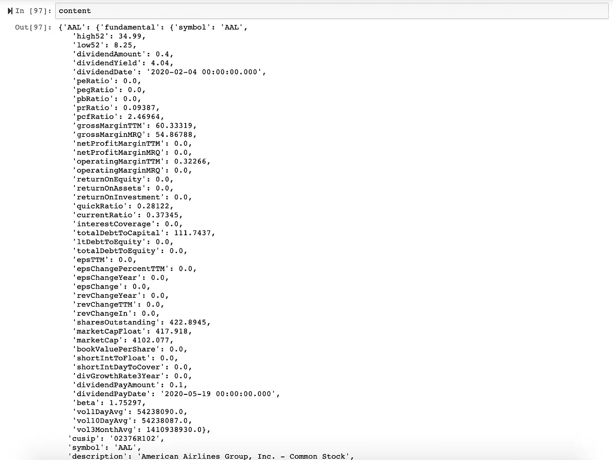

该端点允许不同类型的“预测”，如下所述:

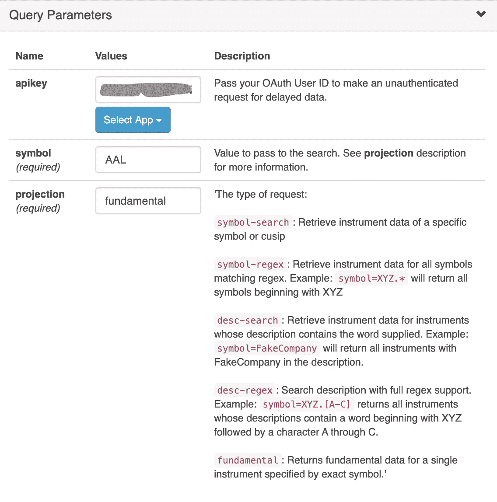

**4。选项数据**

我们还可以使用 TD Ameritrade API 收集选项数据:

```
base_url = '[https://api.tdameritrade.com/v1/marketdata/chains?&symbol={stock_ticker}'](https://api.tdameritrade.com/v1/marketdata/chains?&symbol={stock_ticker}')endpoint = base_url.format(stock_ticker = 'AAL')page = requests.get(url=endpoint, 
            params={'apikey' : td_consumer_key})content = json.loads(page.content)
```

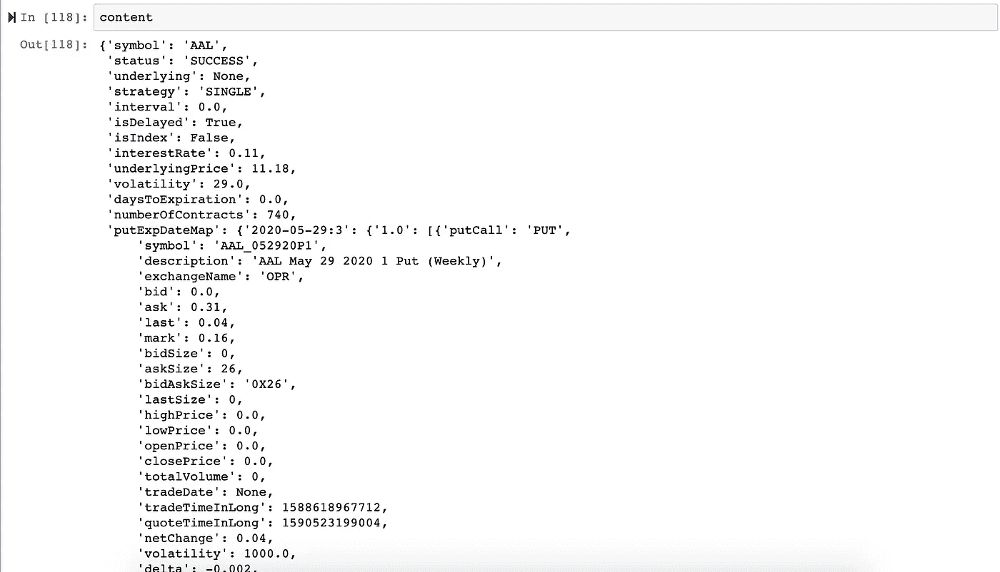

上面的 API 调用将返回一长串期权合约(本例中是 740 份！).对于这种要求，最好说得更具体一些。

让我们具体看看 2020 年 11 月 20 日**到期的**看跌**期权:**

```
base_url = '[https://api.tdameritrade.com/v1/marketdata/chains?&symbol={stock_ticker}](https://api.tdameritrade.com/v1/marketdata/chains?&symbol={stock_ticker}\)&contractType={contractType}&fromDate={date}&toDate={date}'endpoint = base_url.format(stock_ticker = 'AAL',
    contractType = 'PUT',
    date='2020-11-20')page = requests.get(url=endpoint, 
            params={'apikey' : td_consumer_key})content = json.loads(page.content)
```

这里，我们添加了几个参数:fromDate 和 toDate，它们都设置为“2020–11–20”，contractType 设置为“PUT”。

我们现在只得到 22 份期权合约:

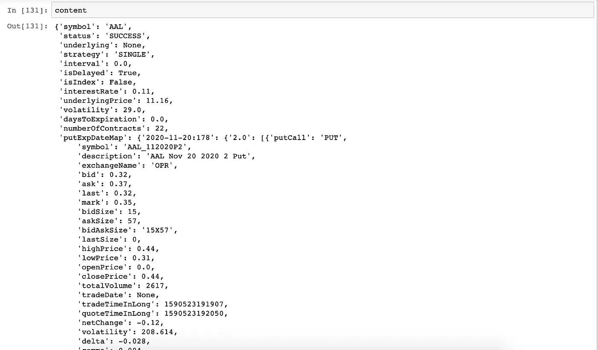

如果您想设置特定的执行价格，您可以通过{strike}参数来设置:

```
base_url = '[https://api.tdameritrade.com/v1/marketdata/chains?&symbol={stock_ticker}\](https://api.tdameritrade.com/v1/marketdata/chains?&symbol={stock_ticker}\)
&contractType={contract_type}&strike={strike}&fromDate={date}&toDate={date}'endpoint = base_url.format(stock_ticker = 'AAL',
    contract_type = 'PUT',
    strike = 9,
    date='2020-06-19')page = requests.get(url=endpoint, 
            params={'apikey' : td_consumer_key})content = json.loads(page.content)
```

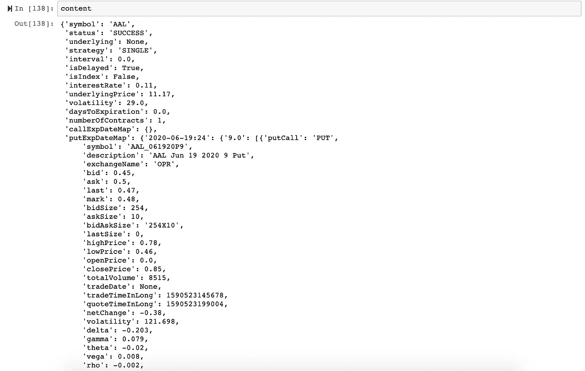

— -

还有其他有趣的 API 端点可用，如交易历史(如果您使用 TD Ameritrade 进行交易)和“movers”，它跟踪不同指数内的高/低表现股票(即今天 DJI 指数内前 10 名上涨股票)。更多信息可以在 TD Ameritrade 的[文档](https://developer.tdameritrade.com/apis)中找到。

— —

这篇博文后来被转载到我的博客[数据架构](https://www.dataarchitecting.com/post/an-introduction-to-the-td-ameritrade-api-in-python)上。