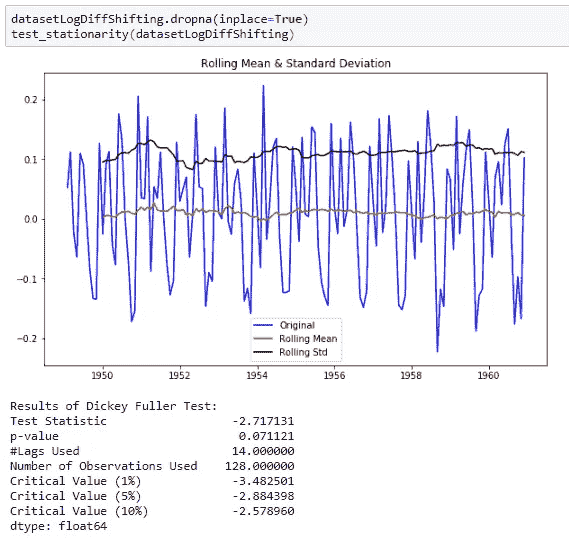
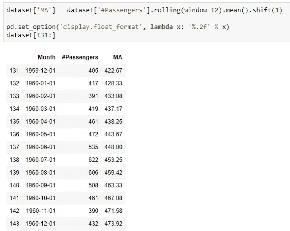

# 时间序列分析导论

> 原文：<https://medium.com/analytics-vidhya/an-introduction-to-time-series-analysis-2a12d3702299?source=collection_archive---------2----------------------->

通过这篇文章，我们将了解:

> *时序数据、预测的重要性及其对企业的影响。*
> 
> *时间序列数据的各种成分，如趋势、季节性、周期性和随机成分。*
> 
> *各种模型如自回归(AR)、移动平均(MA)、自回归移动平均(ARMA)、自回归综合移动平均(ARIMA)。*

根据 [**维基百科**](https://en.wikipedia.org/wiki/Time_series) **，**等间距或按时间顺序索引的数据点序列被识别为时间序列。也可以说是对某些变量或事件以相等的时间间隔发生或发生的一组测量。这里，时间作为估计独立变量。时间序列是以特定的相等间隔进行的一系列观察。对序列的分析有助于我们根据以前的观察值预测未来的值。在时间序列中，我们只有 2 个变量，时间&是我们要预测的变量。例如海潮的高度、太阳黑子的数量、每年季节的有规律变化、米光的发光、真空中钟摆的运动。等等。等等。以相等的时间间隔发生的任何事件，包含时间变量。

时间序列还有许多应用，如:年度 GDP(和更多指标)计算、每月门票销售、电子商务销售得分、天气预报、地震预测、股票价格预测、团队在体育运动中的表现，以及统计学、计量经济学、金融学、天文学、通信工程等不同领域。等等。等等。

***注:*** *当在数据集中，因变量为常量或具有某种数学函数(三角函数、对数函数、多项式函数)时，不使用时间序列分析。*

时间序列可以是单变量或多变量的。如果数据只包含单个变量(t 时刻的产品需求)的观察值，则称为单变量时间序列数据。如果数据包含许多变量(时间 t 时产品的需求、时间 t 时的价格、时间 t 时产品广告的花费、时间 t 时产品竞争者的价格),则称之为多元时间序列数据。

**时序数据的组成**

时序数据有四个组成部分:

1.  **趋势:**趋势是一致的数据长期向上或向下的运动。如果我们在数据集中拟合一条线，如果线的斜率为正，那么它是上升趋势，如果斜率为负，那么它是下降趋势。

**2。季节性:**当一年中的时间或一周中的某一天等因素影响因变量时，在序列中会观察到重复的模式。季节性因素是在一年、一个月或一周内以固定的间隔从趋势中反复向上或向下移动。例如，每年都有不同的季节。向上或向下的波动可能由节日、假日、季末销售(EOSS)等引起。

**季节性**总是固定的、已知的频率。在图中我们可以看到，在每三个小尖峰之后有一个大尖峰，并且这是在持续趋势中发生的。

**3。周期性:**周期性成分是由于衰退、失业等宏观经济变化而发生的以随机间隔(周期之间的时间是随机的)围绕趋势线的波动。与季节性模式不同，周期性成分具有不固定的上升和下降周期。周期性波动具有重复模式，重复间隔时间超过一年(至少 2 年)。而在季节性的情况下，由于每年发生的因素，波动发生在一年内。季节性波动的周期性是恒定的，而在周期性波动的情况下，它不是恒定的。从这张图中我们可以看到，在正常时期有持续的下降，但频率是不固定的。

**4。不规则:**由于随机或不可预见的事件而发生的不规则波动。它们持续时间短且不重复。例如科罗纳疫情，伊波拉疫情。等等。等等。

**5。** **白噪声:**白噪声是无周期的随机波动。它的均值为 0，方差为常数，没有相关性。这对预测没有帮助。啊它既有优点也有缺点。由于没有相关性，它对预测没有帮助，但有时它是有意添加的，以减少其他噪音，例如，为了减少交通噪音，特定的声音可能用于帮助鼓励睡眠，而不管环境噪音，如雨声或海滩声。

**平稳数据(或平稳性):**

在对一个时间序列应用任何统计模型之前，该序列必须是平稳的或时不变的，这意味着，在不同的时期，它应该具有恒定的均值、恒定的方差和恒定的协方差。这意味着数据应该始终具有恒定的平均值，始终如一地分散，并且应该始终具有相同的频率。因此，如果我们的数据均值、方差和协方差随时间变化，那么我们的数据是非平稳的，我们必须在应用任何方法之前使其平稳。这是必要的，因为如果我们的数据有一些规则的模式，那么很有可能在不同的时间间隔内，它会有相同的行为，并可能导致模型的准确性问题。此外，与非平稳数据相比，平稳数据的数学计算更容易。

**非平稳序列:**

这里我们有恒定的方差和协方差，但是平均值不是恒定的。

在这里，我们可以说均值在某种程度上几乎是恒定的，但方差和协方差都不是随时间恒定的。

这里均值和方差是常数，但协方差是随时间变化的。

**平稳性检查:**

有两种方法用于平稳性检查:

a) **滚动统计** —绘制移动平均线或移动标准差，看其是否随时间变化。这是一种视觉技术。

在上图中，我们看到标准偏差是恒定的，但平均值呈上升趋势。因此，它不是静止的。

a) **ADCF 检验——扩展的迪基-富勒检验**用于给出各种有助于识别平稳性的值。零假设认为时间序列是非平稳的。它包括一个**测试统计** &一些**临界值**用于一些置信水平。如果检验统计量小于临界值，我们可以拒绝零假设&说序列是平稳的。ADCF 测试也给了我们一个 [**p 值**](/analytics-vidhya/linear-regression-and-fitting-a-line-to-a-data-6dfd027a0fe2) 。根据零假设，p 值越低越好。

**如何使非平稳时间序列平稳？**

有两种不同方法可以将非平稳时间序列转换成时间序列。

**差异:**p 值(> 0.05)表明我们不能拒绝零假设，因此序列是非平稳的。通过从当前观察值中减去前一个观察值，或者我们可以说，通过从当天需求值中减去前一天需求值，来进行差异计算。

通过差分，平稳性可以很容易地实现。这意味着时间序列不依赖于时间。这就像白噪声，无论我们什么时候观察，它在任何时间点看起来都一样。然而，趋势和季节性在不同时间影响时间序列。平稳时间序列没有任何可预测的模式。

**时间序列的分解:**分解通过将任何非平稳时间序列分解成趋势、季节性和一些随机误差(具有零均值和随时间相关)来去除趋势和季节性模式。我们将随机误差或不规则模式作为平稳分量进行分析。

分解模型也有两种类型:

a)添加剂分解:

b)产品分解:

好的，让我们举个例子。我们将使用航空旅客数据集来检验时间序列数据的平稳性，该数据集提供了 1949 年至 1960 年美国航空旅客的月度总数。可以从 [**Kaggle 获取数据集和代码。**](https://www.kaggle.com/chirag19/air-passengers)

把月份作为索引，会把它作为 X 变量，把总数作为 y 变量。

通过绘制上述数据，我们可以看到数据的任何趋势。如果有任何趋势出现，我们将检查平稳性。

从图中我们可以看出有上升的趋势。因此，我们将进行平稳性检查。

确定滚动统计和绘图。

在上面的图中，我们可以看到平均值的上升趋势，而标准偏差随时间保持不变。对于稳定的序列，平均值和标准偏差必须随时间保持不变，即平行于 x 轴。

**应用 ADCF 检验:**

从 ADCF 测试中显示的结果，我们可以看到 p 值不小于 0.05，并且测试统计不小于任何临界值。因此，我们不拒绝零假设，因此序列是非平稳的。

**实现平稳性的数据转换**

有几种方法可以通过数据转换实现平稳性，如取 log10、loge、平方、平方根、立方、立方根、指数衰减、时移。

**用时移(或差分)法求平稳性。**

为其重复使用定义函数总是比每次都编写完整的代码更好。

这里，我们的 p 值是 0.07，仍然大于 0.05，测试统计值位于临界值(10%)和临界值(5%)之间，并且滚动平均值和滚动标准偏差是随时间恒定的。

如果使用**指数衰减法**效果会更好。

**对数标度变换:**

这里我们得到 p 值为 0.02，测试统计值小于临界值(5%)。

**做级数分解:**

将残差作为分解数据，并对其进行平稳性检验。

**绘制 ACF 和 PACF** :

**自相关函数(ACF):**

自相关指的是时间序列中的观察值相互关联的方式。ACF 是时间序列中当前时间点的值和滞后 k 点的值之间的相关系数，即 y(t)和 y(t-k)之间的相关性。ACF 确定 MA 过程的顺序。

**部分自相关函数(PACF):**

PACF 与 ACF 相同，但 y(t)和 y(t-k)之间的中间滞后被去除(或部分去除)。即 y(t)和 y(t-k)与(k-1)滞后之间的相关性被消除。

从 ACF 图中，我们看到曲线在 x=2 处接触 y=0.0 线。因此，从理论上讲，从 PACF 图中 Q = 2，我们看到曲线在 x=2 处接触 y=0.0 线。因此，从理论上讲，P = 2。

**时间序列模型**

**移动平均线:**

移动平均是所有时间序列模型中最简单的预测模型。它使用过去数据的平均值(或加权平均值)来预测时间序列数据的未来值。

其中 F(t+1)是时间(t+1)的预测值，N 是过去的观测值。

在 pandas 中，rolling()和 mean()函数用于计算时间窗口(或时间段)的移动平均值。

***注:*** *简单移动平均对所有用于预测未来值的过去观察值给予相同的权重，这是它的主要缺点。*

*使用航空旅客数据集展示移动平均预测和指数平滑预测。*

数据集包含两个变量 month 和 Passenger 的 144 个条目，没有缺失值。

计算上述数据集的移动平均值。

绘制 MA 预测的实际值和预测值:

**计算平均绝对百分比误差(MAPE):**

平均绝对百分比误差是绝对百分比误差的平均值。它用百分比表示平均误差。

计算 MAPE 和 RMSE:

**指数平滑:**

[***指数平滑***](https://en.wikipedia.org/wiki/Exponential_smoothing) 对过去的观测值赋予不同的权重。

其中，α是平滑常数。它的值介于 0 和 1 之间。alpha 值越大，平滑程度越低。pandas 中的 ews()函数使用 alpha 作为参数来计算指数移动平均值。

计算 MAPE 并绘制实际值和预测值:

使用指数平滑法预测的误差(MAPE 9.38%)比简单的移动平均模型(MAPE 10.88%)要小。

**自回归综合移动平均模型:**

自回归(AR)和移动平均(MA)，两者都经常用于预测。组合 AR 和 MA 来创建诸如自回归移动平均(ARMA)和自回归综合移动平均(ARIMA)的模型。ARMA 模型是回归模型，这意味着在不同时间段测量的变量本身的回归。

来自 [**维基，**](https://en.wikipedia.org/wiki/Autoregressive_integrated_moving_average)

ARIMA 的 AR 部分表明，感兴趣的演变变量是根据其自身的滞后(即先前)值回归的[。MA 部分表示](https://en.wikipedia.org/wiki/Linear_regression)[回归误差](https://en.wikipedia.org/wiki/Errors_and_residuals_in_statistics)实际上是误差项的[线性组合](https://en.wikipedia.org/wiki/Linear_combination)，其值在过去的不同时间同时出现。I(代表“积分”)表示数据值已经被替换为它们的值和先前值之间的差(并且该差分过程可能已经执行了不止一次)。每个功能的目的都是使模型尽可能符合数据。

非季节性 ARIMA 模型一般表示为 ARIMA( *p* ， *d* ， *q* )，其中[参数](https://en.wikipedia.org/wiki/Parameter) *p* ， *d* ， *q* 为非负整数， *p* 为[自回归模型](https://en.wikipedia.org/wiki/Autoregressive_model)， *d* 的阶(时滞数)季节性 ARIMA 车型通常用 ARIMA( *p* 、 *d* 、 *q* )( *P* 、 *D* 、 *Q* ) *m* ，其中 *m* 表示每个季节的期数，大写 *P* 、 *D* 、 *Q*

**自回归模型:**

自回归是在不同时间点测量的变量本身的回归。具有滞后 1 的自回归模型，AR(1，0，0)由下式给出:

上述方程可以推广到包括右边的 p 滞后，称为 AR(p)模型。

其中，ε(t+1)是一个不受控制的残差序列，假设其服从零均值和恒定标准偏差的正态分布。

AR(p)可以通过自相关函数(ACF)和部分自相关函数(PACF)来计算，对于航空乘客的情况我们已经计算过了。

***从我们把非平稳序列转化为平稳序列的地方继续。***

**移动平均线模型:**

滞后 1 的移动平均过程可以写成:

**ARIMA 型号:**

ARIMA(自回归综合移动平均)是 AR(自回归)和 MA(移动平均)两种模型的组合。它有 3 个超参数——P(自回归滞后), d(微分阶次), Q(移动平均),分别来自 AR、I 和 MA 分量。AR 部分是以前和当前时间段之间的相关性。为了消除噪声，使用 MA 部分。I 部分将 AR 和 MA 部分绑定在一起。

ARIMA 的 RSS 值优于 AR 和 MA 模型。我们将对 ARIMA 模型进行预测，并且还会将预测重新转换回原始形式，因为我们是在经过对数变换的数据集上构建模型的。

**预测:**

预测值与实时值非常接近，是一个很好的模型。

> ………………………………………………………………….

有关时间序列模型的更多细节和各种含义，请访问以下链接:

[*使用 Python 进行时间序列分析和预测的端到端项目。*](https://towardsdatascience.com/an-end-to-end-project-on-time-series-analysis-and-forecasting-with-python-4835e6bf050b)

[*用 Python 进行时间序列分析。*](/datadriveninvestor/time-series-analysis-with-python-f5ab388b865a)

[*多元时间序列|向量自回归。*](https://www.analyticsvidhya.com/blog/2018/09/multivariate-time-series-guide-forecasting-modeling-python-codes/?utm_source=DataCamp.com&utm_medium=Community&utm_campaign=News)

[*多元时间序列使用 ARIMAX。*](http://barnesanalytics.com/analyzing-multivariate-time-series-using-arimax-in-python-with-statsmodels)

如果你想让我添加任何东西或者任何写在这里的不正确的东西，然后引导我通过它。这将是一个巨大的帮助。