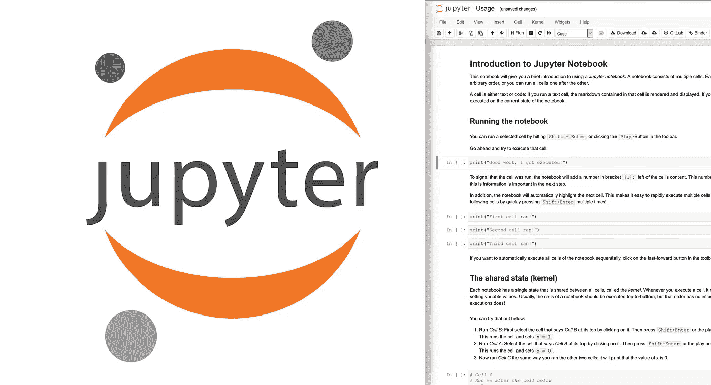
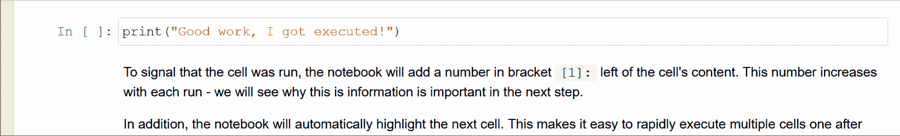
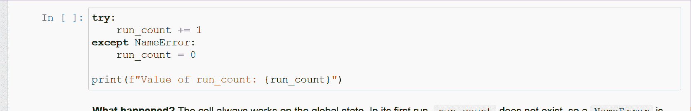
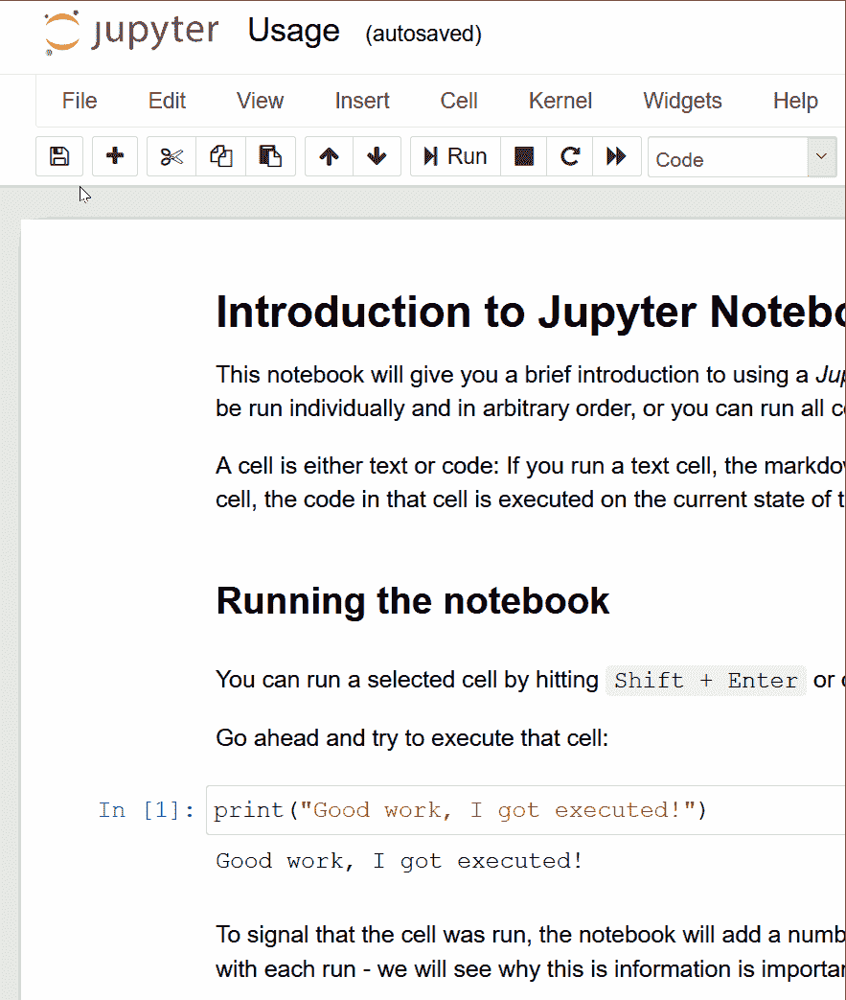

# Jupyter 笔记本使用简介

> 原文：<https://medium.com/analytics-vidhya/an-introduction-to-using-jupyter-notebooks-20bce261d8a4?source=collection_archive---------40----------------------->



[*Jupyter 笔记本*](https://jupyter.org/) 是一种流行的协作和分享代码、报告和[数据分析的方式](https://towardsdatascience.com/an-extensive-guide-to-exploratory-data-analysis-ddd99a03199e)。不幸的是，它们的用法从根本上不同于普通网站和传统的 ide，所以第一次使用可能会令人困惑。为了解决这个问题，这篇文章给你一个成功使用现有笔记本所需知识的快速概述。

# 这是给谁的？

本介绍面向技术背景较浅的人。我在运行的例子中使用了一些非常基本的 Python 代码，但是这里解释的所有概念都是独立的。

我从来没有找到一本直接介绍 Jupyter 笔记本用法的书。相反，读者首先必须通过不同的概念，设置和创建内容的不同部分。一旦你决定创建和分享自己的笔记本，你肯定会需要这些知识，我强烈推荐[realpython.com Jupyter 简介](https://realpython.com/jupyter-notebook-introduction/)和[官方文档](https://jupyter.org/documentation)。但是现在，让我们把注意力集中在如何使用你在网上找到的那个神奇的笔记本上。

# 运行示例

我们将使用我为这次介绍制作的[小型 Jupyter 笔记本](https://mybinder.org/v2/gl/lemberger%2Fjupyter-introduction/master?filepath=Usage.ipynb)。通过 [*活页夹*](https://mybinder.org/) 共享。Binder 使用存储在公共 Git 存储库中的 Jupyter 笔记本，并提供一个 web 服务器和一些资源来运行它们。如果你有兴趣用 binder 出版自己的笔记本，我可以推荐[这本写得很好的介质指南](/@leggomymego/lessons-learned-pushing-a-deep-learning-model-to-production-d6c6d198a7d8)。

运行示例是独立的，包含一些代码示例，所以您可以直接使用它，但是本文将为您提供更多关于用法和行为的细节。

# Jupyter 笔记本电脑的架构

笔记本由多个单元格组成。每个单元可以单独运行，并以任意顺序运行，或者您可以一个接一个地运行所有单元。

单元格可以是文本或代码:如果运行文本单元格，则该单元格中包含的 markdown 将被渲染和显示。如果运行代码单元格，该单元格中的代码将在笔记本的当前状态下执行。该单元的任何输出都显示在该单元的正下方。

# 第一:运行代码



若要运行单元格，请选择它并按下⇑Shift+Enter

您可以通过点击`Shift+Enter`或点击工具栏中的运行按钮运行选定的单元格。

为了表示单元已运行，笔记本会在单元左侧添加一个数字`[1]:`。该数字随着每次运行而增加，并显示细胞是否运行以及以何种顺序运行。此外，笔记本会选择下一个单元格。这使得一个接一个地快速执行多个单元格变得很容易:只需快速按下`Shift+Enter`多次。

# 第二:了解笔记本电脑的全球状态



Jupyter 笔记本全局状态图解:多次运行同一个单元格，每次都会增加 run_count 的值。

每个笔记本都有一个所有单元共享的状态，称为*内核*。每当执行一个单元时，它都会通过运行函数和设置变量值来修改状态。通常，笔记本的单元格应该从上到下执行，但是这个顺序对程序状态没有影响:只有执行的顺序有影响！由于每个单元都在当前的全局状态下工作，如果它的代码依赖于全局状态，那么多次运行同一个单元可能会产生不同的结果。

以上图中的例子为例:例子中的单元执行下面的 Python 代码。

```
try:
    run_count += 1
except NameError:
    run_count = 0
```

在第一次执行时，变量`run_count`不存在，Python 抛出了 NameError:这设置了`run_count = 0`。在同一个单元格的后续执行中，`run_count`现在确实存在，并且单元格的值增加 1。这个小例子显示了单个单元格如何依赖于全局状态，并显示了多个执行的不同行为——当您使用笔记本时，请务必记住这一点。[运行示例](https://mybinder.org/v2/gl/lemberger%2Fjupyter-introduction/master?filepath=Usage.ipynb)包含另一个说明执行顺序重要性的示例。

总结一下，理解两件事非常重要:

1.  *当您开始尝试笔记本时，单元格执行的顺序很重要。*
2.  *单个单元可能被执行多次，并且将始终在当前全局状态下工作。*

每次运行一个代码单元，笔记本会在该单元左侧的括号中增加一个数字，例如`[4]:`。这个数字向您显示了单元运行的顺序，并使您很容易检查是否一切都按照预期的顺序运行。

# 第三:修改

Jupyter 笔记本中的所有单元格都可以修改，您可以通过按`Alt+Enter`添加新的单元格。所以继续吧，只需修改一些代码并运行它！笔记本都是关于探索和实验的。

## 保存更改



最后一点建议:当你使用像 [binder、](http://mybinder.org/)这样的服务时，你使用的是一个 Jupyter 笔记本的临时实例**。这是一件好事，因为你可以改变任何你想要的，它不会对原来的笔记本有任何影响。但反之亦然，你的更改不会保存在 web 上，因为你的实例在一段时间不活动后会被删除。要保存您的更改，您必须通过菜单下载笔记本的内容:`File` → `Download as`。这给了你不同格式的选择:你可以按原样下载笔记本(`Notebook`)；您可以选择将内容下载为原生 Python 文件(`Python`)；或者您可以下载不同格式的文本内容(如`AsciiDoc`、`HTML`或`LaTex`)。**

*免责声明:**“Jupyter”和 Jupyter 徽标是 NumFOCUS 的商标或注册商标。*