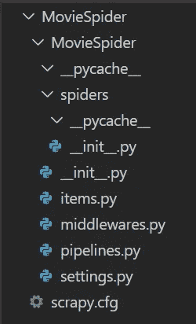

# 使用 Scrapy 进行网页抓取的介绍

> 原文：<https://medium.com/analytics-vidhya/an-introduction-to-web-scraping-using-scrapy-91abca9120d6?source=collection_archive---------13----------------------->


在 [Unsplash](https://unsplash.com?utm_source=medium&utm_medium=referral) 上 [Sai Kiran Anagani](https://unsplash.com/@_imkiran?utm_source=medium&utm_medium=referral) 拍摄的照片

网络抓取是从网站中提取相关数据的过程。这是数据科学领域的一项重要技能。有几个库可用于抓取数据。在本教程中，我们将使用 Scrapy 从互联网中提取一些相关数据。Scrapy 是一个开源框架，用于从网站提取数据，处理数据，并将其存储在您喜欢的结构中。让我们先来看看 Scrapy 的架构。Scrapy 有以下组件。

1.  **Scrapy Engine** :引擎负责控制系统所有组件之间的数据流。当某个动作发生时，它触发事件。
2.  **调度器:**调度器将从服务器接收的请求进行排队。稍后，当引擎请求它们时，调度程序负责供给它们。
3.  **下载器:**下载器负责抓取网页并馈送给引擎。
4.  **蜘蛛:**蜘蛛是用户编写的自定义类，用于从抓取的网页中提取相关信息。
5.  **物品管道:**蜘蛛从互联网上抓取数据后，物品管道负责处理。
6.  **下载器中间件:**下载器中间件是位于引擎和中间件之间的特定挂钩。
7.  **蜘蛛中间件:**这个组件存在于引擎和蜘蛛之间。他们能够处理蜘蛛输入和输出。

如果你想深入了解 Scrapy 架构，请看看[架构概述](https://docs.scrapy.org/en/latest/topics/architecture.html)。

现在让我们开始使用框架。确保您已经安装了 Python。首先我们必须安装 Scrapy。

```
$ pip install scrapy
```

如果你在安装 Scrapy 时遇到任何问题，请查看这里的官方文档。

让我们构建一个蜘蛛来提取电影数据。我们正在刮 IMDb 网站创建一个电影数据集。这些数据可用于创建电影搜索引擎、电影推荐系统等应用。首先，我们要创建一个 Scrapy 项目。

```
$scrapy startproject MovieSpider
```

这将创建一个具有以下结构的 Scrapy 项目。



项目结构

作为初学者，你不必了解所有的文件。现在，记住你的自定义蜘蛛应该放在蜘蛛文件夹中。现在让我们创造我们的蜘蛛。请注意，有两个名为 MovieSpider 的文件夹。移动到第二个目录，创建一个基本的蜘蛛。

```
$cd MovieSpider/MovieSpider
$scrapy genspider imdb_bot
```

这将在您的 spiders 文件夹中创建一个新的 spider imdb_bot.py。蜘蛛的结构如下所示。


蜘蛛代码的结构

我们蜘蛛的名字叫 imdb_bot。我们可以在 start_urls 中指定要抓取的 URL 列表。我已经修改了 start_url 来指向这个[结果页面](https://www.imdb.com/search/title/?release_date=1950-01-01,2020-04-30&title_type=feature&user_rating=1.0,10)。您可以在 imdb 中给出任何搜索查询，并更新 start_url 以指向结果页面。现在一个请求被发送到这个 [url](https://www.imdb.com/search/title/?title_type=feature&release_date=1950-01-01,2020-04-30&user_rating=1.0,10.0]) ，响应从 Scrapy 服务器被发送回来。parse()函数指定了我们想要对这个响应做什么。现在，让我们运行我们的蜘蛛。

```
$scrapy crawl imdb_bot
```

现在，我们已经抓取了一个页面。但是，我们没有实现我们的 parse()函数。让我们开始为此而努力。我们必须分析页面，以确定我们的应用程序所需的相关信息。我们可以使用 [CSS 选择器](https://www.w3schools.com/cssref/css_selectors.asp)和 [XPath 表达式](https://www.w3schools.com/xml/xpath_syntax.asp)提取相关信息。CSS 选择器是用来选择样式元素的模式。XPath 是一种用于从 XML 文档中选择节点的查询语言。使用 XPath 定位元素有很大的灵活性。我们使用 XPath 表达式从结果页面中选择元素。如果您不熟悉 XPath 表达式，请看看[这张](https://devhints.io/xpath)备忘单。结果页面中的每个电影标题都是指向相应电影页面的链接。我们必须访问特定的页面来提取关于电影的信息。为此，我们必须检查电影的标题。右键单击电影标题，然后单击 Inspect 获取元素的类名。


上图显示标题为 h3 标签，类名为 lister-item-header。锚链接指向电影页面。如果你检查其他的电影标题，你会明白所有的结果标题都有类名。您可以使用 XPath 表达式，而不是手动检查所有的标题。单击 inspect 窗口中的 Elements 选项卡，然后按 Ctrl +F。您可以在窗口中输入表达式来选择网页中的项目。获取所有电影链接的表达式为//H3[@ class = " lister-item-header "]/a/@ href。如果您在现在打开的窗口中输入这个表达式，您将获得该页面中的所有电影链接，如下所示。


从图像中，我们可以看到这个页面中有 50 个标题。如果你点击第一个结果的标题，你会注意到，将 imdb.com 添加到现在获得的链接的开头将会导致电影页面。在电影页面上，您必须确定需要抓取的数据，检查这些元素，并通过编写 xpath 表达式提取数据。我就不详细解释了。我选取了 50 部电影中的每一部，并提取了相关数据，如标题、概要、类型等。一旦相关信息被抓取，我们必须放弃它，将它作为字典返回给 Scrapy。

imdb_bot.py

您可以将抓取的输出存储为您喜欢的格式。如果您想将其存储为 json 文件，请运行以下命令。

```
$scrapy crawl imdb_bot -o movies.json
```

该项目的全部代码可在[这里](https://github.com/joyceannie/MovieSpider)获得。