# 区块链技术入门指南

> 原文：<https://medium.com/analytics-vidhya/an-introductory-guide-to-blockchain-technology-69c7d0681a19?source=collection_archive---------20----------------------->

**这一突破的后果很难被夸大。”—马克·安德里森 **

**技术总结**
【_ _ _ _ _ _ _ _ _ _ _ _ _ _ _ _ _ _ _ _ _ _ _ _ _ _ _ _ _ _ _ _ _ _ _ _ _ _ _ _ _ _ _ _ _ _
人们通常使用“区块链技术”这一术语来表示不同的事物，这可能会造成混淆。有时**他们在**喋喋不休地谈论‘比特币区块链’，有时是‘以太坊区块链’，有时是不同的虚拟货币或数字代币，有时只是智能合约。然而，大多数时候，他们谈论的是分布式分类账，即在各种计算机上复制的交易列表，而不是存储在中央服务器上。
常见的主题似乎是**一个知识存储库**，它:
通常有金融交易
几乎实时地在许多系统中复制
通常通过对等网络维持
使用加密和数字签名来证明身份、真实性并强制执行读/写访问权限
可由特定的任何参与者编写
可由特定的任何参与者阅读，可能是更广泛的受众。 而且
有机制使得改变历史记录变得困难，或者至少当有人试图这样做时让它变得更容易察觉。

我认为“区块链技术(BT)”是一套技术的集合，是一袋乐高积木。从袋子里，**你将取出**不同的砖块，并以几种方式**将它们放在一起**，以做出**不同的结果。**

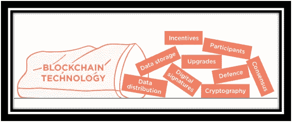

区块链和普通数据库有什么区别？

通俗地说，区块链系统是一个软件包，它包含一个普通的数据库和一些软件，这些软件添加新行，验证新行是否符合预先定义和接受的规则，并通过网络监听和广播新行给它的对等方，确保每个对等方在他们的数据库中有一个等同的数据。

**介绍比特币的区块链**

**比特币区块链生态系统:-**
比特币区块链生态系统**确实是一个相当繁琐和**复杂的系统**得益于**它的双重目的:**首先，那**任何人都应该**准备好**写入比特币区块链；其次，不应该有任何集中的权力或控制。

将这些最小化，你就不需要比特币的许多复杂的通常机制。

**复制数据库:**比特币区块链生态系统充当了一种**复制数据库的**网络，每个复制数据库包含**一个等价的过去比特币交易的**列表。网络的重要成员被称为**验证器**或节点，它们绕过交易数据(支付)和块数据(添加到分类账)。每个验证器独立地检查和分析支付并阻止正在传递的数据，从而对其进行验证。有规则的**在原地形成**网络如期运行。

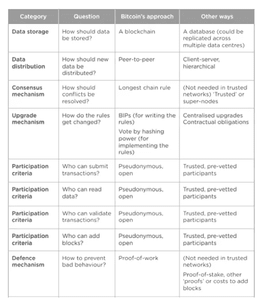

比特币区块链如何运作？

**比特币的复杂性:**比特币的目标是没有中央权威(去中心化)，即没有一定程度的控制**，相对匿名或不为人知。这影响了比特币的发展。并不是所有的区块链生态系统**到**都有**一个等价的**机制，特别是如果参与者**经常被**识别并信任其行为的话。
**以下是比特币如何接近一些决定:** 
**(一)公开 vs 私人区块链:-
——————————****

**在你希望、**依靠**是否**你允许**任何人**写下**给你的区块链，或者已知的，被审查的参与者，这**有一个巨大的**差异。比特币理论上允许任何人**在自己的账本上写下**(但实际上，只有大约 20 个人/团体真正这么做)。**

****公共区块链→** 总账可以是两种意义上的“公共”:
1 .任何人，没有通常由另一个权威授予的许可，可以写数据
2。任何人都可以读取数据
通常，当人们**提到**公共区块链时，他们指的是任何人都可以写。
因为比特币**被理解为**一种“任何人都可以写”的区块链，参与者不受审查**并且可能在没有任何**批准的情况下增加账目**，它需要仲裁差异的方式(在那里**不是任何**“老板”来决定)，以及抵御攻击的防御机制(任何人都可以相对不受惩罚地胡作非为，如果有财务激励这样做的话)。这些通常会增加运行区块链的成本和复杂性。****

****私人区块链→** “私人”区块链网络是参与者/个人为人所知和信任的地方:**例如**一个行业团体，或者**一个伞式公司拥有的公司集群**。许多机制并不需要——或者更确切地说,**它们被法律合同所取代—“你会有所表现，因为你已经签署了这张纸。”。这改变了技术决定**关于**哪些砖块**将**建造**的答案**。
描述公共/私人**的另一种方式可以是**未经许可对经许可或假名对已识别参与者。
参见内部区块链的利与弊或分布式分类账和区块链的区别，了解更多关于**这个主题的信息**。****

 ****_ _ _ _ _ _ _ _ _ _ _ _ _ _ _ _ _ _ _ _ _ _ _ _ _ _ _ _ _ _ _ _ _ _ _ _ _ _ _ _ _ _ _ _ _ _
警告:这一节并不那么温和，因为它详细讨论了上面讨论的每个主题。我建议去喝杯茶。****

******数据存储→** 什么是区块链？区块链只是一个文件。区块链本身就是一个简单的知识结构，也就是说，数据是如何逻辑地组合和存储的。其他数据结构有数据库(行、列、表)、文本文件、逗号分隔值(csv)、图像、字典、列表等等。你可以把**看作是**与数据库竞争最激烈的区块链。****

****在一个链中的块**=页**在一个**书
中进行类比，一本书**可以是一个**页链。一本书的每一页包含:
正文:例如故事
关于它本身的信息/描述:在页面的顶部通常有书名，有时还有章节号或标题；底部通常是**索引**，它会告诉你在**书中的**位置。这种“关于数据的数据”被称为元数据。******

**类似地，在区块链区块中，每个区块具有:
区块的内容，例如在比特币中是比特币交易，还是矿工激励奖励(目前为 25 BTC)。
“标题”包含描述块的数据。**

**在比特币中，报头包含关于该块的一些关键技术信息，如关于前一个块的**和在这个**块期间包含的**信息的**的指纹(散列),等等。这个散列对于排序很重要。******

**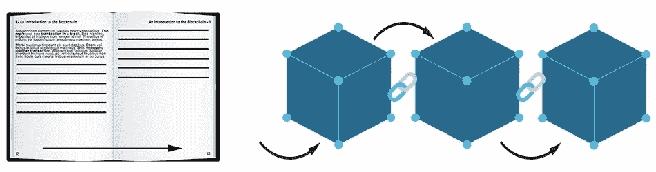**

**一个链中的**块**问**前一个块，就像一本**书的页码**一样。****

****区块链期间的块排序:-**
**逐页→** 对于书籍，可预测的页码使**很容易理解**页面的顺序。如果你撕掉所有的页面并把它们混在一起，**可能**很容易**把它们**放回正确的顺序，在那里故事**是合理的**。**

****逐块→** 在区块链，每个块通过块的指纹而不是“块号”来引用前一个块，这比**索引**更聪明，因为指纹本身**由块的内容决定**。**

**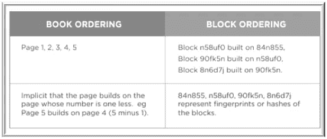**

**图书订购，如区块订购**

**对个先前块的**考虑创建了**个块的序列**——一个区块链！
**内部一致性→** 通过**使用**指纹**而不是**时间戳或数字序列，**您还可以**获得**一种愉快的**方式来验证**信息**。在任何区块链中，**你将**通过使用一些算法自己生成区块指纹。如果根据信息**、**和**指纹**在**链中相遇，那么**你将确定**区块链内部一致。如果任何人想从**到**再到**插入**任何信息**、**，他们需要**重新生成所有的指纹，因此**的区块链看起来会不同。查看区块链程序块的内部可以发现:指纹是该程序块的内容所独有的。
这意味着如果**很难或很慢**做出**这个指纹，那么**也能很难或很慢**重写一个区块链。
比特币的逻辑是:
让**很难得到**一个满足**比特币区块链
原则**的指纹因此，如果有人想重写比特币区块链的一部分，**将**花费他们**一个延长的**时间，**并且他们需要**赶上并超过**剩余部分**
点对点是**一种在**网络中分发数据**的方法**。另一种方法是客户机-服务器。你会听说过 BitTorrent 网络上的点对点文件共享，用户之间共享文件，没有中央服务器控制信息。这通常是 BitTorrent 作为一个网络保持弹性的原因:**没有中央服务器来打包**。********

****客户机-服务器**
在办公环境中，数据往往**保存在**服务器上，无论你在哪里登录，**你都会**访问**信息**。服务器拥有 100%的**信息**、**，因此**客户端相信**信息**是确定的。大部分的网络是客户端-服务器的，其中网站是服务器，而一旦你访问了它，你就是客户端了。**这通常是**非常高效的，而**是计算中的标准**模型。**

**在对等模型中，它更像是一个八卦网络，每个对等点都有 100%的信息(或者说尽可能地处于信息的边缘),并且更新可以共享。点对点在某些方面不如客户机-服务器有效，因为数据被复制了很多次；每台机器一次，**和每一次**改变或增加**的信息**都会产生**吨**的嘈杂流言。然而，每个对等体更加独立，**并且如果它失去与网络的剩余部分**的连接，则可以在某种程度上继续操作。此外，点对点网络更加健壮，因为**没有**受控制的中央服务器**，所以关闭点对点网络更加困难。****

**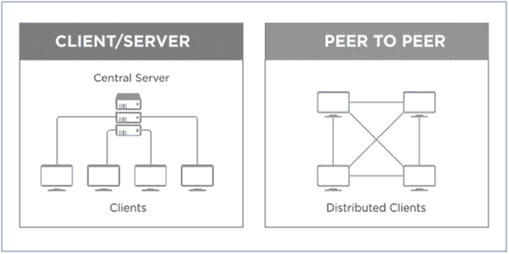**

**客户机-服务器与对等模型**

****点对点模式的问题→**
点对点模式下，**尽管**所有的对等点都是“可信的”，但**通常会阻碍**的一致或共识——如果每个对等点以不同的速度更新，并且状态略有不同，那么**一个**如何确定数据的“真实”或“真实”状态？**

**共识:一个人如何解决冲突？
一个常见的冲突是多个矿工在大约**相同的**时间创建区块。可以看出，有时块需要时间在网络上共享，哪一个应该算作**合法块？****

**例如:假设网络上的所有节点都同步了它们的区块链、**，并且它们**都在 80 号块上。
如果横跨**星球**的三名矿工在大约**相当于**的时间创建了‘81 号区块’，那么哪个‘81 号区块’应该被认为是有效的？请记住**每个**“81 区块”看起来会略有不同:**他们将**当然包含**一个特殊的**支付地址，用于支付 25 个 BTC 区块的奖励；**并且它们**可能包含**一个特殊的**集合事务。我们称它们为 81a，81b，81c。**

**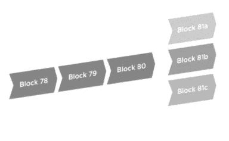**

**因为是合法的，哪个块应该算作**？****

**哪个是合法的区块？一个如何解决这个问题**？****

**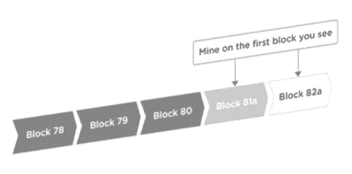**

**第一个块使用 see 是合法的**

****最长链规则→** 在比特币中，冲突是通过被称为“最长链规则”的规则来解决的。在上面的例子中，**你会**假设**你看到的主**‘块 81’是有效的。假设你先看到 81a。**你将**开始构建**后续的**块**其上的**，尝试**使**变成 82a:**

**将**你看到的主**块视为合法→然而**在**几秒钟内**你会**看到 81b。如果你看到这个，**你会一直盯着它。如果稍后你看到 82b，“最长链条规则”告诉**你只需**考虑较长的“b”链条**，因为**有效的链条(…80、81b、82b)并忽略较短的链条(…80、81a)。于是你停止尝试**形成** 82a，转而开始尝试**形成** 83b。****

**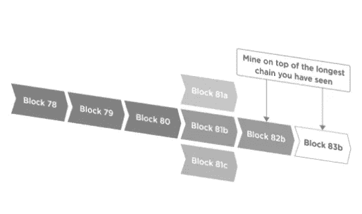**

****最长链法则规定:→如果看到多个区块，将最长的链视为合法。****

**“最长链规则”**是比特币区块链生态系统用来解决这些在分布式网络中常见的冲突的**规则。
然而，在一个更加集中或可信的区块链网络中，**在这些情况下，你将**通过**雇佣一个**可信的或高级验证者进行仲裁来做出决定。**

**升级:如何改变规则？
作为一个网络的整体，**你要**事先同意什么**相当于**的数据是可以传来传去的，而**什么**不是。有了比特币，就有了交易的技术规则(你把指定的数据字段全部填写**了吗？是否在**右格式内的**？等等。，还有一些商业规则，比如(你是想花比你拥有的更多的比特币吗？你是想花两次**等值**比特币吗？).****

****规则改变:-** 随着这些规则随着时间的推移而演变，网络参与者将如何适应这些变化？会不会出现一半网络认为一个交易有效，另一半由于逻辑上的差异而不认为**的情况？在一个私人的、受控的网络中，有人可以控制升级，**这通常是一个简单的**问题来解决:“每个人必须在 7 月 31 日之前升级到新的逻辑”。然而，在一个公开的、不受控制的网络中，这是一个更加棘手的问题。****

****有了比特币，升级有两个部分:→**
1。建议改变(BIPs):首先，**有**提议阶段，在这个阶段提出、讨论和记录改进。一个提案是**提到的**作为“BIP”——一个“比特币改进提案”。
如果它被写入 Github 上的比特币核心软件，那么它可以形成**一个升级的**的一部分— **随后的**版本的“比特币核心”，其中**是该协议最常见的**“参考实现”。**

**2.接受改变(矿工):升级**通常由节点和区块制造者(矿工)下载**并运行，但是**只要他们需要**就可以(你可以想象一个改变，将采矿奖励从每块 25 BTC 减少到每块 0 BTC。我们将会看到**有多少百分比的**矿工**愿意**经营那家公司！).
如果**网络的大部分**(在比特币中，**大部分由**计算能力决定)**更喜欢**运行**软件的替代**版本，那么新型块**将会比少数块**创建得更快，**因此**少数块**将会被**强迫**修改**或者变得无关紧要因此，拥有众多计算能力的矿工们有了诚实的交易。**

**写访问:如何控制谁可以写数据？
在比特币网络中，理论上任何人都可以下载或编写一些软件**并开始**验证交易和创建区块。简单的**去**[https://bitcoin.org/en/download](https://bitcoin.org/en/download)运行“比特币核心”软件。
您的系统或个人电脑将充当完整节点，这意味着:
连接到比特币网络
下载区块链
存储区块链
监听交易
验证交易
传递有效交易
监听块
验证块
传递有效块
创建块
“挖掘”块

**注意**你只需**不**去登记**，登录，或者应用**去连接**网络。 Y **你就**只管**往前犁**和**参加**。与 SWIFT 网络相比，在 SWIFT 网络中，你不能只下载一些软件**就开始记录 SWIFT 报文。**在这种**方式中，一些人称比特币为‘无许可’vs SWIFT**，后者可能**是‘许可’的。******

然而，无许可**并不是唯一的**方式。你可能想在一个可信的私有网络中使用区块链技术**。**你会**不想公布所有**合法**交易或阻止**看起来像**的原则**。**你会**想要**去调节**网络规则是如何改变的。**监管**一个可信的私有网络比监管一个不可信的、像比特币一样的公共自由网络要容易得多。

**辩护:如何让坏人难做？无权限或开放网络的一个问题是他们会受到任何人的攻击。所以**必须**如何创造**网络作为一个整体是可信的，**尽管**具体的参与者不可信。****

歹徒能做什么，不能做什么？一个不诚实的矿工可以。拒绝将有效交易越界到其他节点
2。**计划**创建包含或排除他选择的特定事务的块
3。**计划**创建一个“更长的”区块链，使之前接受的区块成为“孤儿”，而不是**最**链的一部分

他不能:
1。凭空创造比特币*
2。从你的账户中盗取比特币
3。以你的名义付款或者假装是你，这是一种解脱。
*嗯，个人可以，但是只有他的版本的账本才会有这个交易。其他节点会拒绝这一点，这就是为什么**跨**多种**节点验证**事务很重要。

在交易中，一个不诚实的矿工所能产生的影响是极其有限的。如果**网络的剩余**是诚实的，**他们将**拒绝来自他的任何无效交易，**并且他们**将从其他诚实节点那里听到有效交易，**尽管他**拒绝传递它们。
对于积木，如果歹徒有足够的积木创建能力(而**这通常是**一切的关键所在)，他可以通过拒绝**将**它合并到他的积木中来延迟你的交易。但是，您的事务仍将被其他诚实节点视为“未确认事务”，**并且它们**会将它包含在它们的块中。
更糟糕的是，**如果**恶棍可以创建**一个比**网络剩余部分**更长的**区块链，并调用“最长链规则”来淘汰较短的区块链。这让他可以解除交易。

下面是你如何做这件事的方法。用**等价的**比特币进行两次支付:一次支付给**一家网络**零售商，**另一次**支付给你自己(你控制的另一个地址)
2。仅广播支付给零售商的付款
3。当你支付的金额被添加到一个诚实的区块时，零售商会给你发货。秘密创建**一个扩展的**区块链，不包括对零售商的付款，而包括对你自己的付款
5。发布更长的链。如果**对面的**节点按照“最长链规则”进行游戏，那么**他们将**忽略零售商付款的诚实阻碍，而**仍然停留在**你的更长的链上。诚实块**被声称**是“孤立的”,并且**在所有或任何**意图和目的上不存在。
6。**支付给零售商**的第一笔**款项将被诚实节点**视为无效，因为这些比特币实际上已经被花掉了(在你的长链中)

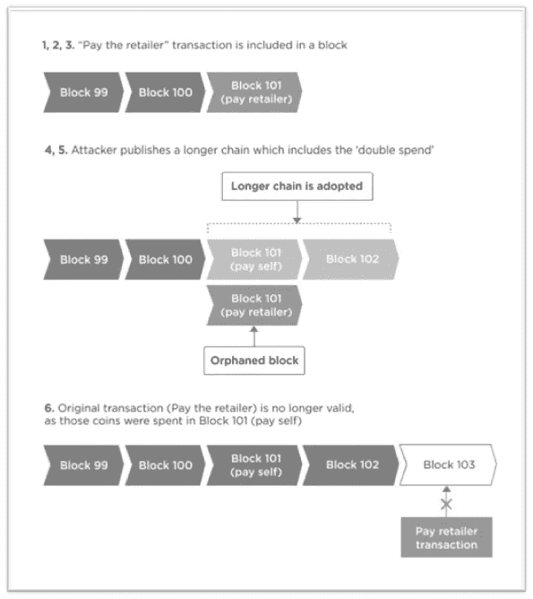

**“双重花费”攻击:→**
它被称为“双重花费”，因为**一个等价的**比特币被花费了两次——但是**另一个**是成为最终区块链的一部分的**，**因此第一个**最终被拒绝。**

一个如何让不诚实的矿工**难以制造**砖块？
记住，**这通常是**唯一的**对于不信任制块者的分类帐来说是一种拖累**。基本上**你想形成**它很难，或者对坏人来说**以**块为特征是昂贵的。在比特币中，**这通常是通过增加计算成本**来实现的。计算昂贵意味着“耗费**吨**的计算机处理能力”，并转化为经济上的昂贵(因为计算机**必须被购买，然后运行和维护)。******

计算本身**可能是一个游戏**，其中块制造者**得到**猜测**变化**，当与**块数据内容的剩余部分**一起处理时，**导致**一个散列/指纹**比特定的**数字**小。那个数字**是表示**到【难度】的挖掘，而**是表示**到**整个**网络的处理能力。在一个**自我调节周期中，加入处理程序块的计算机越多，难度就越大。

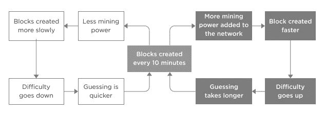

每 2016 个区块(大约每 2 周)，比特币网络调整**游戏的问题**支持区块**被**创建的速度。
这款**游戏被命名为**《工作证明》。通过发布指纹**比目标数字**小的块，**你在**证明**你简单地**做了足够的猜测工作，及时地在**满足网络。

**激励:一个人如何支付验证者？**
交易和块验证**合理**快速，除非**你选择形成一些时间**和昂贵(一个 la 比特币)。
如果你控制你自己网络中的验证器，或者**它们是**可信的，那么
你不**去**使**以**块为特征变得昂贵，因此**你将**减少**激励它们的必要性****

你可以使用其他的方法**，比如**“我们会付钱给人们来运行验证器”或者“人们签订合同来运行验证器并遵守规则”。
由于比特币的“公共”结构，它需要防御不法分子**然后**使用“工作证明”**来形成**计算上很难**来表征**一个区块(参见防御部分)。这就产生了**采矿**的价格**(设备和运行成本),因此需要**进行激励。

正如**黄金的价值**决定**你将**在金矿上花费设备**的比例一样，比特币的价格决定**使用**采矿力量**的比例**来保护网络。**越上层越值钱**，越挖掘**越有**、**因而**越多的恶棍**就有了**花天酒地欺负网络。因此，矿工们做了许多挖掘工作，增加了问题，并筑起了防御网络攻击的高墙。**他们在**得到的比特币**奖励与**的时间表一致，并且随着时间的推移，**因为**区块奖励减少，交易费成为**矿工们收集的动力**。**

比特币的理想情况是，大宗奖励被交易费取代。理论上这一切都是好的，但是你越了解这一点，它就变得越有趣，而且有了比特币解决方案，激励措施可能就不那么有效了。

# UTXO

**什么是 UTXOs？**术语 UTXO 指的是某人在执行类似比特币的交易后剩余的数字货币数量。UTXO 的意思是“未用完的事务输出”。每笔比特币交易都是从用来平衡账本的硬币开始的。UTXOs 被连续处理，负责启动和结束每个事务。虽然交易的确认导致用过的硬币从 UTXO 数据库中移除，但是用过的硬币的记录仍然存在于分类帐中。

因此:

*   UTXO 是执行加密货币交易后剩余的数字货币数量。
*   UTXOs 被连续处理，并负责开始和结束每个事务。
*   当一项交易完成时，任何未用完的产出将作为投入存入数据库，供以后新的交易使用。

# UTXO 是如何工作的

UTXO 事务看似复杂，但实际上相当简单。UTXO 或未用交易输出用于加密货币交易。这些交易是在某人完成一笔交易后留下未用的，类似于某人在商店进行现金交易后收到的零钱。

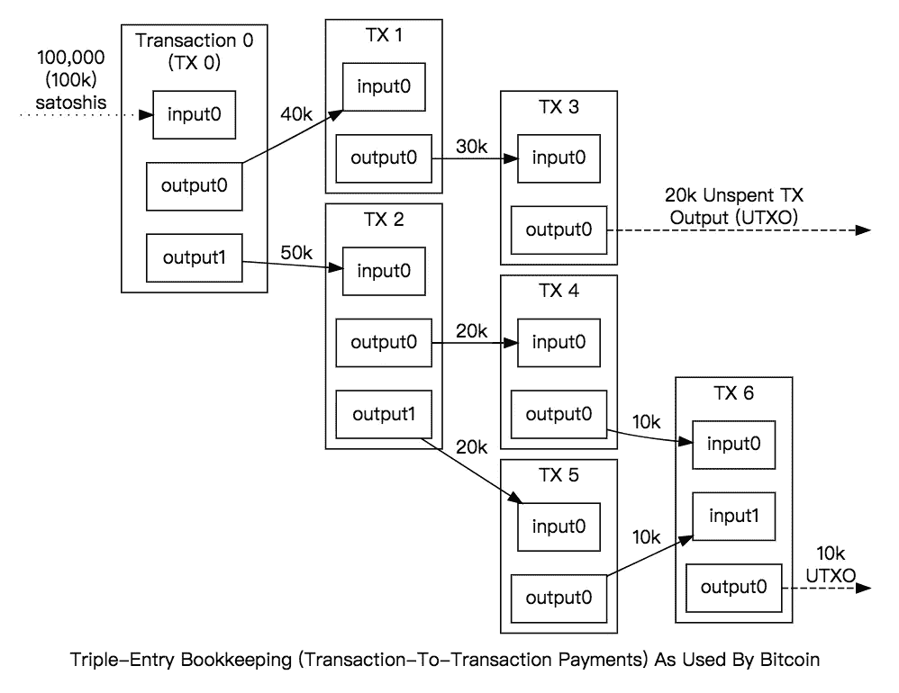

UTXO 数据库或分类帐最初设置为空或零。随着事务的增多，数据库中会填充各种事务的变更记录。当一个交易完成时，如果有未花费的输出，它们将作为输入被存放回数据库，以便在以后的新交易中使用。但是，开销不是使用单个数据字节来实现的。相反，算法会检索比特币的多个部分，以满足消费请求。

例如，价值 10 比特币的购买可以从一个字节中检索 6 BTC，从另一个字节中检索 4 BTC。每个部分的变化都被发送到 UTXO 数据库，供以后使用。

**结论**

在比特币的背景下了解区块链**是有用的**，但是**你不应该**假设**每一个**区块链生态系统都需要比特币机制**比如**代币、劳动证明**开采、最长链规则等。******

比特币**是**第一次试图维护一个没有正式控制或管理的去中心化的公共账本。以太坊**是智能合约区块链的下一个版本。这涉及到重大的挑战。**

在**相反的**方面，私有或内部分布式总账和区块链**经常**部署**来解开**其他组的问题。和以往一样，每个解决方案都有权衡和利弊**，并且**您会想为每个**单独用例单独考虑**这些**。**

如果**你有一个选定的**业务问题，而**你认为这个问题也可以用区块链**解决，我**可能想让**知道:请联系我。