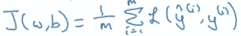
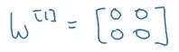

# 深度学习和神经网络的入门指南(来自 deeplearning.ai 课程#1 的笔记)

> 原文：<https://medium.com/analytics-vidhya/an-introductory-guide-to-deep-learning-and-neural-networks-notes-from-deeplearning-ai-course-1-5057d5556956?source=collection_archive---------1----------------------->

如今，牢牢掌握深度学习技术就像获得了一种超能力。从分类图像和翻译语言到制造自动驾驶汽车，所有这些任务都由计算机驱动，而不是人工操作。深度学习已经渗透到多个不同的行业，并且几乎每周都在继续突破新的领域。

可以理解的是，很多人突然对这个领域感兴趣。但是应该从哪里开始呢？应该学什么？构成这个复杂而有趣的领域的核心概念是什么？


我很高兴写下一系列文章，在这些文章中，我将分解每个深度学习爱好者都应该彻底了解的基本组件。我的灵感来自 deeplearning.ai，他发布了一个非常棒的深度学习专业化课程，我发现这对我的学习之旅非常有帮助。

在这篇文章中，我将写专业化的课程 1，其中伟大的[吴恩达](https://medium.com/u/592ce2a67248?source=post_page-----5057d5556956--------------------------------)解释了神经网络的基础知识以及如何实现它们。我们开始吧！

*注意:在整个系列中，我们将遵循自下而上的方法——我们将首先从头开始理解这个概念，然后才是它的实现。这种方法被证明对我很有帮助。*

# 目录

1.  了解课程结构
2.  课程 1:神经网络和深度学习
    1。模块 1:深度学习简介
    2。模块 2:神经网络基础知识
    a .作为神经网络的逻辑回归
    b. Python 和矢量化
    3 .模块 3:浅层神经网络
    4。模块 4:深度神经网络

# 1.了解课程结构

这个深度学习专业总共由 5 门课程组成。课程#1 是本文的重点，它进一步分为 4 个子模块:

1.  第一个模块简要概述了深度学习和神经网络
2.  在模块 2 中，我们深入学习神经网络的基础知识。吴恩达解释了如何使用神经网络解决逻辑回归问题
3.  在模块 3 中，讨论转向浅层神经网络，简要介绍激活函数、梯度下降以及前向和后向传播
4.  在最后一个模块中，吴恩达教授了最令人期待的话题——深度神经网络

准备好开始了吗？接着读下去！

# 2.课程 1:神经网络和深度学习

好了，现在我们对这篇文章的结构有了一个概念，是时候从头开始了。戴上你的学习帽，因为这将是一次有趣的经历。

# 2.1 模块 1:深度学习简介

第一个模块的目标如下:

*   了解推动深度学习兴起的主要趋势
*   能够解释深度学习如何应用于监督学习
*   了解模型的主要类别(如 CNN 和 rnn)，以及何时应用它们
*   能够认识到深度学习何时会(或不会)很好地工作的基础

## 什么是神经网络？

先说事情的症结，一个很关键的问题。什么是神经网络？

考虑一个例子，我们必须预测房子的价格。给我们的变量是房子的平方英尺(或平方米)大小和房子的价格。现在假设我们有 6 栋房子。首先让我们画一张图来形象化我们正在看的东西:


x 轴代表房子的大小，y 轴代表相应的价格。线性回归模型会尝试绘制一条直线来拟合数据:


所以，这里的输入(x)是房子的大小，输出(y)是价格。现在让我们看看如何使用一个简单的神经网络来解决这个问题:


在这里，一个神经元将接受一个输入，对其应用一些激活函数，并生成一个输出。最常用的激活功能之一是 ReLU(整流线性单元):


ReLU 接受一个实数作为输入，并返回 0 或该数的最大值。所以，如果我们传递 10，输出就是 10，如果输入是-10，输出就是 0。我们将在本文后面详细讨论激活函数。

现在让我们坚持我们的例子。如果我们使用 ReLU activation 函数根据房子的大小预测房子的价格，预测结果可能是这样的:


到目前为止，我们已经看到了一个具有单个神经元的神经网络，即，我们只有一个特征(房子的大小)来预测房价。但在现实中，我们必须考虑多个特征，如卧室数量、邮政编码等。？房价还取决于家庭规模、社区位置或学校质量。在这种情况下，我们如何定义神经网络？


这里变得有点复杂。阅读时请参考上面的图像-我们将 4 个特征作为输入传递给神经网络作为 x，它会自动从输入中识别一些隐藏的特征，并最终生成输出 y。这是具有 4 个输入和单个隐藏层输出的神经网络的样子:


既然我们对什么是神经网络有了一个直觉，让我们看看如何将它们用于监督学习问题。

## 神经网络监督学习

监督学习指的是一项任务，我们需要找到一个可以将输入映射到相应输出的函数(给定一组输入输出对)。对于每个给定的输入，我们都有一个定义的输出，我们根据这些例子训练模型。下面是一个非常方便的表格，它显示了监督学习的不同应用以及可用于解决这些问题的不同类型的神经网络:


下面是最常见的神经网络类型的直观表示:


在本文中，我们将关注标准神经网络。不要担心，我们将在接下来的文章中讨论其他类型。

您可能知道，监督学习可以用于结构化和非结构化数据。

在我们的房价预测示例中，给定的数据告诉我们卧室的大小和数量。这是结构化数据，意味着每个特征，如房子的大小，卧室的数量等。有着非常明确的含义。

相比之下，非结构化数据指的是音频、原始音频或图像等您可能想要识别图像或文本中的内容的东西(如对象检测)。这里，特征可能是图像中的像素值，或者是一段文本中的单个单词。不太清楚图像的每个像素代表什么，因此这属于非结构化数据范畴。

简单的机器学习算法适用于结构化数据。但当涉及到非结构化数据时，它们的性能往往会大幅下降。这就是神经网络被证明如此有效和有用的地方。它们在非结构化数据上表现出色。如今，大多数突破性的研究都以神经网络为核心。

## 深度学习为什么会腾飞？

要理解这一点，请看下图:


随着数据量的增加，传统学习算法的性能，如 SVM 和逻辑回归，并没有提高很多。事实上，在某个点之后，它趋于稳定。就类神经网路而言，模型的效能会随著您输入模型的资料增加而提升。

基本上有三个尺度驱动典型的深度学习过程:

1.  数据
2.  计算时间
3.  算法

为了提高模型的计算时间，激活函数起着重要的作用。如果我们使用 sigmoid 激活函数，这就是我们最终得到的结果:


斜率，或者这个函数的梯度，在极端情况下接近于零。所以参数更新非常慢，导致学习非常慢。因此，从 sigmoid 激活函数切换到 ReLU(校正线性单元)是我们在神经网络中看到的最大突破之一。当 x>0 时，当斜率为 1 时，ReLU 更新参数要快得多。这是模型计算更快的主要原因。

# 2.2 模块 2:深度学习简介

模块 2 的目标是:

*   建立一个逻辑回归模型，结构为一个浅层神经网络
*   实现最大似然算法的主要步骤，包括预测、导数计算和梯度下降
*   实现计算高效且高度矢量化的模型版本
*   理解如何使用反向传播思维计算逻辑回归的导数
*   熟悉 Python 和 Numpy

该模块进一步分为两个部分:

*   第一部分:作为神经网络的逻辑回归
*   第二部分:Python 和矢量化

让我们详细了解每一部分。

# 第一部分:作为神经网络的逻辑回归

## 二元分类

在一个二进制分类问题中，我们有一个输入 x，比如说一张图片，我们要把它分类为有没有猫。如果它是一只猫，我们将为它赋值 1，否则为 0。所以在这里，我们只有两个输出——要么图像包含一只猫，要么不包含。这是一个二元分类问题的例子。

在这种情况下，我们当然可以使用最流行的分类技术，逻辑回归。

## 逻辑回归

我们有一个输入 X(图像)，我们想知道图像属于类别 1(即一只猫)的概率。对于给定的 X 向量，输出将是:

**y = w(转置)X + b**

这里 w 和 b 是参数。因为我们的输出 y 是概率，它应该在 0 和 1 之间。但是在上面的等式中，它可以取任何实值，这对得到概率没有意义。因此，逻辑回归也使用 sigmoid 函数来输出概率:


对于作为输入的任何值，它将只返回 0 到 1 范围内的值。sigmoid 函数的公式为:


因此，如果 z 非常大，exp(-z)将接近 0，因此 sigmoid 的输出将为 1。类似地，如果 z 非常小，exp(-z)将是无穷大，因此 sigmoid 的输出将是 0。

注意，参数 w 是 nx 维向量，b 是实数。现在让我们看看逻辑回归的成本函数。

## 逻辑回归成本函数

为了训练逻辑回归的参数 w 和 b，我们需要一个成本函数。我们希望找到参数 w 和 b，使得至少在训练集上，您的输出(y-hat)接近实际值(y)。

我们可以使用下面定义的损失函数:


这个函数的问题是优化问题变得非凸，导致多个局部最优。因此，梯度下降不能很好地处理这个损失函数。因此，对于逻辑回归，我们定义了一个不同的损失函数，其作用与上述损失函数相似，并且还通过给出一个凸函数来解决优化问题:


损失函数是为单个训练示例定义的，它告诉我们在该特定示例上做得有多好。另一方面，成本函数是针对整个训练集的。逻辑回归的成本函数是:



**我们希望我们的成本函数尽可能小**。为此，我们希望我们的参数 w 和 b 得到优化。

## 梯度下降

这是一种有助于以最小化成本函数的方式学习参数 w 和 b 的技术。逻辑回归的成本函数本质上是凸的(即只有一个全局最小值)，这就是选择该函数而不是平方误差(可以有多个局部最小值)的原因。

让我们看看梯度下降的步骤:

1.  初始化 w 和 b(对于逻辑回归通常初始化为 0)
2.  向最陡的下坡方向迈一步
3.  重复步骤 2，直到达到全局最优


梯度下降的更新方程变为:


在这里，⍺是学习率，它控制着我们在每次迭代后应该迈出多大的一步。

如果我们在上图的右边，斜率将是正的。使用更新的等式，我们将向左移动(即向下)，直到达到全局最小值。然而，如果我们在左侧，斜率将是负的，因此我们将向右(向下)移动一步，直到达到全局最小值。很直观，对吧？

逻辑回归参数的更新方程为:


## 派生物

考虑一个函数，f(a) = 3a，如下所示:


这个函数在任一点的导数将给出该点的斜率。所以，

f(a=2) = 3*2 = 6

f(a=2.001) = 3*2.001 = 6.003

a = 2 时函数的斜率/导数为:

斜率=高度/宽度

斜率= 0.003 / 0.001 = 3


这是我们计算函数的导数/斜率的方法。我们再来看几个导数的例子。

## 更多衍生例子

考虑以下 3 个函数及其相应的导数:

f(a) = a2，d(f(a))/d(a) = 2a

f(a) = a3，d(f(a))/d(a) = 3a2

最后，f(a) = log(a)，d(f(a))/d(a) = 1/a

在上面所有的例子中，导数是 a 的函数，这意味着函数在不同点的斜率是不同的。

## 计算图

这些图形组织了特定函数的计算。考虑下面的例子:

J(a，b，c) = 3(a+bc)

给定 a、b 和 c，我们必须计算 J，我们可以将其分为三步:

让我们想象一下 a = 5、b = 3 和 c = 2 的这些步骤:


这是前向传播步骤，其中我们已经计算了输出，即 j。我们也可以使用计算图进行后向传播，其中我们更新上述示例中的参数 a、b 和 c。

## 带计算图的导数

现在让我们看看如何在计算图的帮助下计算导数。假设我们要计算 dJ/da。这些步骤将是:

1.  由于 J 是 v 的函数，计算 dJ/dv:
    dJ/dv = d(3v)/dv = 3
2.  由于 v 是 a 和 u 的函数，计算 dv/da:
    dv/da = d(a+u)/da = 1
3.  计算 dJ/da:
    dJ/da =(dJ/dv)*(dv/da)= 3 * 1 = 3

同样，我们可以计算 dJ/db 和 dJ/dc:


现在，我们将计算图和梯度下降的概念结合起来，看看如何更新逻辑回归的参数。

## 逻辑回归梯度下降

简单回顾一下，逻辑回归方程是:


其中 L 是损失函数。现在，对于两个特征(x1 和 x2)，用于计算损失的计算图将是:


这里，w1、w2 和 b 是需要更新的参数。以下是执行此操作的步骤(对于 w1):

1.  计算 da:
    da = dL/da =(-y/a)+(1-y)/(1-a)
2.  计算 dz:
    dz =(dL/da)*(da/dz)=[(-y/a)+(1-y)/(1-a)]*[a(1-a)]= a-y
3.  计算 dw1:
    dw1 =[(dL/da)*(da/dz)]* dz/dw1 =(a-y)* dz/dw1

同样，我们可以计算 dw2 和 db。最后，将使用以下等式更新权重:


请记住，这是针对单个培训示例的。我们将在真实场景中有多个例子。因此，让我们看看如何为“m”训练示例计算梯度下降。

## “m”示例上的梯度下降

我们可以将“m”训练示例的预测和成本函数定义为:


损失函数对参数的导数可以写成:


现在让我们看看如何对“m”示例应用逻辑回归:

```
J = 0; dw1 = 0; dw2 =0; db = 0;                
w1 = 0; w2 = 0; b=0;                            
for i = 1 to m
    # Forward pass
    z(i) = W1*x1(i) + W2*x2(i) + b
    a(i) = Sigmoid(z(i))
    J += (Y(i)*log(a(i)) + (1-Y(i))*log(1-a(i)))

    # Backward pass
    dz(i) = a(i) - Y(i)
    dw1 += dz(i) * x1(i)
    dw2 += dz(i) * x2(i)
    db  += dz(i)
J /= m
dw1/= m
dw2/= m
db/= m

# Gradient descent
w1 = w1 - alpa * dw1
w2 = w2 - alpa * dw2
b = b - alpa * db
```

这些 for 循环最终使得计算非常缓慢。有一种方法可以替换这些循环，从而提高代码效率。我们将在接下来的章节中研究这些技巧。

# 第二部分— Python 和矢量化

至此，我们已经看到了如何使用梯度下降来更新逻辑回归的参数。在上面的示例中，我们看到，如果我们有“m”个训练示例，我们必须运行循环“m”次才能得到输出，这使得计算非常缓慢。

代替这些 for 循环，我们可以使用矢量化，这是一种有效且省时的方法。

## …向量化…

矢量化基本上是一种消除代码中 for 循环的方法。它对“m”个训练样本一起执行所有操作，而不是单独计算它们。让我们看看逻辑回归的非矢量化和矢量化表示:

非矢量化形式:

```
z = 0
for i in range(nx):
   z += w[i] * x[i]
z +=b
```

现在，让我们看看矢量化的形式。我们可以用矢量形式表示 w 和 x:


现在，我们可以使用以下公式计算所有训练示例的 Z:

*Z = np.dot(W，X)+b (* numpy *导入为 np)*

NumPy 库的点函数默认使用矢量化。这就是我们如何对乘法进行矢量化的方法。现在让我们看看如何对整个逻辑回归算法进行矢量化。

## 向量化逻辑回归

与“m”训练示例保持一致，第一步是计算所有这些示例的 Z:

*Z = np.dot(W.T，X) + b*

这里，X 包含所有训练示例的特征，而 W 是这些示例的系数矩阵。下一步是计算输出(A ),即 Z 的 sigmoid:

*A = 1 / 1 + np.exp(-Z)*

现在，计算损耗，然后使用反向传播将损耗降至最低:

dz *=* A — Y

最后，我们将计算参数的导数并更新它们:

dw *= np.dot(X，dz。T) / m*

db *=* dz *。sum() / m*

*W = W — ⍺dw*

*b = b — ⍺db*

## 用 Python 广播

广播使得代码的某些部分更加有效。但是不要只相信我的话！让我们看一些例子:

*   obj.sum(axis = 0)对列求和，而 obj.sum(axis = 1)对行求和
*   obj . shape(1，4)通过传播值来改变矩阵的形状


如果我们把 100 加到一个(4×1)矩阵，它会把 100 复制到一个(4×1)矩阵。类似地，在下面的示例中，将复制(1×3)矩阵以形成(2×3)矩阵:


总的原则是:


如果我们用一个(1，n)矩阵加、减、乘或除一个(m，n)矩阵，这将把它复制 m 次成为一个(m，n)矩阵。这被称为广播，它使计算速度更快。自己试试吧！

## 关于 Python/Numpy 向量的一个注记

如果使用以下方式组成数组:

a = np.random.randn(5)

它将创建一个 shape (5)数组，这是一个秩为 1 的数组。使用此数组会导致在转置数组时出现问题。相反，我们可以使用以下代码来形成一个向量，而不是秩为 1 的数组:

a = np.random.randn(5，1) # shape (5，1)列向量

a = np.random.randn(1，5) # shape (1，5)行向量

要将(1，5)行向量转换为(5，1)列向量，可以使用:

a = a . shape((5，1))

模块 2 到此结束。在下一节中，我们将深入浅出的神经网络的细节。

# 2.3 模块 3:浅层神经网络

模块 3 的目标是:

*   了解隐藏单元和隐藏层
*   能够在神经网络中应用各种激活函数。
*   使用隐藏层构建您的第一个向前和向后传播
*   对你的神经网络应用随机初始化
*   熟练使用深度学习符号和神经网络表示法
*   建立并训练具有一个隐藏层的神经网络

## 神经网络概述

在逻辑回归中，为了计算输出(y = a)，我们使用了下面的计算图:


在只有一个隐藏层的神经网络的情况下，该结构看起来像是:


计算输出的计算图将是:

```
X1  \ 
X2   => z1 = XW1 + B1 => a1 = Sigmoid(z1) => z2 = a1W2 + B2 => a2    = Sigmoid(z2) => l(a2,Y)
X3  /
```

## 神经网络表示

考虑神经网络的以下表示:


你能识别出上述神经网络的层数吗？请记住，在计算神经网络的层数时，我们不计算输入层。因此，在上面显示的 NN 中有 2 层，即一个隐藏层和一个输出层。

第一层称为[0]，第二层称为[1]，最后一层称为[2]。这里“a”代表激活，这是神经网络不同层传递给下一层的值。对应的参数是 w[1]，b[1]和 w[1]，b[2]:


这就是神经网络的表现方式。接下来，我们将看看如何计算神经网络的输出。

## 计算神经网络的输出

让我们详细看看神经网络的每个神经元是如何工作的。每个神经元接受一个输入，对其执行一些操作(计算 z = w[T]+ b)，然后应用 sigmoid 函数:


这个步骤由每个神经元执行。具有四个神经元的第一隐藏层的方程将是:


因此，对于给定的输入 X，每个神经元的输出将为:

z[1]= W[1]x + b[1]

一[1]= 𝛔(z[1])

z[2]= W[2]x + b[2]

一[2]= 𝛔(z[2])

为了计算这些输出，我们需要运行一个 for 循环，为每个神经元单独计算这些值。但是回想一下，使用 for 循环会使计算非常慢，因此我们应该优化代码，去掉这个 for 循环，使它运行得更快。

## 跨多个示例进行矢量化

计算神经网络输出的非矢量化形式为:

```
for i=1 to m:
    z[1](i) = W[1](i)x + b[1]
    a[1](i) = 𝛔(z[1](i))
    z[2](i) = W[2](i)x + b[2]
    a[2](i) = 𝛔(z[2](i))
```

使用这个 for 循环，我们分别为每个训练示例计算 z 和 a 值。现在我们来看看如何将其矢量化。所有训练示例将被合并到单个矩阵 X 中:


这里，nx 是特征的数量，m 是训练样本的数量。用于计算输出的矢量化形式为:

Z[1]= W[1]X + b[1]

一[1]= 𝛔(Z[1])

Z[2]= W[2]X + b[2]

一[2]= 𝛔(Z[2])

这将减少计算时间(在大多数情况下显著减少)。

## 激活功能

计算输出时，应用激活函数。激活函数的选择极大地影响了模型的性能。到目前为止，我们已经使用了 sigmoid 激活函数:


然而，在某些情况下，这可能不是最佳选择。为什么？因为在图的极端，导数将接近于零，因此梯度下降将非常缓慢地更新参数。

还有其他功能可以替代该激活功能:

*   tanh:


*   ReLU(之前已经介绍过):


我们可以根据要解决的问题选择不同的激活函数。

## 为什么我们需要非线性激活函数？

如果我们对图层的输出使用线性激活函数，它会将输出计算为输入要素的线性函数。我们首先将 Z 值计算为:

Z = WX + b

在线性激活函数的情况下，输出将等于 Z(而不是计算任何非线性激活):

A = Z

使用线性激活本质上是没有意义的。两个线性函数的组合本身就是一个线性函数，除非我们使用一些非线性激活，否则我们不会计算更有趣的函数。这就是为什么大多数专家坚持使用非线性激活函数。

只有一种情况下我们倾向于使用线性激活函数。假设我们想预测一栋房子的价格(可以是任何正实数)。如果我们使用 sigmoid 或 tanh 函数，输出范围将分别为(0，1)和(-1，1)。但价格也将超过 1 英镑。在这种情况下，我们将在输出层使用线性激活函数。

一旦我们有了输出，下一步是什么？我们想要执行反向传播，以便使用梯度下降来更新参数。

## 神经网络的梯度下降

在两层神经网络中，我们必须更新的参数是:w[1]，b[1]，w[2]和 b[2]，我们要最小化的成本函数是:


梯度下降步骤可总结为:

```
Repeat:
    Compute predictions (y'(i), i = 1,...m)
    Get derivatives: dW[1], db[1], dW[2], db[2]
    Update: W[1] = W[1] - ⍺ * dW[1]
            b[1] = b[1] - ⍺ * db[1]
            W[2] = W[2] - ⍺ * dW[2]
            b[2] = b[2] - ⍺ * db[2]
```

让我们快速看一下两层神经网络的正向和反向传播步骤。

正向传播:

```
Z[1] = W[1]*A[0] + b[1]    # A[0] is X
A[1] = g[1](Z[1])
Z[2] = W[2]*A[1] + b[2]
A[2] = g[2](Z[2])
```

反向传播:

```
dZ[2] = A[2] - Y   
dW[2] = (dZ[2] * A[1].T) / m
db[2] = Sum(dZ[2]) / m
dZ[1] = (W[2].T * dZ[2]) * g'[1](Z[1])  # element wise product (*)
dW[1] = (dZ[1] * A[0].T) / m   # A[0] = X
db[1] = Sum(dZ[1]) / m
```

这些是神经网络生成输出的完整步骤。注意，我们必须在开始时初始化权重(W ),然后在反向传播步骤中更新权重。所以让我们看看这些权重应该如何初始化。

## 随机初始化

我们之前已经看到，在逻辑回归算法的情况下，权重被初始化为 0。但是我们应该将神经网络的权重初始化为 0 吗？这是一个中肯的问题。让我们考虑下面的例子:


如果权重被初始化为 0，则 W 矩阵将为:



使用这些重量:


最后在反向传播步骤:


无论我们在一层中使用多少个单元，我们总是得到相同的输出，这与使用单个单元的输出相似。因此，我们没有将权重初始化为 0，而是使用以下代码随机初始化它们:

```
w[1] = np.random.randn((2,2)) * 0.01
b[1] = np.zero((2,1))
```

我们将权重乘以 0.01 来初始化小权重。如果我们初始化大的权重，激活将会很大，导致零斜率(在 sigmoid 和 tanh 激活函数的情况下)。因此，学习会很慢。所以我们一般随机初始化小权重。

# 2.4 模块 4:深度神经网络

终于到了学习深度神经网络的时候了！这些已经成为当今业界和研究领域的流行语。这些天来，无论我拿起哪篇研究论文，都不可避免地提到深度神经网络是如何被用来驱动这项研究背后的思维过程的。

我们最后一个模块的目标是:

*   将深度神经网络视为一个接一个的连续块
*   构建并训练深度 L 层神经网络
*   分析矩阵和向量维数以检查神经网络实现
*   了解如何使用缓存将信息从正向传播传递到反向传播
*   理解超参数在深度学习中的作用

## 深层 L 层神经网络

在本节中，我们将研究如何将前向和后向传播的概念应用于深度神经网络。但是此时你可能会想知道深度神经网络到底是什么？

浅与深是一个程度问题。逻辑回归是一个非常浅的模型，因为它只有一层(请记住，我们不将输入算作一层):


更深的神经网络具有更多数量的隐藏层:


让我们看看与深度神经网络相关的一些符号:

*   l 是神经网络的层数
*   n[l]是层 l 中单元的数量
*   a[l]是层 l 中的激活
*   w[l]是 z[l]的权重

这些是我们将在接下来的章节中使用的一些符号。在我们进行的过程中，请记住它们，或者只是快速跳回到这里，以防您错过了什么。

## 深度神经网络中的前向传播

对于单个训练示例，正向传播步骤可以写成:

```
z[l] = W[l]a[l-1] + b[l]
a[l] = g[l](a[l])
```

我们可以对“m”训练示例的这些步骤进行矢量化，如下所示:

```
Z[l] = W[l]A[l-1] + B[l]
A[l] = g[l](A[l])
```

一层的输出作为下一层的输入。如果没有 for 循环，我们无法计算神经网络所有层的前向传播，所以这里有 for 循环就可以了。在继续之前，让我们看看各种矩阵的维数，这将有助于我们更好地理解这些步骤。

## 获得正确的矩阵维度

分析矩阵的维数是检查代码正确性的最佳调试工具之一。我们将在本节讨论每个矩阵的正确维度。考虑下面的例子:


你能算出这个神经网络的层数(L)吗？如果你猜对了 5，你就答对了。有 4 个隐藏层和 1 个输出层。每层中的单位是:

n[0]= 2，n[1]= 3，n[2]= 5，n[3]= 4，n[4]= 2，n[5]= 1

W、b 及其导数的量纲的一般形式是:

*   W[l]= (n[l]，n[l-1])
*   b[l]= (n[l]，1)
*   dW[l]= (n[l]，n[l-1])
*   db[l]= (n[l]，1)
*   Z[l]，A[l]，dZ[l]，dA[l]= (n[l]，m)的维数

其中“m”是训练样本的数量。这些是一些广义的矩阵维数，它们将帮助你平稳地运行你的代码。

到目前为止，我们已经看到了深度神经网络的一些基础知识。但是为什么我们首先需要深层表现呢？既然有更简单的解决方案，为什么还要把事情复杂化呢？让我们来了解一下！

## 为什么要深度交涉？

在深度神经网络中，我们有大量的隐藏层。这些隐藏层实际上在做什么？为了理解这一点，请看下图:


深度神经网络寻找与数据的关系(从简单到复杂的关系)。第一个隐藏层可能做的是，试图找到简单的功能，如识别上面图像中的边缘。随着我们深入网络，这些简单的功能组合在一起形成更复杂的功能，如识别人脸。利用深度神经网络的一些常见示例有:

*   人脸识别
    图像== >边缘== >人脸部分== >人脸== >想要的人脸
*   音频识别
    音频== >低级声音特征，如(sss，bb) == >音素== >单词== >句子

## 深度神经网络的构建模块

考虑深度神经网络中的任何一层。该层的输入将是来自前一层(l-1)的激活，并且该层的输出将是它自己的激活。

*   输入:a[l-1]
*   输出:a[l]

该层首先计算应用激活的 z[l]。这个 z[l]被保存为缓存。对于反向传播步骤，它将首先计算 da[l]，即层 l 处的激活的导数、权重 dw[l]、db[l]、dz[l]的导数，最后是 da[l-1]。让我们将这些步骤形象化，以降低复杂性:


深度神经网络的每个块(层)就是这样工作的。接下来，我们将看到如何实现所有这些模块。

## 向前和向后传播

前向传播步骤中的输入是 a[l-1]，输出是 a[l]和高速缓存 z[l]，它是 w[l]和 b[l]的函数。因此，计算 Z[l]和 A[l]的矢量化形式为:

Z[l]= W[l]* A[l-1]+ b[l]

A[l]= g[l](Z[l])

我们将计算网络每一层的 Z 和 A。计算激活后，下一步是反向传播，我们使用导数更新权重。反向传播的输入为 da[l]，输出为 da[l-1]、dW[l]和 db[l]。让我们看看反向传播的矢量化方程:

```
dZ[l] = dA[l] * g'[l](Z[l])
dW[l] = 1/m * (dZ[l] * A[l-1].T)
db[l] = 1/m * np.sum(dZ[l], axis = 1, keepdims = True)

dA[l-1] = w[l].T * dZ[l]
```

这就是我们实现深度神经网络的方式。

深度神经网络的表现令人惊讶地好(如果你以前使用过它们，可能就不那么令人惊讶了！).只运行几行代码就能得到令人满意的结果。这是因为我们正在向网络提供大量数据，而网络正在使用隐藏层从这些数据中学习。

选择正确的超参数有助于我们提高模型的效率。我们将在本系列的下一篇文章中讨论超参数调优的细节。

## 参数与超参数

这是深度学习新人经常问的问题。参数和超参数之间的主要区别在于，模型在训练期间学习参数，而超参数可以在训练模型之前改变。

深度神经网络的参数是 W 和 b，模型在反向传播步骤中更新它们。另一方面，深度神经网络有许多超参数，包括:

*   学习率——⍺
*   迭代次数
*   隐藏层数
*   每个隐藏层中的单位
*   激活函数的选择

这是对这两个方面的区别的简要概述。我很乐意在下面的评论区回答你对此可能有的任何问题。

# 结束注释

祝贺您完成本专业的第一门课程！我们现在知道如何实现深度神经网络的前向和后向传播以及梯度下降。我们还看到了矢量化如何帮助我们摆脱显式 for 循环，使我们的代码在这个过程中变得高效。

在下一篇文章中(将涵盖课程#2)，我们将看到如何通过超参数调整、正则化和优化来改善深度神经网络。这是深度学习中更加棘手和迷人的方面之一。

如果你有任何反馈或任何疑问/问题，请在下面的评论区分享。期待听到大家的想法！

*原载于 2018 年 10 月 21 日*[*【www.analyticsvidhya.com】*](https://www.analyticsvidhya.com/blog/2018/10/introduction-neural-networks-deep-learning/)*。*