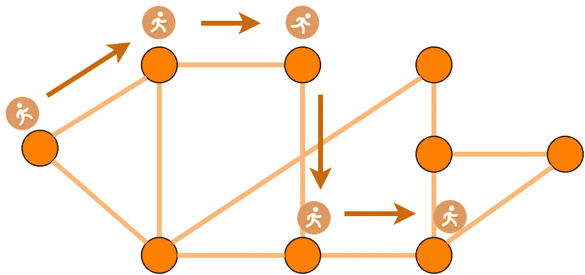
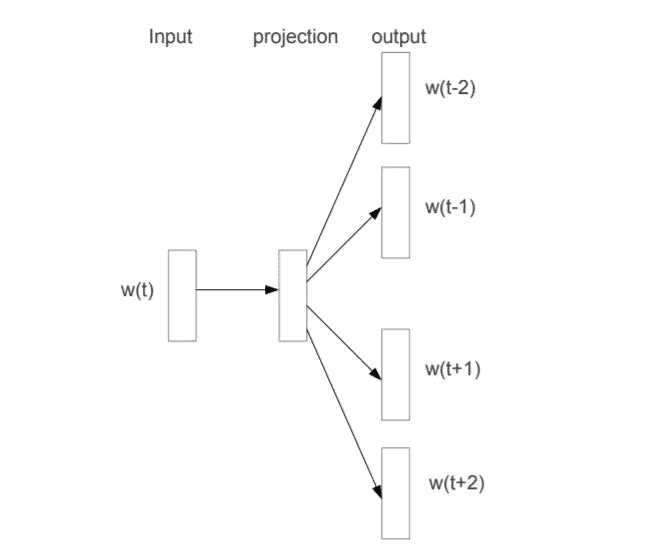

# 对 DeepWalk 的直观解释

> 原文：<https://medium.com/analytics-vidhya/an-intuitive-explanation-of-deepwalk-84177f7f2b72?source=collection_archive---------0----------------------->

## 网络上的机器学习有明显的优势。在这个故事中，我们讨论 DeepWalk 来学习节点嵌入。

# 介绍

这个故事是几何深度学习系列*不同方法的第二个。*在第一篇文章中，我们简要介绍了网络和几何深度学习(GDL ),展示了其优于传统 ML 方法的优势。这是链接，如果你感兴趣的话。

 [## 几何深度学习的不同方法—第一部分

### 这里我们开始一个系列，讨论不同网络类型的各种几何深度学习算法。

medium.com](/@rizaozcelik96/different-methods-in-geometric-deep-learning-part-1-fa64f0deb3b5) 

在这个故事中，我们将讨论一种称为 DeepWalk[1]的开创性方法，该方法使用语言建模方法，通过利用网络中的本地结构来学习节点嵌入。有了节点嵌入，我们可以使用适当的最大似然方法来完成 GDL 任务，例如节点分类、链路预测和社区检测任务。

DeepWalk 是一个两阶段的方法。在第一阶段，它通过随机行走遍历网络，根据邻域关系推断局部结构。在第二阶段，它使用一种称为 SkipGram 的算法来学习嵌入，这些嵌入通过推断的结构来丰富。在接下来的部分中，我们首先描述这两个阶段，然后强调 DeepWalk 的优势。

# 阶段 1 —局部结构发现

在这个阶段，我们的目标是发现网络中的邻居。为此，我们从每个节点开始生成固定数量的 *(k)* 随机行走。每次步行的长度 *(l)* 是预先确定的。因此，当这个阶段结束时，我们获得长度为 *l* 的 *k* 节点序列。随机游走生成的要点是以下假设:

> 相邻节点是相似的，应该有相似的嵌入。

基于这一假设，我们将接受在路径中同时出现的节点作为相似节点。这意味着随机行走中的共现频率是节点相似性的指标。请注意，这是一个合理的假设，因为根据设计，边通常表示网络中相似或相互作用的节点。

网络上长度为 5 的随机漫步示例。

这里 *k* 和 *l* 的作用很重要。k*增加得越多，网络被探索得越多，因为产生了更多的随机行走。另一方面，当 *l* 增加时，路径变得更长，并且更远的节点被接受为相似节点。这对应于放松相似性约束，并且会引入噪声和误导性的共现。*

# 第二阶段—skip program

SkipGram 算法是一种用于学习单词嵌入的流行技术。是米科洛夫等人介绍的。艾尔。在他们关于 word2vec 的著名论文中[2]。给定语料库和窗口大小，SkipGram 旨在最大化出现在同一窗口中的单词的单词嵌入的相似性。这些窗口在 NLP 中也被称为*上下文*。这个想法是基于这样的假设:

> 出现在相同上下文中的单词往往有相近的意思。因此，它们的嵌入也应该彼此接近。

如果你愿意学习更多关于 word2vec 或 SkipGram 的知识，我强烈推荐[这篇文章](http://mccormickml.com/2016/04/19/word2vec-tutorial-the-skip-gram-model/)。

在 SkipGram 中，目标是在给定单词本身的情况下预测单词的上下文。[【2】](https://papers.nips.cc/paper/5021-distributed-representations-of-words-and-phrases-and-their-compositionality.pdf)

为了使 SkipGram 适应网络，我们需要确定*上下文*在网络世界中对应于什么。这就是随机漫步发挥作用的地方。我们可以把上一步中产生的每一步看作文本中的上下文或单词窗口。因此，我们可以最大化发生在相同遍历上的节点嵌入的相似性。

> 在这个意义上，网络中的节点序列对应于文本中的单词序列。

为了通过 SkipGram 学习嵌入，我们首先为每个节点生成维度为 *d* 的随机向量。其次，在给定节点本身的情况下，我们对随机游走集进行迭代，并通过梯度下降来更新节点嵌入，以最大化节点邻居的概率。这可以通过 softmax 函数来实现。当所有的遍历都被处理后，我们可以在相同的遍历集上继续优化其他的遍历，或者在网络上生成新的遍历。

# 讨论

假设网络具有节点特征和节点分类任务。使用传统的 ML 技术，我们可以通过假设每个实例相互独立来学习特征到标签的映射。显然，这对于网络结构化数据是一个无效的假设。

由于 DeepWalk，我们可以将网络中的邻居关系和局部结构反映到节点表示中。因为 SkipGram 试图最大化相邻节点的相似性，所以节点在彼此之间共享信息。这意味着我们用以自我监督的方式学习的节点嵌入来丰富我们现有的特征集。

已经学习了新的节点表示，我们现在可以使用分类模型来完成我们的任务。然而，现在我们已经摆脱了一个无效的假设，并为我们的分类器引入了更多的信息。在论文中，作者进行了大量的实验来证明深度行走嵌入提高了几个任务的分类性能。他们还进行了参数敏感性实验，以观察每个参数对嵌入质量的影响。

# 结论

在这个故事中，我们给出了 DeepWalk 的直观解释，这是一种学习节点嵌入的方法。DeepWalk 借鉴了语言建模的思想，并将其与网络概念相结合。它的主要命题是，链接的节点往往是相似的，它们也应该有相似的嵌入。尽管现在存在更成功和有效的节点嵌入算法，但 DeepWalk 因其提出的直观思想和其先锋角色而突出。

## 参考

[1] [深走](http://www.perozzi.net/publications/14_kdd_deepwalk.pdf)

[2][skip program](https://papers.nips.cc/paper/5021-distributed-representations-of-words-and-phrases-and-their-compositionality.pdf)