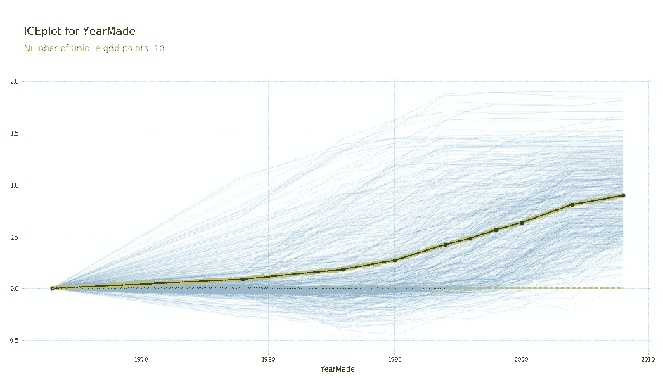

# 使用 fastai 库解释随机森林模型的直观指南(程序员的机器学习—第 2 部分)

> 原文：<https://medium.com/analytics-vidhya/an-intuitive-guide-to-interpret-a-random-forest-model-using-fastai-library-machine-learning-for-f3b4513c366b?source=collection_archive---------2----------------------->

机器学习是一个快速发展的领域——但有些东西会保持几年前的样子。其中之一就是**解读和解释你的机器学习模型的能力**。如果你建立了一个模型，却不能向你的业务用户解释它——它就不太可能出现。

你能想象在不了解其工作原理的情况下将一个模型集成到你的产品中吗？或者哪些特性影响了您的最终结果？

除了利益相关方的支持，作为数据科学家，我们还受益于对我们工作的解释和改进。这是一个双赢的局面！


这个 fast.ai 机器学习课程的[第一篇文章在我们的社区看到了令人难以置信的反响。我很高兴分享本系列的第 2 部分，它主要讨论如何解释随机森林模型。我们将理解这个理论，并用 Python 实现它，以巩固我们对这个关键概念的理解。](https://www.analyticsvidhya.com/blog/2018/10/comprehensive-overview-machine-learning-part-1/)

和往常一样，我鼓励您在阅读本文时在自己的机器上复制代码。对代码进行实验，看看您的结果与我在本文中介绍的结果有多大的不同。这将帮助你理解随机森林算法的不同方面以及可解释性的重要性。

# 目录

1.  第 1 部分概述(第 1 课和第 2 课)
2.  机器学习介绍:第 3 课
    2.1 构建随机森林
    2.2 置信区间
    2.3 特征重要性
3.  机器学习介绍:第 4 课
    3.1 一个热编码
    3.2 去除冗余特征
    3.3 部分依赖
    3.4 树解释器
4.  机器学习介绍:第 5 课
    4.1 外推
    4.2 从零开始随机森林
5.  其他主题

# 第 1 部分概述(第 1 课和第 2 课)

在我们开始本课程的下一课之前，让我们快速回顾一下前两节课所讲的内容。这将让你对未来有所了解。

*   **数据探索和预处理**:探索推土机数据集(链接)，估算缺失值，并将分类变量转换成 ml 模型可接受的数字列。我们还使用 fastai 库中的 *date_part* 函数从 date 列创建了多个特性。
*   **构建随机森林模型并创建验证集**:我们实现了一个随机森林，并计算了训练集的分数。为了确保模型不会过度拟合，创建了一个验证集。此外，我们调整了参数，以改善模型的性能。
*   **装袋介绍**:第二个视频介绍了装袋的概念。我们还可视化了一个单独的树，它提供了对随机森林如何工作的更好理解。

在本文中，我们将继续处理相同的数据集。我们将了解数据集中有哪些不同的变量，以及如何构建随机森林模型来做出有价值的解释。

好了，是时候启动我们的 Jupyter 笔记本，开始学习第三课了！

# 机器学习简介:第 3 课

你可以在这里查阅本课[的笔记本。本笔记本将用于本视频中涵盖的所有三堂课。您可以观看以下视频中的整个课程(或者向下滚动，立即开始实施):](https://github.com/fastai/fastai/blob/master/courses/ml1/lesson2-rf_interpretation.ipynb)

*注意:正如我们在上一篇文章中看到的，杰瑞米·霍华德定期提供各种技巧，可以用来更有效地解决某个问题。这个视频的一部分是关于如何处理非常大的数据集。我在文章的最后一部分提到了这一点，这样我们可以先关注手头的主题。*

让我们从第二课结束时停下的地方继续。我们已经使用日期列创建了新的特性，并且还处理了分类列。我们将加载经过处理的数据集，其中包括我们新设计的功能和*销售价格*变量的日志(因为评估指标是 RMSLE):

```
#importing necessary libraries
%load_ext autoreload
%autoreload 2
%matplotlib inline

from fastai.imports import *
from fastai.structured import *
from pandas_summary import DataFrameSummary
from sklearn.ensemble import RandomForestRegressor, RandomForestClassifier
from IPython.display import display
from sklearn import metrics

#loading preprocessed file
PATH = "data/bulldozers/"

df_raw = pd.read_feather('tmp/bulldozers-raw')
df_trn, y_trn, nas = proc_df(df_raw, 'SalePrice')
```

我们将定义在整个实现过程中经常使用的必要函数。

```
#creating a validation set

def split_vals(a,n): return a[:n], a[n:]
n_valid = 12000
n_trn = len(df_trn)-n_valid
X_train, X_valid = split_vals(df_trn, n_trn)
y_train, y_valid = split_vals(y_trn, n_trn)
raw_train, raw_valid = split_vals(df_raw, n_trn)

#define function to calculate rmse and print score
def rmse(x,y): return math.sqrt(((x-y)**2).mean())

def print_score(m):
   res = [rmse(m.predict(X_train), y_train), rmse(m.predict(X_valid), y_valid),
               m.score(X_train, y_train), m.score(X_valid, y_valid)]
   if hasattr(m, 'oob_score_'): res.append(m.oob_score_)
   print(res)
```

下一步将是实现一个随机森林模型，并解释结果，以更好地理解我们的数据集。到目前为止，我们已经了解到随机森林是由许多树组成的一组树，每棵树都在数据点和特征的不同子集上进行训练。每棵树都尽可能地不同，从数据集中捕捉唯一的关系。我们通过遍历每棵树的每一行并取叶节点值的平均值来进行预测。该平均值将作为该行的最终预测值。

在解释结果时，该过程必须是交互式的，并且需要较少的运行时间。为了实现这一点，我们将在代码中做两处修改(与我们在上一篇文章中实现的相比):

1.  取数据的子集:

```
set_rf_samples(50000)
```

我们只使用一个样本，因为处理整个数据需要很长时间。这里需要注意的一点是，样本不应该很小。这可能会导致不同的结果，对我们的整个项目不利。50，000 的样本大小效果很好。

```
#building a random forest model

m = RandomForestRegressor(n_estimators=40, min_samples_leaf=3, max_features=0.5, n_jobs=-1, oob_score=True)
m.fit(X_train, y_train)
print_score(m)
```

2 .并行进行预测

以前，我们使用每一棵树对每一行进行预测，然后计算结果的平均值和标准偏差。

```
%time preds = np.stack([t.predict(X_valid) for t in m.estimators_])
np.mean(preds[:,0]), np.std(preds[:,0])

CPU times: user 1.38 s, sys: 20 ms, total: 1.4 s
Wall time: 1.4 s
```

你可能已经注意到这是以连续的方式工作的。相反，我们可以并行调用多个树上的预测函数！这可以通过使用 fastai 库中的 *parallel_trees* 函数来实现。

```
def get_preds(t): return t.predict(X_valid)
%time preds = np.stack(parallel_trees(m, get_preds))
np.mean(preds[:,0]), np.std(preds[:,0])
```

这里花的时间更少，结果完全一样！我们现在将创建数据的副本，这样我们所做的任何更改都不会影响原始数据集。

```
x = raw_valid.copy()
```

一旦我们有了预测，我们就可以计算 RMSLE 来确定模型的表现如何。但是总体值并不能帮助我们确定某一行的预测值有多接近，也不能帮助我们确定预测值是否正确。在这种情况下，我们将查看各行的标准偏差。

如果一行不同于训练集中存在的那些行，则每棵树将给出不同的值作为预测。这意味着标准偏差将会很高。另一方面，树将对与训练集 t 中存在的行非常相似的行做出几乎相似的预测，即，标准偏差将很低。因此，基于标准差的值，我们可以决定我们对预测有多有信心。

让我们保存这些预测和标准差:

```
x['pred_std'] = np.std(preds, axis=0)
x['pred'] = np.mean(preds, axis=0)
```

# 置信区间

现在，让我们从数据集中取出一个变量，并可视化它的分布，了解它实际代表什么。我们将从*外壳*变量开始。

1.  计算出变量*闭包:*中每个类别的值计数

```
x.Enclosure.value_counts().plot.barh()
```


2.对于每个类别，下面是*销售价格*的平均值、预测值和标准偏差。

```
flds = ['Enclosure', 'SalePrice', 'pred', 'pred_std']
enc_summ = x[flds].groupby('Enclosure', as_index=False).mean()
enc_summ
```


实际销售价格和预测值在三个类别中几乎相似—“EROPS”、“EROPS w AC”、“OROPS”(其余为空值)。由于这些空值列没有添加任何额外的信息，我们将删除它们，并可视化*销售价格*和预测的图表:

```
enc_summ = enc_summ[~pd.isnull(enc_summ.SalePrice)]
enc_summ.plot('Enclosure', 'pred', 'barh', xerr='pred_std', alpha=0.6, xlim=(0,11));
```


请注意，黑色小条代表标准偏差。同样，让我们看看另一个变量— *ProductSize* 。

```
#the value count for each category raw_valid.ProductSize.value_counts().plot.barh();
```


```
#category wise mean for sale price, prediction and standard deviation
flds = ['ProductSize', 'SalePrice', 'pred', 'pred_std']
summ = x[flds].groupby(flds[0]).mean()
summ
```

我们将取标准偏差值和预测总和的比值，以便比较哪一个类别具有更高的偏差。

```
(summ.pred_std/summ.pred).sort_values(ascending=False)ProductSize
Large             0.034871
Compact           0.034297
Small             0.030545
Large / Medium    0.027799
Medium            0.026928
Mini              0.026247
dtype: float64
```

“大”和“小”类别的标准差较高。你那是为什么？在继续阅读之前，花点时间思考一下答案。

查看 *ProductSize 中每个类别值的条形图。*找到原因了？这两个类别的行数较少。因此，该模型对这些变量的预测精度相对较低。

利用这些信息，我们可以说，我们对迷你、中型和中型/大型产品尺寸的预测更有信心，而对小型、紧凑型和大型产品的预测信心较低。

# 特征重要性

特征重要性是机器学习模型的关键方面之一。理解哪个变量对模型的贡献最大对于解释结果至关重要。这就是数据科学家在构建需要向非技术利益相关者解释的模型时所努力追求的。

我们的数据集有多个要素，通常很难理解哪个要素占主导地位。这就是随机森林的特征重要性函数如此有用的地方。让我们看看当前模型的 10 个最重要的特性(包括根据它们的重要性对它们进行可视化):

```
fi = rf_feat_importance(m, df_trn)
fi[:10]
```


```
fi.plot('cols', 'imp', figsize=(10,6), legend=False);
```


这是一个非常直观的情节。这是 30 大功能的柱状图可视化:

```
def plot_fi(fi):
return fi.plot('cols','imp','barh', figsize=(12,7), legend=False)
plot_fi(fi[:30]);
```


显然*年制*是最重要的特征，其次是*车钩 _ 系统。*大多数特征在最终模型中似乎都不太重要。让我们通过移除这些特征并检查这是否影响模型的性能来验证这种说法。

因此，我们将仅使用要素重要性大于 0.005 的要素构建随机森林模型:

```
to_keep = fi[fi.imp>0.005].cols 
len(to_keep)24df_keep = df_trn[to_keep].copy()
X_train, X_valid = split_vals(df_keep, n_trn)

m = RandomForestRegressor(n_estimators=40, min_samples_leaf=3, max_features=0.5,
n_jobs=-1, oob_score=True)
m.fit(X_train, y_train)
print_score(m)[0.20685390156773095, 0.24454842802383558, 0.91015213846294174, 0.89319840835270514, 0.8942078920004991]
```

仔细想想，删除冗余列应该不会降低模型分数，对吗？在这种情况下，模型性能略有提高。我们之前删除的一些特征可能与其他特征高度共线，因此删除它们不会对模型产生负面影响。让我们再次检查特性重要性，以验证我们的假设:

```
fi = rf_feat_importance(m, df_keep)
plot_fi(fi)
```


*年制*和 C *输出系统*变量的特征重要性差异更显著。从移除的特征列表中，一些特征与 *YearMade、*高度共线，导致它们之间的特征重要性分布。

移除这些特征后，我们可以看到*年制*和*联轴器系统*的重要性之间的差异比之前的图有所增加。以下是如何计算特征重要性的详细说明:

*   **考虑所有列，计算 r 平方:**假设在这种情况下，r 平方为 0.89
*   现在**随机打乱任意一列**的值，比如说 *YearMade。他的列与目标变量无关*
*   **再算一下 r 平方:**r 平方已经降到 0.8 了。这表明 *YearMade* 变量是一个重要的特性
*   **取另一个变量**，说*圈地，*和**随机洗牌**
*   **计算 r 平方:**现在假设 r 平方即将为 0.84。这表明该变量很重要，但相对来说不如*年制*变量重要

这就完成了第 3 课的实施！我鼓励您尝试这些代码，并在您自己的机器上进行试验，以真正理解随机森林模型的每个方面是如何工作的。

# 机器学习简介:第 4 课

在这一课中，杰瑞米·霍华德先对第三课进行了快速概述，然后介绍了一些重要的概念，如热编码、树状图和部分依赖。下面是该讲座的 YouTube 视频(或者您可以直接跳到下面的实现):

# 一键编码

在本系列的第一篇文章中，我们了解到许多机器学习模型无法处理分类变量。使用 *proc_df* ，我们将分类变量转换成数字列。例如，我们有一个变量 *UsageBand* ，它有三个级别——“高”、“低”和“中”。我们用数字(0，1，2)代替了这些类别，以便于我们自己。

肯定有另一种方式来处理这件事，对我们来说要省力得多。有！

我们可以为每个类别创建单独的列，而不是将这些类别转换成数字。列 *UsageBand* 可以替换为三列:

*   *UsageBand_low*
*   *UsageBand_medium*
*   *UsageBand_high*

每个都有 1 和 0 作为值。这被称为一键编码。

当类别远远超过 3 个时会发生什么？如果我们有超过 10 个呢？我们举个例子来理解这一点。

假设我们在数据集中有一个列' *zip_code* '，它对每一行都有一个唯一的值。在这里使用一次性编码对模型没有好处，最终会增加运行时间(一个双输的场景)。

使用 fastai 中的 *proc_df* ，我们可以通过传递一个参数 *max_n_cat* 来执行一键编码。在这里，我们设置了 *max_n_cat=7* ，这意味着级别大于 7 的变量(如邮政编码)将不会被编码，而所有其他变量将被一次性编码。

```
df_trn2, y_trn, nas = proc_df(df_raw, 'SalePrice', max_n_cat=7)
X_train, X_valid = split_vals(df_trn2, n_trn)
m = RandomForestRegressor(n_estimators=40, min_samples_leaf=3,
     max_features=0.6, n_jobs=-1, oob_score=**True**)
m.fit(X_train, y_train)
print_score(m)[0.2132925755978791, 0.25212838463780185, 0.90966193351324276, 0.88647501408921581, 0.89194147155121262]
```

这有助于确定特定列中的特定级别是否重要。由于我们已经将分类变量的每个级别分开，绘制特征重要性也将向我们展示它们之间的比较:

```
fi = rf_feat_importance(m, df_trn2)
fi[:25]
```


早先， *YearMade* 是数据集中最重要的特征，但是 *EROPS w AC* 在上图中具有更高的特征重要性。好奇这个变量是什么？别急，我们会在下一节讨论 EROPS w AC 实际代表的是什么。

# 移除冗余特征

到目前为止，我们已经了解到，拥有大量的要素会影响模型的性能，并且还会使解释结果变得困难。在本节中，我们将了解如何识别冗余特征并将其从数据中移除。

我们将使用聚类分析，更具体地说是等级聚类，来识别相似的变量。在这种技术中，我们观察每一个物体，并识别它们中哪些在特征方面最接近。然后这些变量被它们的中点所取代。为了更好地理解这一点，让我们看一下数据集的聚类图:

```
from scipy.cluster import hierarchy as hc
corr = np.round(scipy.stats.spearmanr(df_keep).correlation, 4)
corr_condensed = hc.distance.squareform(1-corr)
z = hc.linkage(corr_condensed, method='average')
fig = plt.figure(figsize=(16,10))
dendrogram = hc.dendrogram(z, labels=df_keep.columns,
    orientation='left', leaf_font_size=16)
plt.show()
```


从上面的树状图中，我们可以看到变量*saleeyear*和*saleelast*彼此非常相似，并且倾向于表示同一事物。同样，*抓地齿 _ 履带*、*液压 _ 流量*和*连接器 _ 系统*高度相关。*product group*&*ProductGroupDesc*和*fibase model*&*fiModelDesc*也是如此。我们将逐一删除这些功能，并看看它如何影响模型性能。

首先，我们定义一个函数来计算出袋(OOB)分数(以避免重复相同的代码行):

```
#define function to calculate oob score
def get_oob(df):
  m = RandomForestRegressor(n_estimators=30, min_samples_leaf=5, max_features=0.6, n_jobs=-1, oob_score=True)
  x, _ = split_vals(df, n_trn)
  m.fit(x, y_train)
  return m.oob_score_
```

为了便于比较，以下是删除任何功能之前的原始 OOB 评分:

```
get_oob(df_keep) 
0.89019425494301454
```

我们现在一次放下一个变量，然后计算分数:

```
for c in ('saleYear', 'saleElapsed', 'fiModelDesc', 'fiBaseModel', 'Grouser_Tracks', 'Coupler_System'):
  print(c, get_oob(df_keep.drop(c, axis=1)))saleYear 0.889037446375
saleElapsed 0.886210803445
fiModelDesc 0.888540591321
fiBaseModel 0.88893958239
Grouser_Tracks 0.890385236272
Coupler_System 0.889601052658
```

这并没有严重影响 OOB 的分数。现在让我们从每对变量中移除一个变量，并检查总得分:

```
to_drop = ['saleYear', 'fiBaseModel', 'Grouser_Tracks']
get_oob(df_keep.drop(to_drop, axis=1))0.88858458047200739
```

分数从 0.8901 变成了 0.8885。我们将在完整的数据集上使用这些选定的要素，并查看我们的模型如何执行:

```
df_keep.drop(to_drop, axis=1, inplace=True)
X_train, X_valid = split_vals(df_keep, n_trn)
reset_rf_samples()

m = RandomForestRegressor(n_estimators=40, min_samples_leaf=3, max_features=0.5, n_jobs=-1, oob_score=True)
m.fit(X_train, y_train)
print_score(m)[0.12615142089579687, 0.22781819082173235, 0.96677727309424211, 0.90731173105384466, 0.9084359846323049]
```

一旦这些变量从原始数据框架中移除，模型在验证集上的得分变成 0.907。

# 部分依赖

我将在这里介绍另一种技术，它有可能帮助我们更好地理解数据。这种技术被称为部分依赖，它被用来找出特征是如何与目标变量相关的。

```
from pdpbox import pdp
from plotnine import *

set_rf_samples(50000)

df_trn2, y_trn, nas = proc_df(df_raw, 'SalePrice', max_n_cat=7)
X_train, X_valid = split_vals(df_trn2, n_trn)
m = RandomForestRegressor(n_estimators=40, min_samples_leaf=3, max_features=0.6, n_jobs=-1)
m.fit(X_train, y_train);

plot_fi(rf_feat_importance(m, df_trn2)[:10]);
```


让我们比较一下*年制*和*售价*。如果你为*年制造*和*年销售*创建一个散点图，你会注意到一些车辆是在 1000 年制造的，这实际上是不可能的。

```
df_raw.plot('YearMade', 'saleElapsed', 'scatter', alpha=0.01, figsize=(10,8));
```


这些可能是最初丢失的值，已被替换为 1，000。为了保持实用性，我们将关注大于 1930 年的 *YearMade* 变量的值，并使用流行的 *ggplot* 包创建一个图。

```
x_all = get_sample(df_raw[df_raw.YearMade>1930], 500)
ggplot(x_all, aes('YearMade', 'SalePrice'))+stat_smooth(se=True, method='loess')
```


该图表明，除了 1991 年至 1997 年间的一次下跌外，最近生产的汽车的销售价格较高。这种下降可能有多种原因——经济衰退、消费者更喜欢价格较低的汽车，或者其他一些外部因素。为了理解这一点，我们将创建一个图表来显示 *YearMade* 和 *SalePrice* 之间的关系，假设所有其他特征值都相同。

```
x = get_sample(X_train[X_train.YearMade>1930], 500)

def plot_pdp(feat, clusters=None, feat_name=None):
   feat_name = feat_name or feat
   p = pdp.pdp_isolate(m, x, feat)
   return pdp.pdp_plot(p, feat_name, plot_lines=True, cluster=clusters is not None, n_cluster_centers=clusters)

plot_pdp('YearMade')
```



通过将每一行的*年份*固定为 1960 年，然后是 1961 年，以此类推，可以得到这个图。简单地说，我们取一组行，当 *YearMade* 是 1960 年时，计算每行的*销售价格*。然后我们再次取整组，通过将*年制*设定为 1962 年来计算*销售价格*。我们重复多次，这导致了我们在上面的图中看到的多条蓝线。深黑线代表平均值。**这证实了我们的假设，即最近生产的汽车销售价格会上升。**

同样，您可以检查其他功能，如*销售过去时间*，或*年制*和*销售过去时间*。对 *Enclosure* 下的类别执行相同的步骤(因为 *Enclosure_EROPS w AC* 被证明是最重要的特性之一)，结果图如下所示:

```
plot_pdp(['Enclosure_EROPS w AC', 'Enclosure_EROPS', 'Enclosure_OROPS'], 5, 'Enclosure')
```


与其他两个变量(它们的值几乎相等)相比，Enclosure_EROPS w AC 似乎具有更高的销售价格。那么 EROPS 究竟是什么？这是一个封闭的翻车保护结构，可以有或没有空调。很明显，拥有 AC 的英雄会有更高的售价。

# 树解释程序

树解释器是另一种有趣的技术，它分析数据集中的每一行。到目前为止，我们已经了解了如何解释模型，以及每个特征(以及每个分类特征中的级别)如何影响模型预测。因此，我们现在将使用这个树解释器概念，并可视化特定行的预测。

让我们导入树解释器库，并评估验证集中第一行的结果。

```
from treeinterpreter import treeinterpreter as ti
df_train, df_valid = split_vals(df_raw[df_keep.columns], n_trn)
row = X_valid.values[None,0]
row array([[4364751, 2300944, 665, 172, 1.0, 1999, 3726.0, 3, 3232, 1111, 0, 63, 0, 5, 17, 35, 4, 4, 0, 1, 0, 0,
       0, 0, 0, 0, 0, 0, 0, 0, 12, 0, 0, 0, 0, 0, 3, 0, 0, 0, 2, 19, 29, 3, 2, 1, 0, 0, 0, 0, 0, 2010, 9, 37,
       16, 3, 259, False, False, False, False, False, False, 7912, False, False]], dtype=object)
```

这些是验证集中第一行(以及每一列)的原始值。使用树解释器，我们将使用随机森林模型进行预测。树解释器给出三个结果——预测、偏差和贡献。

*   预测是由随机森林模型预测的值
*   偏差是整个数据集的目标变量的平均值
*   贡献是每一列改变预测值的量


***耦合器 _ 系统* < 0.5 的值从 10.189 增加到 10.345，小于 0.2 的外壳从 10.345 减少到 9.955，以此类推。因此，贡献将代表预测值的这种变化。为了更好地理解这一点，请看下表:**


在此表中，我们存储了每个特征和分割点的值(从上图中验证)。变化是分割前后的值之差。这些是用 Excel 中的瀑布图绘制的。这里看到的变化是针对单个树的。随机森林中所有树的平均变化由树解释器中的*贡献*给出。

打印验证集中第一行的预测和偏差:

```
prediction, bias, contributions = ti.predict(m, row)
prediction[0], bias[0](9.1909688098736275, 10.10606580677884)
```

第一行数据集中每个要素的*贡献*值:

```
idxs = np.argsort(contributions[0])
[o for o in zip(df_keep.columns[idxs], df_valid.iloc[0][idxs], contributions[0][idxs])][('ProductSize', 'Mini', -0.54680742853695008),
('age', 11, -0.12507089451852943),
('fiProductClassDesc',
 'Hydraulic Excavator, Track - 3.0 to 4.0 Metric Tons',
 -0.11143111128570773),
('fiModelDesc', 'KX1212', -0.065155113754146801),
('fiSecondaryDesc', nan, -0.055237427792181749),
('Enclosure', 'EROPS', -0.050467175593900217),
('fiModelDescriptor', nan, -0.042354676935508852),
('saleElapsed', 7912, -0.019642242073500914),
('saleDay', 16, -0.012812993479652724),
('Tire_Size', nan, -0.0029687660942271598),
('SalesID', 4364751, -0.0010443985823001434),
('saleDayofyear', 259, -0.00086540581130196688),
('Drive_System', nan, 0.0015385818526195915),
('Hydraulics', 'Standard', 0.0022411701338458821),
('state', 'Ohio', 0.0037587658190299409),
('ProductGroupDesc', 'Track Excavators', 0.0067688906745931197),
('ProductGroup', 'TEX', 0.014654732626326661),
('MachineID', 2300944, 0.015578052196894499),
('Hydraulics_Flow', nan, 0.028973749866174004),
('ModelID', 665, 0.038307429579276284),
('Coupler_System', nan, 0.052509808150765114),
('YearMade', 1999, 0.071829996446492878)]
```

*注意:如果您同时观看本文视频，数值可能会有所不同。这是因为最初这些值是根据索引排序的，而索引提供了不正确的信息。这一点在后面的视频和我们在整个课程中一直学习的笔记本中得到了纠正。*

# 机器学习导论:第 5 课

在这个阶段，您应该对随机森林算法有了很好的理解。在第 5 课中，我们将重点讨论如何识别模型是否具有良好的泛化能力。杰瑞米·霍华德还谈到了树解释器、*贡献、*以及使用瀑布图理解树解释器(我们在上一课中已经介绍过了，所以不再赘述)。**视频的主要重点是推断和理解我们如何从头开始构建随机森林算法。**

# 推断

如果一个模型建立在跨越四年的数据上，然后用于预测下一年的值，那么它可能表现不好。换句话说，该模型不进行外推。我们之前已经看到，训练分数和验证分数之间存在显著差异，这可能是因为我们的验证集由一组最近的数据点组成(并且模型使用时间相关变量进行预测)。

此外，验证分数比 OOB 的*分数*差这是不应该的，对吧？本系列的第一部分已经给出了关于 *OOB* 分数的详细解释。解决这个问题的一个方法是直接解决它——处理与时间相关的变量。

为了找出哪些变量是时间相关的，我们将创建一个随机森林模型，试图预测某一行是否在验证集中。然后，我们将检查哪个变量对成功预测的贡献最大。

定义目标变量:

```
df_ext = df_keep.copy()
df_ext['is_valid'] = 1
df_ext.is_valid[:n_trn] = 0
x, y, nas = proc_df(df_ext, 'is_valid')

m = RandomForestClassifier(n_estimators=40, min_samples_leaf=3, max_features=0.5, n_jobs=-1, oob_score=**True**)
m.fit(x, y);
m.oob_score_0.99998753505765037
```

该模型能够用 r-square 值 0.99998 分离训练集和验证集，最重要的特征是 *SaleID* 、 *SaleElapsed* 、 *MachineID。*

```
fi = rf_feat_importance(m, x)
fi[:10]
```


*   SaleID 当然不是一个随机的标识符，它应该是一个递增的顺序
*   看起来 *MachineID* 有相同的趋势，并且能够分离训练集和验证集
*   *SaleElapsed* 是从数据集中的第一个日期算起的天数。由于我们的验证集具有来自完整数据的最新值， *SaleElapsed* 在这个数据集中会更高。为了证实假设，下面是训练和测试中三个变量的分布:

```
feats=['SalesID', 'saleElapsed', 'MachineID']
(X_train[feats]/1000).describe()
```


```
(X_valid[feats]/1000).describe()
```

从上表可以明显看出，这三个变量的平均值有很大不同。我们将删除这些变量，再次拟合随机森林并检查特征重要性:

```
x.drop(feats, axis=1, inplace=True)
m = RandomForestClassifier(n_estimators=40, min_samples_leaf=3, max_features=0.5, n_jobs=-1, oob_score=True)
m.fit(x, y);
m.oob_score_ 0.9789018385789966fi = rf_feat_importance(m, x)
fi[:10]
```


尽管这些变量明显与时间有关，但它们对预测也很重要。在我们放弃这些变量之前，我们需要检查它们如何影响 *OOB* 分数。计算样本中的初始 *OOB* 分数用于比较:

```
set_rf_samples(50000)
feats=['SalesID', 'saleElapsed', 'MachineID', 'age', 'YearMade', 'saleDayofyear']
X_train, X_valid = split_vals(df_keep, n_trn)
m = RandomForestRegressor(n_estimators=40, min_samples_leaf=3, max_features=0.5, n_jobs=-1, oob_score=True)
m.fit(X_train, y_train)
print_score(m)[0.21136509778791376, 0.2493668921196425, 0.90909393040946562, 0.88894821098056087, 0.89255408392415925]
```

逐一删除每个功能:

```
for f in feats:

  df_subs = df_keep.drop(f, axis=1)
  X_train, X_valid = split_vals(df_subs, n_trn)
  m = RandomForestRegressor(n_estimators=40, min_samples_leaf=3, max_features=0.5, n_jobs=-1, oob_score=True)
  m.fit(X_train, y_train)
  print(f)
  print_score(m)SalesID
0.20918653475938534, 0.2459966629213187, 0.9053273181678706, 0.89192968797265737, 0.89245205174299469]

saleElapsed
[0.2194124612957369, 0.2546442621643524, 0.90358104739129086, 0.8841980790762114, 0.88681881032219145]

MachineID
[0.206612984511148, 0.24446409479358033, 0.90312476862123559, 0.89327205732490311, 0.89501553584754967]

age
[0.21317740718919814, 0.2471719147150774, 0.90260198977488226, 0.89089460707372525, 0.89185129799503315]

YearMade
[0.21305398932040326, 0.2534570148977216, 0.90555219348567462, 0.88527538596974953, 0.89158854973045432]

saleDayofyear
[0.21320711524847227, 0.24629839782893828, 0.90881970943169987, 0.89166441133215968, 0.89272793857941679]
```

从结果来看，*年龄、MachineID* 和 *SaleDayofYear* 确实提高了分数，而其他人则没有。因此，我们将删除剩余的变量，并在完整的数据集上拟合随机森林。

```
reset_rf_samples()
df_subs = df_keep.drop(['SalesID', 'MachineID', 'saleDayofyear'],axis=1)
X_train, X_valid = split_vals(df_subs, n_trn)
m = RandomForestRegressor(n_estimators=40, min_samples_leaf=3, max_features=0.5, n_jobs=-1, oob_score=**True**)
m.fit(X_train, y_train)
print_score(m)[0.1418970082803121, 0.21779153679471935, 0.96040441863389681, 0.91529091848161925, 0.90918594039522138]
```

去除时间相关变量后，验证分数(0.915)现在比 *OOB* 分数(0.909)好。我们现在可以使用其他参数，如*n _ estimator*on*max _ features*。为了创建最终的模型，杰里米将树的数量增加到 160 棵，结果如下:

```
m = RandomForestRegressor(n_estimators=160, max_features=0.5, n_jobs=-1, oob_score=**True**)
%time m.fit(X_train, y_train)
print_score(m)CPU times: user 6min 3s, sys: 2.75 s, total: 6min 6s
Wall time: 16.7 s
[0.08104912951128229, 0.2109679613161783, 0.9865755186304942, 0.92051576728916762, 0.9143700001430598]
```

验证分数为 0.92，而 RMSE 降至 0.21。确实是一大进步！

# 从零开始的随机森林

我们已经了解了随机森林模型实际上是如何工作的，如何选择特征以及如何最终做出预测。在本节中，我们将从头开始创建我们自己的随机森林模型。这是本节的笔记本:[从零开始的随机森林](https://github.com/fastai/fastai/blob/master/courses/ml1/lesson3-rf_foundations.ipynb)。

我们将从导入基本库开始:

```
%load_ext autoreload
%autoreload 2
%matplotlib inline

from fastai.imports import *
from fastai.structured import *
from sklearn.ensemble import RandomForestRegressor, RandomForestClassifier

from IPython.display import display
from sklearn import metrics
```

我们先用两个变量。一旦我们确信模型能够很好地处理这些选定的变量，我们就可以使用完整的功能集了。

```
PATH = "data/bulldozers/"

df_raw = pd.read_feather('tmp/bulldozers-raw')
df_trn, y_trn, nas = proc_df(df_raw, 'SalePrice')
def split_vals(a,n): return a[:n], a[n:]

n_valid = 12000
n_trn = len(df_trn)-n_valid

X_train, X_valid = split_vals(df_trn, n_trn)
y_train, y_valid = split_vals(y_trn, n_trn)
raw_train, raw_valid = split_vals(df_raw, n_trn)
x_sub = X_train[['YearMade', 'MachineHoursCurrentMeter']]
```

我们已经加载了数据集，将它分为训练集和验证集，并选择了两个特征— *YearMade* 和 *MachineHoursCurrentMeter。从头开始构建任何模型时，首先要考虑的是——我们需要什么信息？因此，对于随机森林，我们需要:*

*   一组特征— x
*   目标变量— y
*   随机森林中的树的数量— n_trees
*   定义样本大小的变量— sample_sz
*   最小叶子大小的变量 min _ leaf
*   用于测试的随机种子

让我们用上面提到的输入定义一个类，并将随机种子设置为 42。

```
class TreeEnsemble():
   def __init__(self, x, y, n_trees, sample_sz, min_leaf=5):
       np.random.seed(42)
       self.x,self.y,self.sample_sz,self.min_leaf = x,y,sample_sz,min_leaf
       self.trees = [self.create_tree() for i in range(n_trees)]

   def create_tree(self):
       rnd_idxs = np.random.permutation(len(self.y))[:self.sample_sz]
       return DecisionTree(self.x.iloc[rnd_idxs], self.y[rnd_idxs], min_leaf=self.min_leaf)

   def predict(self, x):
       return np.mean([t.predict(x) for t in self.trees], axis=0)
```

我们已经创建了一个函数 *create_trees* ，它将被调用 n_trees 的数量。函数 *create_trees* 生成一组随机打乱的行(大小= *sample_sz* )并返回*决策树。我们一会儿会看到决策树，但首先让我们弄清楚预测是如何创建和保存的。*

我们之前了解到，在随机森林模型中，每棵树都对每一行进行预测，最后的预测是通过取所有预测的平均值来计算的。所以我们将创建一个预测函数，其中*。predict* 用于每棵树来创建一个预测列表，这个列表的平均值被计算为我们的最终值。

最后一步是创建*决策树。*我们首先选择一个给出最小误差的特征和分割点。目前，此代码仅用于单个决策。如果代码运行成功，我们可以让它递归。

```
class DecisionTree():
   def __init__(self, x, y, idxs=None, min_leaf=5):
       if idxs is None: idxs=np.arange(len(y))
       self.x,self.y,self.idxs,self.min_leaf = x,y,idxs,min_leaf
       self.n,self.c = len(idxs), x.shape[1]
       self.val = np.mean(y[idxs])
       self.score = float('inf')
       self.find_varsplit()

   # This just does one decision; we'll make it recursive later
   def find_varsplit(self):
       for i in range(self.c): self.find_better_split(i)

   # We'll write this later!
   def find_better_split(self, var_idx): pass

   @property
   def split_name(self): return self.x.columns[self.var_idx]

   @property
   def split_col(self): return self.x.values[self.idxs,self.var_idx]

   @property
   def is_leaf(self): return self.score == float('inf')

   def __repr__(self):
       s = f'n: {self.n}; val:{self.val}'
       if not self.is_leaf:
           s += f'; score:{self.score}; split:{self.split}; var:{self.split_name}'
       return s
```

*self.n* 定义每棵树使用的行数，而 *self.c* 是列数。 *self.val* 计算每个指数的预测平均值。这段代码仍然不完整，将在下一课中继续。是的，第 3 部分即将推出！

# 其他主题

*   **在几秒钟内读取一个大型数据集:**如果我们在读取文件本身的时候提供变量的数据类型，那么加载数据集的时间就会减少。使用这个拥有超过 1 亿行的数据集来看看这是怎么回事。

```
types = {'id': 'int64',
       'item_nbr': 'int32',
       'store_nbr': 'int8',
       'unit_sales': 'float32',
       'onpromotion': 'object'}
%%time
df_test = pd.read_csv(f'{PATH}test.csv', parse_dates = ['date'], dtype=types, infer_datetime_format=True)CPU times: user 1min 41s, sys: 5.08s, total: 1min 46s 
Wall time: 1min 48s
```

*   **基数:**这是分类变量中的级别数。对于 *UsageBand* 变量，我们有三个级别—高、低和中。因此基数是 3。
*   **训练-验证-测试:**在测试集上使用模型之前，有一个验证集来检查模型的性能是很重要的。经常发生的情况是，我们最终在验证集上过度拟合我们的模型。如果验证集不是测试集的真实代表，那么模型也会失败。**因此，完整的数据应分为训练、验证和测试集，其中测试集应仅在结束时使用(而不是在参数调整期间)。**
*   **交叉验证:**交叉验证集创建多个验证集，并在每个验证集上测试模型。完整的数据被混洗并分成组，以 5 个为例。其中四组用于训练模型，一组用作验证集。在下一次迭代中，另外四个用于训练，一个用于验证。该步骤将重复五次，其中每组用作一次验证组。

# 结束注释

我认为这是这个系列中最重要的文章之一。我怎么强调模型可解释性的重要性都不为过。在真实的行业场景中，您经常会面临必须向涉众(通常是非技术人员)解释模型结果的情况。

你获得模型批准的机会将取决于你能够解释模型是如何以及为什么会这样。另外，用外行人能理解的方式向自己解释任何模型的性能总是一个好主意——这总是一个好习惯！

使用下面的评论部分让我知道你的想法或者问你对这篇文章的任何问题。正如我提到的，第 3 部分即将推出，敬请期待！

*原载于 2018 年 10 月 29 日*[*【www.analyticsvidhya.com*](https://www.analyticsvidhya.com/blog/2018/10/interpret-random-forest-model-machine-learning-programmers/)*。*