# 对单词嵌入的直观理解:从计数向量到 Word2Vec

> 原文：<https://medium.com/analytics-vidhya/an-intuitive-understanding-of-word-embeddings-from-count-vectors-to-word2vec-8231e18dbe92?source=collection_archive---------1----------------------->

在我们开始之前，看看下面的例子。

1.  你打开谷歌搜索一篇关于正在进行的冠军奖杯的新闻文章，得到数百个关于它的搜索结果。
2.  内特·西尔弗分析了数百万条推文，并正确预测了 2008 年美国总统选举 50 个州中 49 个州的结果。
3.  你在谷歌翻译中输入一个英语句子，就会得到一个对等的中文翻译。


那么以上例子有什么共同点呢？

你可能猜对了—**文本处理**。以上三种场景都需要处理海量的文本来执行不同的任务，比如谷歌搜索中的聚类，第二种情况下的分类，第三种情况下的机器翻译。

人类可以非常直观地处理文本格式，但是假设我们在一天内生成了数百万个文档，我们不可能让人类执行上述三项任务。它既不可扩展也不有效。


那么，既然我们知道当今的计算机在处理字符串或文本以获得任何有成效的输出时通常效率低下，那么我们如何让它们对文本数据执行聚类、分类等操作呢？

当然，计算机可以匹配两个字符串，并告诉你它们是否相同。但是我们如何让计算机在你搜索梅西的时候告诉你足球或者 c 罗？如何让一台电脑明白《苹果是一种美味的水果》中的“苹果”是一种可以吃的水果而不是一家公司？

以上问题的答案在于创建一个单词的表示法，该表示法捕捉它们的*含义*、*语义关系*以及它们在不同类型的上下文中的使用。

所有这些都是通过使用单词嵌入或文本的数字表示来实现的，以便计算机可以处理它们。

下面，我们将正式看到什么是单词嵌入及其不同类型，以及我们如何实际实现它们来执行任务，如返回高效的 Google 搜索结果。

# 目录

1.  什么是单词嵌入？
2.  不同类型的单词嵌入
    2.1 基于频率的嵌入
    2.1.1 计数向量
    2.1.2 TF-IDF
    2.1.3 同现矩阵
    2.2 基于预测的嵌入
    2 . 2 . 1 CBOW
    2 . 2 . 2 Skip-Gram
3.  单词嵌入用例场景(使用单词嵌入可以做什么？例如:相似性、独特性等。)
4.  使用预先训练的单词向量
5.  训练你自己的单词向量
6.  结束注释

# 1.什么是单词嵌入？

简单来说，单词嵌入是将文本转换成数字，同一文本可能有不同的数字表示。但是在我们深入到单词嵌入的细节之前，应该问下面的问题——我们为什么需要单词嵌入？

事实证明，许多机器学习算法和几乎所有的深度学习架构都无法处理原始形式的*字符串*或*纯文本*。他们需要数字作为输入来执行任何种类的工作，无论是分类、回归等等。广义而言。随着大量数据以文本格式呈现，从中提取知识并构建应用程序势在必行。文本应用的一些真实世界的应用是——亚马逊评论的情感分析等。通过 Google 等进行文档或新闻分类或聚类。

现在让我们正式定义单词嵌入。单词嵌入格式通常尝试使用字典将单词映射到向量。让我们把这个句子分解成更细的细节，以便看得更清楚。

看看这个例子——**句子** =“单词嵌入是将单词转换成数字”

这个**句**中的一个*字*可能是“嵌入”或“数字”等。

一个*字典*可以是**句子中所有唯一单词的列表。**因此，字典可能看起来像——
['单词'，'嵌入'，'是'，'转换'，'转换'，'数字']

一个字的 ve *ctor* 表示可以是一个独热编码的向量，其中 1 代表该字存在的位置，0 代表其它任何位置。根据上述字典，这种格式的“数字”的向量表示为[0，0，0，0，0，1]，转换后的向量表示为[0，0，0，1，0，0]。

这只是一个非常简单的方法来表示一个矢量形式的单词。让我们看看不同类型的单词嵌入或单词向量，以及它们相对于其他类型的优缺点。

# 2.不同类型的单词嵌入

不同类型的单词嵌入可以大致分为两类

1.  基于频率的嵌入
2.  基于预测的嵌入

让我们试着详细理解这些方法。

# 2.1 基于频率的嵌入

在这一类别下，我们通常会遇到三种类型的病媒。

1.  计数向量
2.  TF-IDF 载体
3.  共现向量

让我们详细研究一下这些矢量化方法。

## 计数向量

考虑 D 个文档的语料库{ d1，d2…..这 N 个记号将形成我们的字典，并且计数向量矩阵 M 的大小将由 D×N 给出。矩阵 M 中的每一行包含文档 D(i)中记号的频率。

让我们用一个简单的例子来理解这一点。

D1:他是一个懒惰的男孩。她也很懒。

D2:尼拉杰是个懒惰的人。

所创建的字典可以是语料库中的唯一记号(单词)的列表=['He '，' She '，' lazy '，' boy '，' Neeraj '，' person']

这里，D=2，N=6

大小为 2 X 6 的计数矩阵 M 将表示为

他她懒惰的男孩 Neeraj 人 D1 1 1 2 1 0 0 D2 0 0 1 0 1 1

现在，一列也可以理解为矩阵 m 中对应词的词向量，比如上面矩阵中‘lazy’的词向量是[2，1]等等。这里，*行*对应于语料库中的*文档*，而*列*对应于词典中的*标记*。上面矩阵中的第二行可以读作——D2 包含“懒惰”:once，“Neeraj”:once 和“人”once。

现在，在准备上述矩阵 m 时，可能会有相当多的变化。这些变化通常在-

1.  字典的编写方式。
    为什么？因为在现实世界的应用中，我们可能有一个包含数百万文档的语料库。有了数百万份文件，我们可以提取数亿个独特的单词。所以基本上，像上面那样准备的矩阵是非常稀疏的，对于任何计算都是低效的。因此，除了使用每个独特的单词作为字典元素之外，另一种方法是根据频率选择前 10，000 个单词，然后准备一本字典。
2.  对每个单词计数的方式。我们可以采用频率(一个单词在文档中出现的次数)或存在(这个单词在文档中出现过吗？)作为计数矩阵 m 中的条目。但是通常，频率方法优于后者。

下面是矩阵 M 的代表性图像，以便于理解。

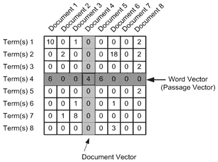

## TF-IDF 矢量化

这是另一种基于频率方法的方法，但它不同于计数矢量化，因为它不仅考虑单个文档中的单词出现，还考虑整个语料库中的单词出现。那么，这背后的逻辑是什么呢？让我们试着去理解。

像“is”、“the”、“a”等常用词。与对文档重要的单词相比，往往出现得相当频繁。例如，与其他文档相比，关于莱昂内尔·梅西的文档 **A** 将包含更多出现的单词“梅西”。但是像“the”这样的常用词。也会在几乎所有文件中以更高的频率出现。

理想情况下，我们想要的是降低在几乎所有文档中出现的常见单词的权重，并赋予出现在文档子集中的单词更多的重要性。

TF-IDF 的工作原理是，在某个特定的文档中，通过给这些普通的单词分配较低的权重来惩罚它们，同时给像 Messi 这样的单词赋予重要性。

那么，TF-IDF 到底是怎么运作的呢？

考虑下面的示例表，它给出了两个文档中的术语(标记/单词)的计数。

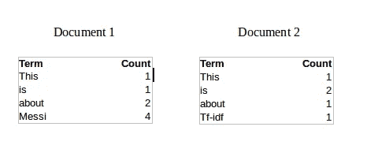

现在，让我们定义几个与 TF-IDF 相关的术语。

TF =(术语 t 在文档中出现的次数)/(文档中的术语数)

所以，TF(This，Document1) = 1/8

TF(This，文档 2)=1/5

它表示单词对文档的贡献，即与文档相关的单词应该是频繁出现的。一份关于梅西的文件应该包含大量的“梅西”一词。

IDF = log(N/n)，其中，N 是文档数，N 是术语 t 出现的文档数。

其中 N 是文档的数量，N 是术语 t 出现过的文档的数量。

所以，IDF(This) = log(2/2) = 0。

那么，我们如何解释 IDF 背后的推理呢？理想情况下，如果一个单词出现在所有文档中，那么这个单词可能与特定文档不相关。但是如果它出现在文档的子集中，那么该单词可能与其出现的文档有某种关联。

让我们计算一下‘梅西’这个词的 IDF。

IDF(梅西)= log(2/1) = 0.301。

现在，让我们比较 TF-IDF 中的一个常用词“This”和一个似乎与文献 1 相关的词“Messi”。

TF-IDF(This，Document1) = (1/8) * (0) = 0

TF-IDF(This，Document2) = (1/5) * (0) = 0

TF-IDF(梅西，Document1) = (4/8)*0.301 = 0.15

正如你在文献 1 中看到的，TF-IDF 方法对单词“This”进行了严重的惩罚，但对“Messi”赋予了更大的权重。因此，从整个语料库的上下文来看，这可以理解为“梅西”是 Document1 的一个重要单词。

## 2.1.3 具有固定上下文窗口的共生矩阵

**大意**—相似的单词往往会一起出现，并且会有相似的上下文，例如——苹果是一种水果。芒果是一种水果。
苹果和芒果往往有相似的语境，即水果。

在我深入研究如何构建共现矩阵的细节之前，有两个概念需要澄清——共现和上下文窗口。

共现-对于给定的语料库，一对词如 w1 和 w2 的共现是它们在上下文窗口中一起出现的次数。

上下文窗口–上下文窗口由一个数字和方向指定。那么 2(左右)的上下文窗口是什么意思呢？让我们看看下面的例子，


绿色单词是单词“Fox”的 2(周围)上下文窗口，并且为了计算共现，将只计算这些单词。让我们看看单词“Over”的上下文窗口。


现在，让我们以一个示例语料库来计算共现矩阵。

他不懒。他很聪明。他很聪明。

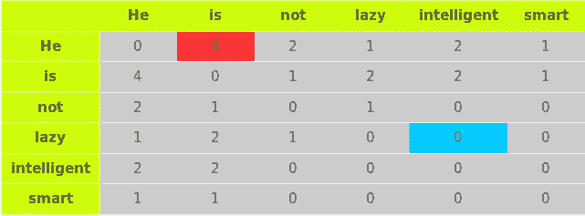

让我们通过上表中的两个例子来理解这个共现矩阵。红色和蓝色的盒子。

红框——它是“他”和“是”在上下文窗口 2 中出现的次数，可以看到计数结果是 4。下表将帮助您直观地了解计数。

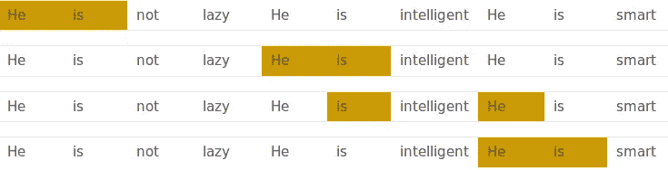

而单词“lazy”从未与“intelligent”一起出现在上下文窗口中，因此在蓝框中被赋值为 0。

**共生矩阵的变化**

假设语料库中有 V 个唯一词。所以词汇大小= V。共现矩阵的列形成了上下文单词*s。共现矩阵的不同变化是*

1.  一个大小为 V×V 的共现矩阵。现在，即使一个像样的语料库 V 也会变得非常大，难以处理。所以一般来说，这种架构在实践中从来都不是首选。
2.  一个大小为 V X N 的共生矩阵，其中 N 是 V 的子集，可以通过移除像停用词等不相关的词来获得。比如说。这仍然非常大，并且存在计算上的困难。

但是，记住这个共现矩阵不是通常使用的单词向量表示。相反，使用诸如 PCA、SVD 等技术来分解这个共生矩阵。这些因素的组合形成了单词向量表示。

让我更清楚地说明这一点。例如，您对上述大小为 VXV 的矩阵执行 PCA。你将获得 V 个主分量。你可以从这些 V 分量中选择 k 分量。所以，新矩阵的形式是 V X k。

并且，一个单词，不是在 V 维中表示，而是在 k 维中表示，同时仍然捕捉几乎相同的语义。k 通常是几百的数量级。

因此，PCA 在后面做的是将共生矩阵分解成三个矩阵，U，S 和 V，其中 U 和 V 都是正交矩阵。重要的是，U 和 S 的点积给出了单词向量表示，而 V 给出了单词上下文表示。


**共生矩阵的优势**

1.  它保留了单词之间的语义关系。也就是说，男人和女人比男人和苹果更亲近。
2.  它在其核心使用 SVD，这产生了比现有方法更精确的单词向量表示。
3.  它使用因式分解，因式分解是一个定义明确的问题，可以有效地解决。
4.  它只需计算一次，一旦计算出来就可以随时使用。从这个意义上说，它比其他的要快。

**共生矩阵的缺点**

1.  它需要巨大的内存来存储共生矩阵。
    但是，这个问题可以通过在系统外分解矩阵来规避，例如在 Hadoop 集群等中。并且可以被保存。

# 2.2 基于向量的预测

**先决条件**:这一部分假设你对神经网络的工作原理和更新神经网络权重的机制有一定的了解。如果你是神经网络的新手，我建议你浏览一下 Sunil 的这篇很棒的文章，以便很好地理解神经网络是如何工作的。

到目前为止，我们已经看到了确定单词向量的确定性方法。但是这些方法被证明是有限的，直到米托洛夫等。el 向 NLP 社区介绍了 word2vec。这些方法是基于预测的，从某种意义上说，它们提供了单词的概率，并被证明是像单词类比和单词相似性这样的任务的最先进水平。他们还能够完成像国王-男人+女人=王后这样的任务，这被认为是一个几乎不可思议的结果。因此，让我们看看目前用于生成单词向量的 word2vec 模型。

Word2vec 不是一个单一的算法，而是两种技术的结合——CBOW(连续单词包)和 Skip-gram 模型。这两种都是浅层神经网络，将单词映射到也是单词的目标变量。这两种技术都学习作为单词向量表示的权重。让我们分别讨论这两种方法，并获得它们工作的直觉。

# 2.2.1 连续单词包

CBOW 的工作方式是，它倾向于预测给定上下文中单词出现的概率。上下文可以是单个单词或一组单词。但是为了简单起见，我将采用单个上下文单词并尝试预测单个目标单词。

假设，我们有一个语料库 C =“嘿，这是只使用一个上下文单词的样本语料库。”并且我们已经定义了 1 的上下文窗口。该语料库可以如下转换成 CBOW 模型的训练集。输入如下所示。下图中右侧的矩阵包含左侧输入的一个热码编码形式。

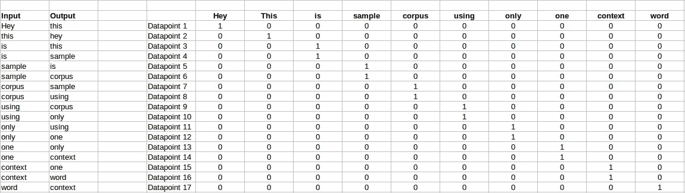

单一数据点(比如数据点 4)的目标如下所示

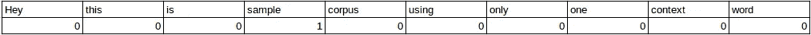

上图所示的这个矩阵被发送到一个具有三层的浅层神经网络中:输入层、隐藏层和输出层。输出层是 softmax 层，用于将输出层中获得的概率总和为 1。现在让我们看看正向传播如何计算隐藏层激活。

让我们首先来看看 CBOW 模型的图示。

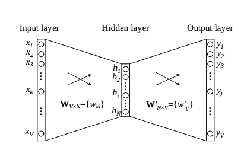

上图中单一数据点的矩阵表示如下。


流程如下:

1.  输入层和目标层都是大小为[1 X V]的一键编码。在上面的例子中，V=10。
2.  有两组砝码。一个是在输入层和隐藏层之间，第二个是在隐藏层和输出层之间。
    输入-隐藏层矩阵大小=[V X N]，隐藏-输出层矩阵大小=[N X V]:其中 N 是我们选择用来表示我们的单词的维数。它是神经网络的任意参数和超参数。另外，N 是隐藏层中神经元的数量。这里，N=4。
3.  任何层之间都没有激活功能。(更具体地说，我指的是线性激活)
4.  输入乘以输入隐藏权重，称为隐藏激活。它只是被复制的输入隐藏矩阵中的相应行。
5.  隐藏输入乘以隐藏输出权重，然后计算输出。
6.  计算输出和目标之间的误差，并传播回去以重新调整权重。
7.  隐藏层和输出层之间的权重作为单词的单词向量表示。

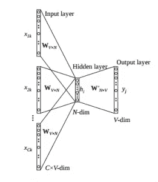

我们看到了单个上下文单词的上述步骤。现在，如果我们有多个上下文单词呢？下图描述了多个上下文单词的架构。

下面是上述架构的矩阵表示，以便于理解。

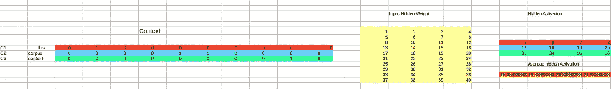

上图采用了 3 个上下文单词，并预测了目标单词的概率。可以假设输入采用输入层中的三个独热编码矢量，如上面的红色、蓝色和绿色所示。

因此，如上所示，输入层在输入中将有 3 个[1 X V]矢量，在输出层中有 1 个[1 X V]。架构的其余部分与单上下文 CBOW 相同。

步骤保持不变，只是隐藏激活的计算发生了变化。不是仅仅将输入隐藏权重矩阵的相应行复制到隐藏层，而是对矩阵的所有相应行取平均值。我们可以通过上图来理解这一点。计算出的平均向量成为隐藏激活。因此，如果我们对于单个目标单词有三个上下文单词，我们将有三个初始隐藏激活，然后对它们进行元素平均以获得最终激活。

在单个上下文单词和多个上下文单词中，我都显示了图像，直到计算隐藏激活，因为这是 CBOW 不同于简单 MLP 网络的部分。隐层计算后的步骤与本文提到的 MLP 相同——[从零开始理解和编码神经网络](https://www.analyticsvidhya.com/blog/2017/05/neural-network-from-scratch-in-python-and-r/)。

MLP 和 CBOW 之间的差异如下:

1.  在 MLP 中的目标函数是 MSE(均方误差)，而在 CBOW 中，它是给定一组上下文的单词的负对数似然性，即 log(p(wo/wi))，其中 p(wo/wi)被给出为

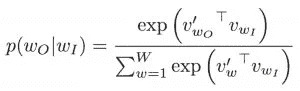

wo:输出单词
wi:上下文单词

2.关于隐藏输出权重和输入隐藏权重的误差梯度是不同的，因为 MLP 具有 sigmoid 激活(通常)而 CBOW 具有线性激活。然而，计算梯度的方法与 MLP 相同。

**CBOW 的优势:**

1.  概率性是自然的，它被认为比确定性方法表现更好(一般来说)。
2.  内存不足。它不需要像共生矩阵那样具有巨大的 RAM 需求，在共生矩阵中它需要存储三个巨大的矩阵。

**CBOW 的缺点:**

1.  CBOW 取一个词的上下文的平均值(如上文计算隐藏激活中所见)。例如，苹果既可以是水果，也可以是公司，但 CBOW 取两者的平均值，将其放在水果和公司之间。
2.  如果没有适当的优化，从头开始训练 CBOW 可能要花很长时间。

# 跳过 Gram 模型

skip–gram 遵循与 CBOW 相同的拓扑结构。它完全颠覆了 CBOW 的架构。跳格的目的是预测给定单词的上下文。让我们以构建 CBOW 模型所基于的相同语料库为例。C= "嘿，这是只使用一个上下文单词的样本语料库。"让我们构建训练数据。

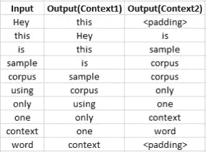

skip-gram 的输入向量将类似于 1-context CBOW 模型。此外，直到隐藏层激活的计算将是相同的。不同之处在于目标变量。由于我们在两侧都定义了 1 的上下文窗口，因此将会有“**两个”一个热编码目标变量**和“**两个”相应的输出**，如图中蓝色部分所示。

相对于两个目标变量计算两个单独的误差，并且将获得的两个误差向量逐元素相加以获得最终误差向量，该最终误差向量被传播回去以更新权重。

输入层和隐含层之间的权重作为训练后的单词向量表示。损失函数或目标与 CBOW 模型的类型相同。

跳跃图结构如下所示。

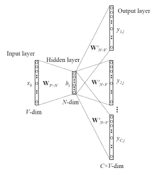

为了更好的理解，下面显示了矩阵风格的结构和计算。

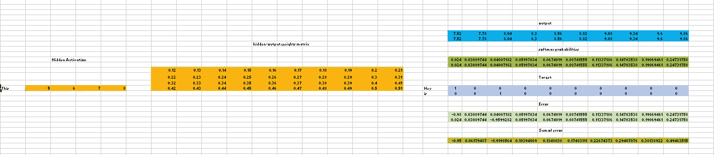

让我们来分解一下上面的图像。

输入层大小—[1 X V]，输入隐藏权重矩阵大小—[V X N]，隐藏层中的神经元数量—N，隐藏输出权重矩阵大小—[N X V]，输出层大小—C[1 X V]

在上面的例子中，C 是上下文单词的数量=2，V= 10，N=4

1.  红色行是对应于输入独热码编码向量的隐藏激活。基本上就是复制了输入隐藏矩阵的对应行。
2.  黄色矩阵是隐藏层和输出层之间的权重。
3.  蓝色矩阵通过隐藏激活和隐藏输出权重的矩阵乘法来获得。将为两个目标(上下文)单词计算两行。
4.  蓝色矩阵的每一行都被单独转换为其 softmax 概率，如绿色框中所示。
5.  灰色矩阵包含两个上下文单词(目标)的一个热编码向量。
6.  通过从绿色矩阵(输出)的第一行中按元素减去灰色矩阵(目标)的第一行来计算误差。对下一行重复这一过程。因此，对于 **n 个**目标上下文单词，我们将有 **n 个**错误向量。
7.  对所有误差向量进行逐元素求和，以获得最终误差向量。
8.  该误差向量被传播回来以更新权重。

# 跳格模型的优点

1.  跳格模型可以捕捉一个单词的两种语义。也就是说，它将有两个苹果的矢量表示。一个给公司，一个给水果。
2.  负子采样 Skip-gram 通常优于所有其他方法。

这个是一个很好的交互工具，可以可视化 CBOW 和 skip gram。我建议你仔细阅读这个链接，以便更好地理解。

# 3.单词嵌入用例场景

由于单词嵌入或单词向量是单词之间上下文相似性的数字表示，它们可以被操纵并执行令人惊奇的任务，如-

1.  寻找两个词之间的相似程度。

```
 model.similarity('woman','man')
 0.73723527
```

2.找出奇怪的一个。

```
model.doesnt_match('breakfast cereal dinner lunch';.split())
 'cereal'
```

3.像女人+国王-男人=王后这样令人惊奇的事情

```
 model.most_similar(positive=['woman','king'],negative=['man'],topn=1)
 queen: 0.508
```

4.模型下文本的概率

```
 model.score(['The fox jumped over the lazy dog'.split()])
 0.21
```

下面是 word2vec 的一个有趣的可视化。

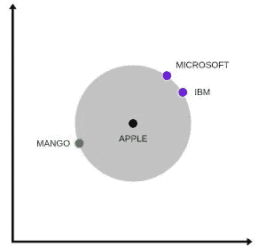

上图是二维单词向量的 t-SNE 表示，你可以看到苹果的两个上下文被捕捉到了。一个是水果，一个是公司。

5.它可以用来执行机器翻译。

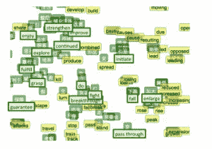

上图是双语嵌入，中文用绿色，英文用黄色。如果我们知道在中文和英文中有相似意思的词，上述双语嵌入可以用于将一种语言翻译成另一种语言。

# 4.使用预先训练的单词向量

我们将使用谷歌的预训练模型。它包含 300 万个单词的词汇向量，这些词汇是根据谷歌新闻数据集中的大约 1000 亿个单词训练的。模型的下载链接是[这个](https://drive.google.com/file/d/0B7XkCwpI5KDYNlNUTTlSS21pQmM/edit)。小心这是一个 1.5 GB 的下载。

```
from gensim.models import Word2Vec#loading the downloaded model
 model = Word2Vec.load_word2vec_format('GoogleNews-vectors-negative300.bin', binary=True, norm_only=True)#the model is loaded. It can be used to perform all of the tasks mentioned above.# getting word vectors of a word
 dog = model['dog']#performing king queen magic
 print(model.most_similar(positive=['woman', 'king'], negative=['man']))#picking odd one out
 print(model.doesnt_match("breakfast cereal dinner lunch".split()))#printing similarity index
 print(model.similarity('woman', 'man')
```

# 5.训练你自己的单词向量

我们将在自定义语料库上训练我们自己的 word2vec。为了训练模型，我们将使用 gensim，步骤如下所示。

word2Vec 要求用于训练列表的列表格式，其中每个文档都包含在列表中，且每个列表都包含文档的标记列表。我不会在这里讨论预处理部分。所以让我们用一个 list 的例子来训练我们的 word2vec 模型。

句子=[' Neeraj '，' Boy']，['Sarwan '，' is']，['good '，' boy']]

```
#training word2vec on 3 sentences
 model = gensim.models.Word2Vec(sentence, min_count=1,size=300,workers=4)
```

让我们试着理解这个模型的参数。

句子—我们的语料库列表的列表
min _ count = 1—单词的阈值。只有频率高于此值的单词才会被包含到模型中。
size = 300——我们希望用来表达我们的话语的维度数量。这是单词向量的大小。
workers=4 —用于并行化

```
#using the model
 #The new trained model can be used similar to the pre-trained ones.#printing similarity index
 print(model.similarity('woman', 'man'))
```

# 6.结束注释

单词嵌入是一个活跃的研究领域，试图找出比现有的更好的单词表示。但是，随着时间的推移，它们的数量越来越多，也越来越复杂。本文旨在简化这些嵌入模型的一些工作，而不会带来数学开销。如果你认为我能够消除你的一些困惑，请在下面评论。欢迎任何改变或建议。

*原载于 2017 年 6 月 4 日*[*【www.analyticsvidhya.com】*](https://www.analyticsvidhya.com/blog/2017/06/word-embeddings-count-word2veec/)*。*