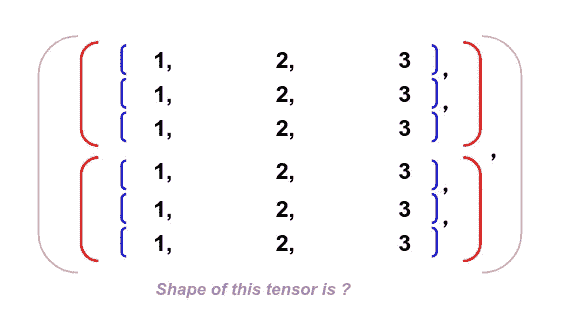
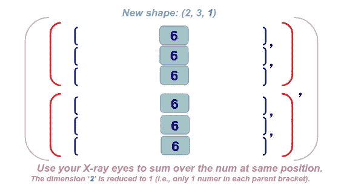

# 用 Pytorch 直观理解张量维数——以 torch.sum()为例

> 原文：<https://medium.com/analytics-vidhya/an-intuitive-understanding-on-tensor-sum-dimension-with-pytorch-d9b0b6ebbae?source=collection_archive---------13----------------------->

你是否曾经对张量维度如何工作感到困惑，尤其是当你需要在高维度上应用类似`sum()`的运算时？你在这篇文章中学到的技巧不仅适用于**张量**维，也适用于 **Numpy ndarray** 维，因为多维数组/张量的逻辑是一样的。

这篇文章将一劳永逸地解决你头脑中的困惑。它将为您提供:

*   一种直观的方式来形象化操作`sum()`如何在张量维度上工作。
*   使用 Pytorch 检查代码中张量和的例子。

# 张量的形状(维度)

首先，**张量**只是**多维数组**的别称。当数学家定义了术语:标量(0D)、向量(1D)、矩阵(2D)之后，我们需要一个更高阶的通用术语和概念

这里有一个张量，我们可以通过统计**每一级**的括号数来找到张量的**形状**。(请注意，最外面的括号将被忽略，因为它只是用来包装整个对象。)

因此，我们在最外层有 2 个元素(dim: 0)，在第二层有 3 个元素(dim: 1)，在最内层有 3 个元素(dim: 2)。因此，张量的形状是(2，3，3)。

# 维度 0 上的总和

接下来，我们将对维度 0 求和，我们只需遵循 3 个简单的步骤:

*   标识维度中的元素。
*   重叠这些元素。
*   用 x 光眼把出现在同一个位置的数字加起来。

就是这样！如下所示的分步插图:

**注:**当你对一个张量中的一个维度 ***i*** 求和时，它会**将那个维度 ***i*** 减少到 ***1*** ，因为你对那个维度中的每个数求和，并将多个数减少为一个和。你会看到这发生在每一个维度。**

现在，我们已经知道这在维度 0 上是如何工作的，让我们在维度 1 上挑战同样的步骤。

# 维度 1 上的和

**注意**:在我们对维度 1 求和之后，维度 1 上发生了同样的维度缩减，求和后的新形状已经缩减为(2，1，3)。

我们只需要把同样的步骤进行到最后一个维度。

# 维度 2 上的和

**注意**:在我们对维度 2 求和之后，同样的维度缩减发生在维度 2 上，并且求和之后的新形状已经缩减到(2，3，1)。

现在我们有了张量`sum()`运算如何工作的想法，让我们用代码来实现它。

# 使用 Pytorch 执行张量求和()

下面的 Jupyter 笔记本展示了我们如何执行张量`sum()`并检查我们对其维度的理解。

**注意:**在函数中，您需要指定`keepdim=True`来保留它的原始维度，正如我们在第一个直观部分中展示的。否则，减少到 1 的维度将被简单地删除。

这是我在努力理解处理高张量维度的运算符(如 *sigmoid* 、 *max* 、 *sum* 等)期间自学的最直观的可视化方法。)，我希望这篇文章能增强你的张量直觉，让你在工作中快速识别张量维度！如果你觉得这个帖子有用，请给这个帖子留个“掌声”。你的鼓励是我前进的动力！感谢您的阅读！