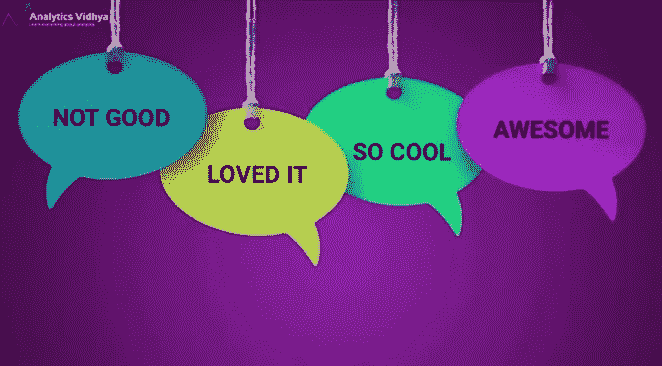
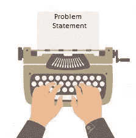
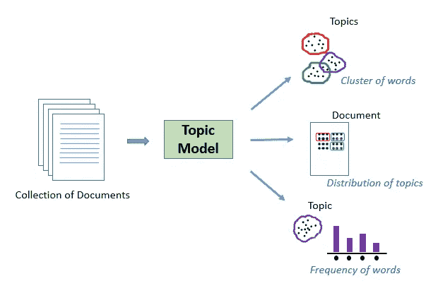
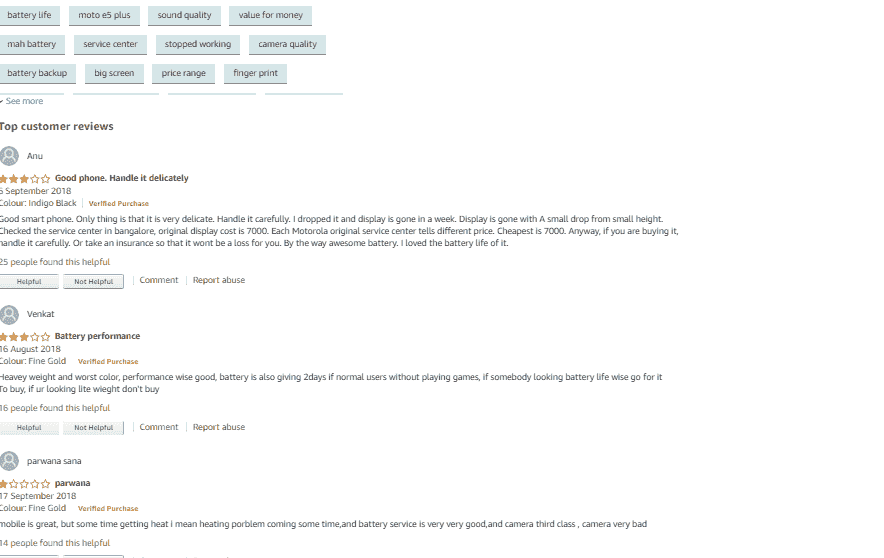
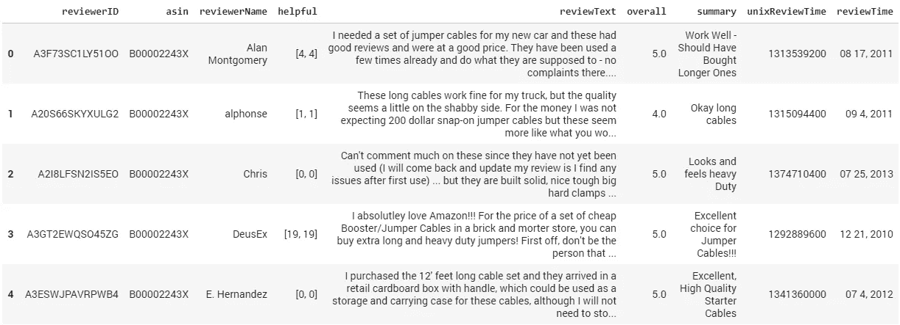
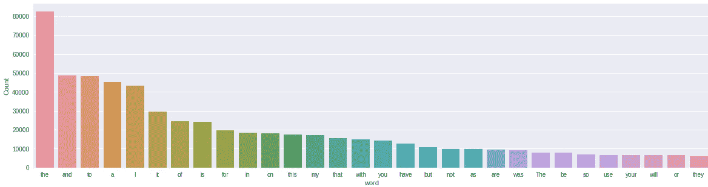
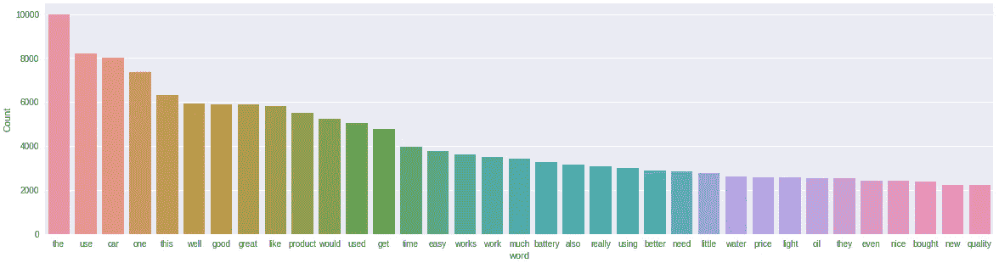
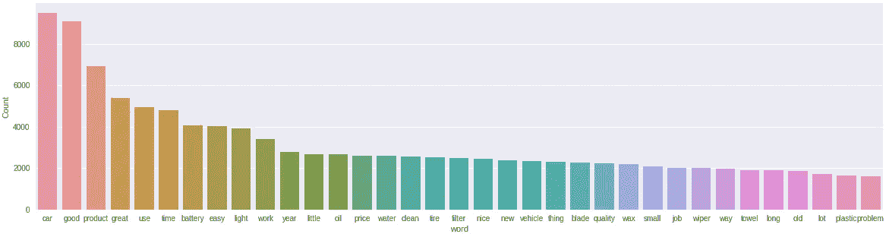
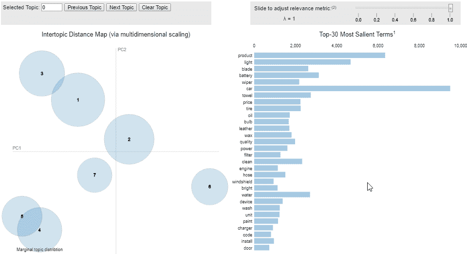

# 使用主题建模挖掘在线评论的 NLP 方法(使用 Python 代码)

> 原文：<https://medium.com/analytics-vidhya/an-nlp-approach-to-mining-online-reviews-using-topic-modeling-with-python-codes-9d766e783003?source=collection_archive---------1----------------------->



电子商务彻底改变了我们购物的方式。你存了几个月的钱想买的那个手机？只需搜索和点击几下鼠标。项目在几天内交付(有时甚至第二天！).

对于在线零售商来说，没有与库存管理或空间管理相关的限制，他们可以销售任意多的不同产品。由于空间有限，实体店只能保存有限数量的产品。

我记得我曾经在当地的书店订购书籍，通常需要一个多星期才能到货。现在看来像是古代的故事！


来源:http://www.yeebaplay.com.br

但是网上购物也有自己的注意事项。最大的挑战之一是验证产品的真实性。有电商网站上宣传的那么好吗？产品会持续一年以上吗？其他客户给的评价是真的还是虚假广告？这些是顾客在花钱前需要问的重要问题。

这是一个试验和应用自然语言处理(NLP)技术的好地方。本文将帮助你理解在主题建模的帮助下利用在线产品评论的重要性。

*如果你需要快速复习主题建模，请浏览下面的文章:*

*   [介绍使用 LSA 进行主题建模](https://www.analyticsvidhya.com/blog/2018/10/stepwise-guide-topic-modeling-latent-semantic-analysis/)
*   [Python 主题建模初学者指南](https://www.analyticsvidhya.com/blog/2016/08/beginners-guide-to-topic-modeling-in-python/)

# 目录

1.  在线评论的重要性
2.  问题陈述
3.  为什么要为此任务进行主题建模？
4.  Python 实现
5.  利用在线评论的其他方法
6.  下一步是什么？

# 在线评论的重要性

几天前，我经历了电子商务的暴跌，在网上购买了一部智能手机。这完全在我的预算之内，而且它的评分是 4.5 分(满分为 5 分)。


不幸的是，这被证明是一个糟糕的决定，因为备用电池远远低于标准。我没有仔细阅读该产品的评论，仅仅根据它的评级就匆忙决定购买它。我知道我不是唯一一个犯这个错误的人！

评级本身并不能给出我们想要购买的产品的完整描述，我发现这让我很受伤。因此，作为一种预防措施，我总是建议人们在决定是否购买之前阅读产品的评论。

但是一个有趣的问题出现了。如果评论的数量是几百或几千呢？查看所有这些评论是不可行的，对吗？这就是自然语言处理的优势所在。

# 设置问题陈述

问题陈述是你的分析开花的种子。所以，有一个扎实、清晰、定义明确的问题陈述真的很重要。



我们如何使用自然语言处理(NLP)来分析大量的在线评论？我们来定义一下这个问题。

在线产品评论对消费者来说是一个很好的信息来源。从卖家的角度来看，在线评论可以用来衡量消费者对他们出售的产品或服务的反馈。然而，由于这些在线评论在数量和信息方面往往是压倒性的，所以能够从这些评论中找到关键见解(主题)的智能系统将对消费者和卖家都有很大的帮助。该系统有两个用途:

1.  使消费者能够快速提取评论所涵盖的关键主题，而不必浏览所有评论
2.  帮助卖家/零售商获得主题形式的消费者反馈(从消费者评论中提取)

为了解决这一任务，我们将在亚马逊汽车评论数据上使用主题建模(LDA)的概念。可以从这个 [**链接**](http://snap.stanford.edu/data/amazon/productGraph/categoryFiles/reviews_Automotive_5.json.gz) **下载。**其他类别产品的类似数据集可在[这里](http://jmcauley.ucsd.edu/data/amazon/)找到。

# 为什么要在这个任务中使用主题建模？

顾名思义，主题建模是一个自动识别文本对象中存在的主题并导出文本语料库中隐藏模式的过程。主题模型有多种用途，包括:

*   文档聚类
*   组织大块文本数据
*   非结构化文本的信息检索
*   特征选择

一个好的主题模型，当训练一些关于股票市场的文本时，应该产生诸如“出价”、“交易”、“股息”、“交换”等主题。下图说明了典型主题模型的工作原理:



在我们的例子中，我们没有文本文档，而是有数以千计的在线产品评论，这些评论都列在“汽车”类别下。我们的目标是从评论中提取一定数量的重要单词组。这些组词基本上是有助于确定消费者在评论中实际谈论的话题。



# Python 实现

在这一节中，我们将启动我们的 Jupyter 笔记本(或任何其他用于 Python 的 IDE！).在这里，我们将使用潜在狄利克雷分配(LDA)的概念从我们的在线评论数据集中提取有用的主题。

*注:正如我在简介中提到的，我强烈推荐通过* [*这篇文章*](https://www.analyticsvidhya.com/blog/2016/08/beginners-guide-to-topic-modeling-in-python/) *来了解 LDA 是什么以及它是如何工作的。*

让我们首先加载所有必需的库:

```
import nltk from nltk 
import FreqDist 
nltk.download('stopwords') # run this one timeimport pandas as pd 
pd.set_option("display.max_colwidth", 200) 
import numpy as np 
import re 
import spacy 
import gensim 
from gensim import corpora # libraries for visualization 
import pyLDAvis 
import pyLDAvis.gensim 
import matplotlib.pyplot as plt 
import seaborn as sns 
%matplotlib inline
```

要导入数据，首先将数据提取到您的工作目录，然后使用 pandas 的 *read_json( )* 函数将其读入 pandas dataframe。

```
df = pd.read_json('Automotive_5.json', lines=True) 
df.head()
```



如您所见，数据包含以下各列:

*   **审核人 ID** —审核人的 ID
*   **asin** —产品的 ID
*   **审核人姓名** —审核人姓名
*   **有用的** —评论的有用性评级，例如 2/3
*   **审查文本** —审查的文本
*   **总体** —产品评级
*   **总结** —评审总结
*   **unix 审查时间** —审查时间(UNIX 时间)
*   **审查时间** —审查的时间(原始)

对于我们的分析和本文的范围，我们将只使用评论栏，即**评论文本**。

# 数据预处理

数据预处理和清洗是任何文本挖掘任务之前的重要步骤，在这一步中，我们将尽可能地删除标点符号、停用词和规范化评论。在每一个预处理步骤之后，检查数据中最常用的单词是一个很好的做法。因此，让我们定义一个函数来绘制数据中“n”个最常用单词的条形图。

```
# function to plot most frequent terms 
def freq_words(x, terms = 30): 
  all_words = ' '.join([text for text in x]) 
  all_words = all_words.split() 

  fdist = FreqDist(all_words) 
  words_df = pd.DataFrame({'word':list(fdist.keys()),   
             'count':list(fdist.values())})   # selecting top 20 most frequent words 
  d = words_df.nlargest(columns="count", n = terms)      
  plt.figure(figsize=(20,5)) 
  ax = sns.barplot(data=d, x= "word", y = "count") 
  ax.set(ylabel = 'Count') 
  plt.show()
```

让我们试试这个函数，看看哪些词在我们的评论数据集中最常见。

```
freq_words(df['reviewText'])
```



最常见的词是“the”、“and”、“to”等等。这些话对我们的任务来说并不重要，也不说明任何问题。我们必须去掉这类词。在此之前，让我们删除文本数据中的标点符号和数字。

```
# remove unwanted characters, numbers and symbols 
df['reviewText'] = df['reviewText'].str.replace("[^a-zA-Z#]", " ")
```

让我们尝试从评论中删除停用词和短词(< 2 个字母)。

```
from nltk.corpus import stopwords 
stop_words = stopwords.words('english')# function to remove stopwords 
def remove_stopwords(rev):     
  rev_new = " ".join([i for i in rev if i not in stop_words])      
  return rev_new # remove short words (length < 3) 
df['reviewText'] = df['reviewText'].apply(lambda x: ' '.join([w for 
                   w in x.split() if len(w)>2])) # remove stopwords from the text 
reviews = [remove_stopwords(r.split()) for r in df['reviewText']] # make entire text lowercase 
reviews = [r.lower() for r in reviews]
```

让我们再次画出最常用的单词，看看更重要的单词是否出现。

```
freq_words(reviews, 35)
```



我们可以看到一些改进。诸如“电池”、“价格”、“产品”、“石油”等术语的出现与汽车类别非常相关。然而，我们仍然有中性词，如“the”、“this”、“much”、“thes”等，这些词并不相关。

为了进一步消除文本中的噪声，我们可以使用 spaCy 库中的词汇化。它将任何给定的单词简化为其基本形式，从而将一个单词的多种形式简化为一个单词。

```
!python -m spacy download en #one time runnlp = spacy.load('en', disable=['parser', 'ner']) def lemmatization(texts, tags=['NOUN', 'ADJ']): 
       output = []        
       for sent in texts:              
             doc = nlp(" ".join(sent))                             
             output.append([token.lemma_ for token in doc if 
             token.pos_ in tags])        
       return output
```

让我们将评论符号化，然后将其词条化。

```
tokenized_reviews = pd.Series(reviews).apply(lambda x: x.split())
print(tokenized_reviews[1])
```

输出:

['这些'，'长'，'电缆'，'工作'，'罚款'，'卡车'，'质量'，'看起来'，'小'，'寒酸'，[T0 '，'一面'，'为'，'钱'，'期待'，'美元'，'快扣'，'跳线'，'电缆'，'看起来'，'喜欢'，[T1 '，'会'，'看到'，'中文'，'敲'，'商店'，'喜欢'，'港口'，'运费'，'美元']

```
reviews_2 = lemmatization(tokenized_reviews)
print(reviews_2[1]) # print lemmatized review
```

**输出:**

['长'，'电缆'，'罚款'，'卡车'，'质量'，'小'，'破旧'，'钱'，'美元'，【T4 '，'跳线'，'电缆'，'中文'，'商店'，'海港'，'运费'，'巴克']

如您所见，我们不仅对单词进行了词汇化，还过滤了名词和形容词。让我们去符号化的评论，并绘制最常见的单词。

```
reviews_3 = []
for i in range(len(reviews_2)):
  reviews_3.append(' '.join(reviews_2[i]))

df['reviews'] = reviews_3

freq_words(df['reviews'], 35)
```



似乎现在我们的数据中最常见的术语是相关的。我们现在可以开始构建我们的主题模型了。

# 构建 LDA 模型

我们将从创建语料库的术语词典开始，每个独特的术语都被分配一个索引

```
dictionary = corpora.Dictionary(reviews_2)
```

然后，我们将使用上面准备的字典将评论列表(reviews_2)转换为文档术语矩阵。

```
doc_term_matrix = [dictionary.doc2bow(rev) for rev in reviews_2]# Creating the object for LDA model using gensim library 
LDA = gensim.models.ldamodel.LdaModel # Build LDA model 
lda_model = LDA(corpus=doc_term_matrix, id2word=dictionary,                                     
                num_topics=7, random_state=100, chunksize=1000,                                     
                passes=50)
```

上面的代码需要一段时间。请注意，我已经使用 *num_topics* 参数将该模型的主题数量指定为 7。您可以使用同一个参数指定任意数量的主题。

让我们打印出我们的 LDA 模型已经学习的主题。

```
lda_model.print_topics()
```

**输出:**

```
[(0, '0.030*"car" + 0.026*"oil" + 0.020*"filter" + 0.018*"engine" + 0.016*"device" + 0.013*"code" + 0.012*"vehicle" + 0.011*"app" + 0.011*"change" + 0.008*"bosch"'), 
(1, '0.017*"easy" + 0.014*"install" + 0.014*"door" + 0.013*"tape" + 0.013*"jeep" + 0.011*"front" + 0.011*"mat" + 0.010*"side" + 0.010*"headlight" + 0.008*"fit"'), 
(2, '0.054*"blade" + 0.045*"wiper" + 0.019*"windshield" + 0.014*"rain" + 0.012*"snow" + 0.012*"good" + 0.011*"year" + 0.011*"old" + 0.011*"car" + 0.009*"time"'), 
(3, '0.044*"car" + 0.024*"towel" + 0.020*"product" + 0.018*"clean" + 0.017*"good" + 0.016*"wax" + 0.014*"water" + 0.013*"use" + 0.011*"time" + 0.011*"wash"'), 
(4, '0.051*"light" + 0.039*"battery" + 0.021*"bulb" + 0.019*"power" + 0.018*"car" + 0.014*"bright" + 0.013*"unit" + 0.011*"charger" + 0.010*"phone" + 0.010*"charge"'), 
(5, '0.022*"tire" + 0.015*"hose" + 0.013*"use" + 0.012*"good" + 0.010*"easy" + 0.010*"pressure" + 0.009*"small" + 0.009*"trailer" + 0.008*"nice" + 0.008*"water"'), 
(6, '0.048*"product" + 0.038*"good" + 0.027*"price" + 0.020*"great" + 0.020*"leather" + 0.019*"quality" + 0.010*"work" + 0.010*"review" + 0.009*"amazon" + 0.009*"worth"')]
```

第四个主题**主题 3** 包含“毛巾”、“清洁”、“蜡”、“水”等术语，表明该主题与洗车密切相关。同样，**主题 6** 似乎是关于产品的整体价值，因为它有“价格”、“质量”和“价值”等术语。

# 主题可视化

为了在二维空间中可视化我们的主题，我们将使用 **pyLDAvis 库**。这种可视化本质上是交互式的，并且显示主题以及最相关的单词。

```
# Visualize the topics 
pyLDAvis.enable_notebook() 
vis = pyLDAvis.gensim.prepare(lda_model, doc_term_matrix,  
                              dictionary) vis
```



# 利用在线评论的其他方法

除了主题建模之外，还有许多其他的 NLP 方法用于分析和理解在线评论。其中一些列举如下:

1.  **文本摘要:**将评论总结成一个段落或几个要点。
2.  **实体识别:**从评论中提取实体，并识别哪些产品在消费者中最受欢迎(或不受欢迎)。
3.  **识别新兴趋势:**基于评论的时间戳，可以识别新的和新兴的主题或实体。这将使我们能够弄清楚哪些产品正在变得流行，哪些产品正在失去对市场的控制。
4.  **情感分析:**对于零售商来说，了解评论的情感有助于改善他们的产品和服务。

# 下一步是什么？

Information retrieval saves us from the labor of going through product reviews one by one. It gives us a fair idea of what other consumers are talking about the product.

However, it does not tell us whether the reviews are positive, neutral, or negative. This becomes an extension of the problem of information retrieval where we don’t just have to extract the topics, but also determine the sentiment. This is an interesting task which we will cover in the next article.

# End Notes

Topic modeling is one of the most popular NLP techniques with several real-world applications such as dimensionality reduction, text summarization, recommendation engine, etc.. The purpose of this article was to demonstrate the application of LDA on a raw, crowd-generated text data. I encourage you to implement the code on other datasets and share your findings.

If you have any suggestion, doubt, or anything else that you wish to share regarding topic modeling, then please feel free to use the comments section below.

Full code is available [here](https://github.com/prateekjoshi565/topic_modeling_online_reviews/blob/master/Mining_Online_Reviews_using_Topic_Modeling_(LDA).ipynb).

*Originally published at* [*www.analyticsvidhya.com*](https://www.analyticsvidhya.com/blog/2018/10/mining-online-reviews-topic-modeling-lda/) *on October 16, 2018.*