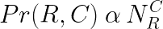
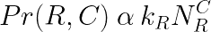
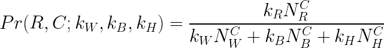
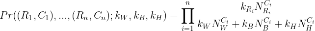
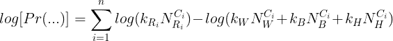
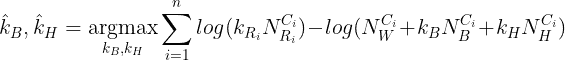
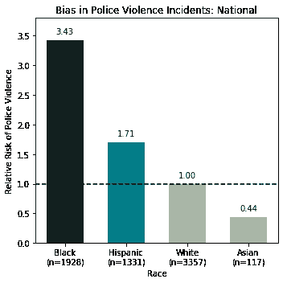
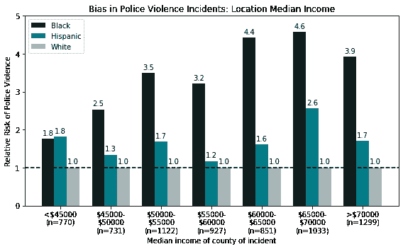
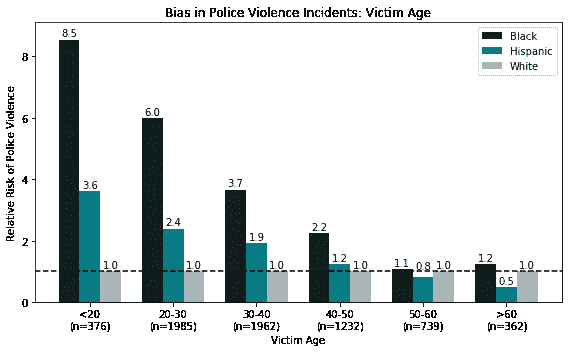
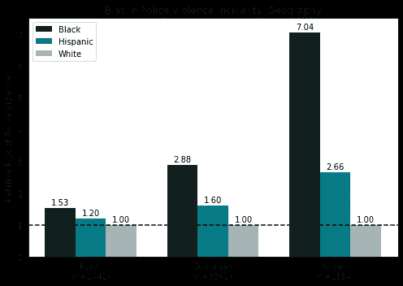

# 对警察暴力的公开分析

> 原文：<https://medium.com/analytics-vidhya/an-open-analysis-of-police-violence-12b73791ae53?source=collection_archive---------15----------------------->

## 从个人账户到国家统计

在持续不断的抗议和要求采取行动打击系统性种族不公正的呼声中，我感到，关于不成比例的警察暴力和其他种族偏见症状的统计数据的混乱和争议经常继续阻止人们承认，更不用说解决这个问题了。虽然许多比我更有经验的分析师已经发表了关于警察暴力的统计数据，但要理解从原始数据到仔细解释统计结果的整个过程往往是一个挑战。我试图在这里从头到尾详细描述我对警察暴力的分析(完整的细节，所有使用的代码都可以在[这里](https://github.com/jhyun95/mpv_analysis)找到)，我希望结果可以帮助理解当前形势的严重性。

作为免责声明，我的培训是生物信息学，而不是社会学，所以可能有我没有包括的调整和纠正，这将是该领域正式学术工作所必需的。然而，我已经尽力用我对统计学的理解和我能找到的数据来解决这个问题。虽然我在这里计算的确切数字可能并不完美，但我相信它们反映了警察暴力方面种族偏见的一些总体趋势和严重性。

# 数据集

我以前听说过，许多关于警察暴力的原始数据往往是不完整的、不可访问的和/或无组织的，在谷歌上搜索几个小时后，情况似乎就是这样。然而，一个特别的来源，[绘制警察暴力](https://mappingpoliceviolence.org/) (MPV)做了出色的工作，精心记录了自 2013 年以来所有众所周知的警察杀人事件，以及原始来源和大量元数据，如受害者年龄/种族和位置。MPV 已经在国家和州一级做了大量的数据分析和展示。然而，由于他们提供了大量的额外细节，考虑到与个别事件相关的人口统计和经济背景，似乎有可能在更精细的水平上分析这些数据。为了解决这个问题，我下载了最新的[人口普查种族人口估计](https://www.census.gov/data/tables/time-series/demo/popest/2010s-counties-detail.html)和[美国农业部单个县的收入中位数估计](https://www.ers.usda.gov/data-products/county-level-data-sets/download-data/)(2018 年估计)。前者的数据可以让种族偏见的估计值根据当地的人口背景进行校准，而后者可以作为了解这些地方有多富裕或贫穷的代理。

# 界定警察暴力中的偏见

有了手头的数据，我对量化警察偏见很感兴趣，这种偏见可能被非正式地定义为“相对于白人，考虑到按种族划分的当地人口分布，警察杀害的受害者属于特定种族的概率增加。”不幸的是，这是我在不涉及数学的情况下能想到的最好的定义。

更详细地说，我们可以这样开始:在一个无偏见的世界中，如果我们观察到 C 县的警察暴力事件，受害者是 R 种族的概率，或 Pr(R，C)，应该与 C 县 R 种族的人数成正比(表示为“α”):

事实上，有种族特定的偏差项 k_R 扭曲了这些概率:

由于这是一个比例，我可以修正其中一个偏差项，并计算其他种族的相对偏差。通过设置 k_White = 1，在考虑人口背景后，其他偏见项成为相对于白人的警察暴力风险的种族特定变化(类似于我早先对纯英语定义的尝试)。例如，如果 k_Black = 2，那么警察暴力的受害者是黑人的概率仍然是白人的两倍，即使考虑了人口背景。

为了从一组警察暴力事件中估计这些偏差/风险项，我可以计算这些项的什么值最大化观察到的事件的可能性，也称为最大可能性估计量。如果我们只看白人(W)、黑人(B)和西班牙裔(H)的情况(构成 MPV 数据的大约 95%)，上面的等式变成:

对于一系列独立的事件(R1、C1)、(R2、C2)、……(Rn、Cn)，观察到所有这些事件的概率是以下各项的乘积:

在实际优化方面，更容易解决最大化该概率的对数或“对数似然”的等价问题，以估计偏差项。

出于归一化目的，再次设置 k_W = 1，这最终归结为:

(Ci，Ri)项可以从 MPV 数据中填充，而“N”项可以从普查数据中填充，只留下偏差“k”项未知。这个等式现在可以很容易地通过大多数计算软件包(如 SciPy)进行优化，并允许我们估计任何一组事件中与警察暴力相关的相对种族风险，如全国范围内的所有事件、涉及特定年龄组受害者的事件、发生在富人区和穷人区的事件等。

# 估计国家一级的偏差

我首先试图在国家层面上估计种族偏见术语，即查看 MPV 记录的所有事件，并提供足够详细的位置数据，以映射到各个县。这产生了 3357 例白人，1928 例黑人和 1331 例西班牙裔病例。我还包括了 117 例具有足够位置数据的亚裔病例，这些数据可能太少，无法准确估计亚裔的种族偏见(因此被排除在亚组分析之外)，但可以为评估现有“模范少数族裔”概念所赋予的特权提供一个起点。

可悲的是，这些结果与 MPV 公布的国家级统计数据一致。我估计，与白人相比，黑人和西班牙裔人遭受警察暴力的风险相对增加了 3.4 和 1.7 倍，与 MPV 网站上报告的警察杀人率相对增加了 2.6 和 1.5 倍类似。然而，同样令人惊讶的是，亚洲人的相对风险非常低，为 0.4，即亚洲人卷入警察暴力的可能性不到白人的一半，比黑人低 8 倍以上。

# 偏差与位置中值收入

接下来，我试图观察当按照事件发生地所在县的收入中值对事件进行分组时，这些偏见术语是如何变化的:

令我惊讶的是，这表明黑人成为警察暴力受害者的相对风险随着一个地区的整体财富(从中位收入推断)而稳步上升，而在最富裕的地区仅略有下降。特别是，在中等收入超过 60000 美元的地区，黑人成为警察暴力受害者的可能性是白人的 4 倍多，甚至比这里和包括 MPV 在内的其他来源估计的全国风险增加 3 倍还要严重。这种趋势对西班牙裔人来说不太明显，但结果仍然表明，警察暴力中的种族偏见存在于所有收入水平的地区，尤其是在较富裕的地区。

# 偏见与受害者年龄

类似地，我还试图观察当事件按受害者年龄分组时，偏见术语是如何变化的:

同样，对数据进行分层揭示了特定人群的偏见程度有多严重。仅检查 20 岁以下的受害者(黑人:3.4 -> 8.5，西班牙裔:1.7 -> 3.6)，有色人种遭受警察暴力的相对风险就已经很高，而且考虑到 30 岁以下的受害者，这一风险还会大幅上升。只有在受害者年龄超过 30 岁时，警察暴力的风险才可与全国所有年龄的偏见估计相比，只有在年龄超过 50 岁时，种族偏见才变得可以忽略不计。

# 偏见与地理(农村、城市、郊区)

最后，我尝试根据 MPV 元数据按地理位置对事件进行分组:

以这种方式对数据进行分组再次强调了特定地区的有色人种遭受警察暴力的相对风险要严重得多。城市地区遭受黑人警察暴力的风险是全国的两倍(3.4 -> 7.0)，西班牙裔人的风险高出 50%以上(1.7 -> 2.7)。与全国范围的估计相比，郊区经历了类似水平的种族特定风险，农村地区经历了最小的风险差异，但尽管如此，所有三种类型都经历了一定程度的警察暴力侵害有色人种的风险升高。

# 结论

总之，MPV 数据集描绘了警察暴力事件中种族偏见的普遍性和严重性。从最贫穷的县到最富裕的县，从农村、郊区到城市社区，有色人种面临的风险越来越大，并直接影响到除最老年龄组以外的所有人群。在全国范围内，黑人和西班牙裔美国人遭受警察暴力的风险分别是白人的 3.4 倍和 1.7 倍。然而，这些风险，特别是针对美国黑人的风险，在特定的人口统计和地点会进一步增加，例如 20 岁以下的受害者(8.5 倍)，中等收入超过 6 万的县(约 4 倍)，或城市环境(7 倍)。

我希望这一分析虽然简短，但能提供一个更透明的视角，从数量上理解警察暴力中存在的偏见，并有助于把握当前形势的严重性。为了支持反对警察暴力的数据驱动行动，请向零运动(T0)或绘制警察暴力地图(T3)捐款。