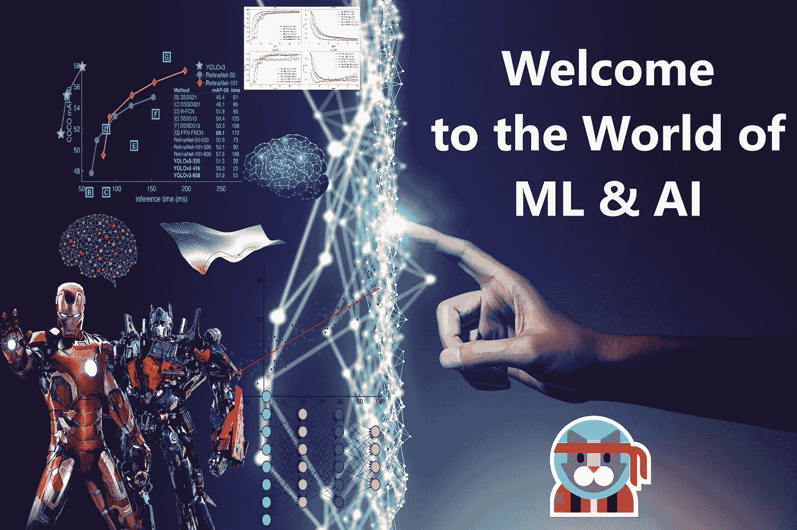

# 机器学习开放指南:第 1.1 部分:单变量线性回归、成本函数和梯度下降。

> 原文：<https://medium.com/analytics-vidhya/an-open-guide-to-machine-learning-part-1-1-5a8fc5770070?source=collection_archive---------16----------------------->

机器学习，虽然听起来很复杂，但它确实是一种天赋，也是现代技术发展中最美的方面之一！我们很多人都知道，也有很多人不知道。有些人害怕它，有些人喜欢它。对我来说，这是我工程生活的一种方式。顺便说一句，我是一名软件工程师，已经恋爱了…