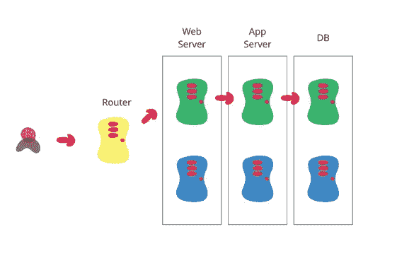

# 蓝绿色部署概述

> 原文：<https://medium.com/analytics-vidhya/an-overview-of-blue-green-deployment-fc3cf94bea3b?source=collection_archive---------0----------------------->

在现代场景中，每当我们谈论开发软件时，我们脑海中闪现的很少是开发实践、部署和发布软件。

这里讨论的重点是阐明部署所遵循的实践和方法，其中一个是 ***【蓝绿部署】*** ，另一个是金丝雀部署，后面讨论的不多。

# **蓝绿部署究竟是什么？**

蓝绿色部署是部署和发布软件的一个好策略。这基本上是维护两个独立的生产环境的想法，为了便于讨论，应该命名为蓝色和绿色。无论是蓝色还是绿色的环境，都必须能够为当前生产中的应用程序提供服务。这就是为什么这两个环境必须几乎相同。

[https://martinfowler.com/bliki/BlueGreenDeployment.html](https://martinfowler.com/bliki/BlueGreenDeployment.html)

# **使用蓝绿色部署的优点**

它只是通过运行两个相同的生产环境(蓝色和绿色)来减少停机时间和风险。在任何时候，只有一个环境是实时的，实时环境为所有生产流量提供服务。

它还降低了风险系数:如果您的绿色新版本发生了意想不到的事情，您可以通过切换回蓝色立即回滚到上一个版本。

在蓝绿色部署中，蓝色和绿色系统使用相同的层或数据库。保持应用程序数据同步是必要的，但是镜像数据库也可以帮助实现这一点。

例如，一旦绿色环境开始为实时应用程序提供服务，您就可以关闭旧的蓝色实例。与此同时，您可以在这些实例上部署一个更新的版本，并在下一个即将发布的版本中将它们变成新的绿色。

# **使用蓝绿色部署的缺点**

您需要基础架构来维护蓝色和绿色环境，这将包括成本和其他因素。

如果您尝试在非隔离的基础架构(虚拟机、Docker 等)上这样做，您将面临破坏您的蓝色和绿色环境的风险

例如，绿色环境中很少有耗时的事务。因此，当您切换到 blue 时，您必须优雅地处理那些耗时的事务以及新事务。如果您的数据库不够智能来处理这种情况，这可能会造成一些严重的问题。

# **简而言之**

虽然有许多其他策略可用于部署，但蓝绿色部署实际上是一种更简单的机制，可以快速、轻松地实现。您只需创建基础架构的副本。实际上，您还可以及时自动创建副本。它还是一个很好的暂存或备份环境，完全是您的生产环境的镜像。在这种类型的部署中，如果事情没有按预期进行或出现任何故障，立即回滚的机会总是存在的。