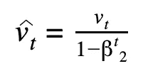

# 梯度下降优化算法综述

> 原文：<https://medium.com/analytics-vidhya/an-overview-of-gradient-descent-optimisation-algorithms-eb75302b5d84?source=collection_archive---------23----------------------->

梯度下降([来源](https://datascience-enthusiast.com/DL/Optimization_methods.html))

# 什么是梯度下降？

G 梯度下降(radient Descent)是一种优化算法，用于为机器学习模型寻找最佳参数(权重和偏差)，从而最小化用于评估模型性能的损失/成本函数。当不能解析地计算参数并且因此必须在巨大的参数空间中搜索时，使用梯度下降。

# 梯度下降程序

梯度下降是一个迭代过程，从一组随机的参数开始，并继续缓慢地改进它们。为了改进给定的一组权重，我们尝试使用当前权重(通过计算梯度)来获得成本函数的值，并在成本函数减小的方向上移动。在大多数情况下，重复这个步骤数千次，给我们一组最小化成本函数的权重。

梯度下降程序如下:

1.  随机初始化砝码 w。
2.  计算成本函数相对于权重的梯度 G。
3.  使用更新规则 *w* := *w-αG* 更新权重
4.  重复步骤 2 和 3，直到重量停止变化或满足终止标准。

梯度下降的基本方程

在步骤 3 中，学习率 *α* 决定了我们达到最小值所采取的步长。必须仔细选择学习速率，因为太低的学习速率会导致非常慢的学习，或者太高的学习速率会导致参数超过最小值。一旦达到最优，就说模型已经收敛。

# 梯度下降的直觉

现在想象你被蒙上眼睛放在一个多维平面上(类似于一个崎岖的山区地形)。你的目标是找到并到达那个地形的最低点。随机分配的起始位置在机器学习领域被称为初始化。现在唯一的方法是，你可以通过感觉周围的地形/坡度开始向最低点移动。感觉斜率的想法类似于在机器学习中计算成本函数的导数。一旦决定了运动的方向，你将采取一个类似于梯度下降算法中权重更新的步骤。这个过程会一遍又一遍地重复，直到你到达最低点或者成本最小的点。

梯度下降([源](/@DBCerigo/on-why-gradient-descent-is-even-needed-25160197a635))

# 香草梯度下降的问题

## 局部最小值

实际上，神经网络是涉及非线性变换的复杂函数。得到的损失函数看起来不像一个只有一个最小值的凸函数。损失函数要复杂得多，可能看起来像这样。

深度神经网络的损失函数轮廓

在上面的图像中，存在一个梯度为零的局部最小值。但是，我们知道，它们并不是我们所能达到的最低点，这是与全局极小值相对应的点。如果权重被初始化到点 A，那么模型很可能会收敛到局部最小值。由于局部最小值处的梯度为零，模型将不能从该点出来。这将导致次优的模型参数，这将导致机器学习模型的不良概括。

## 鞍点

鞍点([来源](https://blog.paperspace.com/intro-to-optimization-in-deep-learning-gradient-descent/))

鞍点的名字来源于一匹马的马鞍，因为它很像它。虽然它在一个方向上是最小值，但在另一个方向上是局部最大值，如果轮廓在 x 方向上更平坦，GD 将在 y 方向上来回振荡，给我们一种已经收敛到最小值的错觉。

为了避免这样的问题，我们可以对梯度下降算法进行细微的调整，以改善优化过程。我现在将谈论最常用的方法。

# 梯度下降优化算法

在这一节中，我将描述各种梯度下降优化算法。

## 记号

*   *w* :我们要更新的重量/参数
*   *α* :学习率
*   *t* :时间步长
*   *∂L/∂w* :损失函数相对于权重/参数的梯度 *w*

## 1.随机梯度下降

随机梯度下降(SGD)使用根据当前权重乘以学习率计算的梯度来更新权重。

## 2.动力

动量不是仅依赖于当前梯度来更新权重，而是用聚合的 *m* 来代替梯度，该聚合是在直到时间 *t* 的所有梯度上计算的。该集合是计算的当前和过去梯度的指数移动平均值，即所有到时间步长 *t* 的梯度。

在哪里，

*m* 初始化为 0，β为超参数。β的常见默认值为 0.9。

**3。阿达格勒**

AdaGrad 或自适应梯度算法作用于权重更新方程的学习率部分。它将学习率除以当前和过去梯度的平方和的平方根。

在哪里，

*ε* 是一个小的浮点常数，确保我们永远不会被零除。

*v* 初始化为 0， *ε* 的默认值设置为 1e-7。

**4。RMSProp**

均方根 prop 或 RMSProp 是对 AdaGrad 的修改。像 AdaGrad 一样，它也处理更新方程中的学习率部分。然而，RMSProp 不像 AdaGrad 那样采用梯度的累积和，而是像动量一样计算以前和当前梯度的指数移动平均值。生成的更新方程看起来就像在 AdaGrad 中一样。

在哪里，

*v* 被初始化为 0， *ε* 的默认值被设置为 1e-6。

## 5.阿达德尔塔

Adaptive Delta 是 AdaGrad 的另一个改进，侧重于学习率部分。术语*δ*在这里指的是当前和新更新的权重之间的差。AdaDelta 和 RMSProp/AdaGrad 的区别在于，它用一个参数 *D* 代替了学习率，即平方 Delta 的指数移动平均值。

在哪里，

*D* 和 *v* 被初始化为 0。 *β* =0.95 和 *ε* =1e-6 的默认值。

6。内斯特罗夫加速梯度(NAG)

NAG 利用动量原理，但是它以一种聪明的方式计算动量。NAG 遵循“三思而后行”的原则。对于前者，NAG 使用先前的动量向前迈一步并计算梯度。然后，这些梯度用于梯度的指数移动平均，以计算动量。因此，对于时间步长 *t* ，我们必须在执行反向传播之前执行另一个正向传播。

在哪里，

*m* 被初始化为 0。

第二个等式中的最后一项是向前计算的梯度。

更新权重的程序:

1.  使用之前的动量将当前权重 *w* 更新为新权重 *w** 。

2.使用 *w** 进行正向传播。

3.计算渐变，*。*

*4.根据上述等式计算动量和更新的权重。*

*β的默认值为 0.9。*

## *7.圣经》和《古兰经》传统中）亚当（人类第一人的名字*

*自适应矩估计是动量和 RMSProp 的融合。梯度分量的计算类似于动量，梯度的指数移动平均值，而学习率分量的计算类似于 RMSProp，将学习率除以平方梯度的指数移动平均值的平方根。*

**

*在哪里，*

****

*是偏差修正，和*

****

*m 和 v 被初始化为 0。缺省值α=0.001，β₁=0.9，β₂=0.999 和ε=1e-8。*

*这个帖子到此为止。如果你喜欢这篇文章，请鼓掌并与他人分享。你可以在 [LinkedIn](http://.com/in/vidit-jain-10a828167/) 上找到我，或者在 [GitHub](https://github.com/viditjain99) 上查看我的一些作品。如果您有任何问题或想法，请在下面留言。感谢你阅读这篇文章！！祝您有愉快的一天…🎉*