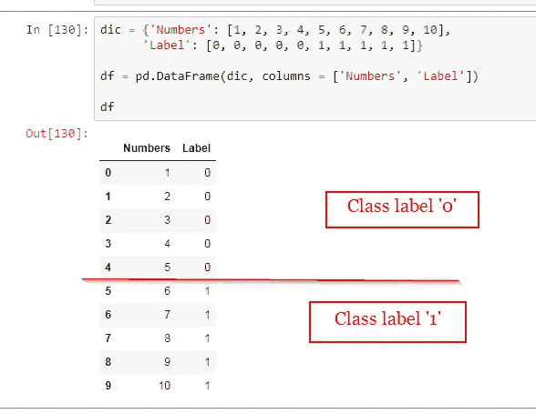
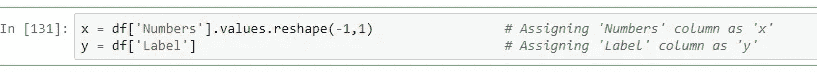
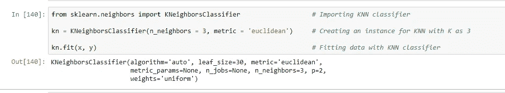
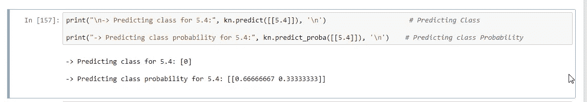
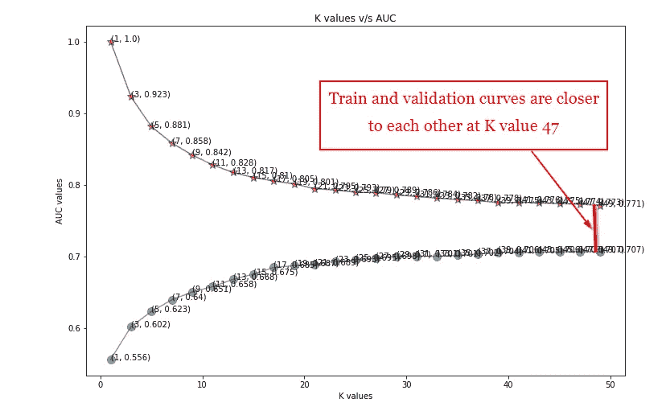

# K 近邻综述

> 原文：<https://medium.com/analytics-vidhya/an-overview-of-k-nearest-neighbor-99daf8a019ea?source=collection_archive---------11----------------------->

图片来源:[超链接](https://www.google.com/search?q=fruits+surrounded+knn&tbm=isch&ved=2ahUKEwiFnJ-qp6vmAhUIIisKHTjODZIQ2-cCegQIABAA&oq=fruits+surrounded+knn&gs_l=img.3...13553.14454..14586...0.0..0.137.640.3j3......0....1..gws-wiz-img.aFOmL718wdk&ei=xa3vXcWlEojErAG4nLeQCQ&bih=640&biw=1499&rlz=1C1RLNS_enIN844IN844&hl=en#imgrc=MsLaGUb9B5SosM)

*****我热烈欢迎所有的读者！*****

# 内容:

1.  KNN 简介
2.  以玩具为例理解 KNN
3.  K 值的选择
4.  KNN 的应用
5.  摘要
6.  参考

# 1.KNN 简介

**K 近邻**简而言之 KNN 是众多机器学习算法中的一种。KNN 属于监督学习的范畴。它既是一种分类算法，也是一种回归算法。它基于**“基于多数类的最近邻分类”的基本思想工作**这里，**‘K’**是自然数，最好选择奇数。假设，我们一边有红色的球，另一边有蓝色的球。我们在红色和蓝色球附近放置一个新球(颜色未知，需要分类)。我们需要弄清楚新球属于红球类别还是蓝球类别。我们现在要做的是，我们将 K 作为新球的 5 个最近邻。我们发现在 5 个最近的邻居中，3 个是蓝球，2 个是红球。基于多数计数，我们可以将新球归类为蓝色。

# 2 用玩具例子理解 KNN:

让我们考虑分类技术(二元分类器)。

> 我没有采用包含 n 个维度的大数据集，因为在我们的脑海中描绘 n 个维度并理解算法是如何工作的变得很困难。为了更好和更容易理解，我正在创建一个玩具的例子。

## 2.1 创建玩具数据框:

我已经创建了一个包含 10 行 2 列的玩具示例。列**‘数字’**代表一个自变量(x)，其数字从 1 到 10。列**‘Label’**代表一个因变量(y ),它有一个二进制类标签‘0’和‘1’。

玩具数据框

从上图我们可以看出，1 到 5 的数字属于 0 类，6 到 10 的数字属于 1 类。我们现在的目标是给定任何数字(实数或分数)，我们的模型应该能够预测新数据点的类别，即 0 或 1。

将“数字”列指定为“x”，将“标签”列指定为“y”。下面是代码图像。

分配列

## 2.2 培训模式:

我们现在将用 **n_neighbors (K)** 作为 **3** 和**‘公制’**作为**‘欧几里德’**来训练模型。k 为 3 意味着我们将只考虑 3 个最近的邻居，并决定给定点属于 0 类还是 1 类。这里，我们正在寻找具有“欧几里得”距离的最近邻居，也称为“L2 范数”。它的工作原理类似于毕达哥拉斯定理。点击[欧几里德距离](https://en.wikipedia.org/wiki/Euclidean_distance#:~:targetText=In%20mathematics%2C%20the%20Euclidean%20distance,is%20called%20the%20Euclidean%20norm.)的超链接。下面是训练模型的代码。

培训模型的代码示例

> **注:**我们可以使用其他距离方法作为度量，如曼哈顿距离(L1 范数)、闵可夫斯基距离、汉明距离、余弦距离等。

## 2.3 预测查询点

有趣的部分来了——预测一个新的点。让我们进入想象。在脑海中想象所有 10 个数字(1 到 10)，其中 1-5 属于 0 类，6-7 属于 1 类。假设，我想预测数字的类别**‘5.4’**。我们将找到最接近 5.4 的 3 个数字，分别是 4、5 和 6。在 3 个最近的点中，2 个点属于 0 类，1 个点属于 1 类。我们可以根据两种方法来决定 5.4 的等级。 **1-基于多数的**和 **2-基于概率的**。

**1-基于多数:**多数点(2)属于 0 类，少数点(1)属于 1 类。因此，数字 5.4 将被归类为 0。

**2-基于概率:**数字 5.4 属于 0 类的概率是 **0.66666667** 属于 1 类的概率是 **0.33333333** 。基于最高概率，数字 5.4 将被归类为 0。

用于预测的代码示例

# 3K 值的选择:

## 3.1 奇数 K 值:

正如我上面提到的，K 值最好取一个奇数，并且有一个很好的令人信服的理由。如果 K 值是偶数，那么 K/2 个最近的点很可能属于一个类，而其他 K/2 个可能属于另一个类。假设，我们把 K 值取为 10。不幸的是，如果 5 个最近的点属于类 0，而另外 5 个属于类 1，那么确定新点属于哪个类肯定是一件非常困难的事情。这是取奇数 K 值的唯一原因。

## 3.2 sci kit 封装的右 K 值:

选择正确的 K 值对模型性能起着很大的作用。如果我们取了错误的 K 值，可能会导致**过拟合**或**欠拟合**的问题。那么我们如何选择正确的 K 值呢？嗯，我们有很多方法，比如 **GridSearchCV、K-Fold 交叉验证、RandomizedSearchCV、For 循环、**等等，我们可以利用这些方法找到正确的 K 值。

> **注意:**随着 K 值的减小，模型会导致过拟合，反之则欠拟合。因此，选择正确的 K 值是一个主要部分。

## 3.3 带图表的右侧 K 值:

在用 scikit 软件包调优不同 K 值的 hyperparameter 时，我们肯定会有不同的 K 值和相应的精度或误差。为了以图形方式选择正确的 K 值，我们需要绘制训练和验证准确度/误差。我已经绘制了训练和验证准确性，我们将使用它来了解。下面是图表图像。

训练和验证准确度图

从上图中，我们可以看到训练曲线逐渐下降，验证曲线逐渐上升。我们应该选择 K 值，使得训练曲线和验证曲线在该值上彼此接近。在我们的例子中，在 K 47，训练和验证曲线彼此接近。所以，我们可以选择 K 为 47。

> **注:**如果从某个 K 值(比如 43)开始，训练和验证曲线都变成常数，即曲线既不下降也不倾斜。在这种情况下，我们在选择 K 值时可能会陷入困境，因为曲线在不止一个点上彼此接近。在这种情况下，我们应该选择较小的 K 值，即如果曲线在 K 值 43、45、47、49 处彼此接近，那么我们应该选择 K 值 43。

# 4 KNN 的应用:

1.  **推荐系统:**像在亚马逊和 Flipkart 中一样，根据我们之前观看、搜索和购买的数据来推荐产品。在网飞，IMDB 等，根据我们的搜索和观看数据推荐电影和网络系列。
2.  **概念搜索:**基于相似概念对文档进行分类。然而还有更多应用。

# 5.总结:

*   KNN 是一种监督学习算法，用于分类和回归。
*   使用 scikit 软件包很容易理解和应用算法。
*   如果数据有一个巨大的维度，KNN 变得非常耗时。因此，当数据具有巨大维度时，应用 KNN 是不可取的。
*   在大多数情况下，只调整 K 就足够了，不像其他算法需要调整一个以上的超参数。

# 6 参考文献:

1.  [https://www . Applied ai course . com/course/11/Applied-Machine-learning-course](https://www.appliedaicourse.com/course/11/Applied-Machine-learning-course)
2.  [https://sci kit-learn . org/stable/modules/generated/sk learn . neighbors . kneighborsclassifier . html](https://scikit-learn.org/stable/modules/generated/sklearn.neighbors.KNeighborsClassifier.html)

## 帮我连接:

*   **领英:**【https://www.linkedin.com/in/sandeep-panchal-682734111/】T4
*   **GitHub:**[https://github.com/Sandeep-Panchal](https://github.com/Sandeep-Panchal)

*****感谢大家阅读这篇博客。非常感谢您的建议！*****