# 机器学习算法综述

> 原文：<https://medium.com/analytics-vidhya/an-overview-of-machine-learning-algorithms-4a9a881a1a4b?source=collection_archive---------20----------------------->

让我问你一个问题...公司在产生数千千兆字节的数据后做什么？基于产品的公司如何通过免费提供产品服务来赚钱？

有没有答案…..让我开门见山地说吧

最终目标是收集数据...想象一下，如果有人知道你的日常习惯——你在什么时间做什么，你去哪里，等等，他们也可以预测你接下来的步骤/行为。当人类学习新事物时，我们依赖数据(信息)、观察等。有人说，一个人变得越老，他获得的经验就越多，在生活中就能做出更好的决定。当我们出生时，大脑是唯一通过观察事物开始学习的地方。这在技术上的精确复制品是机器学习和人工智能。就像上帝给了我们大脑一样，技术时代的程序员也给了我们从数据(统计)和观察中学习和分析的算法。今天在这个博客中，我将介绍一些机器学习算法。但在此之前，让我们了解一下机器学习到底是什么。

机器学习是让计算机系统在没有程序员明确编程的情况下进行操作的科学。它是人工智能的分支，使用从过去的数据中自动学习和改进的能力。学习过程始于观察或数据，并在数据中寻找模式以做出更好的决策。最终目标是让计算机在没有人类干预的情况下自动学习。让我们举一个例子:在当今时代，公司每天生成数千千兆字节的数据，所有这些数据都是原始格式，然后使用 Hadoop、Map Reduce、Hive、Pig、Sqoop、Hbase 等工具对这些数据进行预处理。这些经过预处理的数据然后以不同的方式使用，例如为公司生成分析仪表板，并使用机器学习来预测仪表板的结果。

在过去的十年里，机器学习已经给了我们自动驾驶汽车、模式分类和识别、有效的网络搜索、在医学科学中的应用等等…..

**医学中如何使用 ML 的例子:**

1.生存预测:给定患者 R 的描述，预测 R 将存活多长时间——即还能多活几个月

2.改善癌症治疗:由于有成千上万种可用的治疗方法，可以根据某些参数预测哪种治疗方法对哪些患者更好，这将有效地帮助医生治疗患者(监督学习——分类问题)

3.寻找有效的查询和警报策略

4.智能糖尿病管理

5.使用患者特异性功能磁共振成像进行精神病学诊断和治疗…..等等

现在，既然我们看到机器学习有许多优点，我们也看到一些痛点。

我看到的痛点是，要更快地训练深度学习模型(它有更多的隐藏层数)，必须需要一个具有良好 GPU 和 CPU 核心的高性能系统。我可以给出的例子是使用 GAN(生成对抗网络)生成人脸，我们花费的最小训练时间是 8 小时，因为我们是在 i3 系统上训练的。

**让我们深入研究机器学习算法**

1.  **分类算法:**

分类使用监督学习模型。监督学习算法采用一组已知的输入数据和对数据的已知响应(输出)，并训练模型来生成对新数据响应的合理预测。如果输入和输出都已知，例如预测一只狗或猫，则使用监督学习。监督学习用于分配有目标、值或类别的模式进行预测。例如，假设您想从不同的输入中预测商店的收入，那么您的模型将根据历史数据进行训练，并使用它们来预测未来的收入，因此模型是受监督的。该模型将学习输入和输出之间的联系。监督学习使用分类和回归技术来开发预测模型。

分类是什么？在分类中，我们使用训练集来确定类别之间的决策边界。一旦确定了边界条件，下一步就是预测目标类。这整个过程被称为分类。如果您的数据可以被标记、分类或分成特定的组或类，请使用分类。

**用于执行分类的常见算法**包括支持向量机(SVM)、提升和打包决策树、k-最近邻、朴素贝叶斯、判别分析、逻辑回归和神经网络。

分类算法示例:

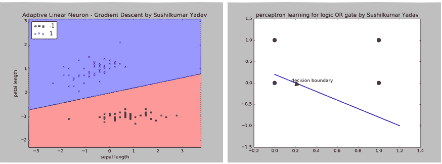

分类算法

**分类算法类型**:线性分类器(逻辑回归、朴素贝叶斯分类器、线性判别分析)、支持向量机(SVM)、二次分类器、K 近邻(KNN)、决策树(随机森林)、神经网络(HebbNet、感知器、Adaline、BP)、学习矢量量化

以下是评估分类器的技术:交叉验证、精确度和召回率、ROC 曲线。精确度和召回率可以使用混淆矩阵来计算。

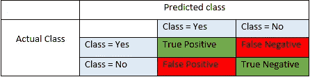

混淆矩阵

准确度= TP+TN/TP+FP+FN+TN

召回= TP/TP+FN

F1 得分= 2*(召回率*精确度)/(召回率+精确度)

在我们的一个深度学习项目中，我们生成了以下混淆矩阵

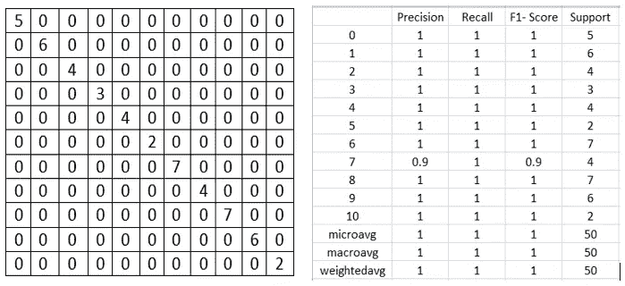

生成混淆矩阵，计算精度和召回率

**2。人工神经网络**

人工神经网络是由生物神经网络发展而来的。它从人类大脑处理信号的方式中看到了相似之处。

如果从结构上比较 BNN 和安，我们会发现两者的相似之处如下

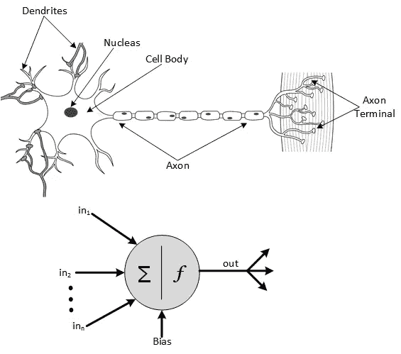

BNN vs 安

树突—输入；胞体——神经元；轴突——输出

也有不同之处，如复杂性、内存管理等。ANN 有以下**架构**:

前馈网络、递归网络、联想网络

人工神经网络基于 3 个参数被分类为**:**

1.  **根据信号流向:例如 LSTM MLP**
2.  **根据学习机制:基于示例错误的学习(反向传播)、赫比学习或联想学习(联想记忆、Hopfield 网络等)、竞争学习(KSOFM- Kohonen 自组织特征映射、LVQ 学习矢量量化)**
3.  **根据结构扩展:示例-感知器(Adaline vs Madaline)**

**最流行的人工神经网络是感知器、多层感知器、反向传播、Hopfield、双向联想记忆(BAM)、Kohonen 自组织映射、LVQ、径向基函数(RDF)等。**

****3。聚类算法****

**聚类算法也称为无监督学习方法，因为在这种情况下，我们从由输入数据组成的数据集(没有标记的响应)中提取参考。**

**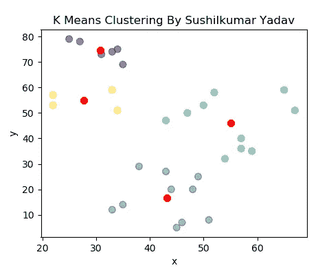**

**k 表示集群**

**在上面的例子中，我们可以看到每个聚类的中心是红色的，这是属于该聚类的所有观察值的平均值。如我们所见，与其他聚类的中心相比，属于给定聚类的数据更接近该聚类的中心。**

****聚类算法类型** : K-Means 聚类(基于质心的聚类)、Mean shift 聚类、Kohonen 自组织映射、基于密度的聚类、基于分布的聚类、基于层次的聚类等**

****4。强化学习****

**强化学习是训练机器学习模型做出一系列决策。在这个模型中，人工智能面临着一种类似游戏的情况，在这种情况下，计算机应用试错法来得出问题的解决方案。人工智能执行的每一个动作，要么得到奖励，要么受到惩罚。虽然程序员制定了奖励政策，但有一条规则是程序员不给出任何提示或建议来解决游戏。从完全随机的试验开始，到用复杂的策略和超人的技能完成，这一切都取决于模型如何找到最大化回报的最佳方式。**

**正如脸书研究主管 Yann LeCun 所说，强化学习是伟大的人工智能蛋糕上的樱桃，机器学习是蛋糕本身，深度学习是糖衣，如果没有之前的迭代，樱桃将一无所获。**

**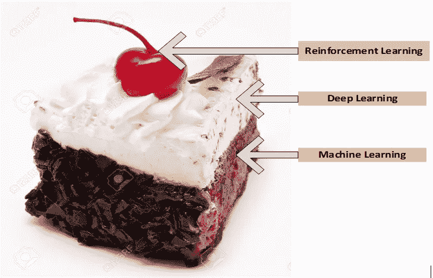**

**强化学习图解**

****强化学习的层次:****

**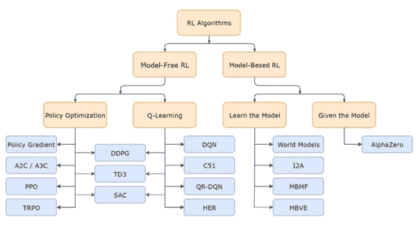**

**强化学习算法**

****5。回归技术****

**这个模型估计变量之间的关系。简而言之，从给定的输入变量或特征列表中，它估计连续的因变量。典型的应用包括生存预测、天气预报等。如果数据范围和响应的性质是实数，则使用回归技术。回归激活函数可以是线性的、二次的、多项式的、非线性的等等。在训练阶段，隐藏参数根据训练中给出的输入值进行优化。进行优化的过程是梯度下降算法，也称为**最速下降算法**。梯度下降用于更新模型的参数。如果学习速率太大，将会导致超调，如果学习速率太小，将需要更长的时间来收敛，如果使用神经网络，则还需要反向传播算法来计算每一层的梯度。一旦理论参数/假设参数得到训练(当它们在训练期间给出最小误差时)，则具有训练参数的相同理论/假设与新的输入值一起使用，以预测将再次成为真实值的结果。**

**激活函数和学习率示例:**

**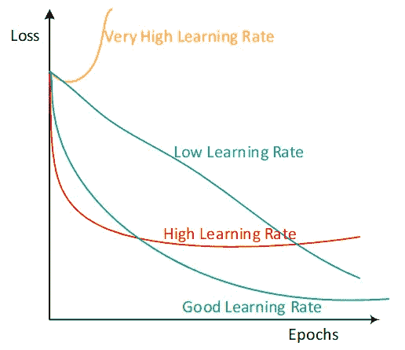**

**学习率比较**

****回归算法类型**:线性回归、逻辑回归、多项式回归、逐步回归、分位数回归、岭回归、Lasso 回归、弹性网回归、主成分回归(PCR)、偏最小二乘(PLS)回归、支持向量回归、有序回归、泊松回归、负二项式回归、准泊松回归、Cox 回归、Tobit 回归、自适应神经模糊学习等**

****6。基于树的算法****

**基于树的机器学习是最常用的监督学习方法。在每个节点使用来自数据集的不同特征，我们递归地分割训练样本。这里要注意的是，从节点中分离出来的数据必须是有效的。基于从训练数据推断的学习简单决策规则，分割数据将是有效的。命名基于树的算法是因为它通过在树上从根到叶节点对示例进行排序来对示例进行分类，其中叶节点表示对示例的分类。树中的每个节点充当某些属性的测试用例，从该节点向下延伸的主干代表测试用例的可能答案。基于树的算法是使用分支和节点构建的**

**基于树的算法的经典例子是计划在某一天打羽毛球。首先决定天气是晴天、多云还是下雨，在决定之后，另一个参数来了，这将帮助我们决定我们是否能够打羽毛球。**

**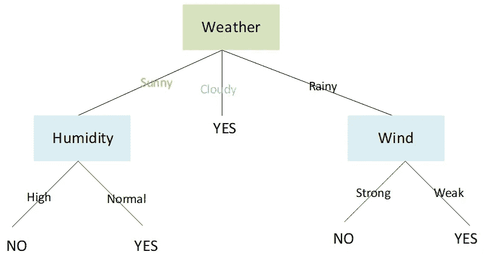**

**基于树的算法的图示**

****决策树的类型**:分类树、回归树等…**

****7。概率模型****

**这是机器学习算法的另一种观点，概括了几乎所有的 ML 算法。在这个框架中，我们将明确地把学习看作是一个统计推断的问题。我能给出的概率建模的最好例子是**朴素贝叶斯模型**。假设我们有一个任务，根据影评中出现的词(特征)来预测一个影评是正面的还是负面的(标签)。**

**因此，单个数据点的**概率**可以写成**

***p*θ(y/x)=*p*θ(y | x1，x2，x3，…，xD)——( 1)**

**这里 y 是**标签**，x 是**特征****

**对于批次变量，使用**链式法则**到上面的等式，**

***p* θ (x1，x2，x3，…，xD，y)=*p*θ(y)*p*θ(x1 | y)*p*θ(x2 | y，x1) ) *p* θ (x3|y，x1，x2)**

**…… *p* θ (xD|y，x1，x2，…..，xD-1)**

**=*p*θ(y)ᴨ*p*θ(xd | y，x1，x2，…..，xD-1)**

**使用朴素贝叶斯假设**

**等式(1)变成，**

***p*θ(y/x)=*p*θ(y)ᴨ*p*θ(xd | y)**

**……我希望这能给我们一个使用概率模型的小想法。**

**大多数复杂算法都是使用概率建模构建的**

****概率建模的类型**:生成概率建模、条件概率建模等**

****8。生成模型****

**生成建模是一种**无监督学习**类型，它描述数据中的特征，使计算机能够理解现实世界。这种算法处理大量的数据，并将数据还原为其数字本质。一种称为**变分自动编码器(VAE)** 的生成模型广泛用于降维，另一种称为**的生成对抗网络(GAN)** 用于生成特定对象的新照片，看起来像真实的对象。**

**让我演示一下，用 VAE，看原图和再生图**

**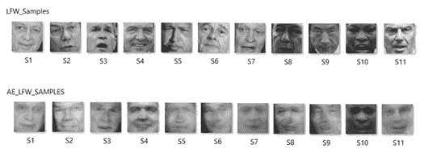**

**正常图像和 VAE 图像示例**

**使用 GAN，查看重新生成的图片**

**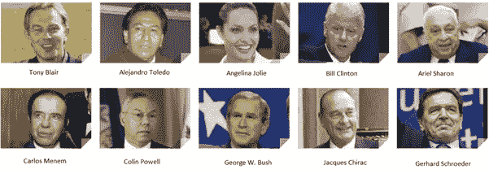**

**用于 GAN 数据库生成的 LFW 数据库样本**

**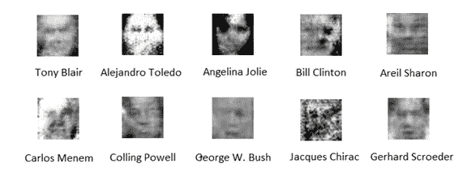**

**GAN 生成的数据库样本**

**3 当今最流行的生成模型类型有:**

**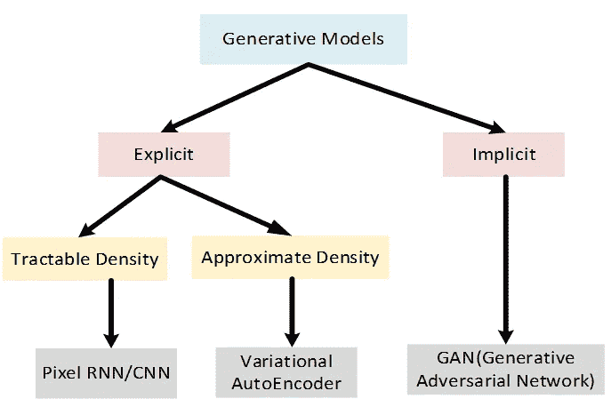**

**广泛使用的生成模型类型**

****9。深度学习模型****

**深度学习是机器学习的一个子领域，涉及被称为人工神经网络的大脑结构和功能所启发的算法。机器学习和深度学习的唯一区别是，机器学习只有一个隐藏层，而深度学习有不止一个神经网络，如下图所示。基本上深度 l，收益用于分类高维数据。深度学习有多个层来处理特征，通常，每一层都提取一些有价值的信息。网络有一个输入层、一个输出层和至少一个位于输入层和输出层之间的隐藏层。每一层都在一个过程中执行特定类型的分类和排序，有些人称之为“特征层次”。这些复杂的神经网络的一个关键用途是处理无标签或非结构化数据。短语“深度学习”也用于描述这些深度神经网络，因为深度学习代表了机器学习的一种特定形式，其中使用人工智能方面的技术寻求以超越简单输入/输出协议的方式对信息进行分类和排序。**

*****深度学习的架构*****

**1.无监督预训练网络**

**2.卷积神经网络**

**3.递归神经网络**

**4.递归神经网络**

**在所有这些架构中，我们为我们的人脸识别模型实现了一个卷积神经网络，因为卷积神经网络允许我们从图像中提取广泛的特征。**

**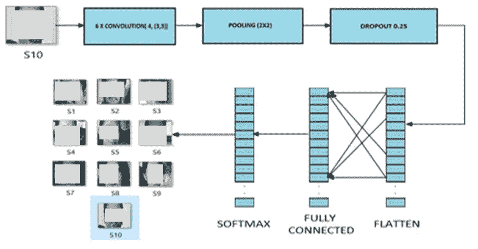**

**CNN 架构**

****10。懒惰算法****

**惰性算法是简单的算法，在这种算法中，一旦将查询发送给模型，就会进行泛化。这种方法的一个关键问题是根据实例到查询实例的距离来加权这些实例，使得最接近的实例具有最高的权重。KNN 是懒惰学习算法的一个例子。**

**惰性算法可以从下图中得到说明，**

**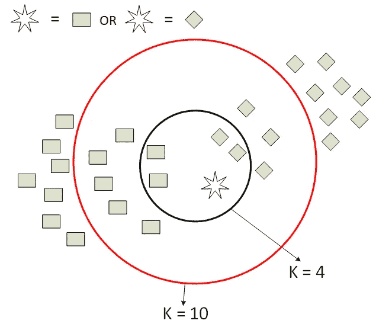**

**KNN**

**11。集成方法**

**当允许几个机器学习算法实现更好的结果时，它被称为集成方法。集成方法是一种元算法，它将几种机器学习技术结合到一个预测模型中，以减少方差、偏差并改善预测。**

**我能给出的最好的例子是我们开发的人脸识别项目，使用不同的训练和测试样本，下面是我们取得的结果。训练样本以递增的顺序获取(从较少的训练样本到较多的训练样本)**

**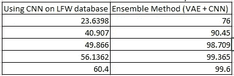**

**使用 CNN 和 VAE 与 CNN 组合的精确度**

**集成算法的类型:Adaboost、Bagging、加权平均等**

****12。Apriori 算法****

**Apriori 算法用于发现数据之间的关联。关联规则可以被认为是一种 if-then(动作-结论)关系，典型的 if-then 规则用于确定前因(原因或动作)是否推断出后果(效果或反应)。假设我们有一个 IF A，THEN B 形式的规则，其中 A 是定义在论域 X 上的一个集合，B 是定义在论域 y 上的一个集合。我可以给出的经典例子是假设客户 A 购买了一些物品，比如说书，那么同一个客户 A 在相同的交易 ID 下购买文具的可能性有多大。许多模糊关联算法依赖于 Apriori 算法。**

**希望这篇文章给了你机器学习算法的概述**