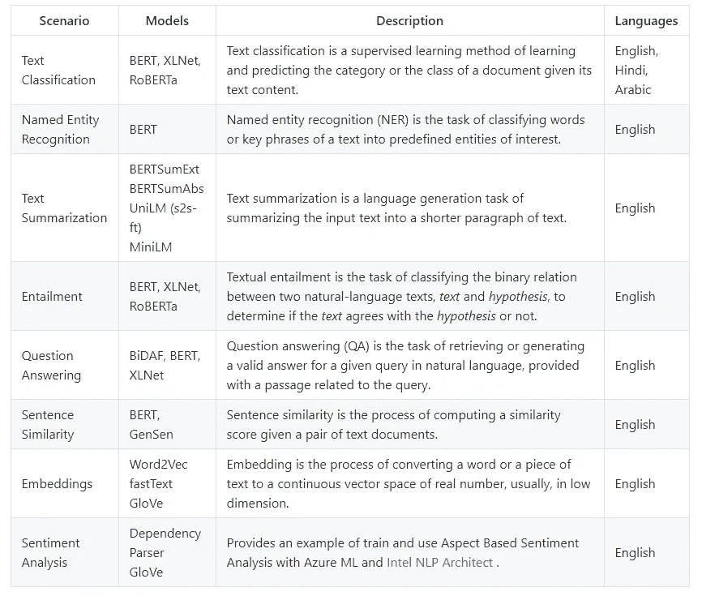

# 微软 Azure NLP 解决方案概述

> 原文：<https://medium.com/analytics-vidhya/an-overview-of-microsoft-azure-nlp-solutions-b39dff61cee8?source=collection_archive---------3----------------------->

在这篇文章中，我将简要讨论 AI 和 NLP 时间轴，并概述 Azure AI。然后我提供了一个如何用 NLP 技术映射 Azure AI 解决方案的指南。

这篇文章的目标受众是具有不同水平的 NLP 知识的开发人员、数据科学家和机器学习工程师，他们正在寻找尝试 Azure AI/NLP 解决方案的简单指南。

## 什么是 NLP？

自然语言处理(NLP)是**人工智能**、**机器学习**和**计算语言学**的一个领域。它的主要目标是计算机和人类(自然)语言(包括文本和语音)之间的交互。特别是，NLP 提供了不同的技术，说明计算机程序如何能够**理解**，**分析**，以及**潜在地生成**大量人类语言数据。

NLP 应用包括自然语言理解、机器翻译、语义、句法传递、自然语言仿真、诸如语音识别的方言系统、问题回答以及诸如主题建模、分类、摘要、句子/文档相似性等广泛的文本分析技术。

## 人工智能和自然语言处理简史

人工智能一词是由美国计算机科学家约翰·麦卡锡在 1956 年达特茅斯会议上创造的，该会议被广泛认为是这门学科的发源地。被称为人工智能之父的麦卡锡在 1958 年创造了 Lisp 计算机语言，该语言成为标准的人工智能编程语言，并一直沿用至今。

人工智能的突破——尤其是 NLP 发生在英国数学家艾伦·图灵发表了他的著名文章[计算机械和智能](https://en.wikipedia.org/wiki/Computing_Machinery_and_Intelligence)并提出了现在所谓的[图灵测试](https://en.wikipedia.org/wiki/Turing_test)。

图灵测试用于确定计算机(机器)是否能像人类一样智能思考？。这一标准取决于计算机程序在与人类法官的实时书面对话中模仿人类的能力，这种能力足够好，以至于法官无法在程序和真人之间进行可靠的区分——仅基于对话内容。

下面是人工智能时间轴，它对机器学习、深度学习和 NLP 的突破一目了然:


[来源:AI 时间轴](https://github.com/LidaGh/Microsoft_Azure_NLP_Solutions)

## 微软 Azure AI

微软人工智能平台提供了一套强大的工具，允许开发人员轻松快速地将人工智能融入他们的应用程序和场景，为他们的用户提供新的智能体验。Azure AI 分为三大支柱:


来源:[微软 Azure AI 文档](https://docs.microsoft.com/en-us/ai/)

以下是微软发布的一些服务的官方存储库:

**1) Azure 认知服务:**Azure 认知服务使开发人员能够轻松地将认知功能添加到他们的应用程序中。Azure Cognitive Services 的目标是帮助开发人员创建可以看、听、说、理解甚至开始推理的应用程序。Azure 认知服务中的服务目录可以分为五大支柱——视觉、语音、语言、网络搜索和决策。以下是微软官方资料库的链接。请注意，为了访问 repo，用户需要从[微软开源 github 库](https://github.com/microsoft)请求访问。

```
[Microsoft docs resource API access](https://docs.microsoft.com/en-us/azure/cognitive-services/Welcome#feedback)
[Project page for Cognitive Services offerings and demos](https://azure.microsoft.com/en-us/services/cognitive-services/)
[Free trial access key link](https://azure.microsoft.com/en-us/try/cognitive-services/)
[Cognitive Services Java SDK samples](https://github.com/Azure-Samples/cognitive-services-java-sdk-samples)
[Cognitive Services Node.js SDK samples](https://github.com/Azure-Samples/cognitive-services-node-sdk-samples)
[Cognitive Services Python SDK samples](https://github.com/Azure-Samples/cognitive-services-python-sdk-samples)
[Cognitive Services Speech SDK](https://github.com/Azure-Samples/cognitive-services-speech-sdk)
[Cognitive-services-REST-api-samples](https://github.com/Azure-Samples/cognitive-services-REST-api-samples)
[Azure Cognitive TTS Samples](https://github.com/Azure-Samples/Cognitive-Speech-TTS)
[Computer Vision Recipes](https://github.com/microsoft/computervision-recipes)
[Language Understanding (LUIS)](https://github.com/Azure-Samples/cognitive-services-language-understanding)
```

**2)知识挖掘解决方案:**
这些解决方案专为高级知识挖掘任务而设计，如名称实体识别、短语提取、自定义标签和自定义技能，可以丰富 IE 流程。以下是微软官方资料库的链接。请注意，为了访问回购，用户需要从[微软开源 github 库](https://github.com/microsoft)请求访问。

```
[Azure Cognitive Search Accelerator](https://github.com/microsoft/azure-search-knowledge-mining)
[Form Recognizer Recipes](https://github.com/microsoft/knowledge-extraction-recipes-forms)
```

**3)深度学习 NLP 解决方案:**微软研究院发布了一个包含构建 NLP 系统的例子和最佳实践的知识库，以 Jupyter 笔记本和实用函数的形式提供。知识库的重点是在研究涉及文本和语言问题的研究人员和从业人员中流行的最先进的方法和常见场景**。**请注意，为了访问回购，用户需要从[微软开源 github 库](https://github.com/microsoft)请求访问。

```
[Microsoft NLP Recipes](https://github.com/microsoft/nlp-recipes)
```



来源:[微软研究院发布的 NLP 收据](https://github.com/microsoft/nlp-recipes)

## 将 NLP 应用程序映射到 Azure AI

作为一名五年的 NLP 专家和两年的微软云解决方案架构师，我提出了 NLP 应用程序到 Azure AI 解决方案的映射。这种映射可以作为选择 Azure cloud 作为 NLP 场景的客户和合作伙伴的指南。


[来源:将 NLP 应用映射到 Azure AI](https://github.com/LidaGh/Microsoft_Azure_NLP_Solutions)

最后，让我通过看一眼微软人工智能平台来结束这篇文章:


[来源:微软人工智能平台](https://www.microsoft.com/en-us/ai/ai-platform)

这篇文章的内容也可以通过[的公共 github repo](https://github.com/LidaGh/Microsoft_Azure_NLP_Solutions) 获得，带有到微软官方仓库的链接，有一个为这次演讲录制的网络研讨会，[可供公众需求](https://portal.meets4b.com/JoinCertain/Lobby?e=0ea63c5e-038e-4e1f-bf60-4c691bc67eeb)。

# azure # azure ml # data science # NLP # machine learning # deep learning #微软