# 推荐系统概述以及如何从头开始实现一个推荐系统

> 原文：<https://medium.com/analytics-vidhya/an-overview-of-recommendation-system-and-how-to-implement-one-from-scratch-9e984f1ad51f?source=collection_archive---------22----------------------->

## 这个博客包括推荐系统的概述，包括历史，现在，未来，它的不同类别，最后是处理笑话推荐的代码。

照片由[江户努格罗霍](https://unsplash.com/@edonugroho?utm_source=medium&utm_medium=referral)在 [Unsplash](https://unsplash.com?utm_source=medium&utm_medium=referral)

## 过去、现在和未来:

如果我们回顾一下推荐系统的历史，这个想法是在 1992-1996 年间被激发的。在推荐系统出现之前，甚至在人们谈论协同过滤之前，它就被称为个性化。但都是手动的。例如:旅行社知道你对旅行感兴趣，会留意你喜欢的旅行类型，而不是任何人都想做的事情。第二个例子:个人购物者有一些简单的数据库，当新产品上市时，他们可以通过这些数据库运行人们的个人资料，并了解他们可能会考虑谁是新产品的良好候选人。【2007 年，网飞宣布了一项 100 万美元的竞赛，它改变了推荐系统的进程。它吸引了来自许多背景的人参加比赛。新的算法和新的数学公式一起出现。顺便说一句 [**惊喜库**](http://surpriselib.com/) 我将使用完全关注 [**Netflix 奖**](https://en.wikipedia.org/wiki/Netflix_Prize) 获奖者团队发表的研究论文开发的笑话推荐系统。当我们展望未来时，仍有许多事情我们不知道。时间推荐的问题。我如何让我的建议不仅与人们已经研究了一段时间的季节相关，还与你已经消费过的下一个消费序列相关。教育推荐就是其中的一个领域，它与时间有很大关系。

## **推荐系统的大致划分:**

推荐系统主要有两类。
1。[协同过滤](https://en.wikipedia.org/wiki/Recommender_system#Collaborative_filtering)
2。基于内容的过滤

**协同过滤:**协同过滤的关键是基于这样一个假设:过去同意的人将来也会同意，他们会像过去一样喜欢相似种类的物品。
协同过滤的三个主要类别是:
1 .用户-用户相似度
2。物品物品相似度
3。基于模型

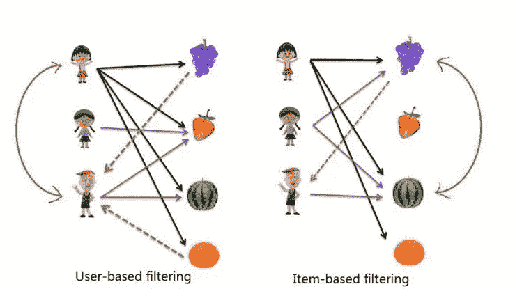

用户-用户和项目-项目相似性

**基于内容的过滤:**基于内容的过滤方法基于项目的描述和用户偏好的配置文件。这些方法最适合于已知项目数据(名称、位置、描述等)的情况。)，但不在用户身上。

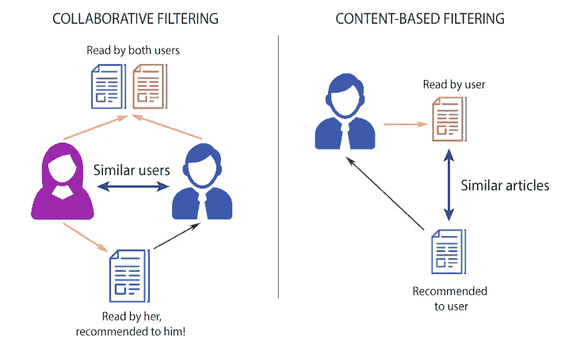

协作与基于内容的推荐

## 先决条件

1.基础 Python
2。基础熊猫
3。渴望探索[惊喜库](http://surpriselib.com/)4。Keras(可选)

如果你想直接跳到代码，请到[这个](https://github.com/prabhudayala/Jester-Joke-recommendation-system/tree/master) github 链接，找到 jupyter 笔记本。

我将解释我在解决问题时遵循的每个主要步骤，但我强烈认为如果你对问题的完整解释感兴趣，并有兴趣了解惊喜库的使用，那么你必须在浏览完博客后看看 [git repo](https://github.com/prabhudayala/Jester-Joke-recommendation-system/tree/master) 。

我们开始吧。
关于我们将要使用的数据的一些基本信息。

数据描述

现在，我会制定一个计划来处理手头的问题，并慢慢走向解决方案。我们将通过代码片段来完成每个步骤。
1。收集数据
2。列车试拼
3。简单统计
4。将数据组织成惊喜库
5 的兼容格式。定义误差指标
6。使用基准模型
7。尝试不同的型号
8。结果

## 收集数据

1.  数据中提供了 3 个 excel 表格。我们将把它们合并在一起，形成一个组合的 python 熊猫数据框架。我们共有 73421 个用户。

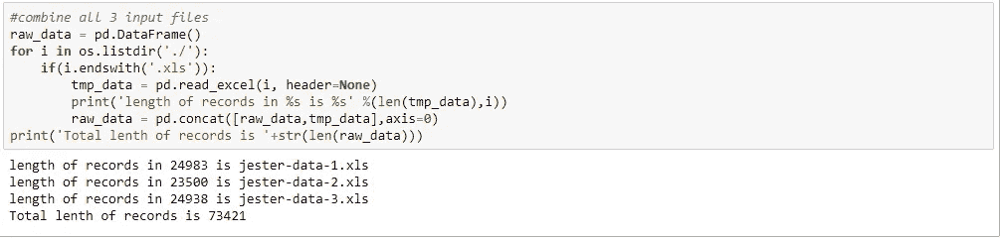

合并所有数据

2.如数据集信息中所述，评级 99 意味着用户没有对该笑话进行评级。我们将删除这些记录，并准备['user_id '，' joke_id '，' rating']格式的数据。

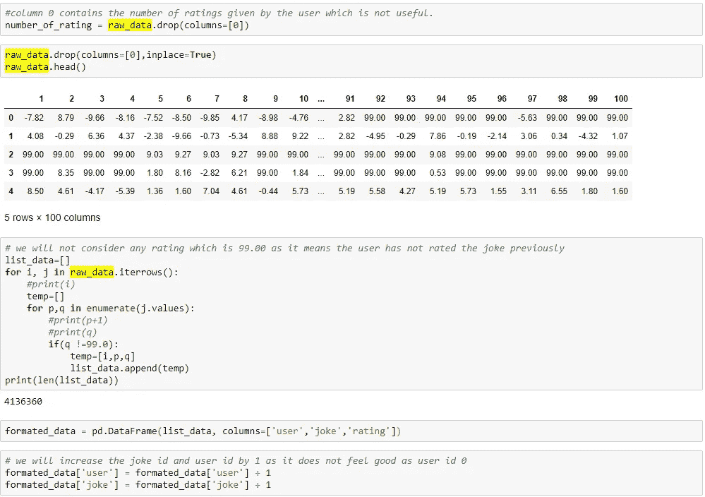

数据准备

## 列车测试分离

我们将使用 scikit-learn train_test_split 并将数据分割为 70–30。70%数据可用于训练，30%可用于测试

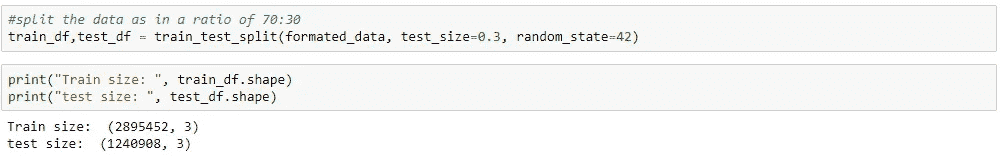

## 基本统计

1.每个用户和每个笑话的平均评分

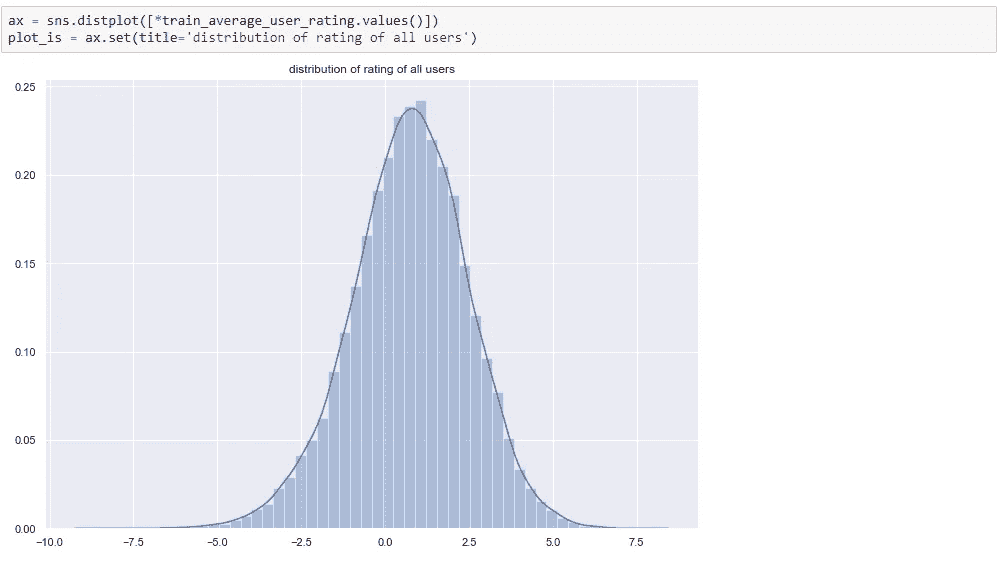

所有用户的评级分布

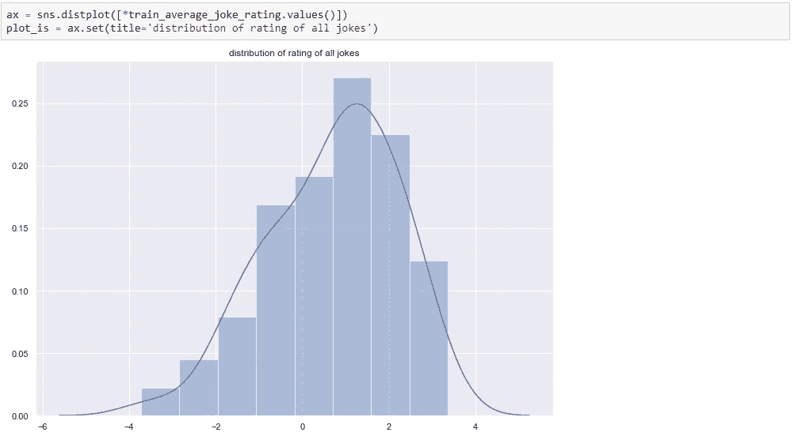

所有笑话的分级分布

## 将数据结构化为惊喜库的兼容格式

我们将按照惊喜库来组织数据。它接受格式为['用户'，'玩笑'，'评级']的数据。如果我们在电影推荐方面有问题，我们会将数据组织为['用户'，'电影'，'评级']。

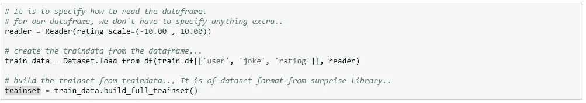

以令人惊讶的库风格准备数据

## 定义误差度量

我们将使用归一化平均绝对误差作为误差度量。

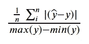

归一化平均绝对误差(NAME)公式

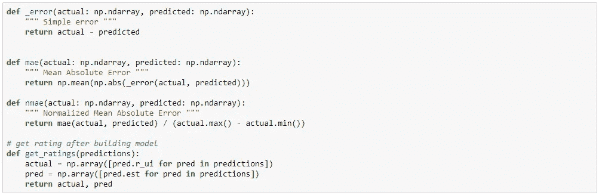

计算 NMAE 的代码

## 使用基线模型

我们将使用惊喜库给出的[基线模型](https://surprise.readthedocs.io/en/stable/basic_algorithms.html#surprise.prediction_algorithms.baseline_only.BaselineOnly)创建一个基线模型。基线模型给出 0.2033 NMAE，我们将尝试不同的惊喜模型，并结合所有结果以获得更好的结果。

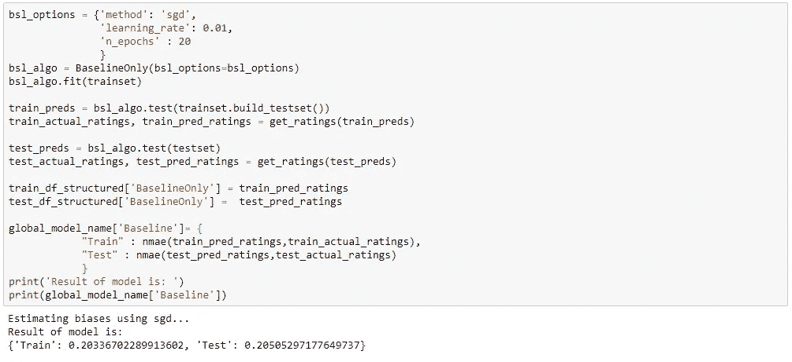

## 尝试不同的模型

1.  KNN 基线模型:
    它使用基于相似性的技术来预测用户对新笑话的评分。在我们的例子中，NMAE 误差是 0.196

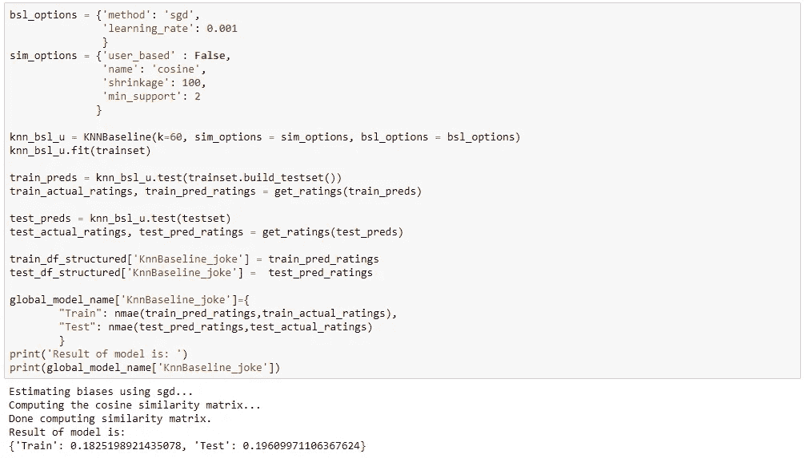

2.XGBoost on userAverageRating、jokeAverageRating、基线的输出和 KNN 基线的输出:
我们已经组合了之前的惊奇模型的所有输出，并在超参数调整后对数据运行了 XGB 回归模型。这里我们得到了 0.1928 NMAE 的稍微好一点的结果

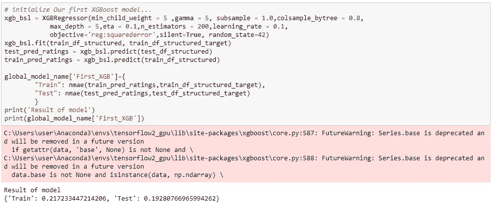

3.奇异值分解模型:
奇异值分解模型使用矩阵分解技术来解决矩阵补全问题并预测评级。

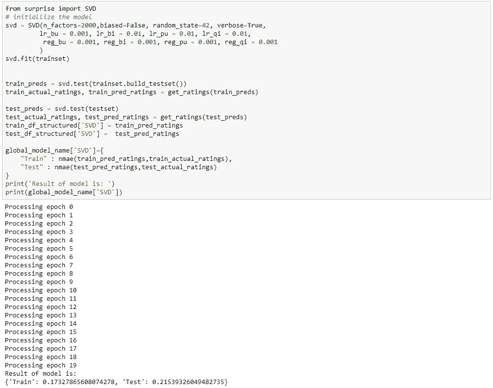

4.XGBoost on userAverageRating，jokeAverageRating，基线输出，KNN 基线输出，SVD 模型输出。这款车型的 NMAE 为 0.18，是迄今为止最好的**。**

**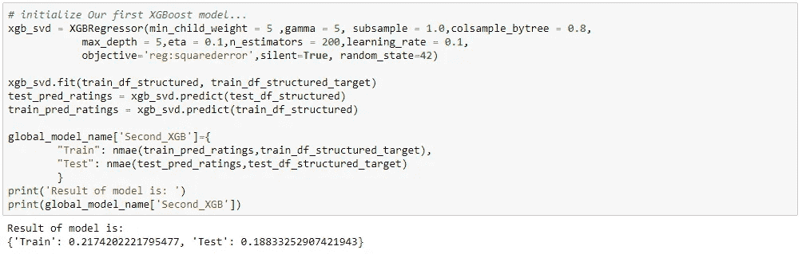**

**5.具有特征工程的模型:
我已经派生了两个简单的特征来检查它们对模型的影响。一个特点是**用户 _ 平均+玩笑 _ 平均-全球 _ 平均**。这个模型通常给出的 NMAE 为 20.2。我也尝试过其他特征工程技术。他们也做得不好。**

**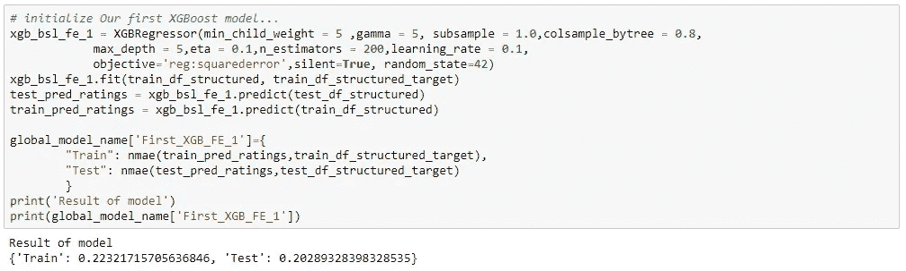**

**6.使用 keras 的德普学习模型:
由于特征工程没有很好地工作，我计划使用 keras 尝试一些简单的神经网络模型。我试了三种不同的型号。一个具有所有基本功能，如用户平均水平、笑话平均水平，第二个和第三个具有所有功能，但架构不同。一个模型有 14.9%的 NMAE。**

**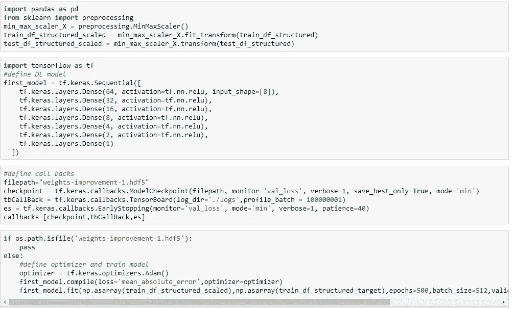****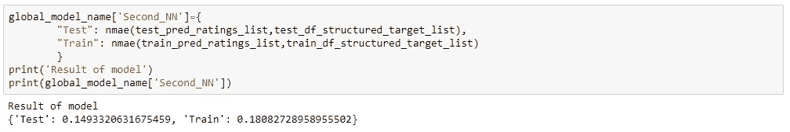**

## **结果**

**正如我们所见，Second_NN 模型效果最好，因为它的测试误差最小。**

**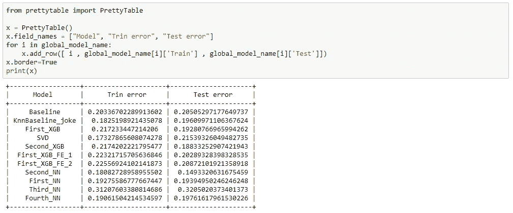**

# **最后的想法**

**众所周知，没有一种模式是完美的。这种模式一直都有改进的空间。可以尝试不同的特征工程技术，一些领域专家的建议和不同的神经网络架构可以产生更好的模型。**

**第二点，我可以说推荐系统现在正在发展。惊喜库通过提供所有著名的模型实现，使开发人员的生活变得更加轻松。对于创建基本的推荐系统，这是非常有用的。我想我已经完成了我写这篇博客的目的，并且通过一个小小的编码介绍让开发者了解了惊喜库。完整的代码可以在 git 的[这里](https://github.com/prabhudayala/Jester-Joke-recommendation-system/blob/master/Anonymous%20Ratings%20Data%20from%20the%20Jester%20Online%20Joke%20Recommender%20System.ipynb)找到。**