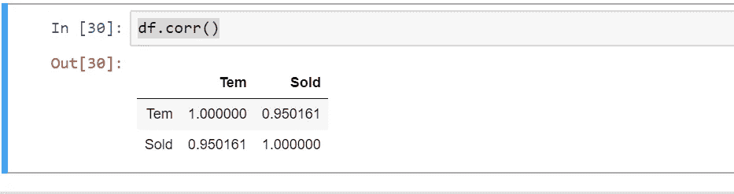

# 统计方法综述:机器学习中的特征选择

> 原文：<https://medium.com/analytics-vidhya/an-overview-of-the-statistical-approach-feature-selection-in-machine-learning-cb0a2dabd429?source=collection_archive---------9----------------------->

当使用机器学习(ML)时，特征选择是最基本的任务之一。如果您对 ML 的特征选择没有正确的概念，您可能会遇到各种困难。尽管可以找到几种特征选择技术，但是皮尔逊相关系数是可靠的，我将在本文中解释这一点。本文将回顾 ML 的特征选择方法和实际操作。

***开头前几个字***

由于这篇文章非常先进，如果你也学习基本统计学和 ML，那就太好了。统计学对 ML 和数据科学非常重要，而统计学在科学研究中的贡献是必不可少的。

***皮尔逊相关系数***

简而言之，相关性是两个变量之间关系。换句话说，相关性表示两个或多个变量一起波动的程度。相关值在-1 到 1 的范围内缩放。越接近 1，两个变量之间的联系越强，越接近 0，关系越低。图 1 示出了由皮尔逊相关方程 r 表示的方程。图 2 示出了相关的标度。

[**图 1:皮尔逊相关方程**](https://corporatefinanceinstitute.com/resources/knowledge/finance/correlation/)

这里:

*   **rxy** —变量 x 和 y 之间线性关系的相关系数
*   **xi** —样本中 x 变量的值
*   **x̅**—x 变量的平均值
*   **yi** —样本中 y 变量的值
*   **ȳ**—y 变量的平均值

[**图 2:皮尔逊相关量表**](https://www.researchgate.net/publication/260989251_The_Influence_of_Transparency_on_the_Leaders%27_Behaviors_A_Study_among_the_Leaders_of_the_Ministry_of_Finance_Yemen/figures?lo=1)

为了理解相关性和系数，请遵循下面的相关矩阵(图 3 ),其中显示了每个矩阵下的不同绘图和强相关性。通过这个图表，你可以了解尺度测量变量之间的关系。详细的顺序和结果如图 3 所示

**图 3:相关矩阵**

让我们通过一个数学方程来找出这种相关性。我们将以数据集为例，看看如何进行特征选择。

> **场景:**假设你是机器学习(ML)专家，X 先生是卖冰淇淋的。x 看到 2020 年 5 月的冰淇淋销售很失望。Cellar 的观点是，当天气炎热时，冰淇淋的销量会增加，这种情况在过去几个月一直存在，但尽管 6 月份天气炎热，但销量并不好。在这种情况下，ML 专家应该要求冰淇淋销售商获得上个月的冰淇淋销售数据。考虑一下，X 现在给了你你问他的数据，现在你必须找出相关性。

步骤 01:收集数据集。

**表 1:数据集**

步骤 02:计算每个变量“温度”和“销售量”的平均值，因为我们要找出它们之间的相关性。看一下这张桌子

**表 2:计算每个变量的平均值**

步骤 03:计算平均值后，我们可以找到其他值。表 3 中给出了计算总结。

**表 3:查找其他值**

r = 4730/√((540)(45891.667))= 0.9502

所以 R 的值是 0.9502。

根据皮尔逊相关系数标度，R 值为 0.9502，证明**温度**和**售出**变量之间有很强的关系。如果你有许多像这样的变量，你可以通过找出相关性来找出两个变量的关系，这样你就能够找到你的机器学习模型的独立变量。这是两个变量之间相关性的理论概念。现在我们将使用这个数据集建立一个机器学习模型，并通过 python & Jupyter notebook 实际查看它。

**步骤 01:导入基本模块和库&加载数据集**

**图 4:包含库并加载数据集**

**步骤 02:以图形表示的可视化数据(不必要，但有助于理解数据集)**

**图 5:散点图的数据可视化**

当你绘制数据时，你会看到如图 6 所示的相互关系

**图 6:变量之间的相关性(散点图)**

**步骤 03:为训练和测试**定义自变量和因变量&分割数据集

**图 7:特征选择&执行列车测试分割**

**步骤 04:将数据拟合到机器学习算法中**

**图 8:将数据拟合到机器学习算法中**

**步骤 05:检查模型的准确性&找出相关性**

**图 9:精度检查&找出相关系数**

当你检查相关性时，你会看到如图 10 所示

**图 10 相关系数**

到总结，机器学习的工作基本上是分几个步骤完成的。确定变量我的意思是说，选择自变量和因变量是极其必要的。统计学与数据科学和机器学习有着千丝万缕的联系。本文回顾了统计方法**“皮尔逊相关系数”**技术，并概述了理论解释以及通过**机器学习进行的实际特征选择。**

**找到 Jupyter 笔记本:**[https://github . com/eliashossain 001/Machine _ Learning _ Feature-selection](https://github.com/eliashossain001/Machine_Learning_Feature-selection)

**此外，找到各种类型的数据可视化技术以及源代码:**

 [## eliashossain 001/非数据可视化-

### 在数据科学领域，数据可视化无疑是当今的热门词汇。数据可视化是图形…

github.com](https://github.com/eliashossain001/Off-to-Data-Visualization-) 

**在写这篇文章的时候，我借助了一些参考资料:**

> [*https://corporatefinanceinstitute . com/resources/knowledge/finance/correlation/*](https://corporatefinanceinstitute.com/resources/knowledge/finance/correlation/)
> 
> [*https://www . research gate . net/publication/260989251 _ The _ Influence _ of _ Transparency _ on _ The _ The _ Leaders ' _ Behaviors _ A _ Study _ between _ The _ Ministry _ of _ Finance _ Yemen*](https://www.researchgate.net/publication/260989251_The_Influence_of_Transparency_on_the_Leaders'_Behaviors_A_Study_among_the_Leaders_of_the_Ministry_of_Finance_Yemen)
> 
> [https://www . tutorialspoint . com/machine _ learning _ with _ python/machine _ learning _ with _ python _ correlation _ matrix _ plot . htm](https://www.tutorialspoint.com/machine_learning_with_python/machine_learning_with_python_correlation_matrix_plot.htm)

如果你想找到我的研究论文和其他更新，请点击以下链接:

**研究门:**https://www.researchgate.net/profile/Elias_Hossain7

**领英:**[https://www.linkedin.com/in/elias-hossain-b70678160/](https://www.linkedin.com/in/elias-hossain-b70678160/)

**推特:**https://twitter.com/eliashossain_