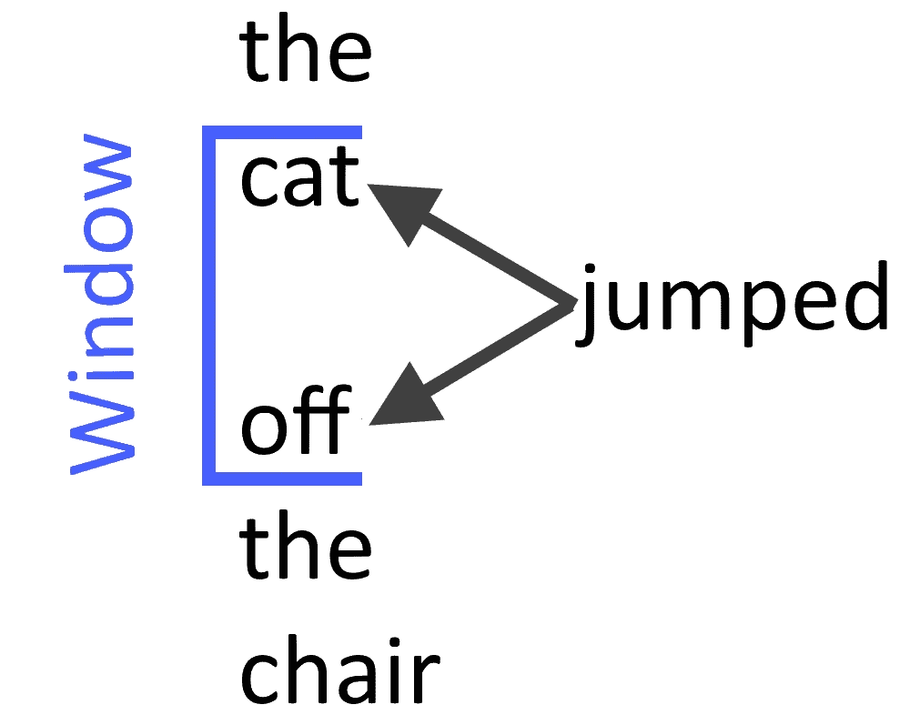
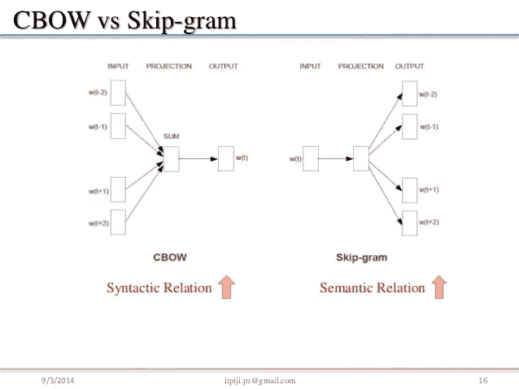
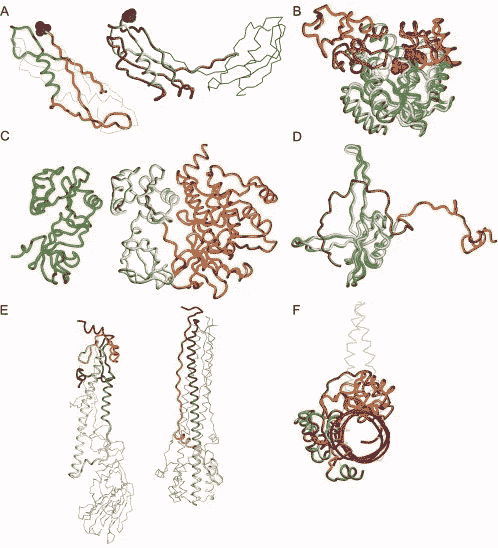

# Word2Vec 概述，它的亮点在哪里，不在哪里

> 原文：<https://medium.com/analytics-vidhya/an-overview-of-word2vec-where-it-shines-and-where-it-didnt-cb671b68a614?source=collection_archive---------15----------------------->

嘿伙计们！我带着一个我在年[月工作时非常熟悉的话题来到这里。自然语言处理！在本文中，我将重点介绍由 Google 开发并获得专利的东西:Word2Vec。](http://mealeon.herokuapp.com/)

我想说，如果你正在期待一个指导你使用 Word2Vec 的教程，你应该看看已经出版的许多教程中的一个！这更多的是对它擅长什么，为什么你会使用它，以及什么时候不应该使用它的高度概括。

在我们进一步讨论之前，我们先来解释一下 NLP 的一些构建模块和 vocab。我记得我经常看到这些单词，如果你忘记了它们的意思，让它们随时可以阅读是很有帮助的。

N-gram:用于创建单词向量的单词数。一元词意味着每个单词都被使用，而二元词意味着两个单词被视为一个。对于食物，unigram 模型会将“橄榄油”分成“橄榄”和“油”，而 bigram 会将其视为“橄榄油”。

Skip-gram:一种无监督的机器学习技术，试图预测给定单词周围的上下文。它“跳过”给定的单词

http://deep-solutions.net/blog/WordEmbeddings.html

文档:文本的一个来源。我会认为这是一本书的章节或新闻文章

语料库/语料库:来自所有文档的文本的总集合/主体。比方说，整本书或整份报纸(也许是一年的新闻文章)

向量:在这种情况下，将单词转换成计算机可以实际使用的数字表示

嵌入:这是我看到很多不一致的地方。我看到一些文章暗示或声明嵌入和单词向量是一样的。我无意贬低任何人，但是[这些](/@jayeshbahire/introduction-to-word-vectors-ea1d4e4b84bf) [就是](/deep-learning-demystified/deep-nlp-word-vectors-with-word2vec-d62cb29b40b3)的例子，我甚至喜欢它们。

在我看来，嵌入是保留了单词的句法和/或语义上下文的单词向量。我做这个区分是因为选择使用单词向量和使用单词嵌入是不同的。

打个比方:单词嵌入像正方形，而单词向量像长方形；就像不是所有的矩形都是正方形，但所有的正方形都是矩形一样，不是所有的词向量都是词嵌入但所有的词嵌入都是词向量。这些 [物品](/@japneet121/introduction-713b3d976323)很好地区分了它们，以及它们如何有不同的用途和性能。

句法/句法学:语法结构。说名词、形容词、动词等。

语义:单词的意思。例如，“巴黎”具有“首都城市”的语义

你可能想知道我为什么对 Word2Vec 感兴趣。我的一个独立数据科学项目是[米利安](http://mealeon.herokuapp.com/)。MeaLeon 通过 NLTK 和术语频率、逆文档频率(TF-IDF)使用自然语言处理，并试图找到与用户请求/喜爱的菜肴以及该菜肴的烹饪风格相似但来自不同烹饪的菜肴。这是通过对由 TF-IDF 变换创建的成分向量执行余弦相似性计算来实现的。这些向量是从一元语法(N 元语法，其中 N 是 1)创建的。

我一直想知道 MeaLeon 是否可以使用 Word2Vec 来帮助向用户提供更好的建议！我在 NLP 项目中发现了如此多的 Word2Vec 和神经网络(一个特别热门的话题)的引用和用法，以至于我认为任何 NLP 项目都需要它们。但是我决定了两件事，我将用

[https://www . horrorgeeklife . com/2017/11/06/stranger-things-2-justice-for-yertle/](https://www.horrorgeeklife.com/2017/11/06/stranger-things-2-justice-for-yertle/)

1.  成分列表似乎不是 Word2Vec 的好用法，稍后我会解释原因。
2.  神经网络并不总是答案！

Word2Vec 在从语料库训练的文本上创建嵌入。这些嵌入保留了文本中的语义和句法模式，并且可以与矢量数学一起使用来发现新的相似性/关系。他们举的例子是兄弟——男人+女人=姐妹，国王——男人+女人=王后，巴黎——法国+德国=柏林。这本身并不新鲜，但是，Word2Vec 的主要特性是:

1.  它处理非常大的语料库的方式(原始论文提到了词汇中有数百万个单词的数十亿个单词的语料库)
2.  利用神经网络技术的结果质量
3.  通过使用两种特定模型架构中的任何一种来分解成浅层神经网络，降低了复杂性和计算时间。

通过使用一种结合浅层神经网络的方法，并在非常大的数据集上用简单的模型调整所述浅层网络，研究人员似乎在追求一种特定的假设:“为特定数据集微调复杂的神经网络好还是在巨大的数据集上使用不太复杂的模型和架构好？”

为什么有人要验证这个假设呢？以前，更深层次的神经网络使用前馈和递归神经网络架构。这些模型需要很长时间来训练，并且变得更加抽象，以便人类理解网络如何运行。如此长的训练时间是谷歌这样的大公司的一个症结所在，谷歌的数据量超过了一个工程师团队的处理能力，必须不断适应不断增长和变化的数据集。记住，Google 拥有 Word2Vec 的专利。对于没有超过数十亿字要处理的较小公司和学术研究小组，使用前馈和递归神经网络架构可能更好。

例如，对于较小的语料库，你应该阅读[这篇伟大的文章](https://towardsdatascience.com/creating-word-embeddings-for-out-of-vocabulary-oov-words-such-as-singlish-3fe33083d466)。最初的数据来源是一个为新加坡人准备的小型留言板，作者想看看自然语言处理具有更复杂的句法和语义环境的新语料库的效果如何。去看看那篇文章和它的后续文章吧！

Word2Vec 在寻找每个单词的上下文时大放异彩。尤其是句法语境(见[这篇文章](https://towardsdatascience.com/nuances-in-the-usage-of-word-embeddings-semantic-and-syntactic-relationships-780940fe28f)，它建议当一个人想要语义语境时使用手套)。原始论文中使用的 CBOW 模型在使用 9 个单词的滚动窗口时表现最佳，其中对中间的单词执行分类。因此，在 9 个单词的窗口中，第 5 个单词将作为预测返回。另一个模型，连续跳格，对句子中当前目标周围的词进行分类。因此，使用一个单词作为输入来预测输入前后特定范围内的几个单词。最初的论文指出，5 到 10 的范围对他们来说是理想的。

【https://www.slideshare.net/ssuser9cc1bd/piji-li-dltm 

你什么时候想选择 CBOW 还是 Skip-gram？这要看上下文。看起来 CBOW 架构在句法任务上工作得更好，而 Skip-gram 在语义任务上更好。此外，当受限于一个 CPU 时，CBOW 更快。

有趣的是，将 Word2Vec 背后的原理用于其他领域已经有了一些成功的尝试！比如生物信息学领域！在这里，从生物序列(BioVec)、蛋白质( [ProtVec](https://arxiv.org/abs/1503.05140) )和基因( [GeneVec](https://arxiv.org/abs/1701.06279) )制作载体，使研究人员能够使用机器学习来帮助生物化学和生物物理学。

我应该说我辅修了生物医学工程，所以这个实现让我有些担心。我从生物化学中学到的是序列很重要，但更难考虑的是产生的蛋白质的结构。从技术上讲，用氨基酸序列写出一串蛋白质并不难，但是这些氨基酸[折叠并以不同的方式与核糖体相互作用](https://www.ncbi.nlm.nih.gov/pmc/articles/PMC2673347/)。

来自[https://www.ncbi.nlm.nih.gov/pmc/articles/PMC2673347/](https://www.ncbi.nlm.nih.gov/pmc/articles/PMC2673347/)的序列相似但结构不同的蛋白质的例子

尽管请随意纠正我的生物学观点:我已经多年没有研究翻译和转录了。无论如何，我认为使用 ProtVec 有一个限制:这项技术依赖于无序蛋白质库。如果遇到新的序列和/或结构，鉴于新的序列必须在两个不同的库中，模型会正确地适应吗？

我前面提到过，MeaLeon 可能不是 Word2Vec 的一个好用法，我袖手旁观了这一点。最初部署的 MeaLeon 版本有大约 18，000 种食谱，大约 2，000 种配料和 23 种烹饪标签。食谱和配料的数量可能听起来很多，但实际上不是:其他食谱网站有 90，000 个；500,000;甚至超过 200 万份食谱！此外，烹饪风格的数量少得可怜:根据联合国的数据，如果世界上每个国家都有自己的烹饪风格，那么就会有 195 种。此外，MeaLeon 的语料库中的文档只是成分列表，因此，在单词嵌入中很少有复杂模型形成句法和语义关系的上下文。例如，如果被查看的“句子”是“鸡胸肉”，那么使用 9 个单词的滚动窗口或 10 个单词的跳格就没什么用了。

我认为这是对 MeaLeon 的充分介绍和对 Word2Vec 的总结，但是这个领域的事情变化很快！在以后的文章中，我将更详细地讨论 MeaLeon 对 NLP 技术的使用，不同的模型和架构如何以及为什么可以改进它，以及 NLP 的新进展，所有这些都与 MeaLeon 的业务目标有关。回想一下以前的实际例子，用滚动窗口大小大于输入到模型中的任何句子来训练嵌入是没有意义的。

来源:

[https://en.wikipedia.org/wiki/Word2vec](https://en.wikipedia.org/wiki/Word2vec)

https://arxiv.org/abs/1301.3781

【https://arxiv.org/abs/1402.3722 

[https://arxiv.org/abs/1310.4546](https://arxiv.org/abs/1310.4546)

[https://www.guru99.com/word-embedding-word2vec.html](https://www.guru99.com/word-embedding-word2vec.html)

[https://altosaar.github.io/food2vec/](https://altosaar.github.io/food2vec/)

 [## food2vec -用机器智能增强烹饪

### TL；DR:查看工具演示，探索食物类比和推荐，或者向下滚动查看交互式地图…

jaan.io](https://jaan.io/food2vec-augmented-cooking-machine-intelligence/) 

[http://deep-solutions.net/blog/WordEmbeddings.html](http://deep-solutions.net/blog/WordEmbeddings.html)

[https://towards data science . com/creating-word-embedding-for-out-of-vocabulary-oov-words-as-Singlish-3fe 33083d 466](https://towardsdatascience.com/creating-word-embeddings-for-out-of-vocabulary-oov-words-such-as-singlish-3fe33083d466)

[https://en.wikipedia.org/wiki/Word_embedding](https://en.wikipedia.org/wiki/Word_embedding)