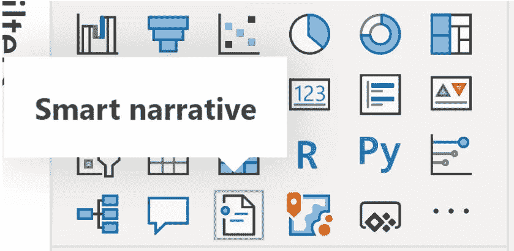
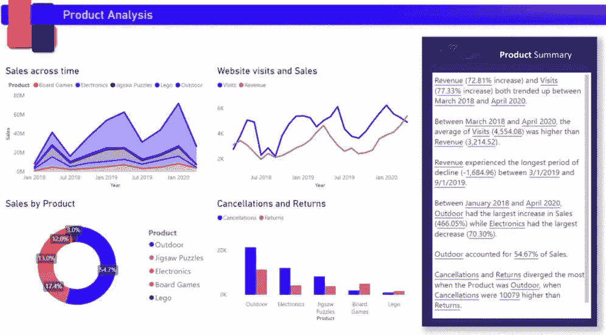
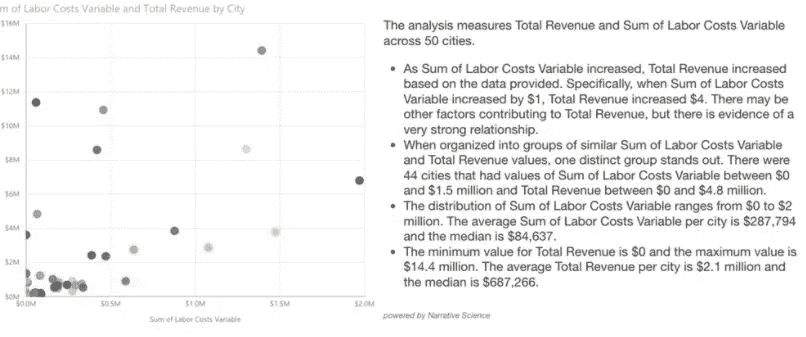

# Power-BI 中的“智能叙事”特征概述。

> 原文：<https://medium.com/analytics-vidhya/an-overview-towards-smart-narrative-feature-in-power-bi-3620ab4bb403?source=collection_archive---------9----------------------->

对于所有数据分析师、数据科学家、数据工程师和喜欢玩数据的人来说，Power-BI 一直是创建出色的数据可视化、图表和更多功能的福音。除了在**自然语言处理(NLP)** 方面的发展，Power-BI 还带来了一个被称为“**智能叙事**！”的伟大特性在【2020 年 9 月，它将以互动/动态文本框的形式展示我们的视觉化见解。

我们一直在使用 Power Point 文本框、交互式标题或自定义视觉效果来为他们的数据添加叙述，以解释数据中的见解，所有这些选项要么缺乏交互式数据、交互式和可定制的文本，要么使用自动见解。智能叙事可视化通过提供可定制的相关开箱即用的见解，帮助快速总结视觉效果和报告！

要在 Power-Bl 中启用智能叙事，请进入:
**文件>选项和设置>选项>预览功能>点击智能叙事**。

启用智能叙述功能后，它可能会出现在可视化效果窗口中。

嗯，这可以有效地用来理解数据，更快地找到关键点，并以更好的方式向客户解释数据。智能叙述可以被认为是一种**智能文本框**，在这里你可以拥有完全动态的文本。我们实际上可以用完全不同的方式来格式化每个单词，或者每个句子，或者每个字符。我们可以应用单独的销售字体大小、字体类型等等，这有助于引出和构建动态评论，而不仅仅是固定的文本，我们还可以根据需求动态地制作文本的一部分。

这就像一个普通的文本框，不同的是它本质上是动态的，而不是静态的。它使用自然语言处理，我们可以直接将一些文本写入框中，或者我们可以单击“**添加值**”以使文本的某些部分作为**动态，**基于提供的可视化。智能叙述的一个问题是，它没有向用户提供任何类型的自定义条件格式选项。

人类和人工智能总是有区别的。Al
擅长用所提供的数据识别联系、相关性和可能的因果关系。考虑到去往相应客户的叙述，陈述“**来源 Y** 的销售额增加了 Xx”或“ **ABC 项目 X 超出预算 Y** ”。这些陈述都是有效的，这可能是 Power-BI 的智能叙事功能提供的，但它们不是需要捕捉的洞察力！洞察力来自于“**由于产品 X** 的促销，Y 源的销售额上升”等陈述。

在不久的将来，人工智能可以被训练来导出这些与数据的联系。但是，如果导致销售的事件是周期性事件，如初冬或夏末，或者是灾难性事件(火灾、洪水、冠状病毒封锁)，该怎么办呢？像**这样的问题需要注意什么？我们应该少做什么？我们做得好吗？我们应该做得更多吗？**没有被聪明的叙述打勾。

得出一个结论，一个聪明的叙述是一个伟大的工具，为提供的可视化生成自动总结。这个功能可以收集一些人类可能**没有**捕捉到的点，这将帮助我们带来洞察力。由于这是 Power-bi 的最新版本，它有很大的发展潜力，但考虑到目前的情况，它可能有点不太可靠**正如上面所讨论的。**

以上是我对 Power-BI 的新功能“智能叙事”的看法，表达了我使用它的第一眼感受。**在下面的评论中分享你的经历和观点，如果对你有帮助，请“喜欢”这篇博客！**

**谢谢！**

## **在 Linkedin 上关注我:**

 [## Gaurav Sahani -数据分析师- eClerx | LinkedIn

### 机器学习，深度学习，云爱好者。喜欢探索新事物，增强和扩展我的知识…

www.linkedin.com](https://www.linkedin.com/in/gaurav-sahani-6177a7179/)