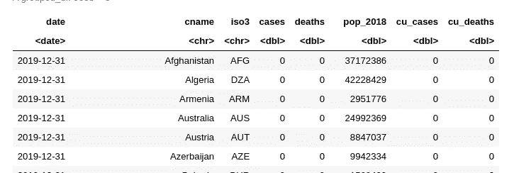
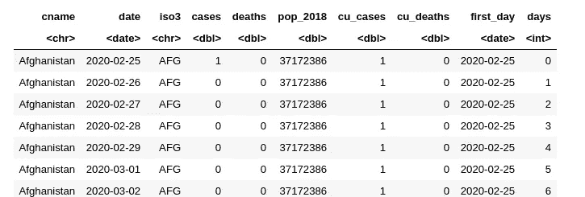
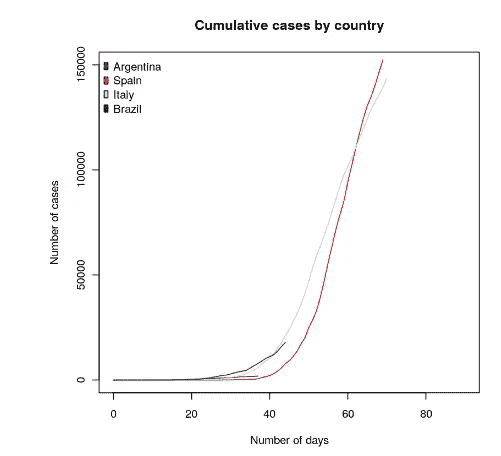
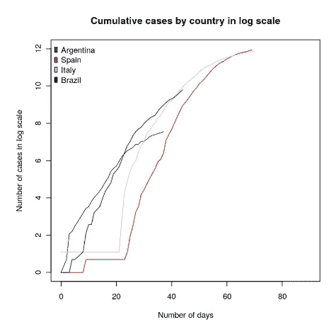

# 给新冠肺炎的 R 包

> 原文：<https://medium.com/analytics-vidhya/an-r-package-for-covid-19-e6697df33862?source=collection_archive---------35----------------------->


戴维·dvořáček 在 [Unsplash](https://unsplash.com/s/photos/convid-19-mask?utm_source=unsplash&utm_medium=referral&utm_content=creditCopyText) 上的照片

*轻松获取新冠肺炎分析数据。*

跟上分析冠状病毒的最新数据非常困难，主要是因为有太多不同的来源需要花费时间来获得它们。

幸运的是， [Kieran Healy](https://kieranhealy.org/blog/archives/2020/04/10/covdata-package/) [1]已经发布了一个新的包，它更新了来自 3 个来源的 CONVID-19 数据。

1.  来自欧洲疾病控制中心的国家级数据。
2.  来自 [COVID 追踪项目](https://covidtracking.com/)【3】的美国州级数据。
3.  美国的州级和县级数据来自《纽约时报》[](https://github.com/nytimes/covid-19-data)**【4】。**

**您可以安装此软件包:**

```
**remotes::[install_github](https://remotes.r-lib.org/reference/install_github.html)("kjhealy/covdata")**
```

**如果您想检查数据库中的 1，您需要:**

```
**covnat**
```

**你会得到:**

****

**这里有日期，国家，2018 年的人口，累计病例和死亡人数。**

**如果您想检查第 2 点和第 3 点的数据，数据库是:**

```
**##for 2
covus
##for 3
nytcovstate
##or 
nytcovcounty**
```

**数据集 covus 有另一个补充性的重要信息，如住院情况、阴性或阳性病例等。**

***曲线:***

**为了便于比较，我们要做第一件事是按国家和日期对数据进行排序，并过滤 cu_cases 大于 0 的行。**

```
**covnat <- covnat %>% arrange (cname, date) %>% filter (cu_cases>0)**
```

**现在，我们将得到每个国家报告的第一个病例。**

```
**#We get the first day for each country
min_day_per_country <- aggregate.data.frame(covnat$date,
                by = list(covnat$cname),
                FUN = min)
#we rename the columns
colnames(min_day_per_country) <- c("cname","first_day")**
```

**然后，我们将其与 covnat 合并。**

```
**covnat <-merge(covnat, min_day_per_country, by='cname' )**
```

**然后，我们添加一个变量“days ”,它将计算从第一天到每个国家的天数。**

```
**covnat <- covnat  %>%  mutate (days=as.integer( date-first_day))**
```

****

**现在是绘制累积病例和对数标度的累积病例的时候了。我们将只绘制 4 个国家:西班牙、意大利、阿根廷和巴西。**

```
**plot(covnat[covnat$cname=='Argentina',]$days, covnat[covnat$cname=='Argentina',]$cu_cases, type='l', col='blue', main='Cumulative cases by country', xlab='Number of days', ylab='Number of cases', xlim=c(0,90), ylim=c(0,150000) )lines(covnat[covnat$cname=='Spain',]$days, covnat[covnat$cname=='Spain',]$cu_cases, col='red')lines(covnat[covnat$cname=='Italy',]$days, covnat[covnat$cname=='Italy',]$cu_cases, col='lightblue')lines(covnat[covnat$cname=='Brazil',]$days, covnat[covnat$cname=='Brazil',]$cu_cases, col='darkgreen')legend("topleft", 
  legend = c('Argentina', 'Spain', 'Italy', 'Brazil'),
  fill =c('blue', 'red', 'lightblue', 'darkgreen'),
    col=c('blue', 'red', 'lightblue', 'darkgreen'),
        bty='n')**
```

**然后我们得到**

****

**对于对数标度，我们做:**

```
**plot(covnat[covnat$cname=='Argentina',]$days, log(covnat[covnat$cname=='Argentina',]$cu_cases), type='l', col='blue', main='Cumulative cases by country in log scale', xlab='Number of days', ylab='Number of cases in log scale', xlim=c(0,90), ylim=c(0,12) )lines(covnat[covnat$cname=='Spain',]$days, log(covnat[covnat$cname=='Spain',]$cu_cases), col='red')lines(covnat[covnat$cname=='Italy',]$days, log(covnat[covnat$cname=='Italy',]$cu_cases), col='lightblue')lines(covnat[covnat$cname=='Brazil',]$days, log(covnat[covnat$cname=='Brazil',]$cu_cases), col='darkgreen')legend("topleft", 
  legend = c('Argentina', 'Spain', 'Italy', 'Brazil'),
  fill =c('blue', 'red', 'lightblue', 'darkgreen'),
    col=c('blue', 'red', 'lightblue', 'darkgreen'),
        bty='n')**
```

**然后我们得到:**

****

**你可以做你想做的分析。对于对数标度，可能建议在案例数量大于某个阈值时开始，并在开始时避免这种奇怪的形状。**

**完整的代码是[这里是](https://github.com/facundodeza/covdatapackage/blob/master/covdata%20package%20(1).ipynb)。**

**这个帖子只是为了演示这个包。**

****参考文献****

**[1][https://Kieran Healy . org/blog/archives/2020/04/10/covdata-package/](https://kieranhealy.org/blog/archives/2020/04/10/covdata-package/)**

**[2]https://www.ecdc.europa.eu/en**

**[3]https://covidtracking.com/**

**[https://github.com/nytimes/covid-19-data](https://github.com/nytimes/covid-19-data)**

**你喜欢这篇文章吗？
***推荐*** *，在你的社交网络上分享***

***要不要和我一起读读数据科学？* ***跟着我*** *上媒***