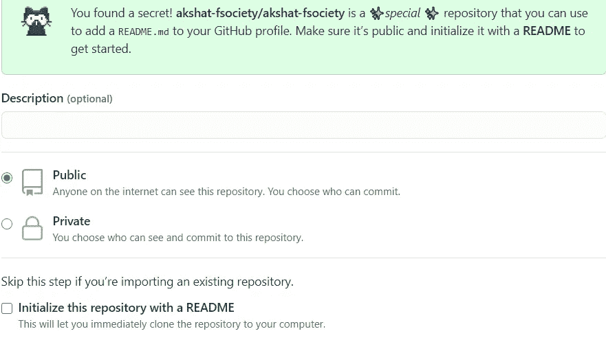

# Git 和 GitHub 的终极指南

> 原文：<https://medium.com/analytics-vidhya/an-ultimate-guide-to-git-and-github-2de760a840ee?source=collection_archive---------17----------------------->


如果你是一名开发人员，那么你一定知道 GIT 和 GITHUB，因为这是一个开发人员居住的地方，世界各地的许多开发人员日以继夜地为开源项目做贡献，甚至更多。

***阅读这篇全文最后有一个额外的提示给你；)***


# GIT 是什么？

GIT 是一个*版本控制系统(VCS)。*

## 那么什么是版本控制系统呢？

如果你是一名开发人员，那么你必须在许多项目上工作，因此在这个时候版本控制系统开始发挥作用，它用于文件管理，跟踪项目随时间的变化，这是最主要的事情之一，它还保留了你正在工作的事情的整个历史。

这对于那些首先开发出基本版本，然后在不影响原始版本的情况下添加新功能的开发人员来说很有帮助。

GIT 提供的另一个令人惊讶的特性是，它允许全球的许多开发人员通过在不同的分支上工作，在不干扰彼此文件的情况下，同时在同一个项目上一起工作。GIT 中的协作很容易，团队成员可以在同一个项目中处理不同的特性。

# 开源代码库


# 什么是 Github？

[GitHub](http://www.github.com) 是一个世界领先的软件开发平台，它是一个使用 Git 进行版本控制的基于 web 的服务。它将协作直接构建到开发过程中。工作被组织到存储库中，开发人员可以在那里概述需求或方向，并为团队成员设定期望。

# 1)你必须知道的基本术语..

**a)存储库:-** 存储库，或 repo，或 git 项目，包含了与项目相关的文件和文件夹的全部集合，以及每个文件的修订历史。

**b) Fork:-** Fork 基本上是你个人 Github 账户上其他用户库的副本，这背后的主要原因是根据你的需要定制其他库。

**c)Master:-**“Master”是一个默认的开发分支，当你创建一个全新的存储库时。创建存储库之后，您可以创建更多的分支。

**d)readme . MD:-**readme . MD 文件是项目的描述性基本文件，包含项目的摘录/描述。

> **有了这个，我们就可以进入 Git 和 Github 的世界，并与世界领先的开发者合作:)**

# **2)安装过程**

## a)对于 Linux 用户:

使用您的 Linux 包管理系统来安装 Git。

```
**> sudo apt-get install git**
```

## b)对于 Windows 用户:

推荐下载 GitHub for Windows，其中包含 Git，安装更容易:[**windows.github.com**](http://windows.github.com/)。为您的终端使用 **Git Shell** 。

## c)对于 Mac 用户:

m[ac.github.com](http://mac.github.com/)(从 Preferences 中选择命令行工具 install)，或者在:[git-scm.com/downloads](http://git-scm.com/downloads)自行下载 Git，并按照安装说明进行操作。

或者，安装[家酿](http://brew.sh/)并运行以下程序，在你的 Mac 上安装最新版本的 Git:

```
**> brew install git**
```

要更新 Git 安装，请使用 Homebrew 的升级选项:

```
**> brew upgrade git**
```

# 3)配置 Git

一旦安装了 Git，打开**终端/shell/命令提示符/bash**

运行以下命令:

```
#*This command will return the latest version of your git version* **>$ git --version***#Set your name* ***>*$ git config --global user.name "<Your Name>"***#Set your email* **$ git config --global user.email "<youremail@example.com>"***#verify with* **>$ git-it verify**
```

# 4)基本的 GIT 命令。

**a)** `**$ git init**` :-初始化一个全新的 Git 仓库，并开始跟踪它。

**b)** `**$git clone**` :-将托管在 Github 上的存储库复制到您本地机器上的一个文件夹中。

跟踪你的文件和 GIT 中的变化。

**d)** `**$git commit**` :-将您的文件保存在 GIT 中。

**e)** `**$git status**` :-显示变更的状态，如未跟踪、已修改或已暂存。

**f)** `**$git branch <new branch-name>**` :-为你的项目创建新的分支。

**g)**`**$git checkout <branch-name>**`:-*【check out】*在一个项目的分支之间切换。

**h)** `**$git merge**` :-将开发线合并在一起。

**I)**`**$git pull**`:-用来自其远程对应方的更新来更新本地开发线。如果团队成员提交了远程上的分支，开发人员可以使用此命令

**j)** `**$git push**` :-将 git 提交上传到 Github 这样的远程存储库。

> 还有更多的命令需要学习，但这些是一些基本的和最常用的 GIT 命令，它们会让你的开发者的生活更加自由。学习这些命令，抢占先机:)

# 开发者现在轮到你为下一代做贡献了！！

# 5)示范以供参考

```
**#Create new folder example: demo****>cd demo** #change directory#create README.md file**>git init** #initialize a new repository**>git status** #you can see untracked README.md file**>git add README.md** #adds README.md file**>git status** #now you can see README.md file is tracked**>git commit -m "initial commit"****>git remote add origin master <link of repository>****>git remote -v** #to check the working of repo**>git push -u origin master**
```

# 6)奖励小费！！！

我相信你一定在等这个*【额外提示】*，所以不要浪费任何时间，让我们开始吧；)

额外的提示是 Github 让你以一种更具视觉吸引力的方式个性化你自己的个人资料…..



## 那么，如何制作这个超赞的知识库呢？

这很简单，只要用你的用户名创建一个新的存储库，然后它会给你一个绿色的盒子，并显示一条消息**“你发现了一个秘密！<您的名字> / <您的存储库名称>是一个特殊的存储库，您可以使用它将 README.md 添加到您的 Github 配置文件中。*确保它是公共的*并用自述文件初始化它以开始使用"**

只需简单地检查我的 Github 帐户和分叉我的存储库，编辑它，并根据您的需要个性化它。

[](https://github.com/akshat-fsociety/akshat-fsociety) [## 阿克沙特-fsociety/阿克沙特-fsociety

### 关于 ME I 我是一名激情开发者，一名技术爱好者，开源贡献者，技术博客作者，作家，导师…

github.com](https://github.com/akshat-fsociety/akshat-fsociety) 

# 结束语

现在我们的讨论到此结束，如果你已经阅读了这篇文章，现在你可以做出贡献，与世界领先的开发人员合作。

我希望你喜欢这篇文章。

如果你想开始你的网络开发之旅，你可以看看这个。

[](/dev-genius/simplified-approach-to-web-development-1699c523f5e0) [## Web 开发的简化方法。

### 在这篇短小精悍的文章中，我将引导你完成学习 Web 开发的整个过程。

medium.com](/dev-genius/simplified-approach-to-web-development-1699c523f5e0) 

> 对知识的投资回报最高。

再次感谢，祝你未来一切顺利！

有疑问可以随时联系我，寻求帮助。

> 电子邮件:——adaksh5@gmail.com
> 
> 网页:——http://www.akshatsrivastava.tk/
> 
> LinkedIn:-[https://www.linkedin.com/in/akshat-srivastava-4812271a9/](https://www.linkedin.com/in/akshat-srivastava-4812271a9/)
> 
> github:-[https://github.com/akshat-fsociety](https://github.com/akshat-fsociety)