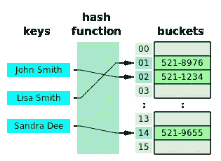
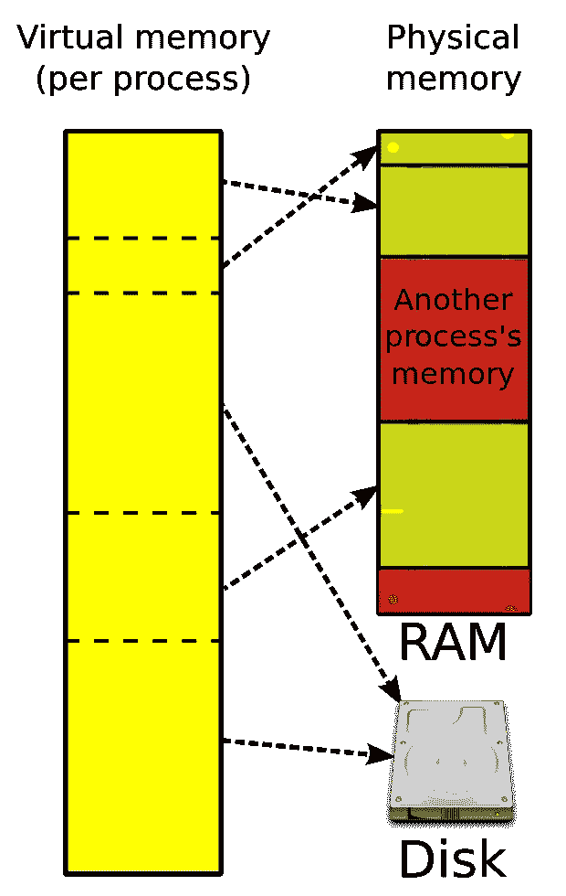

# 哈希表的未被认可的使用

> 原文：<https://medium.com/analytics-vidhya/an-unacknowledged-use-of-hash-tables-f4485ab00b03?source=collection_archive---------30----------------------->


来自[爆发](https://burst.shopify.com/books?utm_campaign=photo_credit&utm_content=Free+Stock+Photo+of+Antique+Books+On+Shelves+%E2%80%94+HD+Images&utm_medium=referral&utm_source=credit)的[莎拉·普弗洛](https://burst.shopify.com/@sarahpflugphoto?utm_campaign=photo_credit&utm_content=Free+Stock+Photo+of+Antique+Books+On+Shelves+%E2%80%94+HD+Images&utm_medium=referral&utm_source=credit)的照片

哈希表是编程世界中最好的发明之一。在大多数情况下，从数据元素池中即时访问值是加速程序的救命稻草。如果我问你哈希表的用法，你会怎么回答？在这篇文章中，我将揭示散列表是如何一直存在，而我们却没有给予它足够的重视。

# 在屏风后面

在使用数据结构之前，理解它的底层架构是很重要的。让我们回顾一下字典是什么——它存储了键和值对。举个例子，

```
contacts = {
   "John Smith": "521-1234",
   "Lisa Smith": "521-8976",
   "Sandra Dee": "521-9655"
}
```



[来源](https://commons.wikimedia.org/wiki/File:Hash_table_3_1_1_0_1_0_0_SP.svg#/media/File:Hash_table_3_1_1_0_1_0_0_SP.svg)

哈希表使用一个*哈希函数*来翻译关键字以识别值桶。通过散列密钥来添加/检索值；在这种情况下，`“John Smith”`被散列为唯一值`02`，该值对应于存储其值`“521–1234”`的桶。

你可以在这里查看各种散列方法。C *碰撞*(两个键散列到同一个桶)是选择散列函数*时的一个警告。*专家们很久以前就已经通过使桶成为链接列表存储以将多个值保存在同一个桶中或者对键进行双重散列以总是指向唯一的桶来补救这个问题。

# **我们没有想到的用途**

你电脑中一个极快的内存(紧挨着缓存)就是你的 ***随机存取存储器*** 。*静态 RAM*将值存储在内存空间中，处理器知道其 RAM 中的每个内存地址。数据的存储和检索没有什么新奇的。如果一个程序运行，它会为实际的程序及其数据占用连续的内存空间。因此，另一个想要运行的程序必须在二级内存中等待，直到空间被清空，它才能启动。

计算机科学家必须想出一个聪明的方法来管理内存。他们想出了 ***动态内存*** ，这给每个程序创造了一个假象，让它有空间开始执行。这种错觉是通过将物理内存地址映射到虚拟地址来实现的(就像提供一个邮政信箱号码而不是您的实际地址一样)。内存管理单元(MMU)通过页表来促进这种转换。



DRAM — [图像源](https://commons.wikimedia.org/wiki/File:Virtual_memory.svg#/media/File:Virtual_memory.svg)

基于哈希函数，处理器能够外推到 16x 或 32x 内存，尽管它在物理上没有这样的空间。它对这个虚拟地址(键)到物理地址(桶 id)的映射和访问数据(值)有影响吗？Y ***es。哈希表。*** 我们一直把它们当做硬件里的原始来用！

惊呆了。🤯