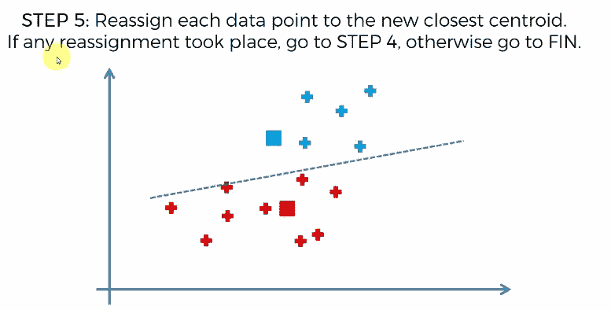

# 基于 K-means 算法的无监督场景

> 原文：<https://medium.com/analytics-vidhya/an-unsupervised-scenario-with-k-means-algorithm-5312fee552b8?source=collection_archive---------12----------------------->

梅尔·普尔在 [Unsplash](https://unsplash.com?utm_source=medium&utm_medium=referral) 上的照片

在这篇博客中，我将以最简单的形式解释 K-means 算法。所以读者们，准备好行动吧。

欺诈检测和网络入侵是 K 均值聚类派上用场的地方。

就像在分类过程中，我们在数据集中有标签，用于将新数据点分类到相应的标签类，我们在聚类问题中没有提到任何类。因此，为了对没有标签的数据点进行分类，我们将遵循以下步骤:

1.  首先，为要分类的数据点选择随机数量的聚类。设，它是 K 个随机簇。
2.  随机取 K 个质心作为 K 个簇。每个聚类在 n-D 平面上的表示都有一个质心。
3.  将每个数据点分配到其最近的质心形成了空间中数据点的 k 聚类。
4.  再次计算 k 个聚类的质心，看它们是否为该组形成任何新的聚类。
5.  如果是，继续移动该组数据点的质心的过程，直到这 k 个聚类组的质心没有变化。

让我们以这个例子为例，我们选择了**集群** **K=2**

在这之后，取 **2 个质心**(因为我们取了 **k=2** )为你在平面上任意位置的数据点组成聚类

现在，我们可以通过绘制一条从连接两个质心的线的**中心穿过的**垂直线**，将每个数据点分配到其最近的质心。现在，该垂直线上半部分的数据点将被分配给**蓝色质心**，下半部分被分配给**红色质心**。这是因为如果我们取垂直线上的任何一点，那么该点与红色和蓝色质心的距离总是相等的。**

之后，再次计算蓝色数据点和红色数据点的质心。我们将注意到从旧质心到新质心的转移。

再次从连接两个新质心的线的**中心画一条新的**垂直线**，并用这条新的垂直线分隔数据点。**

现在，继续重复重新分配新质心的相同过程，以对两个数据点聚类进行分类，直到在新质心中看不到变化。在我们得到这两个质心之后，我们将在那里停下来，为这两组数据点形成两个集群。**参考。本段下提供的 gif 文件，以便理解清楚**。

一次又一次地重新分配新的质心以获得 K 组聚类

## 随机初始化陷阱→

在我们的 n 维空间有了 k 个簇之后，我们可能会面临随机初始化陷阱的问题。在这种情况下，因为我们的星团质心随机初始化。例如，如果我们的多维空间中有这样的数据点

这里我们选择 k =3，随机初始化质心为

那么我们将会像这样结束我们的集群

如果我们像这样设置我们的集群

那么我们最终将优化集群设置为

这是我们数据集的优化聚类集，而不是上面的那个。

所以，为了解决这个随机初始化陷阱的问题，我们使用了 **Kmeans ++算法。**因此，我们将在我接下来的博客中研究这个 Kmeans ++算法。

## 如何为 n 维空间中的数据点选择正确的聚类数→

因此，为此我们将首先假设我们的 k 个簇将在一组定义的整数之间(让它在 2 到 12 之间)。然后我们将通过计算 **WCSS(类内平方和)**

k=3 时如何计算 WCSS

**对于我们的 k = 2 到 k = 12，将第一种情况下的 2 个质心初始化为最后一种情况下的 12 个质心。**

当我们绘制 WCSS 与 k-聚类图时，我们会注意到一条肘形曲线，其中 WCSS 将显示从高到低的突然下降，因为 WCSS 与 k 成反比。因此，k 具有稳定下降的点，而不是像我们的肘关节所在的点那样突然下降，这是我们在为数据点选择 k 值时应该考虑的点。

所以，我希望你喜欢看我的博客。如果您有任何疑问，请通过下面的评论让我知道。在此之前，学习、理解、实施和重复。