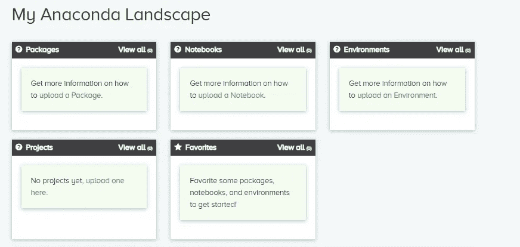
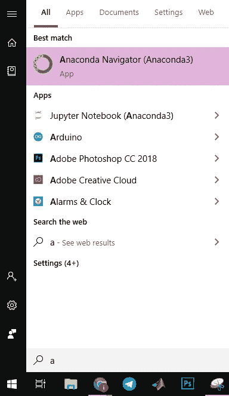
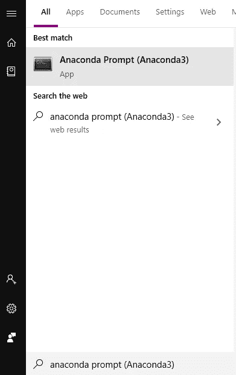
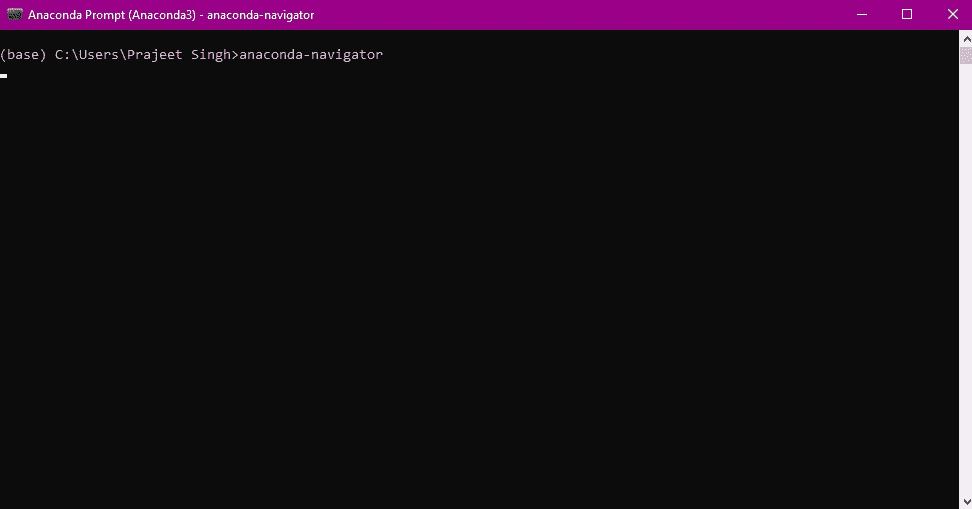
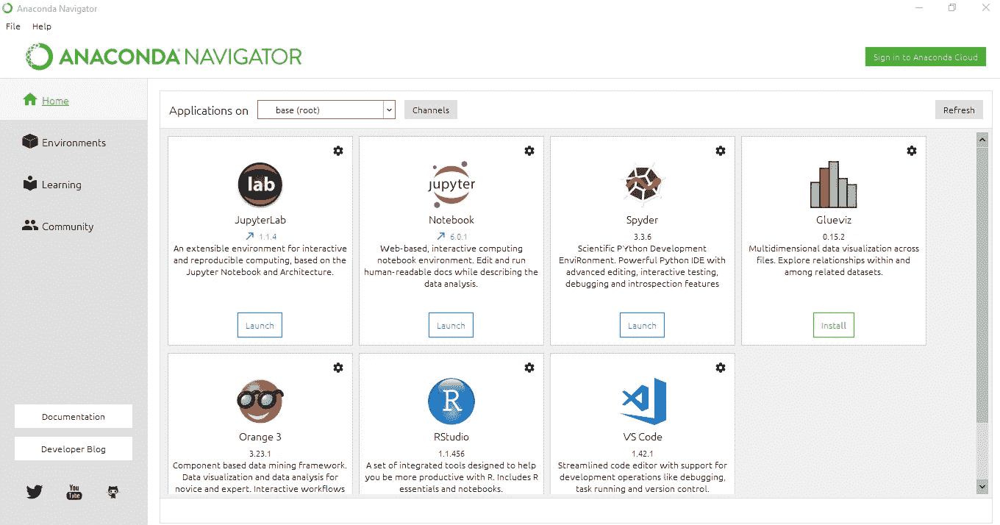
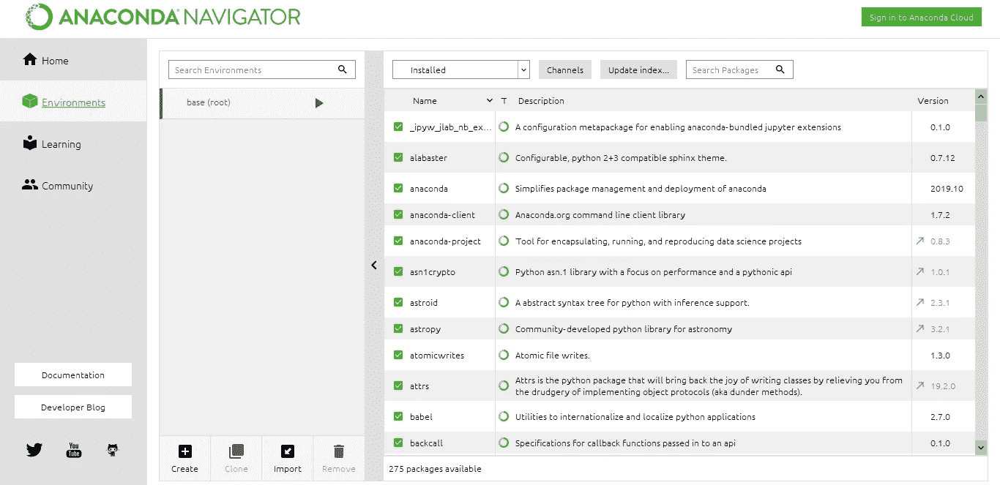
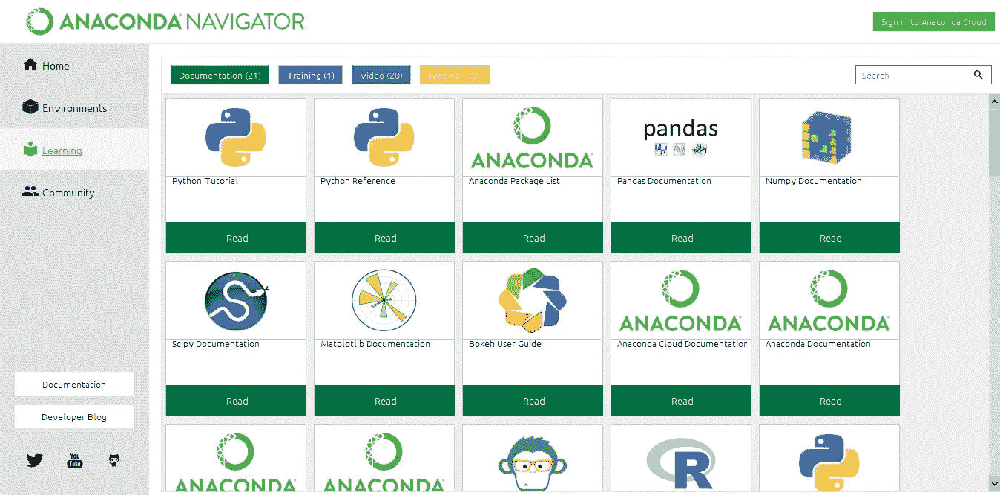
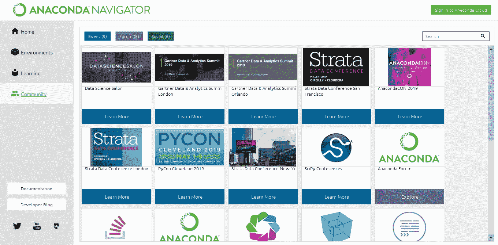
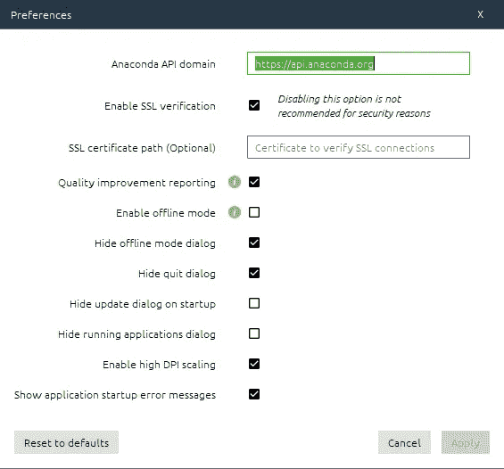

# Anaconda Navigator |概述

> 原文：<https://medium.com/analytics-vidhya/anaconda-navigator-an-overview-4e5d27ca8047?source=collection_archive---------5----------------------->

# 入门指南

Anaconda Navigator 是一个图形界面，用于启动常见的 Python 程序，而无需使用命令行来安装软件包和管理您的环境。它还允许您启动应用程序并轻松管理 conda 包、环境和通道，而无需使用命令行命令。Navigator 可以在 Anaconda Cloud 或本地 Anaconda 存储库中搜索包。它适用于 Windows、macOS 和 Linux。

> 为什么使用 Navigator？

Navigator 是一种简单的点击式方法，无需在终端窗口中键入 conda 命令即可使用软件包和环境。您可以使用它来查找您想要的包，将它们安装到一个环境中，运行这些包，并更新它们——所有这些都在 Navigator 中完成。

> Navigator 提供的应用程序

默认情况下，Anaconda Navigator 提供了以下应用程序:

*   木星实验室
*   *朱庇特笔记本*
*   Spyder
*   皮查姆
*   虚拟代码
*   Glueviz
*   橙色 3 应用程序
*   r 工作室
*   Anaconda 提示符(仅适用于 Windows)
*   Anaconda PowerShell(仅限 Windows)

# 装置

Navigator 支持以下操作系统:

*   Windows 8 及更高版本| 32 位或 64 位
*   macOS 10.13+ | 64 位
*   Ubuntu 14+/Centos 6+ | 64 位

Python 版本:2.7、3.6、3.7、3.8

下载 [Anaconda Navigator](https://www.anaconda.com/distribution/) ，下载完成后运行*。要安装的 exe* 文件。安装完成后，你将被重定向到[https://anaconda.org/](https://anaconda.org/)，在那里你必须注册，一个类似这样的仪表板将会出现，它会给你关于软件包、笔记本、环境等各种信息。

注册页面

> 启动导航器

*   从“开始”菜单，单击 Anaconda Navigator 桌面应用程序。

*   或者从开始菜单中，搜索并打开“Anaconda Prompt”并输入 *anaconda-navigator*

命令提示符屏幕

# 发布和编码

启动应用程序后，您将看到 Anaconda 支持的环境，如 Jupyter Notebook、Spyder、RStudio 等。

除了所有这些信息之外，您还会看到各种选项卡，如学习、社区等。这对刚刚进入这种环境的初学者很有帮助。

主页选项卡-显示所有可用的应用程序

# 环境选项卡

环境选项卡允许您管理已安装的*环境、包和通道。*

左栏列出了环境，您可以单击任何环境来激活它。而右边的列列出了当前环境中的包。默认情况下，它显示已安装的软件包。必须记住，我们一次只能选择一个环境。

# 学习选项卡

学习选项卡为您提供了学习更多关于 Navigator、Anaconda Plateform 和 open Data Science 的选项。您可以选择各种学习方式，如*文档、培训、网络研讨会或视频按钮。*

# 社区选项卡

在这里，您可以了解有关 Navigator 的活动、免费支持论坛和社交网络的更多信息。单击*事件、论坛或社交按钮*，然后单击任何项目在浏览器窗口中打开它。

更多关于 Anaconda 和 Navigator 的帮助，可以加入 [*Anaconda 论坛*](https://groups.google.com/a/anaconda.com/forum/#!forum/anaconda) *。*

# 文件菜单

导航器文件菜单包含以下选项:

*   关于:显示关于 Navigator 的信息，包括错误报告和功能请求的链接。
*   首选项:允许您设置导航器首选项。

> P 参考

在首选项窗口中，您可以执行以下操作:

*   重置 Anaconda API 域以指向本地 Anaconda 存储库，而不是 Anaconda 云
*   启用或禁用 SSL 验证。
*   可以选择设置证书来验证 SSL 连接。
*   切换选项以提供不可识别的个人信息来帮助改进产品。
*   启用或禁用离线模式。
*   隐藏脱机模式对话框。
*   退出程序时隐藏退出对话框。
*   启动程序时隐藏更新对话框。
*   隐藏“关闭正在运行的应用程序”对话框，如果仍有从 Navigator 启动的正在运行的应用程序，该对话框通常会在退出程序时显示。
*   使用启用高 DPI 缩放选项修改导航器的显示。如果 Navigator 在某些高 DPI 屏幕上显示不正确，此选项会很有用。
*   显示应用程序启动错误消息。

# 帮助菜单

帮助菜单包含以下选项:

*   *搜索—* 链接到您电脑的帮助。
*   *在线文档*–链接到[本文档](https://docs.anaconda.com/anaconda/navigator/help-support/)，您可以在任何网络浏览器中阅读。
*   *日志查看器*–允许您查看当前会话中在 Navigator 中执行的所有操作的日志。

# 导航窗口按钮

*   *登录 Anaconda Cloud*——显示在右上角。按一下即可登入 Anaconda Cloud(Anaconda.org ),并在上面搜寻包裹。登录后，按钮标签会变为“以[用户名]身份登录”
*   *文档*–显示在左下方。单击以在浏览器中打开导航器文档。
*   *开发者博客*——显示在左下角。点击阅读我们的开发人员对导航器开发的看法。
*   *社交媒体*–显示在左下方。点击查看我们的 Twitter、YouTube 和 GitHub 页面。

# 更多资源

> 社区支持[bit.ly/anaconda-community](http://bit.ly/anaconda-community)
> 
> 训练[anaconda.com/training](http://anaconda.com/training)
> 
> 咨询[anaconda.com/专业服务/](http://anaconda.com/ professional-services/)