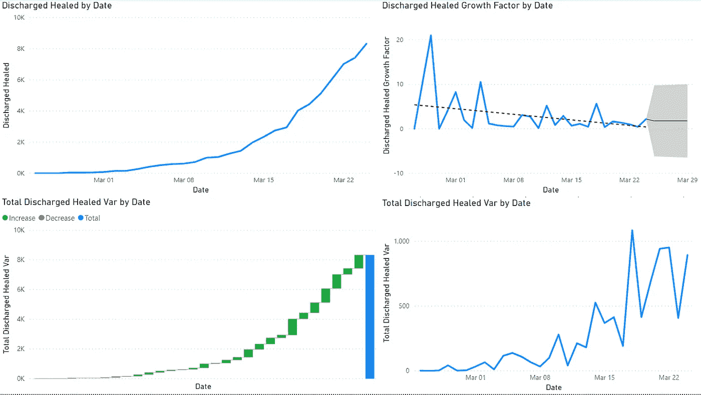

# 用 Excel 和 Power BI 分析新冠肺炎在意大利的传播

> 原文：<https://medium.com/analytics-vidhya/analyse-covid-19-spreading-in-italy-with-microsoft-excel-and-power-bi-a4ac70cb4d11?source=collection_archive---------18----------------------->

## 使用 Microsoft Power BI 分析新冠肺炎数据

[https://en . Wikipedia . org/wiki/2020 _ 冠状病毒 _ 疫情 _ 意大利](https://en.wikipedia.org/wiki/2020_coronavirus_pandemic_in_Italy)

一如既往，让我们应用 **CRISP-DM 流程**(跨行业数据挖掘流程)来解决这个问题:

1.  **商业理解**
2.  **数据理解**
3.  **准备数据**
4.  **数据建模**
5.  **评估结果**
6.  **展开**

**业务理解**

目的是对新冠肺炎教在义大利的传播有一些了解

流行病经常被模拟成逻辑函数。关于这方面的更多信息可以很容易地在网上找到。我想推荐这个非常有趣的[帖子](https://www.wired.com/story/the-promising-math-behind-flattening-the-curve/)在 [Wired](https://www.wired.com/) 上，还有这个 Youtube [视频](https://www.youtube.com/watch?v=Kas0tIxDvrg)，它聚焦于这个建模假设背后的数学

物流功能

简而言之，逻辑函数基本上由最初的指数增长组成，直到拐点，在拐点，增长将开始变成趋向最大值 L 的对数

两个连续点的变化是它们的值之间的差，通过除以两个连续点的变化，我们可以计算出增长因子。当增长因子类似于 1 时，我们接近拐点

**数据理解**

自 2020 年 2 月底[意大利民事保护部门](http://www.protezionecivile.gov.it/)在这个 Github [资源库](https://github.com/pcm-dpc/COVID-19)发布了关于新冠肺炎在意大利传播情况的数据。欧洲中部时间每天下午 6 点更新数据

如 [wiki](https://github.com/pcm-dpc/COVID-19/wiki/1.it-Dati:-andamento-nazionale) 中所述，数据由以下部分组成:

知识库 wiki 部分的意大利语数据字段描述

对于区域数据，我们还有:

*   codice_regione:区域标识符
*   denominazione_regione:地区名称
*   lat:该地区的纬度
*   long:该地区的经度

英语数据字段描述

我还使用了来自人道主义数据交换的数据来比较意大利和其他国家的情况。正如我将在后面解释的，我把重点放在了死亡人数上

*   省/州:州
*   国家/地区:国家
*   Lat:国家的纬度
*   Long:国家的经度
*   日期:记录的每一天一栏

当某一天由于任何原因没有可用数据时，将复制前一天的数据，以避免时间序列中出现任何间断

这两个源都是在线托管的 CSV 格式

**准备数据**

使用 Microsoft Power BI 功能连接到 web 数据源，从网站上实时提取数据

dpc-covid19-ita-regioni.csv

由于之前的[项目](/@simone.rigoni01/visualize-istat-data-with-microsoft-power-bi-faef3594c155)，我已经准备好一个 CSV 文件来构建位置层次**状态** — **地理区域** — **宏区域** — **区域**

意大利由以下国家组成:

*   3 地理区域:北部、中部和梅佐吉奥尔诺
*   4 个大区:西北区、东北区、中部区、南部区和伊索勒区
*   20 个地区

位置关系构建

构建位置层次结构将允许我们向上/向下钻取意大利的数据

时间序列 2019-ncov-死亡人数. csv

为了使来自人道主义数据交换的数据更容易处理，我已经取消了所有与日期相关的列。

**数据建模**

导入数据后，我对表进行了规范化，并为意大利构建了位置维度

位置维度:
-州
-地理区域
-宏观区域
-地区

需要更多的映射来修复位置层次结构中的一些错位

数据模型

为了使用向上/向下钻取功能，我构建了一个位置表，其中包含位置维度的所有名称

创建的度量:
- **总死亡人数**:死亡人数值总和
- **前一天总死亡人数**:前一天死亡人数值总和
- **前一天总死亡人数 Var**-
-**总死亡人数 Var** :总死亡人数-前一天总死亡人数
- **总出院治愈人数**:出院治愈人数值总和
- **前一天总出院治愈人数**:总和 前一天的出院治愈值
- **前一天的出院治愈总 Var**
- **前一天的出院治愈总 Var**
- **死亡增长因子**:死亡总 Var 除以前一天的死亡总 Var
- **前一天的出院治愈总 Var 除以前一天的出院治愈总 Var
- **估计感染**:死亡总死亡率**

**评估结果**

该病毒于 2 月中旬开始在意大利北部尤其是伦巴第大区传播

意大利传播概述

意大利总计概览

意大利宏观地区概览

意大利各地区概览

由于不可能每天测试全部人口以获得真实的感染人数，让我们考虑死亡人数和治愈人数作为我们分析的起点，以尝试估计感染人数。这种直觉来自于我的朋友安东尼奥和关于意大利现状的无休止的讨论

已故的

痊愈出院

我们可以看到，变异和生长因子是非常“嘈杂的信号”

我们可以应用一些滤波技术来平滑信号，例如[移动平均线](https://en.wikipedia.org/wiki/Moving_average)，以了解我们目前在逻辑曲线上的位置。现在我们是否接近拐点了？

我用 Excel 输入数据，计算出增长因素的预测值，考虑到经济放缓 4%。这种减缓的假设是，意大利政府采取的封锁措施将很快减缓新感染人数，从而减轻意大利医疗保健系统([Servizio Sanitario Nazionale](http://www.salute.gov.it/portale/salute/p1_4.jsp?lingua=italiano&area=Il_Ssn))的压力，进而减少每天的死亡人数。为了平滑变化，我使用了窗口 4 的移动平均线。我还试图平滑生长因子而不是变化，但结果非常糟糕，这是因为生长因子是两个连续变化的除法，所以我们对原始信号而不是衍生信号进行平滑会更好

用 excel 预测生长因子

黄色表示让移动平均线在窗口 4 下工作所需的数据点，橙色表示所需的输入。我还考虑了增长因素放缓的权重下降

已故预测用橙色标记，而当前数据用蓝色标记

我正在考虑 60 天的时间框架，这符合病毒在中国传播的演变

生长因子预测

变化预测

实际死者和死者预测之间的误差

从这个模拟中可以看出，在意大利，我们现在已经非常接近拐点了

让我们把死亡人数与其他国家进行比较

按国家分列的世界死亡人数

通过及时移动所有曲线，我们可以更好地比较每个国家的轨迹

感染天数中的世界死亡人数

我们可以看到，中国现在正处于对数增长阶段，而所有其他国家或多或少都处于指数增长阶段(常数段是由缺失数据造成的)。时间序列中的这个间隙用前一天的值的副本来填充)

让我们假设死亡率是 8%，相对于估计的[一个](https://en.wikipedia.org/wiki/Coronavirus_disease_2019)来说是两倍。需要多少感染者才能看到目前的死亡人数？

估计感染人数

**部署**

使用 Power Bi 可以在在线 Power BI 服务上发布报告

**结论**

我不是病毒学或生物学方面的专家，我只是试图查看我们拥有的数据，并试图对其进行分析。从目前的情况来看，受感染的人数远远高于实际估计的人数，意大利应该非常接近拐点

**2020 年 6 月 4 日更新**

比较一下我发表这篇文章时(2020 年 3 月 25 日)到现在的情况，情况有很大的不同:在意大利，我们已经很快超过了 12000 的死亡人数，现在逻辑曲线的估计 L 约为 20000。从这一点来看，实际死亡人数(蓝色曲线)的下降速度比预测的要快，所以这个模型应该是一个我们无法超越的上限(或者至少让我们希望如此)

已故预测用橙色标记，而当前数据用蓝色标记

从世界范围来看，西班牙和美国的死亡人数增长非常迅速。正如我们所见，西班牙和美国在疾病传播方面比意大利大约落后 10 天，这意味着它们仍处于指数增长阶段的开始

感染天数中的世界死亡人数

**2020 年 10 月 17 日更新**

从上次更新(2020 年 6 月 4 日)到现在，情况有很大的不同:在意大利，我们已经很快超过了 30000 死亡人数，现在逻辑曲线的估计 L 约为 36000。在这些天里，我们可以看到死亡人数略有增加。我们有可能正处于一条新的逻辑曲线的起点吗

已故预测用橙色标记，而当前数据用蓝色标记

从世界范围来看，美国和巴西的死亡人数仍在快速增长，而其他国家似乎仍处于对数增长阶段

感染天数中的世界死亡人数

**注意:**代码可以在这个 github [仓库](https://github.com/simonerigoni/covid-19_italy_analysis)中找到