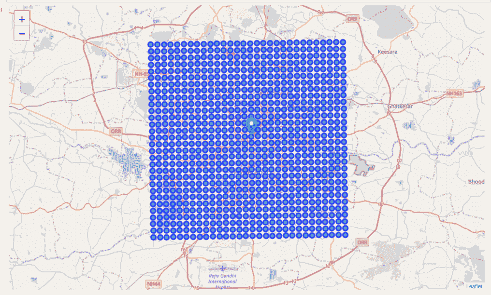
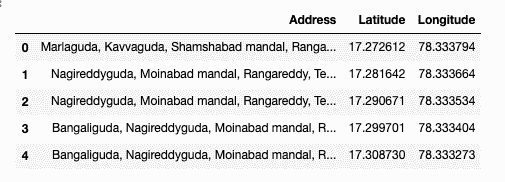
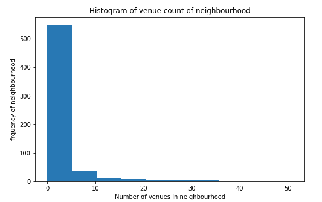
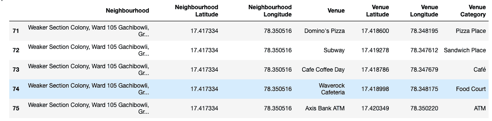
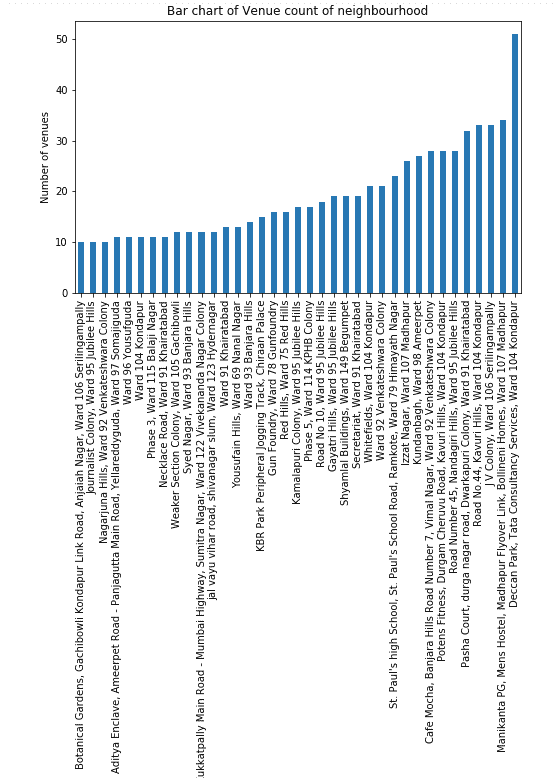
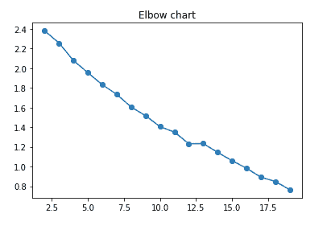
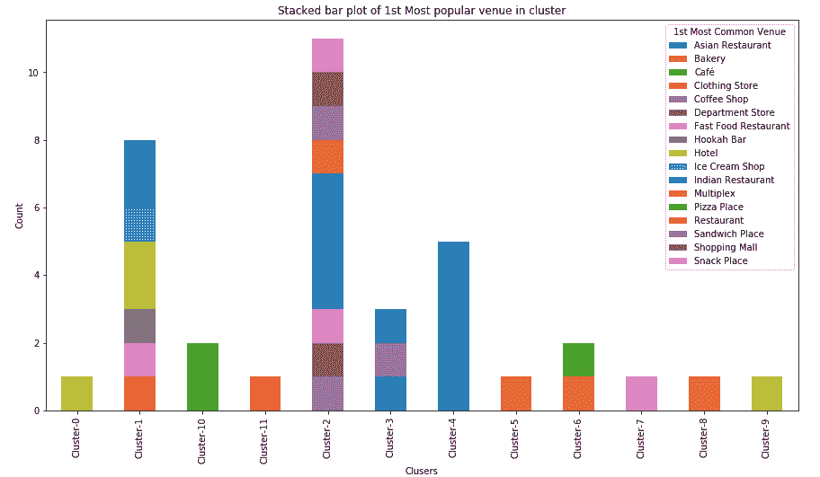
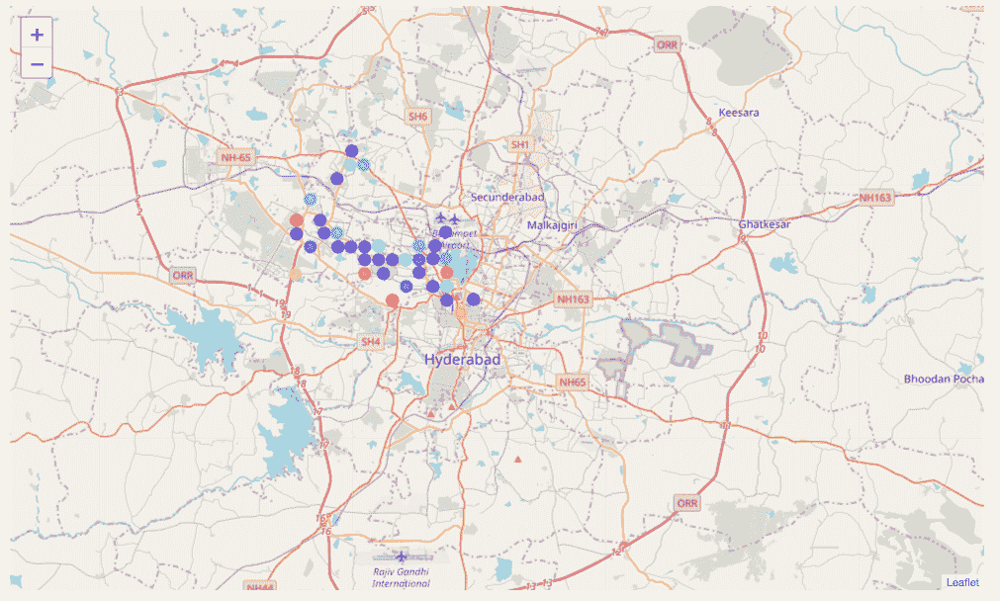
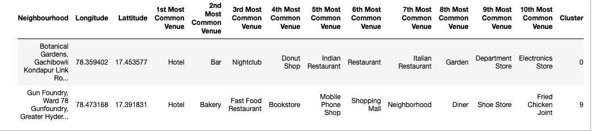
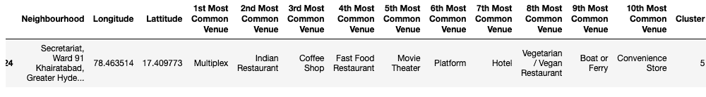

# 分析海得拉巴的街区数据

> 原文：<https://medium.com/analytics-vidhya/analyse-neighbourhood-data-in-hyderabad-654df8cbd839?source=collection_archive---------25----------------------->

# 简介/业务问题

位置是餐馆成功的最重要的方面。位置不当会导致客流量和收入减少，最终导致餐馆倒闭，从而导致投资者损失。因此，对于投资者来说，在选择地点时采用数据驱动的方法是非常有价值的。

此处的问题陈述旨在确定 Hyderabad 的位置特征，这些特征可用于判断开设餐厅的位置是否合适。

# 数据

作为解决问题的一部分，海得拉巴市将以市中心为中心点划分成正方形。从市中心开始，海得拉巴向两边延伸了 15 公里。因此，我们将它分成 30x30 的正方形，每个块的大小为 1x1 平方公里。我将使用 geopy 库查找海得拉巴中心的坐标(海得拉巴中心地址将是蓝毗尼公园)。基于中心坐标，我会用算法把城市分成几块。并将确定每个区块的经纬度。我将使用 **geopy** 库来查找每个街区的邻居名称。一旦附近的信息可用，我将使用 **foursquare** venue API 获取附近受欢迎的场地。

一旦我准备好了所有数据(即街区名称、纬度、经度、场馆名称、场馆类别等)，我将研究这些数据，应用 ML 模型，评估该模型，并最终展示结果和结论。

# 方法学

我们将确定在海德拉巴开设餐厅的最佳地点。让我们首先确定海得拉巴市中心蓝毗尼公园的坐标。

接下来我们把我们市中心每个方向 15 公里的正方形区块划分成 1x1 网格。请注意，使用 square 并不是最佳选择，因为我们在使用 Foursquare venue API 时会错过角落的场地。我们将在未来的版本中解决这个问题。现在让我们只使用正方形，因为生成正方形块的算法相对来说比较容易。我们将创建一个区块中心重叠在海得拉巴市中心使用叶。

由于我们的城市中心在地理坐标中，我们需要将其转换为笛卡尔坐标。一旦我们有了市中心的笛卡尔坐标，我们就可以使用该信息来计算 1x1 街区的笛卡尔坐标。1x1 区块的笛卡尔坐标将转换回地理坐标。

现在我们已经有了带有中心坐标的块，我们将使用 geopy 库找到块中心的邻域名称。我们将使用区块的经度和纬度信息。

现在我们有了街区的地理坐标，让我们为每个街区找出半径为 500 米的前 100 个场馆。为此，我将使用 Foursquare API。Foursquare API 有时没有场地的类别信息，我们会在事后丢弃这样的记录。

我们有 1517 个分门别类的场馆。现在，让我们来看一个直方图分布，看看场馆附近的分布情况。

从上面的直方图可以明显看出，大部分街区只有 10 个或更少的场馆。这表明缺乏这种邻域的数据，因此现在让我们丢弃它们。

我们现在可能有 37 个社区可供选择。让我们看看这些街区的场地分布。

块名

从上图可以看出，Kondapur 和 Madhapur 的场地较多，记者殖民地和 Serilingampally 的场地相对较少。

现在我们有了完整的数据，我们需要决定我们的模型。我们数据中最重要的特征是场馆的类别及其邻近地区。我们需要标记我们的邻居数据。分类和聚类是标记这些数据的两种方法。分类是一种监督算法，需要我们没有的训练数据。因此，我们将采用聚类方法。我们将尝试 k 均值聚类算法，并使用肘方法选择最佳 k。

肘点在 k=12 时可见。我们将用 k=12 对我们的邻居进行聚类。然后，将通过创建跨集群的第一个最常见场馆的条形图来分析每个集群。

# 结果

投资者希望在服务水平不高的地方或吸引大量人群的地方开设餐馆。根据我们的分析，酒店和影城是吸引大量人群的场所。让我们来看看这两类集群的数据。

酒店

多样的

从上面两个

1.酒店集群大多是混合类型的场馆，位于热门场馆的第二至第十位。

2.多厅集群在第 5 点还有一个电影院，在第 7 点有一个酒店。

因此，在第 5 区附近开一家餐馆更有意义

那就是**秘书处，海德拉巴海尔塔巴德**。

# 结论

我们根据十大热门场馆对海德拉巴的街区进行了分析，并对最热门的场馆进行了加权，以确定合适的街区。

虽然我们找到了答案，但仍有很大的改进空间。今后，我们将重点关注以下改进，以得出更准确的结果。

1.  把积木换成六边形是比较接近圆形的一种。这样我们将避免错过广场角落的场地。
2.  在决定是否适合在附近开餐馆时，引入餐馆得分。餐厅的分数也应该考虑到场地的受欢迎程度。
3.  引入 DBSCAN 聚类算法，该算法可以创建任意形状的聚类以提供更好的结果。

请随时提供进一步改进的建议。

谢谢，