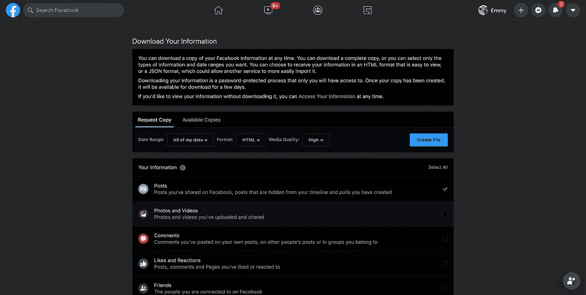
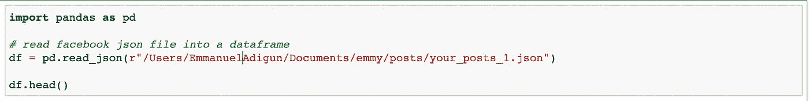
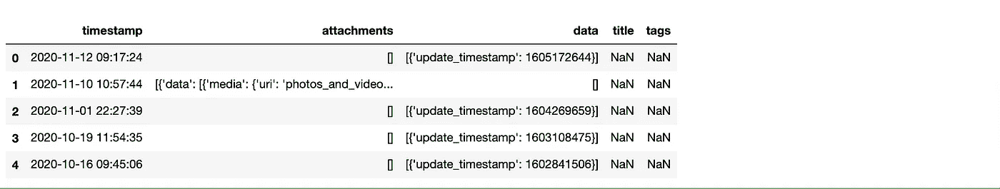
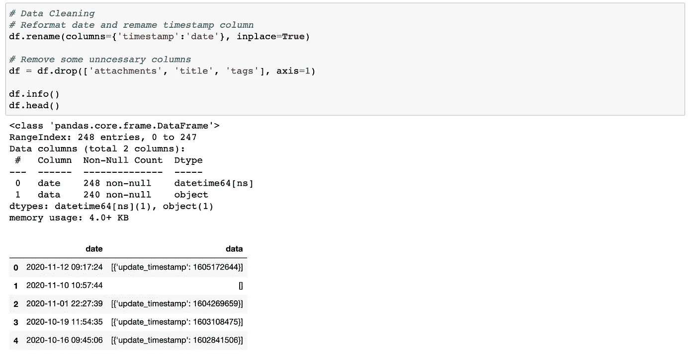
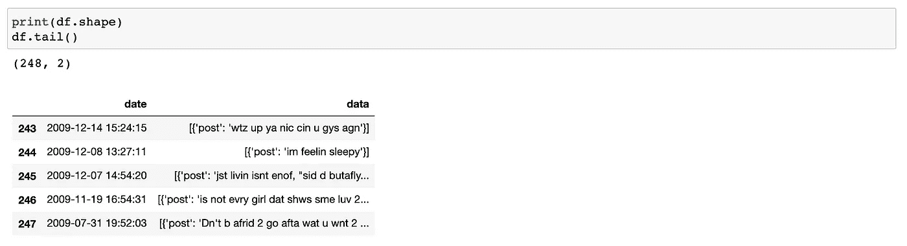
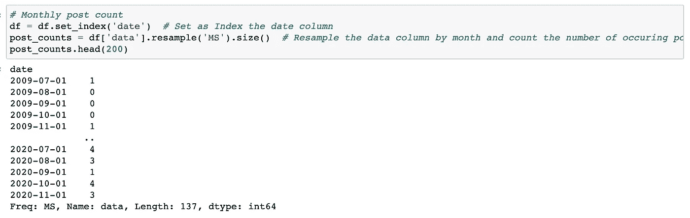
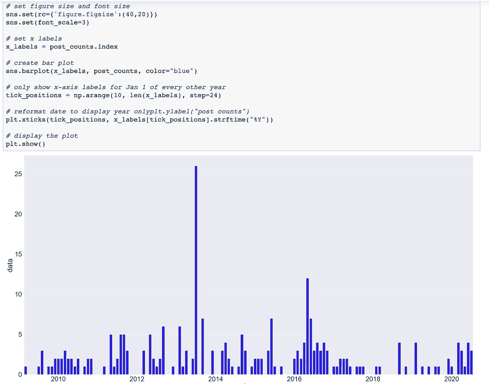

# 使用 Python 分析您的个人脸书数据

> 原文：<https://medium.com/analytics-vidhya/analyse-your-personal-facebook-data-with-python-5d877e556692?source=collection_archive---------7----------------------->

图片来源:towardsdatascience.com

从 Twitter 开始，我一直在尝试做一些关于社交媒体分析的东西，但我一直在创建 Twitter 开发帐户 API 方面遇到挑战…所以我转到脸书，试图分析我自 2009 年加入脸书以来的帖子数…是..那是 11 年前的事了..有意思！！..跟我来。！

1.  **下载您的脸书数据**

脸书允许我们将网站上的每一项活动下载成文件。你可以[在这里](https://web.facebook.com/dyi/?referrer=yfi_settings&_rdc=1&_rdr)下载你的数据。但是您可能不需要所有选中/选中的项目，该文件可能很大，这取决于您使用脸书的频率和持续时间。我的是 1MB。

我们将在分析我们的帖子时回答这些问题

*   我多久发布一次
*   我使用脸书的次数比以前多了还是少了？

回到我们的[数据下载脸书页面](https://web.facebook.com/dyi/?referrer=yfi_settings&_rdc=1&_rdr)。我们将取消所有选项，只检查帖子。我们还会将请求的文件格式从 HTML 更改为 JSON，然后单击 Create File。

文件创建完成后，脸书会通知您文件已经可以下载了。这可能需要一段时间，取决于你的脸书历史。

下载 zip 文件，解压缩并查找“posts”文件夹和其中名为“your_posts_1.json”的文件。

**2。数据清理**

现在是我们动手的时候了..哇哦。启动 Jupiter 笔记本或 VS 代码，我们开始导入我们的库。我们导入熊猫和我们刚刚下载的脸书 JSON 文件，并将其读入数据帧。

内置的 *pd.read_json()* 函数将能够自动解释数据帧中的 json 数据

我们这里的重点不是实际的文章内容或附加的媒体文件。我们关心的是频率——发布新帖子的频率。

接下来是清理我们的数据。为此，我们删除了一些不必要的列。有几行写着 NaN——这些帖子只包含图片，没有文字。图像将在“附件”栏中链接。我们还将把“时间戳”列重命名为“日期”

在这个阶段，我们有一些更清晰的数据可以处理。我们可以获得一些关于我们想要分析的数据的信息。

[df.info](http://df.info) ()将为您提供有关数据的简短摘要信息

df.shape 将计算我们正在分析的帖子的行数

df.head()将获得前 5 行数据

df.tail()将检查数据帧的结尾

以我个人的脸书数据为例，我总共发布了 248 次……哇！！。我的数据从 2009 年开始。

**3。计算每月帖子数量**

逐月查看我们的数据会很有意义。这意味着我们需要按月对“日期”列进行分组，并计算每个月有多少行(即文章)与之相关联。

这是时间序列数据的一个例子，pandas 的设计使得处理起来相对简单。我们需要做两件事:

1.  将日期列设置为数据帧的索引
2.  按月对数据进行重新采样，计算每个月有多少帖子

对于第一步，我们可以使用 set_index()。对于第二步，我们将执行以下操作

1.  选择我们要重新取样的列——“数据”列
2.  使用。带有参数“MS”(表示“月初”)的 resample()函数按月对数据进行重采样
3.  使用。size()来指定我们每个月想要度量的内容——在本例中，是发布日期在该月内的行数(即帖子数)。
4.  将结果序列赋给一个名为 post_counts 的变量。

我们已经得到了按月细分的帖子数量，如果我们从原始数据集进行确认，我们可以看到数量是正确的。

请注意，没有帖子的月份被正确地计为 0，而不是简单地跳过。

**4。可视化您的脸书用法**

现在是时候可视化我们的数据了。为此，我们将导入 matplotlib(并使用%matplotlib inline magic 使我们的图表出现在 Jupiter 笔记本中。我们还将导入 Seaborn 和 NumPy，这将帮助我们制作一个可读性更好的图表。

接下来，我们将使用 sis.set()来设置图表的大小和字体大小

然后，我们将 x 标签设置为使用 post_counts(日期)的索引，并使用 sns.barplot()创建一个条形图。在 sns.barplot()的参数中，我们将告诉函数使用我们定义的 x 标签，在 post_counts 中绘制数据，并将条形颜色设为蓝色。

仅此一点就足以创建一个基本的图表，但在这种情况下，我们希望采取一些额外的步骤来使图表可读。具体来说，我们希望将 x 轴上的刻度位置安排为每 24 个月一次，这样我们就可以在结果图表中每隔一年看到一个刻度。我们还想重新格式化图表中的日期，以便只显示年份。

上面的图表是我个人的脸书数据。我在 2009 年加入平台的早期很少发帖。我的常规使用始于 2011 年，在 2013 年左右达到峰值。我记得我试图推广我开发的一款小型手机应用程序..哇哦。在 2014 年至 2016 年期间，出现了下降和小幅上升。2017 年我有个不错的秒杀。虽然没有达到 2011 年的水平。从那以后，我的使用逐渐减少了。
还有记住，那只是*帖子*，不是*评论*！还有一个完整的 JSON 文件用于注释。

我就停在这里。你也可以试着分析一下你的脸书用法，看看是不是比我的好。以下是我们所做工作的总结:

*   我们从脸书下载了个人使用数据
*   我们将 JSON 文件读入熊猫数据帧
*   我们按月对数据进行了分解，并统计了每个月的帖子数量
*   我们想象了脸书的用法

**资源**

https://www.dataquest.io/blog/analyze-facebook-data-python/