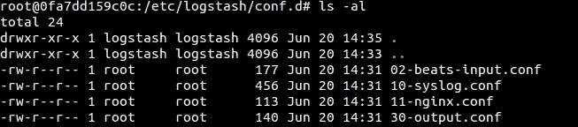
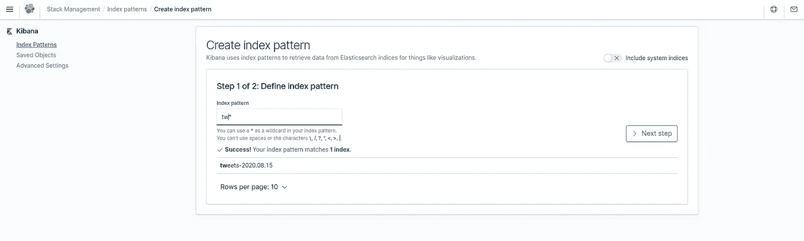
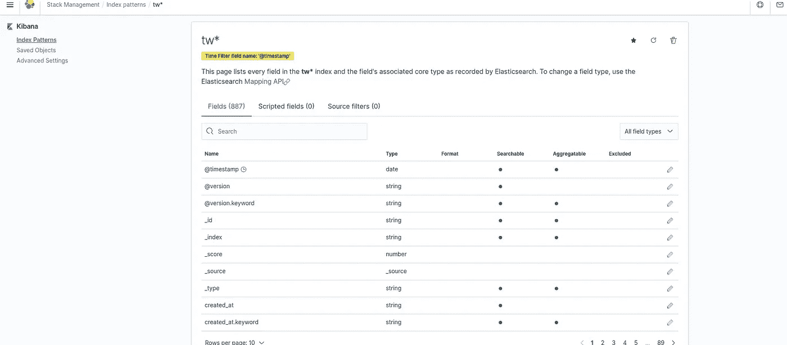
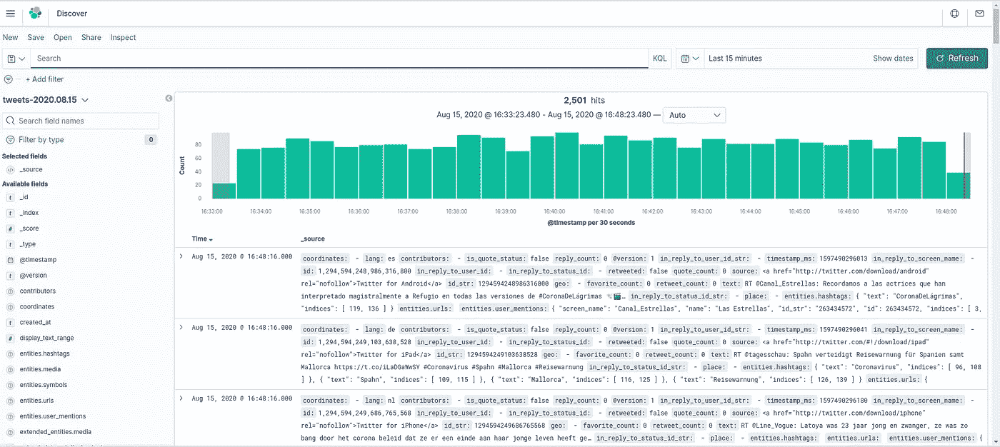

# 分析和可视化推文

> 原文：<https://medium.com/analytics-vidhya/analysing-and-visualising-tweets-d3690abfc5fe?source=collection_archive---------23----------------------->

在这篇文章中，我们将学习如何使用 Kibana，Docker 基于搜索关键字来分析和可视化推文。这些数据可以进一步用于人工智能和人工智能任务，以预测不同领域的事件和检测某些事件，如分析抑郁症和癌症推文，人工智能可以将其用于医疗保健行业。

**先决条件**

> Docker 安装在您的机器上。你可以按照 Docker 的官方文档在你的机器上安装它。
> 
> Twitter 用户的访问令牌:用户可以通过访问 Twitter 的开发者面板来获得他们自己的访问令牌，在那里他们的帐户可以获得访问令牌。
> 这由 4 个值组成，分别是:
> *消费者密钥、消费者秘密、oauth 令牌和 oauth 令牌秘密*

**简介**

> **Kibana:** Kibana 是一个开源前端应用程序，位于 Elastic 堆栈之上，为 Elasticsearch 中索引的数据提供搜索和数据可视化功能。Kibana 有许多用于数据探索、可视化、监控和管理的特性。Kibana 和 EL stack 可用于查找异常和异常值，根据趋势进行预测，并通过弹性机器学习识别数据中的感兴趣区域。
> 
> **Docker:** Docker 是一个工具，旨在通过使用容器来简化应用程序的创建、部署和运行。容器允许开发人员将应用程序与它需要的所有部分打包在一起，比如库和其他依赖项，并作为一个包进行部署。

**如何实现**

**步骤 1:运行 ELK 的 docker 映像** 确保您有 ELK 的 Docker 映像，如果没有，您可以运行以下命令来获取该映像

*   ***码头工人拉塞布/麋鹿***

在这里，我使用 sebp/elk 图像，这是由整个 elk 堆栈组成的单一图像。一旦你用这个图像运行容器，在此之前我们需要增加 mmap 计数，因为 Elasticsearch 默认使用 mmapfs 目录来存储它的索引。mmap 计数的默认操作系统限制可能太低，这可能导致内存不足异常。

在 Linux 上，您可以通过以 root 用户身份运行以下命令来增加限制:

*   ***sysctl-w VM . max _ map _ count = 262144***

默认情况下，Elasticsearch 使用一个`[mmapfs](https://www.elastic.co/guide/en/elasticsearch/reference/current/index-modules-store.html#mmapfs)`目录来存储其索引。mmap 计数的默认操作系统限制可能太低，这可能导致内存不足异常。

在 Linux 上，您可以通过以`root`的身份运行以下命令来增加限制:

*   ***docker run-p 5601:5601-p 9200:9200-p 9300:9300-p 5044:5044-it sebp/elk***

一旦容器开始运行，复制可以通过使用命令"***【docker PS "***获得的容器 id，然后使用这个命令 ssh 到容器中

> ##通过您复制的容器标识删除“容器标识”

***docker exec-u 0-it ' container _ id '/bin/bash***

**第二步:修改配置文件**

一旦你通过 ssh 进入你的容器，转到 **' /etc/logstash/conf.d'** 目录，你会在那里看到下面的文件

这里我们必须修改输入和输出文件。

对于 **02-beats-input.conf，**我们将对其进行修改，使其接受来自 twitter api 的输入，而不是向其传递任何文件。修改后的文件如下所示

**02-beats-input.conf**

> **输入{
> Twitter {
> consumer _ key =>“* * * * * * * * * * * * * * * * * * * * * * * * * * * * * * * * * * * * * * * * * * * * * * * * * * * * *
> oauth _ token =>“* * * * * * * * * * * * * * * * * * * * * * * * * * * * * * * * * * * * * * * * * * * * *
> oauth _ token _ secret =>“* * * * * * * * * * * * * * * * * * * * * * * * * * * * * * * * * * * * * *”
> 关键词= >【抑郁】【电晕】【电晕】**

用你想要搜索的关键词替换关键词，用你为你的帐户得到的访问令牌替换访问令牌。

对于 **30-output.conf，**我们将对其进行修改，以索引模式**‘tweets-**’输出数据到 elasticsearch，后面跟日期。

**30-output.conf**

> **output {
> elastic search {
> hosts =>[" localhost "]
> manage _ template =>false
> index =>" tweets-% {+YYYY。MM.dd}"
> }
> }**

**第三步:重启容器**

一旦我们更改了配置文件，我们需要重启容器以使更改生效。使用命令**‘docker restart container _ id’**重启容器。

**第四步:启动基巴纳:**

一旦 Kibana 准备就绪，在你的浏览器上启动**‘localhost:5601’**，如果一切正常，kibana 仪表板就会出现。

在 Kibana Dashboard 中，在堆栈管理下创建一个索引模式

创建索引模式后，您可以转到 discover 面板，可以根据字段、时间和其他事实过滤数据，并可以下载 csv 格式的数据以供进一步分析。Kibana 为您提供了您想要使用的不同可视化技术。

通过这种方式，您可以分析大量 tweets 数据，这些数据可以进一步用于 ML 模型，并可以使用不同的过滤器和时区在 Kibana dashboard 中以图形、峰值、图表的形式可视化。