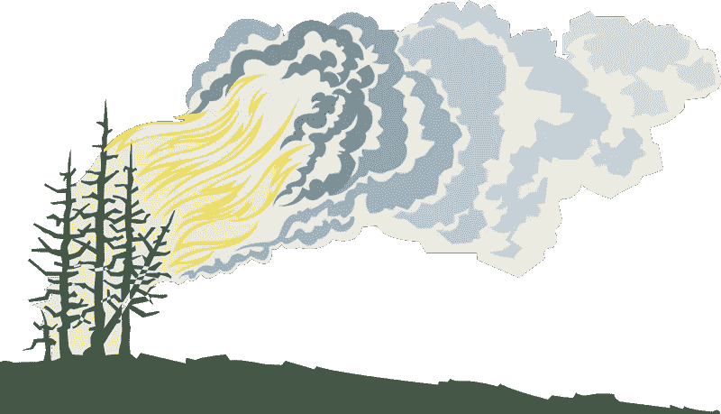
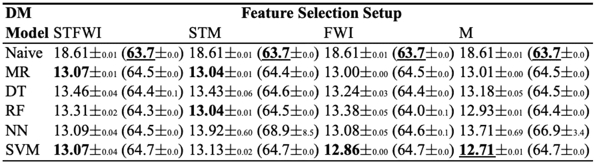

# 分析气象特征和人类活动对森林火灾发生的影响

> 原文：<https://medium.com/analytics-vidhya/analysing-the-influence-of-metrological-features-and-human-activities-in-the-outbreak-of-forest-2593e65bafce?source=collection_archive---------27----------------------->

*影响森林火灾的主要气象预测因子有哪些？人类活动如何影响野火？*

*本文将提供人类活动、计量预测的综合，并以数据挖掘如何应用于探测和最终预防森林火灾作为结论。*

> **在写这篇文章的时候，加州正被一场野火肆虐，这场野火被认为是由接触干燥灌木丛的电缆点燃的。**

不可否认，人类活动影响环境是科学能够证明气候变化和我们日常行为之间因果关系的方式。而政治主体继续淡化这些互动，以保护巨额利润，从而提高他们国家的国内生产总值。

下面的时间线图将人类活动与全球火灾的发生联系起来。工业革命的开始标志着火灾活动激增的开始。

图片由 [NASA](https://www.nasa.gov/topics/earth/features/fiery-past.html) 提供

基于过去一千年木炭记录的火灾活动(显示为灰色)，这与野火模型(显示为红色)和木炭记录非常匹配。气候模型的组合表明，根据其他预测因素，全球火灾活动可能会增加 5%至 35%。未来的温室气体排放、发展模式和人口结构都是重要的影响因素。

***“人类活动与气候变化之间存在因果关系，从而影响森林火灾的发生。”***

在世界进入启示录模式(新冠肺炎)之前，我们目睹了亚马逊雨林被烧毁，这是斯蒂芬·金和阿尔弗雷德·希区柯克剧本中的一个熟悉的地方。此后不久，澳大利亚的新南威尔士和维多利亚发生了 50 多起火灾。据推测，这场创纪录的大火已经杀死了超过 10 亿只动物，使许多物种处于严重的危险之中。来自 2020 年美国火灾的报告导致生物学家估计火灾已经杀死了该州 50%的濒危侏儒兔，这些兔子居住在今年燃烧的山艾树平原上。他们认为北美最小的兔子只剩下大约 50 只了。官员们估计，大火还杀死了该州 30%至 70%的鼠尾草松鸡和尖尾松鸡，这些鸟也依赖于山艾树。

图片由 [BBC](https://www.bbc.com/news/world-australia-53231348?xtor=AL-72-%5Bpartner%5D-%5Bbbc.news.twitter%5D-%5Bheadline%5D-%5Bnews%5D-%5Bbizdev%5D-%5Bisapi%5D&at_custom2=twitter&at_campaign=64&at_custom3=%40BBCWorld&at_custom4=108DAAC6-BA9F-11EA-97C6-67EF4744363C&at_medium=custom7&at_custom1=%5Bpost+type%5D) 提供

一只考拉从澳大利亚的一场森林大火中被救出来，不幸的是，他的许多物种都消失了。

森林火灾地图显示了在 12 个月内超过 200，000 起火灾检测中从低到极高的恐慌程度。由于火灾频发，南美、中国、俄罗斯、中非、澳大利亚和北美都面临着巨大的损失。

图片由[财富](https://fortune.com/longform/forest-fires-2019-map-world-amazon-rain-forest/)提供

亚马逊最大的雨林因森林大火而遭到严重破坏，烧毁面积超过 9000 平方公里。复苏的成本几乎是一万亿美元。原因是在为 2019 年的农业努力做准备时，对砍伐森林的土地采取了刀耕火种的方法。巴西国家空间研究所表示，今年该国的火灾数量——主要由人类引起——比 2018 年同期增长了 84%。在此期间，巴西亚马逊森林覆盖面积减少了 39%。绿色和平组织估计，今年西伯利亚的大火已经释放了超过 166 公吨的二氧化碳，几乎相当于 3600 万辆汽车一年的排放量。

## **影响森林火灾的气象因素**

由火灾引起的主要环境问题不仅会造成生态和经济损失，还会危及人类生命。努力理解和检测气象条件，如温度、风、土壤湿度、树木密度、灌木和其他潜在的燃料来源。根据气候和能源解决方案中心的说法，气候变化是增加美国西部野火风险和范围的部分原因。气候变化的副产品是有机燃料的产生，这些燃料燃烧并助长了野火的蔓延。

## **案例研究一:** **天气和人为因素对森林火灾的影响**

(Zumbrunnen *等人*，2011)基于瑞士最易发生火灾的地区进行了长达一个世纪的研究。考虑 1904 年至 2008 年期间森林火灾的土地利用和气象数据。山区的瓦莱州和提契诺州被观察到，因为它们拥有独特的气候条件。分析了点火的可能性，道路密度被认为是点火源，牲畜密度和易发生火灾的森林面积的变化。这项研究发现，虽然道路和牲畜密度对这两个州有影响，但森林面积的增加与提契诺州的火灾发生率有很好的相关性，但与瓦莱州没有相关性。土地废弃和森林覆盖变化较小可能导致火灾发生范围较小。

上图显示了从 1904 年到 2008 年整个研究区域(瓦莱州和提契诺州)预测因子的变化:内斯特罗夫着火指数(10 年移动平均值)、道路密度、森林面积变化(前 10 年)和牲畜密度。计算道路和牲畜密度的参考面对应于海拔 2500 米以下的地区

分析人类和天气对火灾复发的潜在影响的概念框架如下所示。假设最具预测能力的变量是点火、燃料负载和火灾天气。

与点火和燃料条件相关的人为因素和天气对火灾发生的潜在影响的概念模型。

结果的主要重点是突出火灾发生与人为驱动因素之间关系的非线性本质。没有阈值，超过该阈值，道路密度不再与火灾发生相关。因此，两个县的人口增长预测不会导致森林火灾爆发的风险增加。总之，这项研究表明，如果气候变暖，这两个州的人类活动和人口增加的影响会导致不同的结果。因此，不需要否认人类活动与森林火灾之间的相关性不是这项研究的结果。

## 案例研究二:气象变量对塞尔维亚森林火灾风险的潜在影响

这份最近的出版物专注于建立塞尔维亚气象变量和森林火灾指数之间的关系(托希奇*等人*，2019)。考虑的因素是全国 15 个气象站的每日温度、降水、相对湿度和风速数据。提供的结果表明，气候的年际变化对火灾活动有影响。2000-2012 年间塞尔维亚森林火灾的增加遵循了地中海国家观察到的模式；森林覆盖率不到 50%的意大利阿尔卑斯山脉和西班牙比利牛斯山脉受到了严重影响。

总之，该研究清楚地展示了气象变量对塞尔维亚森林火灾的潜在影响。气候动力学与高气温、低湿度和缺少降水之间的相互作用影响最大。表 1 是回归模型的结果。

贝尔格莱德 2011- 2017 年评估期的模拟(虚线)和观测(实线)年森林火灾数:a)使用气象变量(保留降水量-P(mm)作为预测值，b)使用火灾指数(保留 L 作为预测值)。

月度分析表明，最频繁的火灾发生在 8 月、3-4 月和 9 月。这一趋势在 2007 年至 2012 年间达到顶峰，野火数量最多，为 1627 起。这导致超过 22，000 公顷。归因于 2007 年的高气温和持续的热浪以及有记录以来最严重的干旱。

表 1:保留预测因子(气象变量:相对湿度-RH、降水量-P 和风速-V 以及火灾指数)的贝尔格莱德森林火灾数量逐步回归模型的结果

为了确定造成森林火灾的气象变量，贝尔格莱德的逐步回归模型需要输入变量的组合。这导致降雨量或相对湿度被发现是具有最高预测能力的变量。

## **案例研究三:利用气象数据预测森林火灾的数据挖掘方法**

使用现代工具和技术来预测森林火灾，远在我们拥有先进的数据分析和计算和存储资源之前，二十年前只有大型机拥有这些资源。考虑到这一点，现在最大限度地发挥分析在鼓励更好的生态结果方面的潜力比以往任何时候都更加重要。如前几节所述，森林火灾造成的损失是巨大的，恢复的成本是无法用金钱衡量的。

这项研究揭示了数据挖掘技术，如支持向量机(SVM)，随机森林(RF)和四个不同的特征选择设置是如何成功地应用于预测森林火灾(科尔特斯和莫莱斯，2007 年)。使用空间、时间、火险天气指数组件和天气属性，对最近从葡萄牙东北部地区收集的真实世界数据进行了测试。最佳配置使用 SVM 和四个气象输入(即温度、相对湿度、雨和风)，并且能够预测更频繁的小火灾的燃烧区域。这些知识对于改善消防资源管理特别有用(例如，优先考虑空中加油机和地勤人员的目标)。

表 2:根据 MAD 误差的预测结果(括号中是 RMSE 值；下划线—最佳模式；粗体-在特征选择中最佳)

M-SVM、M-RF 和 Naive 模型的 REC 曲线(左)；y 轴输出范围上的实际值(黑点)和 M SVM 预测值(灰点)(右图)

图片由[美国科学促进会](https://www.sciencemag.org/news/2020/09/wildfires-continue-western-united-states-biologists-fear-vulnerable-species)提供

**未来研究领域**

关于增加野火的气象预测和人类-生态相互作用，这篇文章仅仅触及了表面。必须对这些因果关系进行更详细的全球综合分析。正如本文所承认的，这些火灾造成的损失必须是许多政府和实体关注的问题。气候行动政策，包括减少用于伐木、农业和发展事业的土地使用，必须更加严格。必须解决森林保护和民间行为者之间的差距。

**结论**

森林火灾造成的环境破坏是巨大的，具有预防和检测潜在火灾的手段是至关重要的。在火灾管理系统(FMS)自动化检测方面付出了巨大努力。使用卫星数据、红外扫描和带有计量数据的本地传感器的三个主要趋势为应用数据挖掘技术实现实时火灾报警系统创造了良好的基础。正如在最后的案例研究中所看到的，使用 SVM 和特征选择的回归模型获得了典型的结果。

根据世界卫生组织的说法，野火通常是由人类活动或天灾(如闪电)引起的，并且可能随机发生。然而，在记录的 50%的野火案例中，原因仍然不明。在干旱少雨或大风的情况下，野火的风险会成倍增加。野火的影响从破坏交通、通讯、电力和供水不等。空气质量恶化对动物和人类都有影响。1998 年至 2017 年间，野火和火山活动影响了 600 多万人，其中 2400 人因窒息、受伤和烧伤而死亡。随着气候变化的气象影响的增加，野火的频率也在增加。

**参考文献**

1.科尔特斯，p .和莫莱斯，A. (2007)“利用气象数据预测森林火灾的数据挖掘方法”，*第 13 届葡萄牙人工智能会议论文集*，第 512–523 页。可在:[http://www.dsi.uminho.pt/~pcortez/fires.pdf.](http://www.dsi.uminho.pt/~pcortez/fires.pdf.)

2.托希奇，I. *等人*(2019)“2000-2017 年期间气象变量对塞尔维亚森林火灾风险的潜在影响”，*开放地球科学*，11(1)，第 414-425 页。doi:10.1515/geo-2019–0033。

3.t .*zumbrunnen 等人*(2011)‘天气和人类对森林火灾的影响:瑞士两个气候区的 100 年火灾史’，*森林生态和管理*。爱思唯尔公司，第 261 卷第 12 期，第 2188-2199 页。doi:10.1016/j . foreco . 2010 . 10 . 009