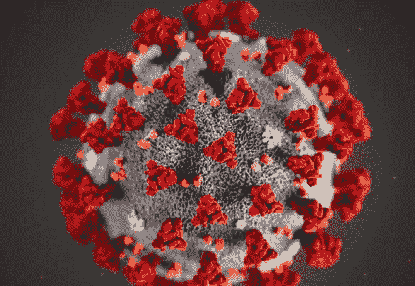
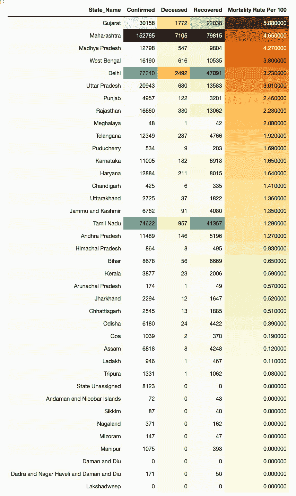
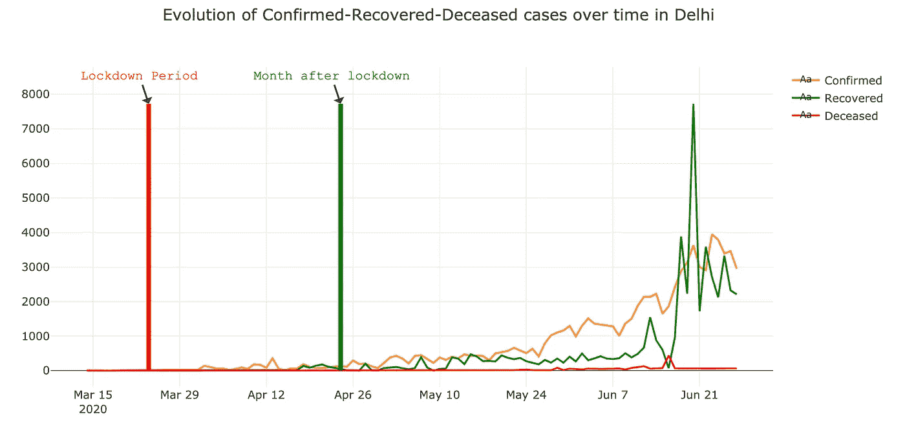
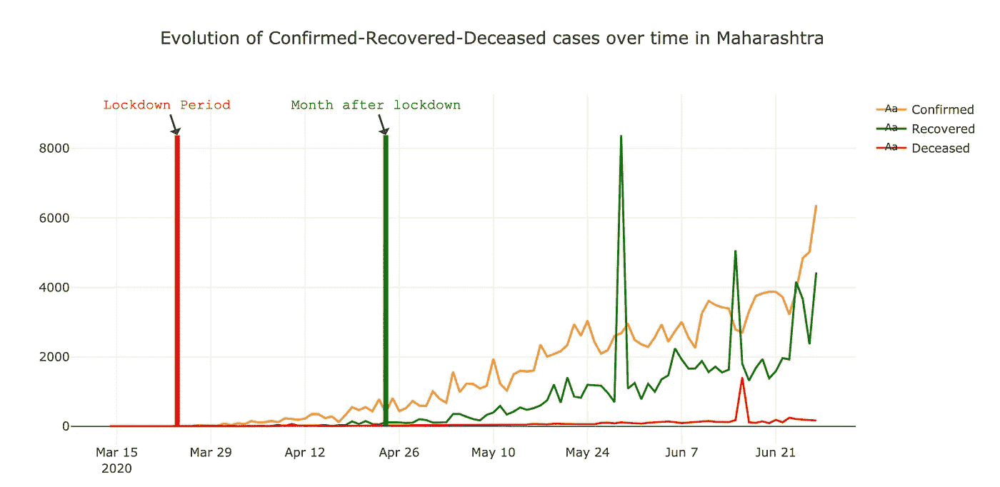
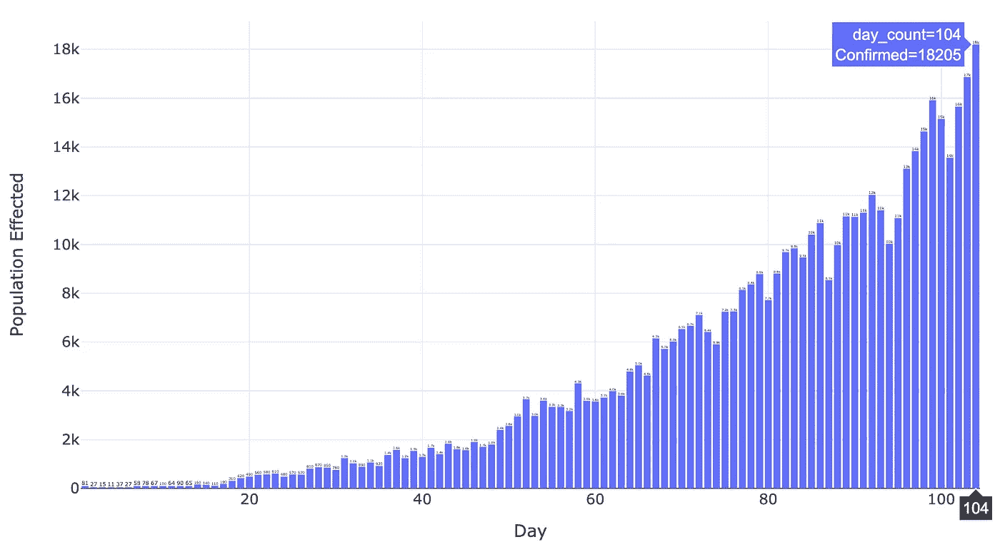
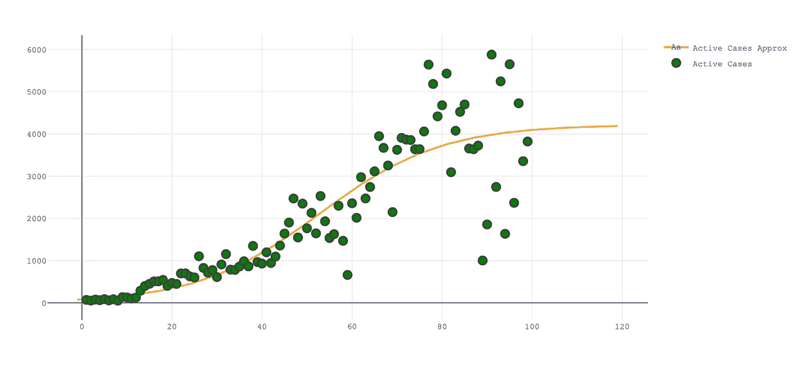
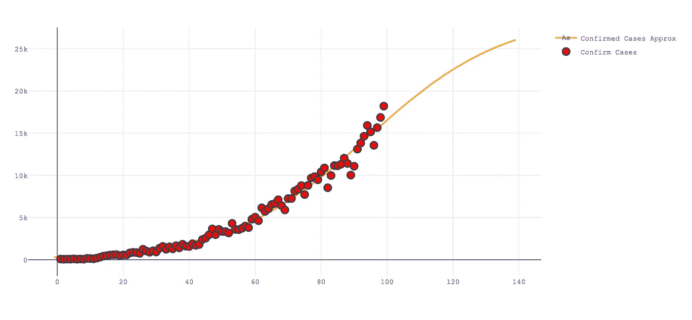

# 使用 Python 分析、可视化和预测新冠肺炎在印度的传播

> 原文：<https://medium.com/analytics-vidhya/analysing-visualising-and-forecasting-of-covid-19-spread-in-india-using-python-941bdc3158e7?source=collection_archive---------17----------------------->

## 目前，有很多关于冠状病毒在互联网上传播的可视化和统计数据。有这么多的信息和专家意见，很难分析这些信息及其对局势的影响。例如，不同的国家采用不同的策略来实施封锁，在受影响的地区遵循社会距离规范等等。没有直接的解决方案可以解决当前的情况，因为它还取决于许多其他因素来谨慎处理这种情况。本文试图预测和分析冠状病毒(新冠肺炎)在印度的传播。

来源:[https://www . FDA . gov/food/food-safety-during-emergencies/food-safety-and-coronavirus-disease-2019-新冠肺炎](https://www.fda.gov/food/food-safety-during-emergencies/food-safety-and-coronavirus-disease-2019-covid-19)

## 介绍

冠状病毒是一种 RNA(核糖核酸)病毒，由大约 27-32kb 的正义单链 RNA 组成。冠状病毒属于冠状病毒科，包括α、β、δ和γ冠状病毒。已知该病毒会感染广泛的宿主，包括人类、其他哺乳动物和鸟类。在印度，13.4 亿人已经按照印度政府发布的指导方针，遵循一级防范、保持社交距离和其他预防措施。因此，我试图涵盖新冠肺炎对印度人口的影响。

# 目标

本文的目的是**获得所需的数据**进行分析，**通过收集所有相关数据获得对新冠肺炎的了解**。

# **目录**

*   **技术前提**
*   **收集新冠肺炎数据**
*   **印度各邦死亡率**
*   **锁定前后的状态分析**
*   **主动案例预测**
*   **确诊病例预测**

# 先决条件

*   安装 Python 3.1 或更高版本
*   安装熊猫，Plotly，Maltplotlib，Scikit-learn

# 收集新冠肺炎的数据

随着各种试图压制新冠肺炎对世界的影响，各种研究工作和创新措施取决于从正确的数据中获得的洞察力，所以我决定使用**covid 19 India**API，下面的是从 API 中获取状态细节的代码。

上面的**代码，下面的**指定细节

*   2 数据来源**最新**和 **state_wise_daily**
*   带有州名的映射州代码
*   每日汇总和分类数据

所以现在我们有了逐日累计的**确诊**、**死亡**和**痊愈病例**的状态数。

# **印度各邦死亡率**

要找出每 100 人中的死亡率，请使用以下代码。

上面我们汇总了各州的总数据，为了找出死亡率，我们将死亡病例与确诊病例分开，运行代码后，您会发现下面的输出

**各州每 100 人的死亡率(最后更新日期:2020 年 6 月 27 日)**

从输出中我们可以分析出，古吉拉特邦**、马哈拉施特拉邦**和中央邦**是新冠肺炎每 100 例确诊病例中的主要邦。 **5 例**归入**死者**。**

# **锁定前后的状态分析**

为了进行状态分析，分析了从 2020 年 3 月 24 日至 2020 年 4 月 24 日**的第一阶段封锁期。以下是几个国家明智的趋势快照。**

**德里确诊-恢复-死亡病例的演变(最后更新日期:2020 年 6 月 27 日**

**马哈拉施特拉邦确认-恢复-死亡病例的演变(最后更新:2020 年 6 月 28 日**

有趣的是**在封锁**后**如何恢复，确诊病例**在**增加，类似的模式**适用于所有州。你可以使用下面的代码来获得上面的可视化。

现在，我们将按天数汇总**确诊病例，以获得直观表示。**

**日确诊病例评估(最后更新日期:2020 年 6 月 26 日)**

自从在印度发现首例新冠肺炎病例以来，我们现在已经是第 104 天了，分析显示，这一数字与日俱增。下面是获得以上观想的代码。

*下面的预测给出的信息是，我们可以得出有意义的分析，并采取* ***预先行动*** *，而不是纠结于确切的数字。*

# **主动案例预测**

**主动案例预测**

分析显示，每日****活跃** **病例**在印度约为。 **4524** 第 52 天曲线停止**变陡**并开始**变平**，曲线将变平直到**第 130 天**也就是 2020 年 7 月 22 日**。**此外，在 2020 年 7 月 31 日**，印度有大约 **360848 例活跃的新冠肺炎病例**。在让**理解我们场景中的 sigmoid 函数之前，您可以使用下面的代码来获得上面的分析。******

****乙状结肠功能****

**当缺乏特定的数学模型时，通常使用 sigmoid 函数，从加速的小起点开始，随着时间的推移接近高潮。所以在我们的例子中，乙状结肠函数是**y = c/(1+NP . exp(-a *(x-b)))**其中
**c —** 最大值(来自病毒的最大感染人数)
**a —** 乙状结肠形状(感染如何进展)
**b —** 乙状结肠开始变平的点**

**下面是 sigmoid 函数和活动案例预测的代码**

****乙状结肠功能****

**理解这一点的诀窍是这不是一个实际的线性过程，而是一个指数过程。我们必须相应地对待我们的数据。**

****主动案例预测****

# ****确诊病例预测****

****

****每日** **确诊** **印度**病例约为。 **29115** 第 94 天曲线停止**变陡**并开始**变平**，曲线将变平直到**第 245 天**即 2020 年 11 月 14 日**。**同样，在 2020 年 7 月 31 日**，**印度有大约。**新冠肺炎 1276800 例确诊病例**。您可以使用下面的代码来获得上述分析。**

**希望本文对进一步的研究工作有所帮助。感谢阅读。保持安全！**

# ****参考文献****

**[Covid19India.org](https://www.covid19india.org/)
[从病人身上分离出冠状病毒的鉴定](https://www.ncbi.nlm.nih.gov/pmc/articles/PMC7045880/)
特别感谢[普里扬卡](/@ppandey170993)和[尼基尔](https://towardsdatascience.com/@nikhilsharma129540)！**