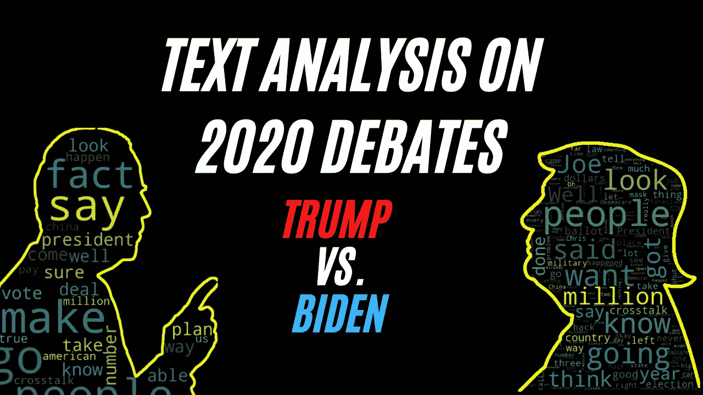
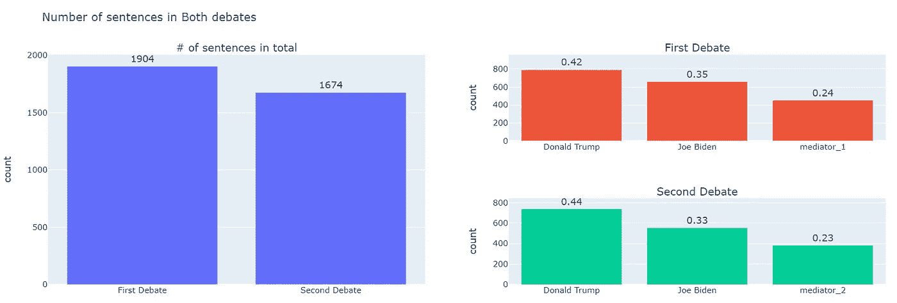
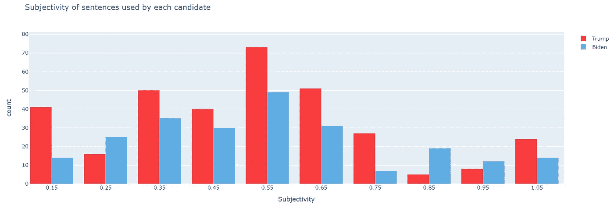

# 第一次和第二次 2020 辩论的分析和可视化

> 原文：<https://medium.com/analytics-vidhya/analysis-and-visualization-of-the-first-and-second-2020-debates-592f193704b7?source=collection_archive---------24----------------------->

当我在观看第一场和第二场辩论时，我被每个演讲者在整个演讲中倾向于使用某些词语或以特定方式表现的方式迷住了。就像许多其他人一样，我不是政治家。但我知道我可以通过分析人们的谈话来了解他们的性格或个性，看看他们使用某些词语的程度以及他们在总体上打断或谈论的程度。于是我去网上找了两场辩论的脚本，开始探索。起初，我只是头脑风暴和策划任何想到的东西，但我发现这可能是一个非常好的机会，可以了解更多关于自然语言处理方面的一些著名包，并写一篇文章来总结我的旅程。在这里，我主要想回顾一下我所看到的，并告诉你关于角色的事情，但是如果你想看我使用的代码和软件包，你可以简单地访问我的 [Kaggle](https://www.kaggle.com/mitramir5/complete-visualization-and-analysis-of-2020debates) 或 [Colab](https://colab.research.google.com/drive/1ymTgIdESjvUoymx2yQsuSslJRpAe232g?usp=sharing) 笔记本。

# 故事情节

在这篇文章中，我们将从分析段落开始，然后转移到句子，最后深入到单词。希望数据集已经准备好供我们在 Kaggle 中使用，你可以根据需要使用不同类型的副本。在我用于此分析的 CSV 文件中，每一行都指定给一个说话者和他们使用的句子，以及他们说话的时间戳。在检查数据集、填充空值、删除或恢复一些差异之后，我们得到了类似下面这样的结果。通过使用分钟列，我们可以计算另一个指定为秒的列。因为每个辩论都有两个部分，每个部分都从 00:00 开始，所以本专栏可以提供很大的帮助，只需将第一部分的时间值添加到第二部分。

第二场辩论进行到一半

# 段落级别

## 讨论的热度！

在观看辩论(尤其是第一场辩论)时，你可能已经注意到了一件事，那就是每一方都打断了另一方的谈话。所以我想看看能不能画出一些图表，显示在对方试图说些什么的同时，双方开始说话的次数和地点，以及调解人试图让他们平静下来的次数。

所以我想我可以画一张图表，显示每个人在一分钟内开始说话的次数。如果这个人不是一个打断者，他们可能不会说超过 4 或 5 次，因为如果你让别人也说话，这是正常的。

第一场辩论的热图

第二场辩论的热图

一般来说，在两场辩论中，候选人会在三个部分开始互相攻击，一个是在介绍和热身之后，另一个是在中间，还有一个是在结束前大约 15 分钟，他们试图通过说得更快、更多来证明自己的观点，以强势结束辩论！

同样在每次激烈的讨论之后，我们可以看到他们冷静下来，正常交谈 20 分钟左右。

# 句子层次

## 谁主导了这场讨论？

现在我们用一个句子分词器，分析一下每场辩论中用到的句子。我使用 NLTK sent_detector 来完成这个任务，并添加了另一个列来计算句子的数量，每次他们开始说话时。

辩手使用的句子总数

通过绘制句子的数量，我们可以看到，在两场辩论中，特朗普都是说得最多的一方(准确地说，使用了更多的句子)，主导了超过 40%的对话。

在分析这个情节的时候，我认为句子的数量并没有表现出辩手的所有特征。如果我们想知道这个人是否真的在打岔，我们必须在每次他们开始说话的时候，计算他们使用的句子数量。所以下面我画了一张图表，显示在第一场辩论中，特朗普和拜登都开始说话，只说了一句话大约 190 次和 150 次。这表明有 40 次，特朗普要么打断调解人，要么只是简短地回答调解人(我不认为是这样，因为特朗普也是最倾向于使用更多句子说话的人。)但我们可以看到第二位辩手的巨大进步，两位辩手的次数都减少了 100 次，分别达到了 70 次和 50 次左右。(虽然这也可能是因为讨论的时间太长，因为第一场辩论比第一场短 20 分钟左右。)

# 句子层次

## 最常见的单词

为了探索候选人使用的词汇，我们简单地选取所有文本，并尝试清理不必要的单词和标点符号，如“is”、“in”、“at”等。尽可能地抓住他们想说的要点。你可能注意到了，我没有删除所有的停用词，因为我想看看是否有一个代词一个人比另一个人用得多(比如“我”)。)

每个人最常用的单词

如果你仔细观察上面的树状图，你会发现每个人都有不同的称呼方式。特朗普更有可能直接称呼他的对手，而拜登则倾向于更多地与调解人交谈，并使用代词“他”来称呼特朗普。据我所知，他们大多使用相同的词语，但方式不同。例如，在特朗普使用的前 60 个单词中，大约 10%是代词“我”(几乎是拜登的两倍)，另外 10%是代词“你”，而拜登倾向于比特朗普使用更广泛的单词，没有任何一个单词在他的常用单词中占主导地位超过 7%。

# ☁️WordCloud

有了所有这些单词，我们可以使用每个候选人最常用的单词来为每个候选人制作单词云。对于图片(或遮罩)中的单词云，你必须具备两个条件:1 .单词 2。遮罩(或轮廓图片。只要记住图片必须有一个透明的背景。)

## 👈TextBlob 的极性和主观性👉

**极性**是一个介于-1 和 1 之间的值，表示一句话的情绪是积极还是消极。TextBlob 所做的是，它首先识别其[词典](https://github.com/sloria/TextBlob/blob/eb08c120d364e908646731d60b4e4c6c1712ff63/textblob/en/en-sentiment.xml)中的单词，然后对一个单词的所有不同含义的极性进行平均，然后将这些平均值彼此相乘，并将该数字作为整个句子的极性。[这是一篇很棒的博文](https://planspace.org/20150607-textblob_sentiment/)，在这里你可以读到更多关于它是如何计算的。

但因为极性是一个值，而不是一个具体的标签，我决定将光谱分为 5 个不同的组，并给每个组一个标签:

0:负面，1:有些负面，2:中性，3:有些正面，4:正面

**主观性**是一个介于 0 和 1 之间的因子，表示一个单词或短语的主观程度。(挺明显的！我知道。)

虽然 TextBlob 是最著名的处理文本的库之一，但我倾向于不经常使用它，也不像信任情感分析中的深度学习模型那样信任它。这是因为它使用一种天真的方法来分析句子，如果不是在非常明显的情况下，它可能不总是得到正确的答案。因此，在这里，我将只画出辩手谈话的主观性和极性，而不会深入到我们在每个图表上看到的细节，我将为我们的下一步留出空间，即使用**进行情绪分析🤗变形金刚**。

主观性

极性

# **转移学习用🤗变形金刚**

有了变形金刚，我们面前有了各种各样的工具和模型，只需要几行代码就可以完成我们想要的任何任务。在本文中，我将为那些只想快速分析的人快速介绍管道，但对于分类，我将使用在具有 5 个不同标签的数据集上训练的 RoBERTa 模型。

## 管道:

**优点:**管道是 transformers 库提供的工具，只需一两行代码就可以帮助我们用文本数据完成各种任务！例如，通过使用管道功能，只需输入我们的数据和我们想要执行的任务的名称，我们就可以简单地获得我们想要的结果，而无需担心构建模型或训练模型。看一下下面的代码就能得到直觉。

您可能想知道这个函数的性能。嗯，transformers pipeline 用于情感分析的默认模型是一个经过预先训练的“distilbert-base-uncased”模型，该模型已经在 sst2(电影评论数据集)上进行了训练。因此，你实际上是在使用迁移学习，并根据另一个人或组织训练的权重来预测新的数据集。

你可以在这里看到情感分类[的现场演示。模特种类繁多，你可以在这里使用她们，也可以在](https://huggingface.co/distilbert-base-uncased-finetuned-sst-2-english) [Huggingface 网站](https://huggingface.co/models?filter=text-classification&search=roberta-large)上观看每个模特的现场演示。

**缺点:**所有这些模型都很有用，很好，但是记住，所有的模型并不像其他模型一样准确或好！例如，如果您使用缺省值(distillbert 模型，它不是变形金刚模型中最准确或最好的)。

管道模型是在带有特定标签的特定数据集上训练的，所以你不能从它们能提供给你的东西中得到任何不同。就像在这个例子中，如果我们想要有 5 个标签，但是因为 sst2 数据集基于具有 3 个不同标签的数据集:阴性、中性和阳性，我们不能得到我们确切想要的。虽然当你用 distillbert 分类你的文本时有一些缺陷，但它仍然是一个很好的情感分析方法(我认为比极性更好)。

## 罗伯塔

因此，正如我所说，我真的想得到最好和最准确的结果，并有 5 个标记输出，以尽可能最好地识别不同的情绪。所以我搜索了一下，在 Kaggle 上找到了[这个数据集。虽然它包含基于电影评论的分类文本，但它的训练集包括所有不同的单词和短语，因此我们可以使用部分定制的模型来识别和学习每个单词、短语和句子的情感！](https://www.kaggle.com/c/sentiment-analysis-on-movie-reviews/data?select=sampleSubmission.csv)

我们能得到的最好的模型是大型 Roberta 模型，它优于大型 Bert、XLNet 和 DistillBert。(实际上，我对所有这些模型进行了实验，看看它是否真的是最好的模型，结果表明，即使只有少数几个时期，它也能给我们带来很好的结果)

[这是 Colab 笔记本](https://colab.research.google.com/drive/16F3RoWOGY1knLRdqMw2yHw68TdxpaImf?usp=sharing)，我在其中包含了使用任何 Tensorflow 变压器模型所需的所有内容。你可以看到我是如何训练这些模型的，你也可以用它来训练你自己的模型！

情感分析

如你所见，我们的模型能更好地识别情感，并能给出更具体的结果。有趣的是，我们可以看到特朗普在用句子表达情感方面是如何领先于拜登的。虽然有一次差距很小，但拜登在第一场辩论中使用了更多“有点积极”的句子。同样，通过比较两场辩论，我们可以看到第一场辩论不仅有更多的中性句子，也有更多的负面情绪句子。所以我认为总的来说，两位候选人在第二场辩论中都尽了最大努力，将敌意和干扰排除在辩论之外。

# 尾注

你在这个笔记本上读到的都是我从数据中看到的东西。我不反对或支持任何候选人或政治团体，也不冒犯任何个人。我很想听听你们的意见，听听你们对以上所有情节的看法，以及你们对每个情节的分析！请务必在下面留下您的评论，并为这篇文章鼓掌！

来源:[https://medium . com/hacker noon/how-I-implemented-the-medium-clap-from scratch-4a 16 AC 90 ad 3 b](/hackernoon/how-i-implemented-the-medium-clap-from-scratch-4a16ac90ad3b)