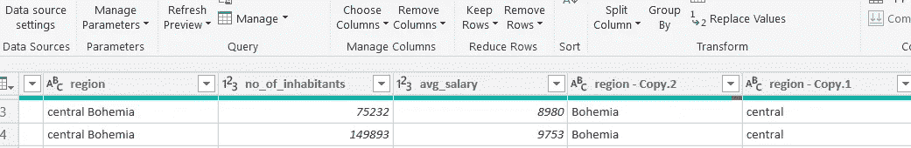

# 银行客户在 Power BI 中使用仪表板的分析

> 原文：<https://medium.com/analytics-vidhya/analysis-of-bank-customers-using-dashboard-in-power-bi-a366f2b3e563?source=collection_archive---------5----------------------->

纽约公共图书馆在 [Unsplash](https://unsplash.com/s/photos/bank?utm_source=unsplash&utm_medium=referral&utm_content=creditCopyText) 拍摄的照片

通过假装是捷克共和国一家银行的数据分析师，我希望帮助银行增加他们向新客户发放新贷款和信用卡的利润。使用银行提供的银行账户和人口统计数据在 Power BI 中创建分析仪表板。有两个问题可以探讨。

首先，它的营销策略，银行应该关注哪个潜在客户群体/领域？我们可以看看该地区的人口和平均收入，以决定我们可以在哪里针对他们的贷款和信用卡产品进行广告/促销。

第二，确定信用不良客户的特征，假设客户拖欠贷款或逾期付款，这样我们就可以避免或设置更严格的贷款条件，以避免在违约时遭受损失。

请注意，数据已被划分为捷克共和国境内的 8 个地区，包括首都布拉格。其货币为捷克克朗(符号:***kě)。***

从贷款数据集中，我们可以假设 1999 年，因为 1998 年 1 月发放的 12 个月贷款仍然有效。

1997 年 12 月发放的一笔为期 12 个月的贷款已经全部偿还。

# **数据建模**

**管理关系**

“disp”文件将被用作主连接器，因为它包含大多数关键标识符(帐户 id、客户 id 和 disp id ),可用于将 8 个数据文件关联在一起。“地区”文件用于在地理上将客户简档与“地区 id”链接起来

**性别和年龄数据建模**

请注意，数据中缺少客户的性别和年龄。这些可以用出生数字 YYMMDD 来表示，其中月份(第三和第四位数)大于 50 意味着客户是女性。我们可以创建一个性别专栏。

对于生日，我们需要将女性的出生月份减少 50，然后将日期格式更改为 DD/MM/YYYY，并在年份上加上 1900。

对于年龄，我们将假设如前所述是 1999 年，并用它减去出生年份。

**替换数值**

为了便于理解，将一些字段设置为英语，我们用超级查询编辑器将值替换为英语。

在电源查询时更改区域名称的顺序

复制“地区/区域”,然后使用空格作为分隔符拆分列。

然后按区域和方向合并列。有关详细信息，请参考应用步骤。

**按年龄范围分组**

由于客户的年龄范围从 12 岁到 88 岁，我们将把他们划分为不同的年龄段，以便于分析。参考[https://marketing artfully . com/customer-demographics-age-ranges-numbers/](https://marketingartfully.com/customer-demographics-age-ranges-numbers/)(雅各布森，2019)，我们将年龄分为 5 组。

Y 世代是年轻人，

X 一代是年轻的工作成年人，有些人开始组建家庭

婴儿潮一代是有家庭的工作成年人。

沉默的一代有些人正在工作，有些人已经退休，靠养老金生活。

最伟大的一代，靠养老金生活的退休老人。

**信用评级和贷款状况**

因为贷款状态使用了 A、B、C、D，这对于读者来说并不友好。我们可以添加一列来表示它所代表的内容，我们还简化了那些延迟或拖欠付款的不良信用的分类，请参考下表了解新添加的列的详细信息。

“帐户 Id”之类的值也被设置为文本。

和地区名称已被分类为用于地图的地点，以显示每个地区的居民总数。

# **仪表板概述**

封面显示了我们的目标，每个页面有 3 个按钮 gg，用于营销的人口统计分析，贷款分析和信用卡分析。

“人口统计数据”页面显示捷克共和国的人口分布以及从最高到最低的平均薪资等级。用户可以按地区过滤，看看人们在哪里。还有一个显示年龄组分布的环形图，可以追溯到性别。用户还可以过滤帐户持有人的性别和类型。

贷款页面的侧面显示了可以使用的过滤器，例如贷款状态。顶部显示了贷款总数和贷款金额的表格，以及贷款金额的条形图。页面的下半部分显示了我们已经发现的不良信用的特征，这将在后面解释。

信用卡页面显示了从 93 年到 98 年每年发行的信用卡的表格。有一个瀑布图，让我们对每年发卡量的变化有了更多的了解。另一个表格显示了每个年龄组的发卡数量，带有条形颜色条件格式，其中发卡数量越高，其单元格将被填充得越多。因此，我们可以看到经典卡是由婴儿潮一代持有的。此外，在侧边还有过滤器，用于选择卡的类型和区域，以便深入查看卡的所有权。

# **关键图表，分析&含义**

**营销分析**

信用度的一个良好指标是收入，因此较高的工资将是更好的借款人，所以我们应该针对平均工资最高的人群(布拉格)进行促销和广告宣传，在地图上还可以注意到，在首都布拉格的外圈是波希米亚中心区，平均工资第二高。因为这两个地区距离很近，人口密集。不像地图上显示的其他地区，人们分散在大片土地上。

布拉格居民数量和银行客户数量之间的巨大差距(黄色箭头)也表明，这是银行尚未开发的潜在客户领域。我们需要收集更多关于城市居民偏好的数据，以便制定出好的营销策略。

**贷款和信用分析**

婴儿潮一代的借款利率最高，为 45%，也占据了大部分贷款。这些婴儿潮一代是我们贷款产品的主要目标，另一个重要群体是 37%的 X 一代。20-54 岁的人占借款人总数的 80%以上。我们可以进一步了解他们正在为贷款进行何种类型的购买，并为他们提供利息更好的更专业的贷款或免费项目。

根据对目标年龄组的进一步分析，比较每个年龄组中好的和坏的借款人的百分比，大约 10-11%会违约。(4.99% / 45.02%).我们应该调查这些不良信用借款人的特征，并在贷款审批时改进我们的信用审查。

考虑到在发行的 892 张卡中只有 2 张卡主违约，不到 1%,没有明显的关系表明信用卡主会拖欠贷款。

从坏账金额可以看出，摩拉维亚南北违约和迟付金额最高。(最暗的红色=最高金额)。

不良借款人的另一个特点是，他们的平均账户余额低于 34，060.66 美元的平均账户余额。如图所示，这些棕色单元格突出显示了所有拖欠和逾期付款的借款人。我们可以考虑将借款人的账户余额作为贷款审批的信用审查标准。此外，我们应该避免向 55 岁及以上的人发放贷款，因为我们可以看到，那些没有贷款的人(见“空白”栏中的棕色单元格)的平均余额非常低，不到 30，000 美元。

“空白栏”也为我们标出了一些潜在信用良好的客户，用绿色突出显示。这些是目前的银行客户，年龄在 20-54 岁之间，他们在银行有良好的平均余额。银行可以考虑将他们作为其贷款和信用卡产品的直接营销目标。

从数据中我们还可以看出，发放的贷款都是短期贷款，期限为 1 至 5 年。银行可以考虑向客户发放长期贷款。

**信用卡分析**

另一个创收领域是信用卡，从这一天开始，我们可以看到银行通过每年发卡量的增加，在信用卡推广方面越来越积极。

利用瀑布图，我们进一步分析了发卡量的同比增长情况。其中绿色表示与上一年相比发卡量增加，红色表示下降。当我们将鼠标悬停在该条形图上时，还可以看到同比变化%。

**限制**

可以收集更多关于借款人的数据，以便更好地分析他们的信用。数据，如客户的信用历史，即他们的付款历史，拥有的债务总额，信用历史的长度，其信用组合，以获得对不良借款人特征的更多见解和对未来贷款的有效信用审查。我们可以从信用卡消费中获得数据，还可以找出这些客户感兴趣的东西，这样我们就可以赠送对他们有吸引力的礼物，吸引他们接受我们的贷款和信用卡产品。

提供的数据是 1993-1998 年的，不到 10 年，已经过时 20 多年了。随着技术的进步，人们的工作和生活方式发生了变化，更多的最新数据将能够为我们提供关于客户行为和人口统计的更相关的见解。

关于每个地区人口的更多数据，如人口的年龄、性别、工作，将能够帮助我们将他们归类到更好的客户档案中。

**视频演示**

**参考文献&图片来源**

t .雅各布森(2019 年 03 月 19 日)。*巧妙营销*。从客户人口统计数据中检索—年龄范围、世代名称和数量:[https://marketing art fully . com/CUSTOMER-DEMOGRAPHICS-AGE-RANGES-NUMBERS/](https://marketingartfully.com/customer-demographics-age-ranges-numbers/)

封面背景
[https://eeagrants.org/countries/czech-republic](https://eeagrants.org/countries/czech-republic)
信用卡图标[https://www . icon finder . com/icons/2224480/card _ Credit _ card _ debit _ card _ master _ card _ icon](https://www.iconfinder.com/icons/2224480/card_credit_card_debit_card_master_card_icon)
贷款图标[https://www . business today . in/top-story/what-will-happen-to-your-Loan-after-banks-link-it-external-benchmark/story/380795 . html](https://www.businesstoday.in/top-story/what-will-happen-to-your-loan-after-banks-link-it-to-external-benchmark/story/380795.html)
营销