# 美国各州的新冠肺炎分析

> 原文：<https://medium.com/analytics-vidhya/analysis-of-covid-19-across-us-states-77e3cf6ac081?source=collection_archive---------26----------------------->

## 第一部分:*社会经济因素的描述性统计分析*

# 问题陈述和概述

新冠肺炎是一种传染病，会导致发烧、咳嗽、呼吸急促和其他呼吸道症状。虽然大多数病例的严重程度为轻度至中度，但那些老年人或有潜在健康问题的人更容易感染病毒。截至 2020 年 8 月 7 日，仅美国就有 506 万确诊病例，16.2 万人死亡[1]。

在*本分析的第 1 部分*中，我们的目标是通过使用描述性统计数据来分析可能导致总体死亡率的潜在社会经济因素，从而更好地了解疫情，并对其有一个“总体”的了解。在*分析的第二部分*，我们希望使用这些因素和其他因素作为预测美国短期未来死亡的模型参数。

# 数据

分析中使用了几种不同的数据来源。 *COVID 跟踪项目*数据集用于各州的每日死亡和种族数据。对于社会经济数据，我们使用了来自 *Kaggle* 的数据集，该数据集聚合了*约翰·霍普斯金*美国*死亡*数据和 *ACS* (美国社区调查)*美国人口普查*数据。最后，美国的天气数据是从国家环境信息中心的数据库中收集的。原始数据的链接可以在*数据来源*部分找到。

# 清洁

数据清理脚本将收集的数据转换成更适合未来分析和建模的格式。一般来说，这意味着对数据集进行选择、重新格式化、合并和分组，形成一个聚合的“基础数据”，可用于统计分析和模型构建过程中的其他操作。这些基础数据集可以在*输出*文件夹中找到，名称为 *daily_cases_with_race.csv、total_cases_with_race.csv、*和*total _ cases with _ socio econ . CSV*。可以在*资源库*部分找到资源库和源代码的链接。

# 描述性分析

## Choropleth 地图

Choropleth 地图是一种很好的方式，可以提供病毒地理影响的整体情况。*图 1* 显示了美国所有 50 个州的总死亡人数。

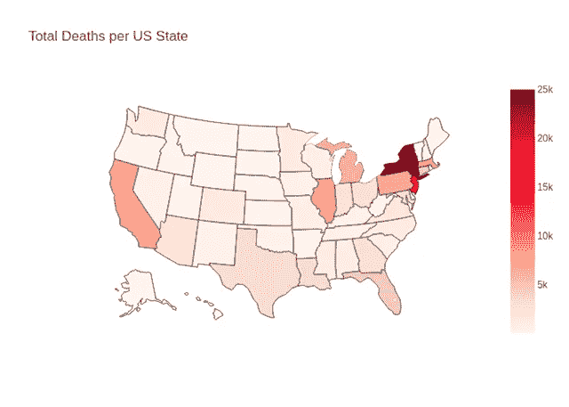

**图 1:** 美国显示美国各州死亡总人数。

显然，纽约及其邻国首当其冲。在西海岸，加利福尼亚的死亡人数最多。与此同时，美国中部(更偏远的美国内陆地区)受病毒的影响要小得多。

*按人口统计的死亡人数超过了*和*按人口密度统计的死亡人数*(分别为*图 2* 和*图 3* )，使用相对的衡量标准，这可能使我们能够在各州之间进行更有见地的比较。

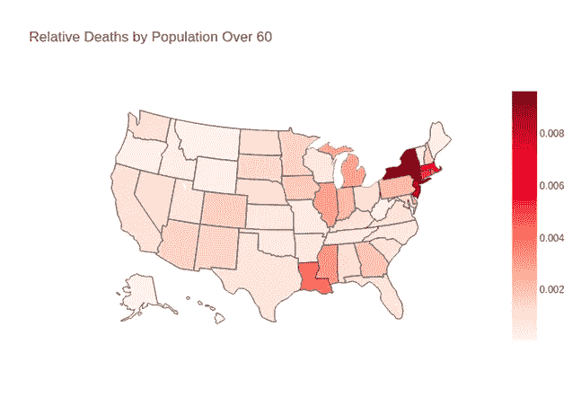

**图 2:** 美国人口分布图，显示了美国各州 60 岁以上人口的死亡比例。计算方法是总死亡人数除以 60 岁以上人口。

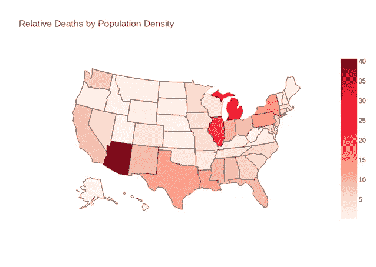

**图 3:** 美国的 choropleth 地图，显示死亡与人口密度的比率。按死亡人数除以人口密度计算，其中人口密度按每平方英里人口计算。

65 岁以上人群的 IFR(感染死亡率)显著高于 50-64 岁人群(0.14%) [3]。*图 2* 给出了与绝对死亡人数相比，各州表现如何的更好衡量标准。一个与众不同的州是路易斯安那州。与总死亡人数相比，60 岁以上的人口相对较少。一旦我们可以证明人口密度是一个有用的度量，我们将回到图 3 的结果。

## 社会经济因素的线性回归

这部分分析的目的是确定美国死亡率的总体驱动因素，并用于预测。我们收集了几个有趣的独立变量，如*家庭收入平均收入*，*每个房间有一个以上居住者的家庭总数*，*60 岁以上的平民劳动力*，以及 *CDC SVI 指数*(衡量社会经济、少数民族、语言和残疾状况的指标)。我们能够发现的唯一具有线性关系( *p 值*小于 0.05)的有意义的死亡预测因子是*人口密度*(见*图 4* )，其 R 为 0.575。

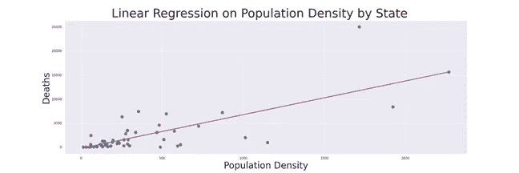

**图 4:**R = 0.575，p 值小于 0.05 的美国各州人口密度对死亡数的线性回归(有统计学意义的线性关系)。

现在*人口密度*已经被确定为具有统计学意义，我们可以看到死亡与人口密度的低比率是多么的可取。查看*图 3，*我们可以看到，纽约在这一指标下表现相对较好，而亚利桑那州表现最差，尽管使用之前的两个统计数据并没有显示出这一点。

# 种族分析

## 相关矩阵

通过观察不同种族群体之间的相关系数，我们可能能够确定一些解释每个群体如何受到病毒影响的一般模式或趋势。请注意，目前报告每一组病例和死亡的州只有加州、CO 和西澳大利亚。因此，从这些数据中得出的任何信息都不能代表整个美国人口。正如预期的那样，*图 5* 显示所有组的病例和死亡之间存在正相关关系。可能最值得注意的模式是所有类别中黑人和白人之间的强正相关(病例对病例、死亡对死亡和死亡病例)。另一个有趣的模式是相对较弱或负相关，例如，AIAN 和所有其他群体。

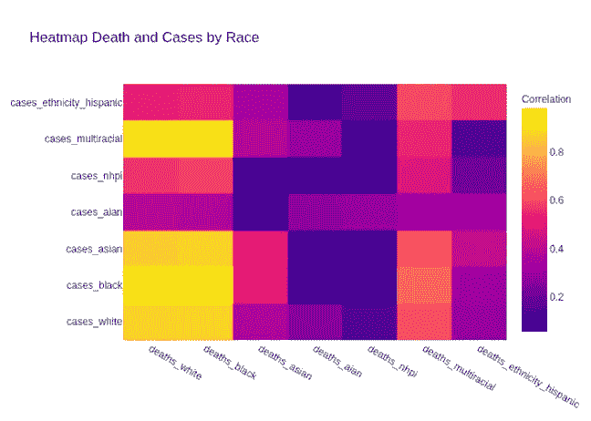

**图 5: :** 显示 CA、CO 和 WA 跨种族群体死亡和病例之间相关性的热图。数据涵盖 2020 年 5 月 3 日至 2020 年 7 月 15 日。

这些总体趋势可能给出一些迹象，例如，白人和黑人社区以某种方式紧密结合，导致相似的感染率。同样，我们可以从理论上说，AIAN 是种族隔离最严重的，这可以解释为什么他们的病例和死亡与其他群体无关。当然，还需要更深入的分析来验证这些说法，但这是进一步分析的有趣起点。*图 6* 和*图 7 (* 例 *vs* )。病例和死亡数*对*。死亡 *)* 也包括在内。

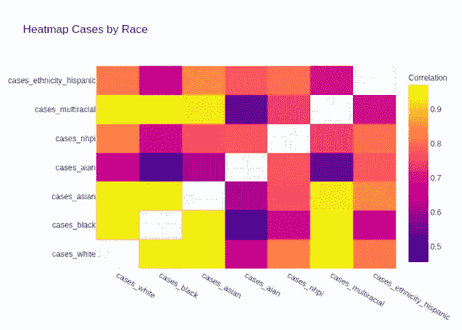

**图 6:** 显示 CA、CO 和 WA 跨种族群体病例之间相关性的热图。对角线条目被删除(相关性为 1)，以便更容易区分相邻值。数据涵盖 2020 年 5 月 3 日至 2020 年 7 月 15 日。

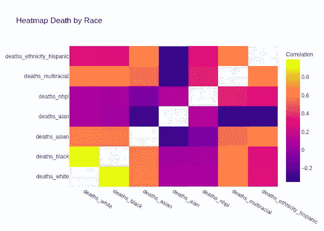

**图 7:** 显示 CA、CO 和 WA 跨种族群体死亡之间相关性的热图。对角线条目被删除(相关性为 1)，以便更容易区分相邻值。数据涵盖 2020 年 5 月 3 日至 2020 年 7 月 15 日。

## 每日死亡推断

对于分析的这一部分，我们感兴趣的问题是“当按各自的人口加权时，每个种族的平均每日死亡率是否不同？”。我们使用 ANOVA 测试来回答这个问题(我们的替代假设)。再一次，我们遇到了数据不足的问题，不得不通过删除 AIAN、NHPI 和多种族，将我们的范围从相关性分析扩大到 AK、CA、CO、GA、IL、LA、MN、NC 和 WA。当然，这并不代表整个美国人口。处理数据的一些挑战包括对每日死亡人数进行负调整、区分无报告日和零死亡日，以及转换数据以使其足够正常以使用 ANOVA 检验。

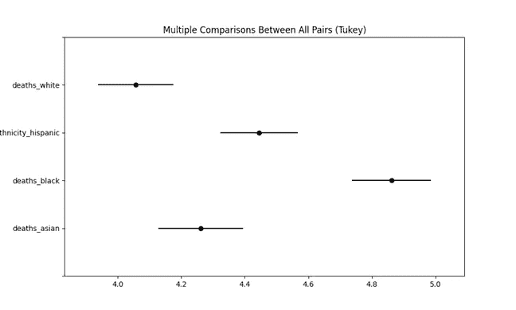

**图 8:** 关于 AK、CA、CO、GA、IL、LA、MN、NC 和 WA 的平均每日死亡率的 Tukey HSD 测试结果。显示黑人的死亡率明显高于所有其他种族，西班牙裔的死亡率明显高于白人。白人和亚裔的死亡率差异没有统计学意义，亚裔和西班牙裔的死亡率差异也是如此。x 轴被缩放和记录。每个种族的实际死亡率分别是:白人——0.0009%，黑人——0.0019%，西班牙裔——0.0012%，亚裔——0.0010%。数据涵盖 2020 年 4 月 26 日至 2020 年 7 月 15 日。

这些问题通过以下方式处理:少数负调整被移除，因为一些调整较大，导致保守值较低，分布严重右偏，因此将所有死亡率乘以一个标量，然后取数据的对数有助于解决这个问题，零死亡的日子被移除，因为通过查看转换后的分布，很明显几天实际上没有死亡。进行 ANOVA 测试的最终结果是 p 值小于 0.05，这使我们可以得出结论，各组之间的均值存在差异。通过利用 Tukey 的 HSD 测试来比较配对，我们能够进一步减少这些信息。结果如*图 8* 所示。你可以看到，在α=0.05 时，黑人的死亡率高于其他种族。

# 初步预测模型:单变量时间序列

## 短期每日死亡预测

为了测试一下，我们决定运行一个简单的单变量时间序列预测(使用单变量 *d* ea *t* hs ),看看它的表现如何。我们使用脸书的开源先知库[4]来预测未来 8 天的死亡人数。在 12 个州中，每个州都有 100 个数据点，时间跨度从 2020 年 3 月 26 日到 2020 年 7 月 15 日。100 天中的最后 8 天被保留以验证训练好的模型。

Prophet API 符合训练数据，并允许我们指定我们希望预测未来的时间段。其内置的绘图功能允许我们可视化历史数据点(黑点)、基本预测图(蓝线)和该预测的置信区间(参见*图 10* )。它的分量函数进一步将时间序列图分解为基本分量(趋势、每周和每小时季节性)，这些分量构成了我们模型的整体(参见*图 11* )。

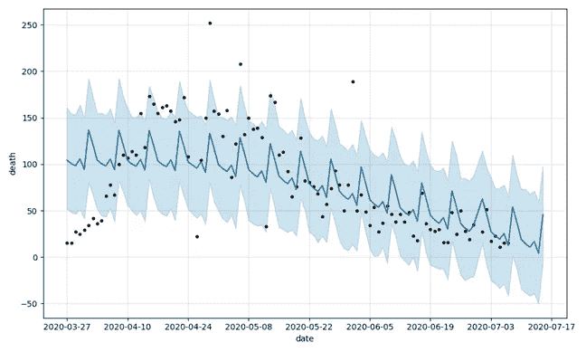

**图 10:** 对数变换前马萨诸塞州的单变量时间序列预测。时间序列图用蓝线表示。大多数数据点(黑点)分布在图附近，在置信区间(浅蓝色区域)内。

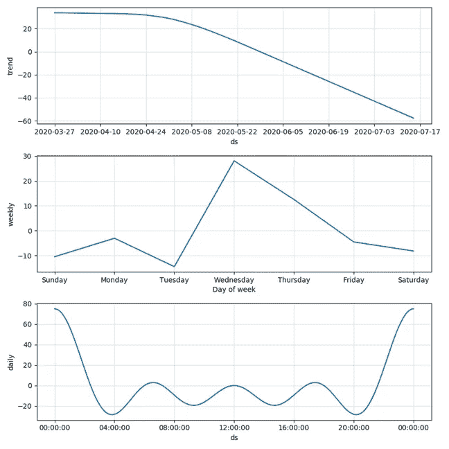

**图 11:** 将整个时间序列图分解为 3 个部分:趋势、每周和每日季节性。趋势描述时间序列图的走向。每周和每日季节性描述时间序列图的轨迹如何受每日和每周趋势的影响。

## 预测验证和转换

简而言之，预测验证将我们最初保留的数据与我们的模型预测进行比较。评估的质量取决于我们的模型出错的频率(以%表示的 MAPE)和我们的模型平均出错的程度(以死亡人数表示的平均误差)。在进行任何调整之前，MAPE 和 MAE 值异常高(见*图 14* )。此外，从图中可以看出，许多实际数据点位于置信区间之外。我们推断这些问题可能是由于不稳定的方差*，即*。随着响应变量(死亡)的变化，方差也随之变化。为了稳定方差，我们对数据集应用了对数变换(Box-Cox 变换)[5]，然后再次使用变换后的数据重复预测。*图 12* 和*图 13* 显示了修改后的预测结果。

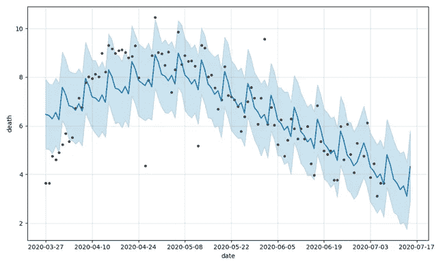

**图 12:** *对数变换后马萨诸塞州的单变量时间序列预测。新的时间序列图比对数变换前更靠近数据点。它的置信区间覆盖了更多的数据点。*

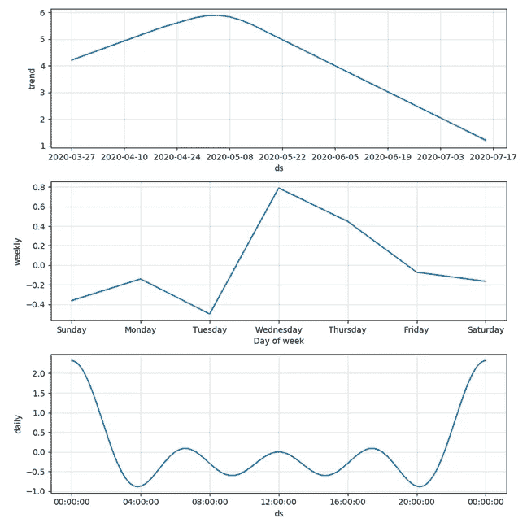

**图 13:** 对数变换是预测模型用来更好地拟合数据并使误差最小化的一种校正方法。这种参数调整技术不会改变时间序列图的组成部分。

## 转型后预测与分析

我们创建了一个新的 Prophet 模型，并对转换后的数据集重复了拟合-预测周期。根据新的时间序列图，更多的数据点位于置信区间内(见*图 12* )。转换后数据的误差(MAPE 和平均误差)要低得多，MAPE 降至 30%范围，大多数平均误差在 10 例死亡以内。*图 14* 显示了运行预测的样本州的结果。

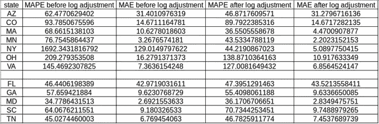

**图 14:** 通过将训练数据与验证数据进行比较，完成了时间序列模型的评估。MAPE 是预测值与真实值的%误差。MAE 是误差的大小。7 个州中有超过一半的州对对数变换做出了响应，大大减少了预测误差。对数变换没有减少其他 5 个状态的预测误差。

这种转变在某些情况下产生了很大的影响。然而，高误差表明还有其他因素在起作用。显然，仅使用过去的 COVID 死亡来预测未来的 COVID 死亡是不够的。

# 作者

迈克尔·扎吉

*曹杰森*

# 公共知识库

 [## Mike z77/covid 19-项目

### 面向 CMPT353 GitHub 的 COVID19 数据科学项目是 5000 多万开发人员的家园，他们共同工作来托管和…

github.com](https://github.com/MikeZ77/COVID19-Project) 

# 参考

[1]疾病控制和预防中心(CDC)。访问时间:2020 年 8 月 12 日。来源:[https://www . CDC . gov/coronavirus/2019-ncov/cases-updates/cases-in-us . html](https://www.cdc.gov/coronavirus/2019-ncov/cases-updates/cases-in-us.html)

[2] Scikit-Learn:用 IterativeImputer 的变量输入缺失值。访问时间:2020 年 8 月 12 日。来源:[https://sci kit-learn . org/stable/auto _ examples/impute/plot _ iterative _ inputr _ variants _ comparison . html](https://scikit-learn.org/stable/auto_examples/impute/plot_iterative_imputer_variants_comparison.html)

[3]美国科学与健康委员会。访问于 2020 年 8 月 12 日。来源:[https://www . acsh . org/news/2020/06/23/coronavirus-covid-deaths-us-age-race-14863](https://www.acsh.org/news/2020/06/23/coronavirus-covid-deaths-us-age-race-14863)

[4]先知:快速入门 Python API。访问于 2020 年 8 月 12 日。来源:[https://facebook.github.io/prophet/docs/quick_start.html](https://facebook.github.io/prophet/docs/quick_start.html)

[5]使用 Prophet 在 Python 中进行预测。访问于 2020 年 8 月 12 日。来源:[https://mode . com/example-gallery/forecasting _ prophet _ python _ cookbook/](https://mode.com/example-gallery/forecasting_prophet_python_cookbook/)

# 数据源

## 新冠肺炎死亡及相关统计

[https://covidtracking.com/](https://covidtracking.com/)

## 美国社会经济数据

[https://www . ka ggle . com/jtourkis/us-county-level-ACS-features-for-covid-analysis](https://www.kaggle.com/jtourkis/us-county-level-acs-features-for-covid-analysis)

## 气象资料

 [## 在线气候数据

### 气候数据在线(CDO)提供免费访问 NCDC 的全球历史天气和气候数据档案…

www.ncdc.noaa.gov](https://www.ncdc.noaa.gov/cdo-web/) 

# **术语表**

阿拉斯加州

亚利桑那州——亚利桑那州

加利福尼亚州

科罗拉多州

佛罗里达州

**加**——格鲁吉亚

伊利诺伊州

路易斯安那州

马——马萨诸塞州

马里兰州

明尼苏达州

**NC** —北卡罗来纳州

**哦**——俄亥俄州

南卡罗来纳州

田纳西州

**纽约**–纽约州

**华盛顿** —华盛顿

弗吉尼亚州

**AIAN**——美洲土著和阿拉斯加土著

**NHPI** —夏威夷土著和太平洋岛民

**MAE** —平均绝对误差

**MAPE** —平均绝对百分比误差