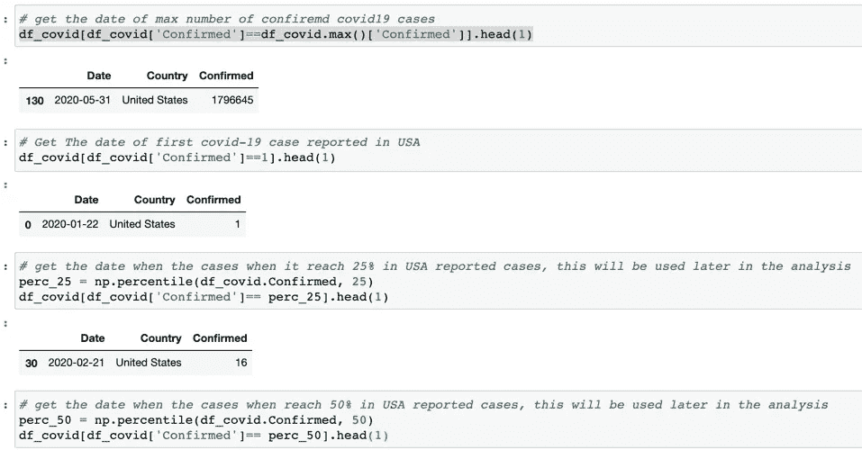
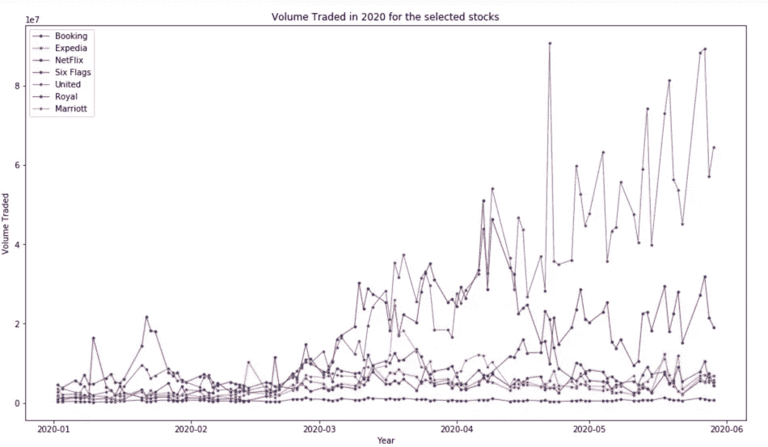

# 新冠肺炎对(海滩)股票的影响分析及价格预测

> 原文：<https://medium.com/analytics-vidhya/analysis-of-covid-19-impact-on-beach-stocks-and-price-prediction-6c78aa1c00f3?source=collection_archive---------20----------------------->

# 简介:

我们意识到新冠肺炎已经扭转了经济形势。旅游和娱乐行业的公司，即所谓的海滩股，绝对是受打击最大的。这些股票在 2020 年 2 月至 3 月期间蒸发了超过 3320 亿美元[来源](https://markets.businessinsider.com/news/stocks/covid-19-downturn-beach-stocks-1029032907#))。

另一方面，时间序列预测，尤其是股票预测，几十年来一直是热门话题。显然，预测股票市场是最具挑战性的事情之一，许多聪明的人和组织都参与了这一领域。影响[价格](https://www.udacity.com/course/machine-learning-for-trading--ud501)的变量有很多:一家公司的收益、当时的供求关系、整体经济的走势、政治气候、疫情等等。

# 目标:

作为 Udacity 数据科学家纳米学位项目的一部分，我选择了投资和交易作为顶点项目，该项目的目标是:

1-量化、比较和可视化新冠肺炎对美国旅游和娱乐行业股票市场的影响。数据库存被认为是从(2019 年和 2020 年)1 月 2 日到(2019 年和 2020 年)5 月 31 日，我选择这一时期是因为美国的封锁始于 2020 年 3 月 19 日，截至 4 月 12 日，美国有近 3 亿人(约 90%的人口)处于某种形式的封锁之下[来源](https://www.businessinsider.com/us-map-stay-at-home-orders-lockdowns-2020-3)

2-构建股票价格预测器，该预测器将特定日期范围内的每日交易数据作为选定股票样本(旅游和娱乐行业)的输入，并输出给定查询日期的预计估计值。系统只会预测调整后的收盘价。

# 数据:

已从以下位置访问数据:

-雅虎财经使用熊猫 _datareader 库。

——美国新冠肺炎来自[https://raw.githubusercontent.com](https://raw.githubusercontent.com)

# 目录

1.导入模块

2.数据下载和探索

第一部分分析新冠肺炎对(海滩)股票的影响

3.可视化数据

4.基础财务分析

第二部分利用长短期记忆进行价格预测(LSTM)

1.  数据可视化
2.  数据预处理
3.  数据建模
4.  Dash Web 应用程序

# 第一部分分析新冠肺炎对(海滩)股票的影响)。

# 问题陈述:

随着冠状病毒(新冠肺炎)从中国传播到世界各地，股票大幅下跌，波动性大大增加。在项目的这一部分，我将量化、比较和可视化新冠肺炎对选定的美国股票(预订、娱乐、航空公司、邮轮和酒店)的影响。股票的数据被认为是从(2019 年和 2020 年)1 月 2 日到(2019 年和 2020 年)5 月 31 日，我选择了这一时期，因为美国的封锁从 2020 年 3 月 19 日开始。

# 解决方案:

**1。数据下载和探索:**

**首先，我会利用 raw.githubusercontent.com 获得美国新冠肺炎确诊病例**

获取数据，然后使用下面的函数按国家(美国)过滤数据

使用下面的函数将数据转换成字符串并按日期分组

按日期过滤日期从 2020 年 1 月 2 日到 5 月 31 日，新冠肺炎的数据很简单，如下所示。只有两栏国家和确诊(这代表美国每天确诊病例的数量。

正如我们所看到的，该数据包含 131 个原始数据，该表还显示了有关新冠肺炎符合病例的一些统计信息。例如，我们可以看到最小的“已确认”是 1，最大的是 1796645。另外，我计算过病例数达到 25%、50%和 70%的时候。我将使用这些数据来可视化对股票价格的影响。

第二，我会使用雅虎财经(https://finance.yahoo.com/)。有一个名为 finance 的 python 包，它可以使我们轻松地拉动股票价格。

从雅虎财经获取该项目所选公司 2019 年和 2020 年的数据:

预订股票(纳斯达克股票代码:BKNG 预订

Expedia 股票(纳斯达克股票代码:EXPE 预订

网飞股票(纳斯达克股票代码:NFLX)-媒体/娱乐

我把网飞包括在内，因为它是一家媒体娱乐公司。所以，我想把它的结果与受打击最严重的公司进行比较，因为由于新冠肺炎的突然崛起，人们在社交上疏远了。

六旗娱乐和现场活动

联合航空公司股票(纳斯达克股票代码:UAL)-航空公司

皇家加勒比游轮公司(纳斯达克股票代码:RCL)-游轮和赌场

万豪国际股票(纳斯达克股票代码:MAR 酒店和度假村

正如我们从上表中看到的，数据集中有多个变量——日期、开盘价、盘高、盘低、尾盘、收盘价、成交量——开盘价和收盘价列代表股票在某一天的交易起始价和最终价。最高价、最低价和最后价代表当天股票的最高价、最低价和最后价。

2.**数据分析和可视化**

比较所选期间内所选股票在 2019 年和 2020 年的调整价格

从上面的探索中我们可以看到，所有股票在 2020 年的 minim 调整价格都下降了。

*a)预订量下降 8.78%*

*b) Expedia 下降 30.04%*

*c)网飞倾斜 7.39%*

*d)六旗下跌 51.24%*

*e)美联航下跌 40.60%*

*f)皇家谢绝 38.52*

*g)万豪下跌 11.54%*

下图比较了 2019 年和 2020 年间各公司的百分比变化:

**从上面每只股票调整后收盘价的日回报率百分比线图可以看出，回报率的下降发生在 2 月 21 日新冠肺炎确诊病例开始增加 25%和 4 月 22 日确诊病例达到 70%之间。**

可视化所选股票在 2020 年的收盘价，其中损益计算通常由股票当天的收盘价决定，因此我们将收盘价视为目标变量。让我们绘制目标变量，以了解它在我们的数据中是如何形成的:

正如我们从线图中看到的，所选股票在 2020 年的最低调整收盘价是在 3 月份

可视化所选股票在 2020 年的交易量，其中股票交易量是指特定股票在一段时间内的交易量。交易量通常以每天交易的股票数量来衡量。记住买卖的股票数量。如果某只股票的交易量较高，这自然意味着投资者有兴趣买入或卖出。如果成交量和价格都在上升，这意味着投资者押注该公司将表现良好。如果交易量上升，但价格下降，这意味着更多的投资者正在寻求出售。

评估新冠肺炎与所选海滩股票市场的相关系数，该矩阵表示以下关系:

我们使用以下函数计算相关性:

预订库存在确诊病例和调整价格之间呈负相关(-0.3)

Expedia 的股票在确诊病例和调整价格之间有负相关(-0.39)

网飞股票在确诊病例和调整价格之间有正相关(0.85)

六旗公司股票在确诊病例和调整后价格之间有负相关(-0.27

美联航股票在确诊病例和调整价格之间负相关(-0.66)

皇家股票在确诊病例和调整价格之间有负相关(-0.48)

万豪股票在确诊病例和调整价格之间有负相关(-0.49)

*从上面可以看出，评估新冠肺炎与所选海滩股市的相关系数。获得的相关系数表示其对所选股票的影响的强度和严重性，除了网飞具有正值，因为它在锁定条件下是家庭娱乐。*

**3。第一部分-结论**

这种波动性和相关矩阵比较的结合是一种有效的方法，可以分析新冠肺炎在选定的时间段(2019 年和 2020 年)1 月 2 日至 2019 年和 2020 年 5 月 31 日(2020 年 3 月 19 日在美国开始封锁)如何影响美国旅游和娱乐行业的股票市场。

# 第二部分价格预测使用长短期记忆(LSTM)。

# 问题陈述:

在这个项目的这一部分，我将致力于“股票预测”问题。首先，我将尝试建立一个机器学习/深度学习模型，该模型可以根据历史数据预测未来股票的“Adj Close”价格。将运行培训和评估来测试模型性能。第二，我将构建一个交互式 web 应用程序，使用户能够选择旅游和娱乐行业的股票符号和模型运行的时间范围。

# 解决方案:

数据下载和探索

我们有多种方法可以得到股票价格。为了这个项目的目的，我将使用雅虎金融(https://finance.yahoo.com/)。有一个名为 finance 的 python 包，它可以使我们轻松地拉动股票价格。

雅虎财经的股票数据相当简单，如下图所示。包括日期在内主要有 7 列。在我的项目中，我计划使用“Adj Close”作为我们的目标(预测价格)。

从上表可以看出，数据帧包含 7 列。对于这个项目，我们的主要目标是预测 Adj Close 价格。熊猫的“描述”方法来获得更多关于数据的信息。

正如我们在上面看到的，数据包含 5223 个点，我们稍后将把它们分成训练和测试数据集。该表还提供了大量关于预订库存数据的统计信息。例如，我们可以看到 20 年前的最低“Adj Close”价格约为 6.6 美元，最高价格约为 2206.09 美元，相差约 334 倍。

**数据分析和可视化**

损益计算通常由股票当天的收盘价决定，因此我们将收盘价作为目标变量。让我们绘制目标变量，以了解它在我们的数据中是如何形成的:

股票交易量是指某一特定股票在一段时间内的交易量。交易量通常以每天交易的股票数量来衡量。记住买卖的股票数量。
如果某只股票的交易量较高，这自然意味着投资者有兴趣买入或卖出。如果成交量和价格都在上升，这意味着投资者押注该公司将表现良好。如果交易量上升，但价格下降，这意味着更多的投资者正在寻求出售。

这张图表已经说明了很多事情。我选择这家公司而不是其他公司的具体原因是，随着时间的推移，这张图表充满了不同的股价行为。这将使学习更加稳健，也给你一个机会来测试对各种情况的预测有多好。另一件需要注意的事情是，2003 年至 2012 年的交易价值比 2012 年后的交易价值高得多，波动也更大。

**数据预处理**

由于大多数机器学习/深度学习技术对规范化的数据效果最好，所以我将使用 MinMaxScaler 来规范化数据。

**数据建模**

解决方案有几种可能的模型(线性回归、KNN、随机森林、xgboost 等)。在这些技术中，一种称为 LSTM(长短期记忆)的深度学习方法，LSTM 在序列预测方面非常强大，因为它能够存储过去的信息。我将主要关注 LSTM 的模型，并希望其性能是可以接受的。

**算法— LSTM:**

LSTMs 被广泛用于序列预测问题，并被证明是非常有效的。它们如此有效的原因是因为 LSTM 能够存储过去重要的信息，并忘记不重要的信息。LSTM 有三个城门:

**输入门:**输入门向单元状态添加信息

**遗忘门:**它删除模型不再需要的信息

**输出门:**LSTM 的输出门选择要显示为输出的信息

要更详细地了解 LSTM 及其建筑，你可以阅读下面的文章:[长短期记忆简介](https://www.analyticsvidhya.com/blog/2017/12/fundamentals-of-deep-learning-introduction-to-lstm/)

现在，让我们将 LSTM 实现为一个黑盒，并检查它在特定数据上的性能。

韵律学

对于模型性能的度量、评估，我将主要使用均方根偏差(RMSD)和平均绝对百分比误差(MAPE)。

1.  将数据分为训练数据集和测试数据集。这里我们定义了如下 4 个主要参数。

“num_periods”是我们将测试的预测周期，并将结果与基准模型进行比较。“预测天数”定义为我们希望根据历史数据预测的天数。“回望天数”将作为输入特征形状用于 LSTM 模型，而“窗口大小”是简单移动平均基准模型的参数。

然后，我们可以按如下方式分割数据。结果训练集和测试集将有三列。此外，对于测试数据集，我们将需要创建一个扩展数据集，以便它将包含一些以前的价格，用于功能创建和移动平均价格计算。

2.模型实现——长短期记忆(LSTM)

一旦我们定义了我们的参数，如“回顾天数”、“预测天数”，并有了我们的训练和测试数据集。下一步是为 LSTM 模型生成序列。下面我们有这样的功能。

我们可以生成如下的训练序列。

对于每个 X_train 数据点，形状为(15，1)，这是过去 15 天的标准化“调整收盘”价格。y_train 的数据点将是 7 天价格的数组。如果我们想知道预测后的真实价格，我们将需要使用归一化函数将其转换回来。

由于训练数据只有 5223 点，我将只使用简单的 LSTM 模型，而不是复杂的模型(将是两层或更多层)。LSTM 的损失函数将是‘均方误差’，激活函数 I 将选择‘relu’。如预期的那样，输入数据形状将是(lookback_days，1)。模型函数如下:

计算训练损失与时间的关系，如下所示:

如我们所见，当 epoch 大于 200 时，模型达到收敛。

一旦我们完成了模型训练，我们需要在测试数据集上测试模型预测。正如我们在前面几节中提到的，我们将使用 40 个“forecast_days”期间来测试预测(对于 7 天预测，这将是 280 天)。

一旦我们有了上述测试数据序列，我们可以使用我们训练的 LSTM 模型来执行预测。请注意，预测值将是一个标准化的价格，因此我们需要使用“inverse_transform”将其转换回实际价格。

我们可以用 matplotlib 将预测价格和真实价格一起可视化。

正如我们在上面看到的，当价格上涨过快时，预测不断输出大幅下跌信号，其中有些是正确的，有些是错误的。

现在，我们将使用移动平均价格，通过以下函数进行预测

使用移动平均线，LSTM，我们可以用 matplotlib 将预测价格和实际价格一起可视化。

**细化**

上面的模型实现更倾向于静态的方式。用户使用起来不太方便，在选定的日子查价格。因此，我们将使用构建一个 web 应用程序，它可以帮助用户以交互方式训练和可视化股票。

正如我们提到的，破折号 Plotly 将被使用。相关代码在“lstm”文件夹中。为了启动网络应用程序，我们需要运行“Python index.py ”,然后打开位于[的网址 http://127.0.0.1:8080/](http://127.0.0.1:8080/)

如下所示，应用程序如下所示:

我们可以从下拉窗口中选择股票代码，并选择下载数据的日期范围。与之前类似，数据将被分为训练和测试。完成选择后，我们可以通过单击“运行模型”按钮来运行模型。

您可以从终端监控程序进度，通常需要大约 3-7 分钟。一旦完成，我们将能够看到结果图。

与 jupyter 笔记本中的静态情节不同，这里的结果是一个交互式情节。您可以查看每个股票数据点的详细信息。更重要的是，您可以选择图形的子集并将其放大，这样您就可以看到细节。例如，我们可以放大上图的测试和预测范围，如下所示。

·