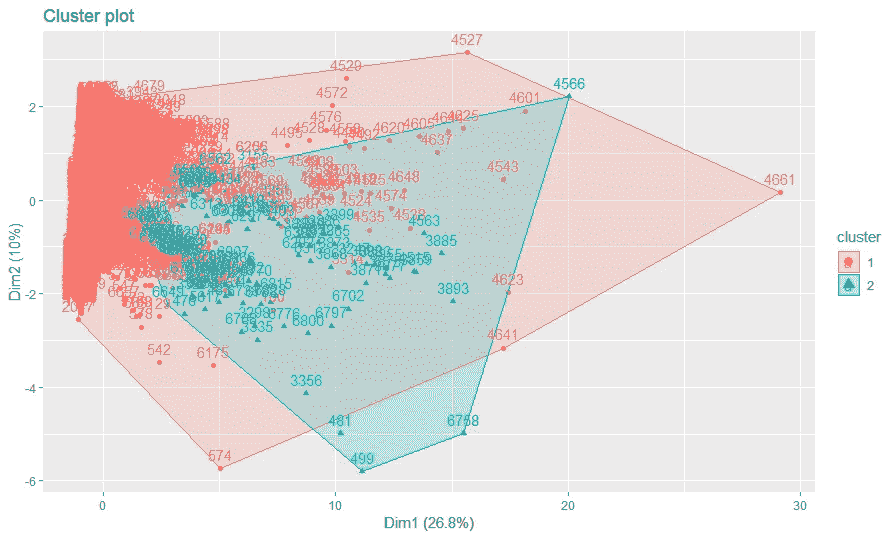
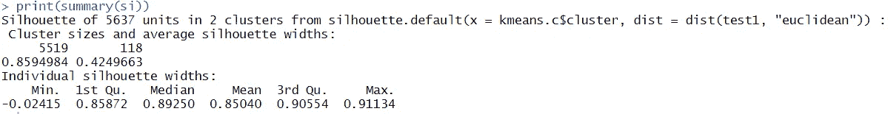
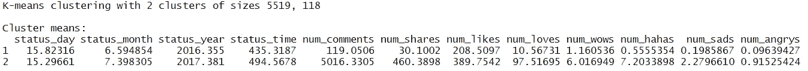

# 社交媒体平台上的客户参与度分析

> 原文：<https://medium.com/analytics-vidhya/analysis-of-customer-engagement-on-social-media-platforms-490bc3947b14?source=collection_archive---------5----------------------->

## 无监督的机器学习——10 家泰国时尚和化妆品零售商的脸书页面。不同性质的帖子(视频、照片、状态和喜欢)。参与度指标包括评论、分享和反应。


由[在](https://unsplash.com/@stickermule?utm_source=medium&utm_medium=referral) [Unsplash](https://unsplash.com?utm_source=medium&utm_medium=referral) 上贴骡子的照片

该研究的目的是使用无监督的机器学习技术从数据集中识别聚类模式，以帮助时尚和化妆品零售公司更好地与数字媒体平台上的客户和用户互动。

> 这些类型的无监督机器学习分析有助于公司增加社交媒体平台上用户的参与度。这不仅仅是关于定期发帖和更新，也是关于在发帖时间和其他重要因素方面以最有效的方式增加印象。

为了进行这项研究，我们从 [UCI 机器学习库](https://archive.ics.uci.edu/ml/datasets/Facebook+Live+Sellers+in+Thailand#)下载了数据集。

**我们如何着手这项研究:**

1.  从 [UCI 机器学习库](https://archive.ics.uci.edu/ml/datasets/Facebook+Live+Sellers+in+Thailand#)收集数据
2.  清理数据集[缺少值，变量转换，如日期和时间等]
3.  运行探索性数据分析(EDA)并基于数据透视表完成数据分析。
4.  应用霍普金斯统计—检查聚类趋势。
5.  建立基于 K-均值聚类的模型
6.  将轮廓指数应用于集群性能测量。

无监督的 ML 模型建立是在 R 中完成的，我们遵循 K-means 聚类技术来形成聚类。

我完成了对 excel 表格的初始数据清理。

数据清理中的重要任务是 ststua_published feature —针对月、日和年。我使用 lubridate 库——将因子转换成日期格式。

```
## Convert Factor into Dateattach(live)library(lubridate)
library(dplyr)live$status_published = mdy_hm(as.character(live$status_published))
```

此外，为了将日期分为日、月和年，我们使用了 tidyr 库和一个单独的()函数。

```
library(tidyr)live_fb = live_fb %>% separate(status_published, sep="-", 
             into = c("status_day", "status_month", "status_year"))
```


由[埃斯特·扬森斯](https://unsplash.com/@esteejanssens?utm_source=medium&utm_medium=referral)在 [Unsplash](https://unsplash.com?utm_source=medium&utm_medium=referral) 上拍摄的照片

在 EDA(探索性数据分析)中，我们使用 rpivotTabel()启动数据分析。

我们确定了以下几点，

*   我们观察到，从 2012 年到 2018 年，客户互动逐年增加，复合增长率约为 27.66%。然而，我们也观察到了 2014 年的急剧下降。
*   根据数据集交互，与链接、雕像和视频相比，o **n“照片”状态是最高的**——适合发布照片。
*   根据这几个月的观察，我们发现**在五月和十二月与客户的互动最多**——这可能是因为假期！
*   根据日统计数据，我们观察到 6 月开始时客户互动量较高，而互动量最高的 5 月在月末时客户互动量保持不变，这表明**年中最好的日子是在 5 月 20 日之后和 6 月 13 日之前。**然而，12 月的天数与客户互动一致。

为了测量聚类趋势，我们使用了霍普金斯统计。

```
print(get_clust_tendency(live_fb, graph = FALSE, n = 100, seed = 123))# Here 'n' is random pickup of dataset for hopkins Stats - to check cluster tendency# $hopkins_stat
# [1] 0.01066148
```

> 霍普金斯统计给出 0 到 1 之间的值。
> 
> 接近零表示存在有效的聚类。

对于无监督 ML 技术，我们建立了 K-means 模型。为了识别正确的集群，我们在 r。

> 注意:由于选择随机观察，结果可能与 Github 代码不同。

```
## Need to do Sampling due to high Observation.ind = sample(2, nrow(live_fb), replace = TRUE, prob = c(0.8,0.2))test1 = live_fb[ind == 1, ]cluster1 = NbClust(test1, distance = 'euclidean', method = 'kmeans')kmeans.c = kmeans(test1, centers = 2, nstart = 50)print(kmeans.c)## Plot Clusterlibrary(factoextra)print(fviz_cluster(kmeans.c, data = test1))
```



两类图

为了提高性能，我们在聚类库的帮助下使用了剪影指数。

```
library(cluster)si = silhouette(kmeans.c$cluster, dist(test1, 'euclidean'))print(summary(si))
```



轮廓指数结果

聚类 1 和聚类 2 分别捕获了 5519 和 118 个观测值。聚类 1 和聚类 2 的轮廓值分别是 0.85 和 0.42。

> 轮廓值越高，聚类结构越好。基于轮廓值，我们可以说聚类 1 发现了强结构，聚类 2 发现了合理的结构。从聚类图中可以看出这种差异。

基于我们可以分析的聚类平均值，



k 均值聚类

根据泰国用户对时尚的脸书参与度研究，我们观察到聚类 1 的大小为 5519，聚类 2 的大小为 118。

1.  对于群组 1，最大参与发生在 2016 年年中的 6 月份左右。同样，对于集群 2，最大参与度发生在 2017 年年中的 7 月份左右。**由此得出结论，五月至六月对于营销人员在 FB 上与消费者互动非常重要。**
2.  对于集群 1 和集群 2 的用户来说，一天中的**最佳时间是早上 8 点到 10 点之间。**
3.  集群 1 在尺寸上非常大，因此在参与度上显著高于集群 2。
4.  来自集群 2 的评论数量和分享数量分别是集群 1 的大约 42 倍和大约 15 倍，这明显更高以产生嗡嗡声。**这表明集群 2 具有重要的活跃用户。在集群 1 中，大多数用户都是橱窗购物者！**
5.  类似地，群 2 中平均参与度的爱和哇的数量是群 1 的 10 倍。

然而，作为一名营销人员，应该能够看到集群 1 被动参与的显著差距，其中基础比集群 2 大 45 倍以上。然而，这两个聚类都是从 7，050 个观察值中选取的样本。但是，从营销人员的角度来看，目标应该是如何吸引更多的集群 1 用户。

有关项目细节和无监督学习— k 均值聚类代码，请访问 [Github 知识库](https://github.com/RutvijBhutaiya/Thailand-Customer-Engagement-Facebook)。

[](https://rutvijbhutaiya.wixsite.com/newage) [## Github |机器学习|数据科学 I 项目

### 这个网页反映了我对机器学习和数据科学项目及其实施的理解。

rutvijbhutaiya.wixsite.com](https://rutvijbhutaiya.wixsite.com/newage)