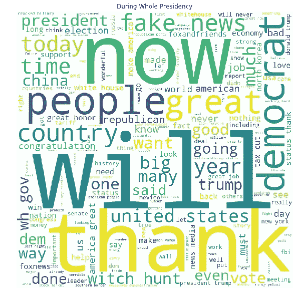

# 使用 NLP 分析唐纳德·特朗普生命中不同阶段的推文

> 原文：<https://medium.com/analytics-vidhya/analysis-of-donald-trumps-tweets-during-different-phases-of-his-life-using-nlp-2eca27b6db30?source=collection_archive---------14----------------------->

自特朗普担任总统以来，推特的角色已经发生了变化，它已经成为官方的信息来源，比如通过推特获得特朗普解雇国务卿的消息。唐纳德·特朗普不同于其他任何一位总统，在特朗普总统任期开始时，唐纳德·特朗普每天发 9 条推文，但随着时间的推移，推文率增加了两倍。据《纽约时报》报道，唐纳德·特朗普在 33 个月内发了 11000 条推特。Twitter 一直是唐纳德·特朗普最喜欢的社交媒体平台。因此，让我们以词云的形式分析特朗普的推文。

# 资料组

这里使用的[数据集](https://www.kaggle.com/austinreese/trump-tweets)取自 kaggle。它包含 9 列内容，分别是 tweet 文本、tweet 日期、retweets 转发次数、favorites 转发次数、提名数(如果有)、hashtags 标签(如果有)和 geo 位置(如果指定)。出于我们的目的，我们使用两种色谱柱:

*   获取推文完整文本的内容
*   第二个是日期，用于指定 tweet 的时间段。

我们将对此进行操作。

# 预处理

我们使用 NLTK 包进行 NLP 操作。我们从内容栏获得的文本需要一点清理，所以我们应用了以下技术进行预处理

1.  使用正则表达式消除除字母以外的所有符号
2.  词干查找词根以消除歧义
3.  停用词删除

# 唐纳德·特朗普生活的不同时期

以下是用来找出唐纳德·特朗普生活 4 个阶段中的推文的重要日期

1.  就任总统前
2.  竞选期间
3.  在总统任期内
4.  在弹劾听证会期间

我们内核的重要日期

# 词云

单词云或标签云是一种新颖的表示文本数据的方式。为了创建单词云，我们使用了 python 中的单词云库，并使用 matplotlib 来绘制单词云

用于创建和绘制单词云的代码段

# 总统任期前的词汇云

总统任期前的词汇云

# 竞选期间

竞选期间

# 在整个总统任期内

# 弹劾期间

弹劾期间

希望你喜欢这本书，下面是我的 kaggle 内核的链接，如果你喜欢的话可以看看投票

[https://www . ka ggle . com/owaisraza 009/trumps-tweets-word-cloud-during-phases-of-his-life](https://www.kaggle.com/owaisraza009/trumps-tweets-word-cloud-during-phases-of-his-life)

快乐编码❤